# V8 Engine Architecture

Explore V8's multi-tiered compilation pipeline from Ignition interpreter to TurboFan optimizer, understanding how it achieves near-native performance while maintaining JavaScript's dynamic nature.

## TLDR

**V8 Engine** is Google's high-performance JavaScript and WebAssembly engine that uses a sophisticated multi-tiered compilation pipeline to achieve near-native performance while maintaining JavaScript's dynamic nature.

### Multi-Tiered Compilation Pipeline

- **Ignition Interpreter**: Fast bytecode interpreter that executes code immediately and collects type feedback
- **Sparkplug JIT**: Baseline compiler that generates machine code from bytecode in a single linear pass
- **Maglev JIT**: Mid-tier optimizing compiler using SSA-based CFG for quick optimizations
- **TurboFan JIT**: Top-tier optimizing compiler with deep speculative optimizations for peak performance

### Core Architecture Components

- **Parser**: Converts JavaScript source to AST with lazy parsing for fast startup
- **Bytecode Generator**: Creates V8 bytecode as the canonical executable representation
- **Hidden Classes (Maps)**: Object shape tracking for fast property access via memory offsets
- **Inline Caching**: Dynamic feedback mechanism tracking property access patterns
- **FeedbackVector**: Per-function data structure storing type feedback for optimization

### Runtime System & Optimization

- **Object Model**: Hidden classes with transition trees for dynamic object shape evolution
- **Type Feedback**: Monomorphic (1 shape), polymorphic (2-4 shapes), megamorphic (>4 shapes)
- **Speculative Optimization**: Making assumptions based on observed types for performance gains
- **Deoptimization**: Safety mechanism to revert to interpreter when assumptions fail

### Memory Management (Orinoco GC)

- **Generational Hypothesis**: Most objects die young, enabling specialized collection strategies
- **Young Generation**: Small region (16MB) with frequent, fast scavenging using copying algorithm
- **Old Generation**: Large region with infrequent, concurrent mark-sweep-compact collection
- **Parallel Scavenger**: Multi-threaded young generation collection to minimize pause times
- **Concurrent Marking**: Background marking in old generation to reduce main thread pauses

### Performance Characteristics

- **Startup Speed**: Lazy parsing and fast bytecode interpretation for quick initial execution
- **Peak Performance**: TurboFan's speculative optimizations achieve near-native execution speed
- **Memory Efficiency**: External buffer allocation and generational garbage collection
- **Smooth Performance**: Multi-tier pipeline provides gradual performance improvement

### Advanced Features

- **On-Stack Replacement (OSR)**: Switching between tiers mid-execution for optimal performance
- **CodeStubAssembler (CSA)**: Platform-independent DSL for generating bytecode handlers
- **Write Barriers**: Tracking object pointer changes during concurrent garbage collection
- **Idle-Time GC**: Proactive memory cleanup during application idle periods

### Evolution & Future

- **Historical Progression**: Full-codegen/Crankshaft → Ignition/TurboFan → Four-tier pipeline
- **Performance Predictability**: Eliminated performance cliffs through full language support
- **Engineering Pragmatism**: Moved from Sea of Nodes to CFG-based IR for newer compilers
- **Continuous Optimization**: Ongoing improvements in compilation speed and execution performance

## Table of Contents

## Introduction

The efficient execution of a highly dynamic, loosely-typed scripting language at speeds rivaling statically-compiled languages represents a formidable challenge in computer science. This is the core problem that Google's V8, the open-source JavaScript and WebAssembly engine, is engineered to solve. The design of any such Just-in-Time (JIT) compiler is governed by a fundamental set of trade-offs between compilation time, execution speed, and memory consumption. V8's architecture is a sophisticated and continuously evolving answer to this challenge, designed to balance peak performance with fast startup and modest memory usage.

This report presents a deep architectural analysis of the V8 engine, dissecting the foundational pillars upon which its performance rests. We will explore each component of its multi-tiered compilation pipeline, the advanced runtime system that makes optimization possible, and the state-of-the-art garbage collector that ensures a responsive user experience.

## The V8 Execution Pipeline: From Source to Machine Code

At its core, V8 is a Just-in-Time (JIT) compiler. Instead of interpreting code line-by-line or compiling everything ahead of time, it employs a hybrid approach. The pipeline is designed to get code running quickly and then progressively optimize the "hot" parts of the application—code that is executed frequently. This multi-tiered strategy provides a smooth performance curve, from fast initial load times to peak execution speed.

The modern V8 pipeline can be visualized as a series of tiers, each making a different trade-off between compilation speed and execution speed:

<figure>

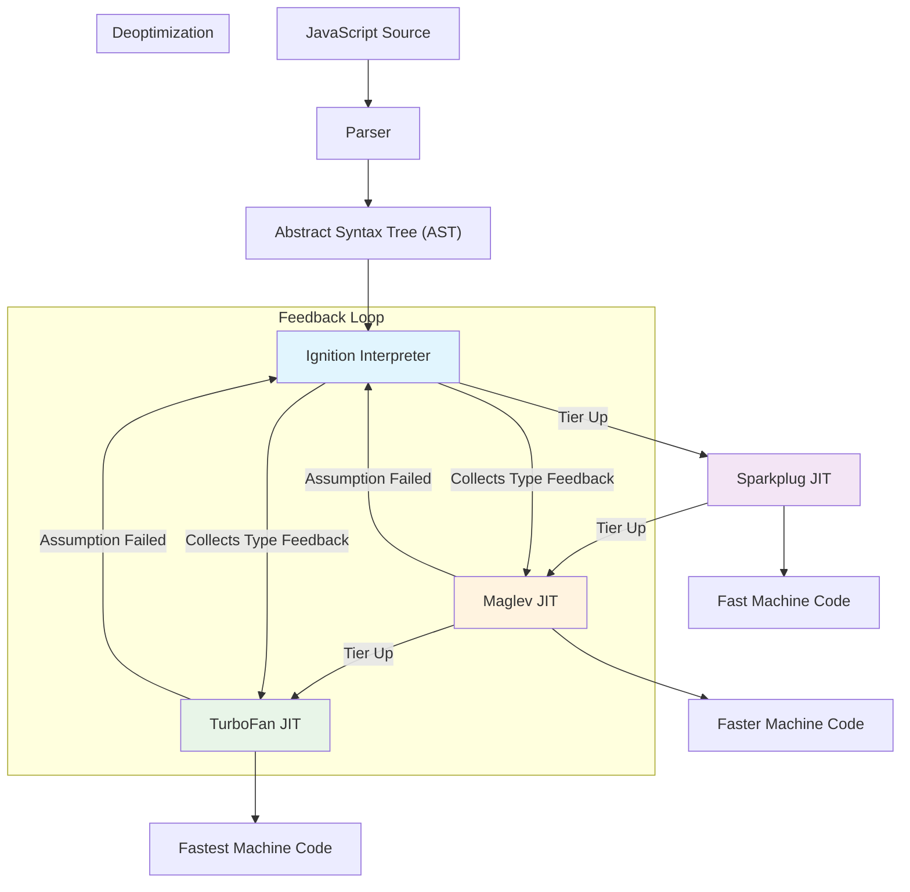

<figcaption>V8 execution pipeline showing the multi-tiered compilation strategy from source code to optimized machine code</figcaption>

</figure>

## Section 1: Parsing - The First Step

Before any execution can occur, V8 must first understand the code. This initial phase transforms human-readable JavaScript source into a structured format the engine can work with.

### 1.1 Scanner and Parser

The process begins with the scanner, which reads the stream of UTF-16 characters and groups them into meaningful "tokens" like identifiers, operators, and strings. The parser then consumes these tokens to build an Abstract Syntax Tree (AST), a hierarchical, tree-like representation of the code's syntactic structure.

For example, this simple line of code:

```javascript
const chk = "have it"
```

Would be parsed into an AST that represents a constant declaration with the identifier `chk` and the string literal value `"have it"`.

### 1.2 Pre-parsing and Lazy Parsing

To accelerate startup, V8 employs a pre-parser that performs a quick initial pass to identify function boundaries and check for early syntax errors. This enables **lazy parsing**, a critical optimization where functions are only fully parsed and compiled into an AST when they are first invoked. This significantly reduces initial page load times and memory usage, as V8 avoids doing work for code that may never be executed.

<figure>

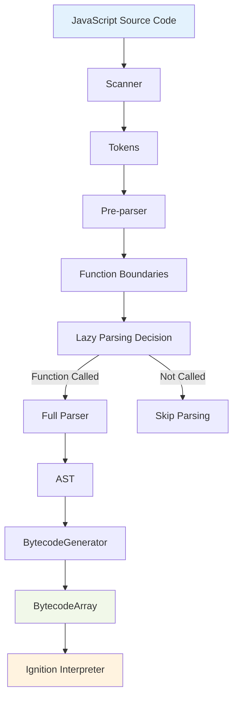

<figcaption>Parsing and lazy parsing workflow showing how V8 optimizes startup by deferring full parsing until functions are called</figcaption>

</figure>

## Section 2: Ignition - The Foundational Interpreter

Ignition is the first execution tier and the foundation of the entire modern V8 pipeline. It is a bytecode interpreter responsible for getting code running quickly and for gathering the crucial feedback needed for later optimization.

### 2.1 Architecture: A Register Machine with an Accumulator

Unlike some interpreters that use a stack-based model, Ignition is designed as a **register machine**. Its bytecode instructions operate on a set of virtual registers (e.g., r0, r1, r2). A defining feature is its special-purpose **accumulator register**. A large number of bytecodes use the accumulator as an implicit source and/or destination for their result.

This design has two profound benefits:

- **Memory Efficiency**: By making the accumulator an implicit operand, the bytecodes themselves can be shorter, reducing the memory footprint of the compiled code—a primary design goal.
- **Execution Efficiency**: For common operational chains (e.g., `a + b - c`), intermediate results can remain in the accumulator, minimizing instructions needed to shuffle temporary values.

### 2.2 From AST to Bytecode

Once a function is needed, the BytecodeGenerator traverses its AST and emits a stream of V8 bytecode. This becomes the canonical, executable representation of the function.

Consider this function:

```javascript
function incrementX(obj) {
  return 1 + obj.x
}
incrementX({ x: 42 }) // Must be called for V8 to compile it
```

V8's Ignition interpreter generates the following bytecode for it:

```
LdaSmi [1]         // Load Small Integer 1 into the accumulator
Star r0            // Store the accumulator's value (1) into register r0
LdaNamedProperty a0, [0], [0]  // Load property 'x' from argument 0 (obj) into accumulator
Add r0, [1]        // Add register r0's value to the accumulator
Return             // Return the value in the accumulator
```

This bytecode is the "source of truth" for all subsequent execution and optimization tiers.

<figure>

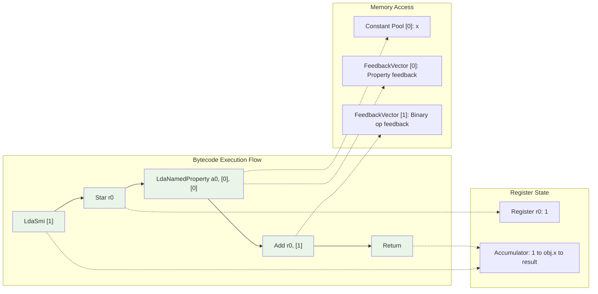

<figcaption>Bytecode execution flow showing the step-by-step execution of V8 bytecode instructions with register and memory state</figcaption>

</figure>

### 2.3 The CodeStubAssembler (CSA) Backend

To avoid the monumental task of hand-writing assembly for each of V8's nine-plus supported CPU architectures, the bytecode handlers (the machine code that implements each bytecode instruction) are written in a high-level, platform-independent C++-based DSL called the **CodeStubAssembler (CSA)**. This CSA code is then compiled by TurboFan's own backend, meaning any improvement to TurboFan's code generation automatically makes the interpreter faster.

At runtime, the interpreter enters a dispatch loop. It fetches the next bytecode from the BytecodeArray, uses its value as an index into a global dispatch table, and jumps to the address of the corresponding machine-code handler to execute the instruction. This architecture means that any improvement to TurboFan's code generation backend automatically makes not only optimized JavaScript faster, but also the interpreter and other core V8 builtins.

## Section 3: The Object Model and Inline Caching: The Bedrock of Speculative Optimization

The entire strategy of speculative optimization in V8 hinges on its ability to infer static-like properties from the dynamic execution of JavaScript code. This is accomplished through a sophisticated runtime system built on two interconnected concepts: a hidden class-based object model and a data-driven feedback mechanism. This system forms the essential contract that allows a compiler built for static analysis (TurboFan) to operate effectively and safely on a dynamic language.

### 3.1 Hidden Classes (Maps): Imposing Order on Dynamic Objects

In JavaScript, object properties can be added or removed at any time. A naive implementation would require storing properties in a dictionary-like structure, such as a hash table, making property access a slow, dynamic lookup operation. V8's core insight is that most JavaScript objects, while dynamic, are created and used in stereotypical ways. To optimize this, V8 associates every object with a **Hidden Class**, internally called a Map. This Map acts as a descriptor for the object's "shape," defining which properties it has and, crucially, their offset within the object's memory layout.

A Map contains a pointer to a **DescriptorArray**, which lists property names and their attributes (like their offset and whether they are const), and a **TransitionArray**, which links to other Maps for when properties are added or their attributes change. This architecture transforms a slow dictionary lookup into a fast, predictable sequence:

1. Compare the object's Map pointer to an expected Map pointer.
2. If they match, load the property value from a hard-coded memory offset.

This sequence, which can often be just a few machine instructions, is orders of magnitude faster than a dynamic lookup.

<figure>

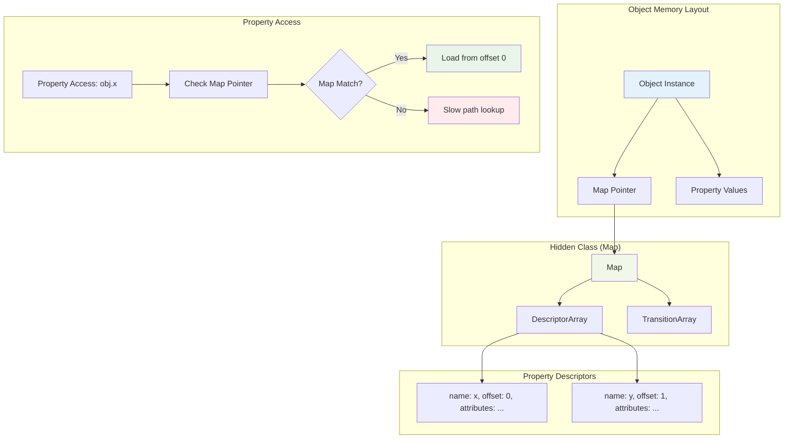

<figcaption>Hidden class (Map) architecture showing how V8 optimizes property access through object shape tracking</figcaption>

</figure>

### 3.2 The Dance of Transitions: How Object Shapes Evolve

Hidden classes are not static; they form a transition tree. When an object is created, it starts with an initial Map. As each property is added, V8 follows a transition to a new Map that describes the new shape.

A critical detail for developers to understand is that the transition path is dependent on the order in which properties are added. The code `p1.a = 1; p1.b = 2;` will result in a different final Map than `p2.b = 2; p2.a = 1;`. This means p1 and p2, despite having the same properties, will have different hidden classes, preventing V8 from optimizing them together. The direct implication for writing performant code is that objects should be initialized with all their properties at once (ideally in a constructor) and in a consistent order. This ensures that similar objects share the same Map and can benefit from the same optimizations.

<figure>

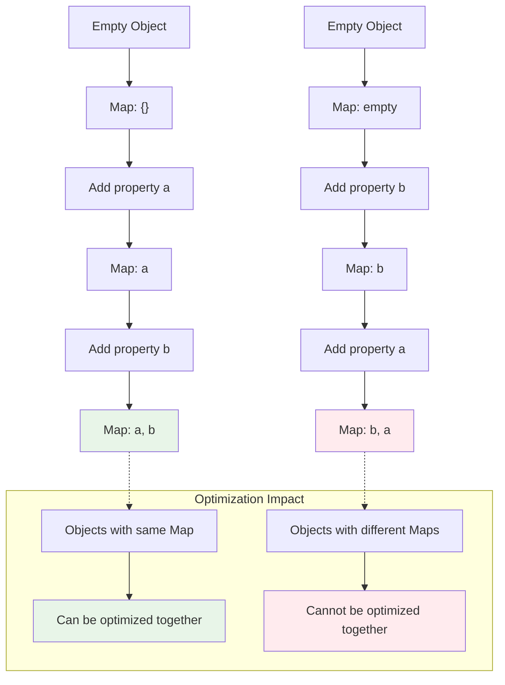

<figcaption>Object shape transitions showing how property addition order affects hidden class optimization</figcaption>

</figure>

### 3.3 Inline Caching (IC) and the FeedbackVector

While hidden classes provide the static layout, **Inline Caches (ICs)** are the dynamic mechanism V8 uses to observe which layouts actually appear at specific points in the code. Every property access site (e.g., `object.property`, `object.method()`) in the code has an associated IC that acts as a "listening" mechanism.

In modern V8, this feedback is not patched directly into the machine code. Instead, it is stored in a separate data structure called a **FeedbackVector** that is associated with each function closure. This vector is an array with slots corresponding to each IC site in the function's bytecode. As Ignition executes the bytecode, it updates the corresponding slots in the FeedbackVector with the Maps of the objects it observes at each site. This separation of feedback data from executable code is a crucial design principle that improves the robustness and maintainability of the engine. The FeedbackVector becomes the primary data source that TurboFan consumes to make its speculative optimization decisions.

<figure>

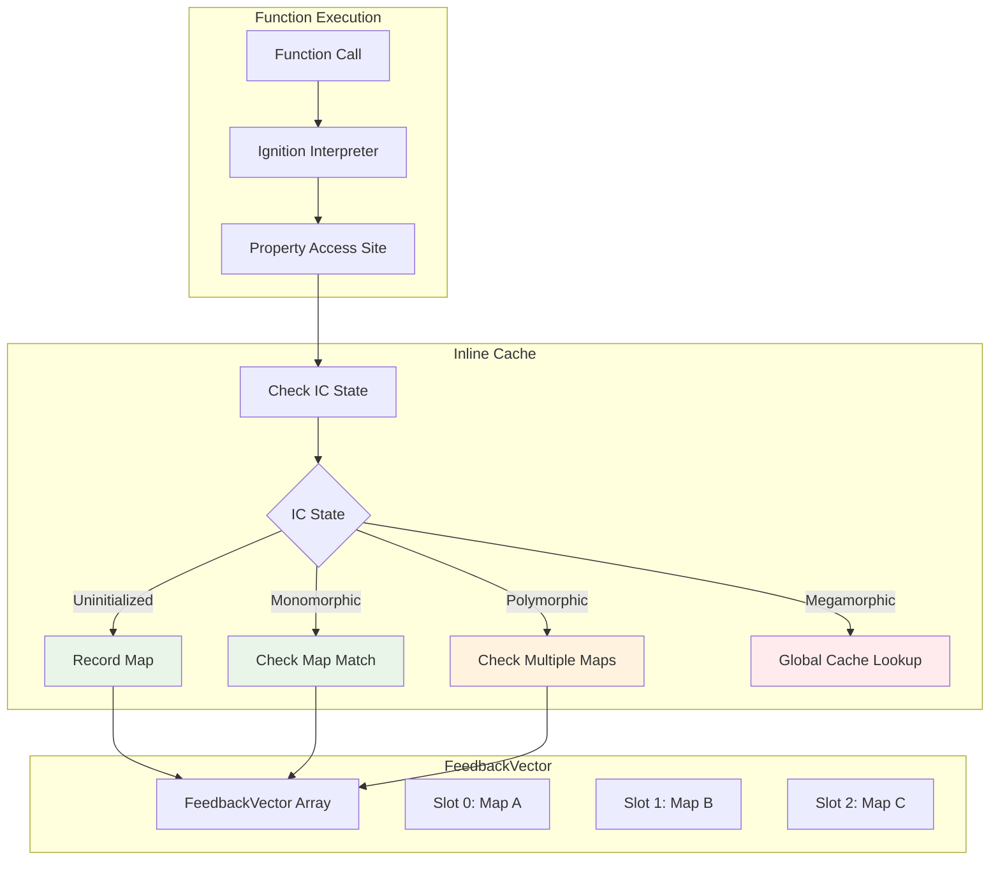

<figcaption>Inline cache state machine showing how V8 tracks property access patterns through different optimization states</figcaption>

</figure>

### 3.4 Monomorphic, Polymorphic, and Megamorphic Call Sites: Quantifying Predictability

The state of an IC quantifies the predictability of a given code location and is determined by the number of different hidden classes it has observed.

- **Uninitialized**: The IC has not been executed yet.
- **Monomorphic**: The IC has only ever seen a single hidden class. This is the "golden path" for optimization, as the code's behavior is perfectly predictable. Access is extremely fast, as it involves a single Map check.
- **Polymorphic**: The IC has seen a small number of different hidden classes (typically 2 to 4 in V8). V8 can still handle this efficiently by generating code that checks against a short list of known Maps. This is slightly slower than a monomorphic access but still very fast.
- **Megamorphic**: The IC has seen too many different hidden classes (more than 4). At this point, V8 "gives up" on trying to track all the shapes locally at that site. The IC transitions to a megamorphic state, which uses a slower, global stub cache for property lookups. This state is a strong signal of unpredictability and often prevents TurboFan from optimizing the function at all, as it "has no idea what's going on" anymore.

| State Name    | Number of Shapes Seen | Performance Characteristic                                                      | TurboFan Optimizability                                                           |
| ------------- | --------------------- | ------------------------------------------------------------------------------- | --------------------------------------------------------------------------------- |
| Uninitialized | 0                     | Initial state before first execution.                                           | N/A                                                                               |
| Monomorphic   | 1                     | Ideal. Extremely fast property access via a single map check and direct offset. | Highest. Provides the most precise type information for speculation.              |
| Polymorphic   | 2-4                   | Fast. Requires checking against a small, fixed list of known maps.              | High. Can still be optimized effectively, though may require more complex checks. |
| Megamorphic   | >4                    | Slow. Reverts to a generic lookup using a global cache.                         | Lowest. Often prevents optimization entirely due to high unpredictability.        |

**Table 1: Comparison of Inline Cache States**

## Section 4: Sparkplug - The Fast Baseline JIT Compiler

Introduced in 2021, Sparkplug is a fast, non-optimizing baseline JIT compiler. Its sole purpose is to bridge the performance gap between the Ignition interpreter and the more powerful optimizing compilers by generating native machine code as quickly as possible.

### 4.1 Architecture and Design Philosophy

**Compiles from Bytecode**: Sparkplug compiles directly from Ignition's bytecode, not from the source code or AST. This leverages the work already done by the parser and BytecodeGenerator.

**No Intermediate Representation (IR)**: Sparkplug's defining feature is that it generates no IR of its own. It performs a single, linear pass over the bytecode and emits machine code for each instruction, often by simply generating calls to pre-compiled builtins for complex operations. This makes its compilation speed orders of magnitude faster than optimizing compilers.

**Interpreter Frame Compatibility**: Sparkplug is designed as an "interpreter accelerator." It generates machine code that works with a stack frame nearly identical to the one used by Ignition. This makes On-Stack Replacement (OSR)—switching from interpretation to compiled code mid-execution—extremely fast and simple.

A function is tiered up from Ignition to Sparkplug after only a handful of invocations (around 8), without requiring any type feedback, prioritizing a quick jump from interpreted to native execution.

## Section 5: Maglev - The Mid-Tier Optimizing JIT Compiler

Introduced in 2023, Maglev is a mid-tier optimizing compiler that sits between Sparkplug and TurboFan. Its goal is to provide quick optimizations that yield code significantly faster than Sparkplug's, without incurring the high compilation cost of TurboFan.

### 5.1 Architecture and Optimization Strategy

**SSA-based CFG**: Unlike TurboFan's historical Sea of Nodes IR, Maglev uses a more traditional Static Single-Assignment (SSA) based Control-Flow Graph (CFG). This design was chosen for its compilation speed and ease of development.

**Feedback-Driven Optimization**: Maglev relies heavily on the type feedback collected by Ignition and stored in the FeedbackVector. It uses this feedback to generate specialized SSA nodes. For example, if a property access `o.x` has only ever seen objects with a specific shape, Maglev will emit a runtime shape check followed by a fast `LoadField` instruction.

**Representation Selection**: A key optimization is its ability to unbox numeric values. Based on feedback, it can treat numbers as raw machine-level integers or floats, passing them directly in CPU registers and avoiding the overhead of heap-allocated number objects.

A function is tiered up from Sparkplug to Maglev after it has been invoked hundreds of times (around 500) and its type feedback has stabilized, indicating its behavior is predictable enough for optimization.

## Section 6: TurboFan - The Peak Performance Compiler

TurboFan is V8's top-tier optimizing compiler, responsible for generating the fastest possible machine code for the "hottest" parts of an application. Its design, particularly its historical use of the Sea of Nodes Intermediate Representation, offers a powerful case study in the tension between theoretical compiler elegance and the practical realities of a specific language domain.

### 6.1 The Tier-Up Trigger: Deciding When to Optimize

V8's runtime profiler continuously monitors executing code. Functions that are executed frequently are marked as "hot" and become candidates for optimization. The decision to "tier-up" a function to a higher-level compiler is based on two key factors:

1. **Invocation Count**: The function must be called a sufficient number of times.
2. **Feedback Stability**: The type feedback collected in the function's FeedbackVector must be "stable" (i.e., not changing frequently).

This second check is crucial. It prevents V8 from wasting expensive compilation cycles on code whose behavior is still erratic and thus likely to cause a deoptimization. The modern pipeline uses concrete thresholds for these triggers: a function might tier up from Ignition to Sparkplug after just 8 invocations without requiring feedback, but the jump from Sparkplug to Maglev requires around 500 invocations with stable feedback, and the final tier-up to TurboFan requires approximately 6000 invocations.

### 6.2 The Sea of Nodes: A Deep Dive into a Graph-Based IR

#### 6.2.1 Core Concepts

Unlike traditional compilers that use a Control-Flow Graph (CFG) of basic blocks, TurboFan was originally built on a more abstract Sea of Nodes (SoN) Intermediate Representation.

- **Graph Structure**: In SoN, nodes represent individual instructions or values, not blocks of code. Edges between these nodes represent dependencies, forming a single graph that combines data-flow and control-flow information.

- **Edge Types**: The graph's structure is defined by three types of edges:
  - **Value Edges**: Represent data dependencies (e.g., an Add node is connected by value edges to its two numeric inputs).
  - **Control Edges**: Impose a sequential ordering on control-flow operations like If, Loop, and Return, which may not have direct data dependencies.
  - **Effect Edges**: Impose an ordering on operations with side effects, such as memory loads and stores (`o.x = 1`) or function calls. This is essential for maintaining program correctness when operations lack direct value or control dependencies.

- **Optimization Freedom**: The fundamental advantage of SoN is that any nodes not connected by a dependency path are considered "free-floating." This gives the compiler maximum freedom to reorder instructions, enabling more powerful and global optimizations than a rigid CFG would typically allow.

<figure>

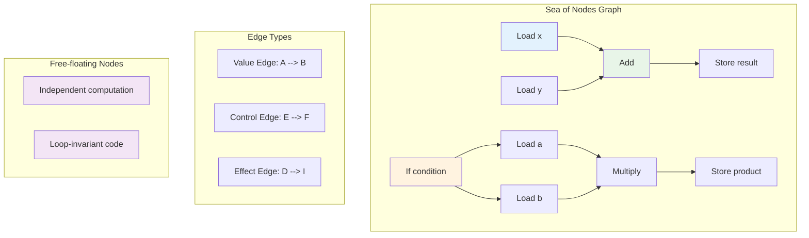

<figcaption>Sea of Nodes graph showing value, control, and effect edges, and the concept of free-floating nodes for optimization</figcaption>

</figure>

#### 6.2.2 Optimization in the Sea

Optimization in a SoN IR is performed through a process of "graph reduction." The compiler applies a series of reduction rules that match patterns in the graph and replace them with simpler, more optimal equivalents. The flexibility of the graph enables a wide range of powerful optimizations:

- **Global Value Numbering (GVN) and Redundancy Elimination**: SoN naturally facilitates GVN. If the same pure computation (e.g., `a / b`) appears in two different control-flow paths, they can be represented by a single node in the graph, eliminating the redundant work.

- **Aggressive Code Motion**: Operations that are loop-invariant can "float" out of loops more easily because they lack a control or effect dependency tying them to the loop's body.

- **Other Advanced Optimizations**: The flexible representation also enables load/check elimination, escape analysis (where temporary object allocations are replaced by scalar variables), and representation selection (choosing the most efficient numeric format for a value).

#### 6.2.3 Land Ahoy: The Pragmatic Departure from Sea of Nodes

While theoretically powerful and successful for languages like Java, SoN proved to be a problematic fit for JavaScript. The reason lies in a fundamental mismatch: in a dynamic language like JavaScript, almost every operation is potentially effectful. A simple property access could trigger a getter function with arbitrary side effects.

This forced most nodes in a typical JavaScript graph to be linked together by the effect chain. In practice, this effect chain often ended up mirroring the program's control-flow graph, effectively collapsing the "sea" back into a rigid structure and negating SoN's primary benefit of free-floating nodes. This mismatch led to significant engineering problems:

- **Extreme Complexity**: SoN graphs were incredibly difficult for compiler engineers to read, reason about, and debug.
- **Poor Compilation Performance**: The in-place mutation of a large, non-linear graph structure resulted in poor CPU cache locality, making the compiler itself slow—a critical flaw for a JIT compiler.
- **Optimization Hurdles**: Many optimizations that rely on clear control-flow reasoning became harder, not easier, to implement correctly.

Recognizing that the theoretical benefits were not being realized in practice, V8's engineering team made the pragmatic decision to build their newer compilers (Maglev and the next-generation Turboshaft) on a more traditional, better-suited CFG foundation.


### 6.3 A Walkthrough of the TurboFan Optimization Pipeline

The TurboFan pipeline can be visualized with tools like Turbolizer, which shows the state of the graph at each phase.

1. **Input**: The pipeline begins with the BytecodeGraphBuilder, which consumes the Ignition bytecode and the associated FeedbackVector to construct the initial graph.

2. **Frontend (Graph Building & Typing)**: The initial graph is built. The Typer and TypedLowering phases then use the feedback data to specialize generic operations. For example, a generic `+` operation in the bytecode becomes a `SpeculativeNumberAdd` node in the graph if the feedback indicates that only numbers have been seen at that site.

3. **Optimization Passes**: The graph then passes through a series of optimization and reduction phases that perform the analyses described previously (GVN, loop optimizations, escape analysis, etc.).

4. **Scheduling and Backend**: The now-optimized but still unordered graph is passed to the scheduler, which arranges the nodes into a linear sequence of basic blocks, effectively creating a CFG. This is followed by register allocation and final code generation, which emits the architecture-specific machine code.

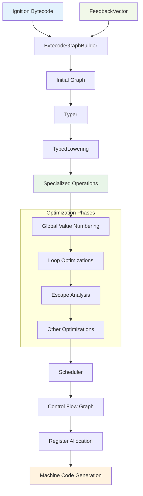

## Section 6: The Runtime System - Enabling Optimization

The entire strategy of speculative optimization in V8 hinges on its ability to infer static-like properties from dynamic code. This is accomplished through a sophisticated runtime system built on two interconnected concepts: hidden classes and inline caching.

### 6.1 Hidden Classes (Maps): Imposing Order on Dynamic Objects

To avoid slow dictionary-like lookups for object properties, V8 associates every object with a **Hidden Class** (internally called a Map). This Map acts as a descriptor for the object's "shape," defining its properties and their offset in memory. When a property is accessed, V8 can simply check the object's Map and, if it matches the expected one, load the value from a hard-coded memory offset—an operation that is orders of magnitude faster than a dynamic lookup.

Hidden classes form a transition tree. As properties are added to an object, V8 follows a transition to a new Map that describes the new shape.

A crucial takeaway is that the order of property addition matters. The code `p1.x=1; p1.y=2;` results in a different final Map than `p2.y=2; p2.x=1;`. To ensure optimal performance, objects should be initialized with all properties at once, in a consistent order.

### 6.2 Inline Caching (IC) and the FeedbackVector

While hidden classes provide the static layout, **Inline Caches (ICs)** are the dynamic mechanism V8 uses to observe which layouts actually appear at specific points in the code. Feedback from these ICs is stored in a per-function data structure called a **FeedbackVector**. As Ignition executes, it updates slots in this vector with the Maps it observes. This vector becomes the primary data source for the optimizing compilers.

The state of an IC quantifies the predictability of a code location:

- **Monomorphic**: The IC has only ever seen a single hidden class. This is the ideal state for optimization.
- **Polymorphic**: The IC has seen a small number of different hidden classes (typically 2-4). This is still fast and optimizable.
- **Megamorphic**: The IC has seen too many different hidden classes. V8 gives up on local optimization for this site and uses a slower, global cache. This state often prevents TurboFan from optimizing the function.

| State Name    | Number of Shapes Seen | Performance Characteristic                                                      | TurboFan Optimizability                                                           |
| ------------- | --------------------- | ------------------------------------------------------------------------------- | --------------------------------------------------------------------------------- |
| Uninitialized | 0                     | Initial state before first execution.                                           | N/A                                                                               |
| Monomorphic   | 1                     | Ideal. Extremely fast property access via a single map check and direct offset. | Highest. Provides the most precise type information for speculation.              |
| Polymorphic   | 2-4                   | Fast. Requires checking against a small, fixed list of known maps.              | High. Can still be optimized effectively, though may require more complex checks. |
| Megamorphic   | >4                    | Slow. Reverts to a generic lookup using a global cache.                         | Lowest. Often prevents optimization entirely due to high unpredictability.        |

**Table 1: Comparison of Inline Cache States**

## Section 7: The Art of Deoptimization: A Safety Net for Speculation

Deoptimization is not an error condition but a fundamental, and highly complex, component of V8's execution model. The compiler's job is not just to generate fast code, but also to generate the extensive metadata needed to precisely reverse its own transformations at any potential failure point. This mechanism is the essential safety net that makes V8's entire speculative JIT strategy safe and viable.

### 7.1 The Necessity of Deoptimization

TurboFan's performance gains are derived from making optimistic assumptions—speculations—based on the type feedback collected during interpretation. A typical speculation might be, "this function parameter will always be an object with hidden class C1". Deoptimization is the essential mechanism that safely handles the cases where these assumptions are violated at runtime (e.g., the parameter is suddenly a string). It allows V8 to be aggressive in its optimizations without sacrificing correctness.

### 7.2 A Catalogue of Deoptimization Triggers

Deoptimization events can be unconditional (e.g., intentionally placed at a loop exit to transition from optimized loop code back to the interpreter) or conditional, which are far more common. Common conditional triggers include:

- **Type and Map Checks**: This is the most frequent cause of deoptimization. The optimized code contains a check to ensure an object's hidden class (Map) is the one it expects. If not, it triggers a deopt with the reason `kWrongMap`. This is the direct consequence of dynamic changes in object shape.

- **Value Checks**: A value was expected to be a Small Integer (Smi) but was not (`kSmi`, `kNotASmi`), or an array access encountered an uninitialized "hole" (`kHole`).

- **Bounds and Overflow Checks**: An array access was determined to be out of bounds (`kOutOfBounds`), or an arithmetic operation resulted in an overflow (`kOverflow`).

- **Insufficient Feedback**: A function is deoptimized because it was optimized too early, before enough type information was gathered to make a stable speculation (`kInsufficientTypeFeedback`).

Deoptimizations can also be classified as eager or lazy. Eager deoptimization occurs immediately when a check fails within the currently executing optimized function. Lazy deoptimization happens when the execution of one function invalidates the assumptions of another optimized function; that other function is then marked for deoptimization and will bail out the next time it is called.

| Category        | Specific Reason | Explanation                                                                     | Example Code Pattern                                                                                                 |
| --------------- | --------------- | ------------------------------------------------------------------------------- | -------------------------------------------------------------------------------------------------------------------- |
| Type Checks     | kWrongMap       | The object's hidden class is not what the optimized code expected.              | A function optimized for `obj.x` is called with an object where `y` was added before `x`, changing its hidden class. |
| Value Checks    | kNotASmi        | An operation expected a Small Integer but received a heap number or other type. | A function optimized for `x + 1` is called with `x` being a floating-point number.                                   |
| Bounds Checks   | kOutOfBounds    | An array index was outside the valid range of the array's length.               | `arr[i]` where `i` becomes greater than or equal to `arr.length`.                                                    |
| Overflow Checks | kOverflow       | An integer arithmetic operation exceeded the representable range.               | Adding two large integers results in a value that cannot be stored as a Smi.                                         |

**Table 2: Common Deoptimization Reasons in V8**

### 7.3 The Mechanics of Deoptimization: Reconstructing the Execution State

The core challenge of deoptimization is that it cannot simply restart the function from the beginning due to potential side effects. It must resume execution in the unoptimized Ignition bytecode from the exact point where the optimized code failed. This process of "time travel" is known as frame translation and involves three steps:

1. **Save State**: The current state of the optimized function—including values in CPU registers and on the stack—is captured and serialized into a FrameDescription data structure. This is triggered by a call from the optimized code to a DeoptimizationEntry builtin.

2. **Transform State**: This saved state is then translated to match the layout expected by the Ignition interpreter's stack frame at the target bytecode offset. This complex mapping involves moving values from CPU registers back to their corresponding virtual registers or stack slots in the interpreter frame. The metadata required for this translation is generated by TurboFan at compile time and stored alongside the optimized code.

3. **Replace Frame and Jump**: The optimized stack frame is popped from the call stack and replaced with the newly constructed, fully populated interpreter frame. Execution then resumes by jumping directly to the correct bytecode instruction within Ignition, as if the optimized code had never run.

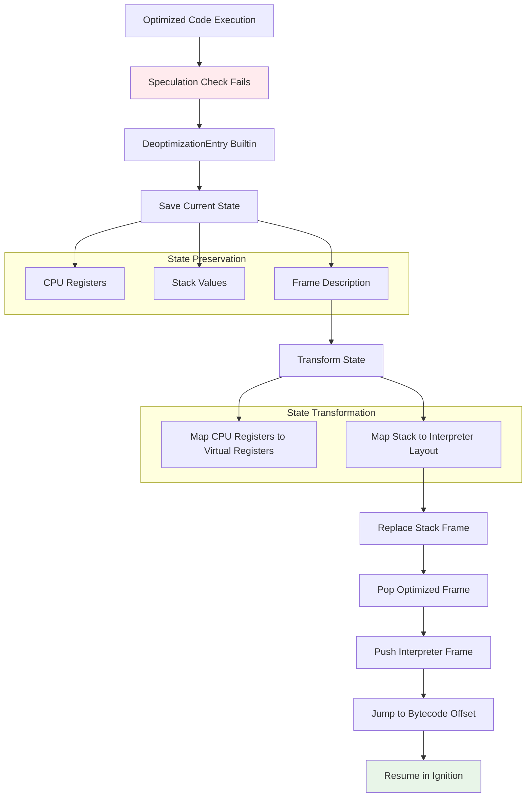

## Section 8: Orinoco - The High-Throughput, Low-Latency Garbage Collector

Orinoco is the codename for V8's garbage collection (GC) project. It represents a transformation of the memory manager from a simple utility into a core performance feature, designed explicitly to minimize application latency, or "jank." The architecture is a sophisticated, hybrid solution that pragmatically applies the right collection technique to the right phase of the problem, all unified by the singular goal of freeing the main thread and minimizing "stop-the-world" time.

### 8.1 The Generational Hypothesis and V8's Heap Structure

The design of most modern garbage collectors is dominated by the Generational Hypothesis: "most objects die young". This empirical observation means that most allocated memory becomes garbage very quickly. V8's heap is partitioned to exploit this fact, separating objects by age to apply different, specialized collection strategies:

- **Young Generation**: A relatively small region (up to 16MB) where all new objects are allocated. It is collected frequently and aggressively. It is further divided into a "nursery" for brand-new allocations and an "intermediate" sub-generation for objects that have survived one collection cycle.

- **Old Generation**: A much larger region that holds "tenured" objects—those that have survived multiple collections in the Young Generation. It is collected much less frequently but the collections are more involved.

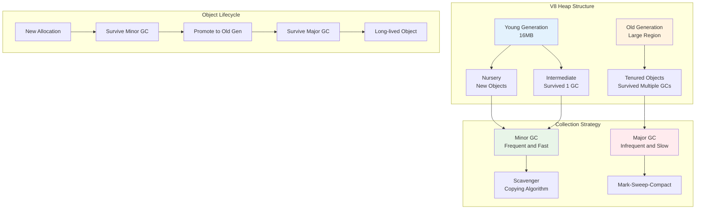

### 8.2 The Parallel Scavenger: Optimizing Young Generation Collection

The Young Generation is managed by a minor GC called a scavenger, which uses a semi-space copying algorithm. The space is divided into an active "From-Space" and an empty "To-Space." During a collection, all live objects are evacuated (copied) from From-Space to To-Space. This process automatically compacts memory, as the dead objects are simply left behind in the now-abandoned From-Space.

The key Orinoco innovation for this process is making the scavenge parallel. During the brief "stop-the-world" pause, the main JavaScript thread and several helper threads work together to scan for roots and evacuate live objects. This divides the total pause time by the number of available CPU cores, dramatically reducing its duration and impact on application responsiveness. Objects that survive a second scavenge are "promoted" by being moved to the Old Generation instead of to To-Space.

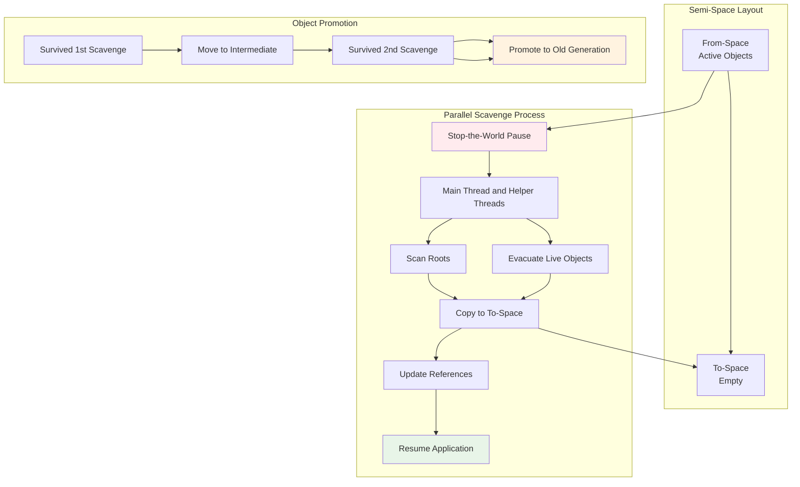

### 8.3 The Major GC: Concurrent Marking and Parallel Compaction in the Old Generation

The Old Generation is managed by a major GC that uses a three-phase Mark-Sweep-Compact algorithm:

1. **Marking**: Traverse the object graph from a set of roots (e.g., the execution stack, global objects) to identify all live, reachable objects.
2. **Sweeping**: Iterate through the heap and add the memory regions of dead (unmarked) objects to free lists, making the memory available for future allocations.
3. **Compacting**: Move live objects together to reduce memory fragmentation and improve locality.

Orinoco's strategy is to apply different advanced techniques to each phase to minimize main thread pauses:

- **Concurrent Marking**: The marking phase, which is the most time-consuming part of a major GC, is performed concurrently. Helper threads perform most of the object graph traversal in the background while the main JavaScript thread continues to run. Special "write barriers" are used to track any new object pointers created by the running JavaScript code, ensuring the GC's view of the object graph remains consistent.

- **Concurrent Sweeping**: The sweeping phase can also be performed concurrently in the background after marking is complete.

- **Parallel Compaction**: The final compaction phase, which moves objects in memory, still requires a "stop-the-world" pause. However, like the scavenger, this work is performed in parallel by the main thread and helper threads to shorten the pause duration as much as possible.

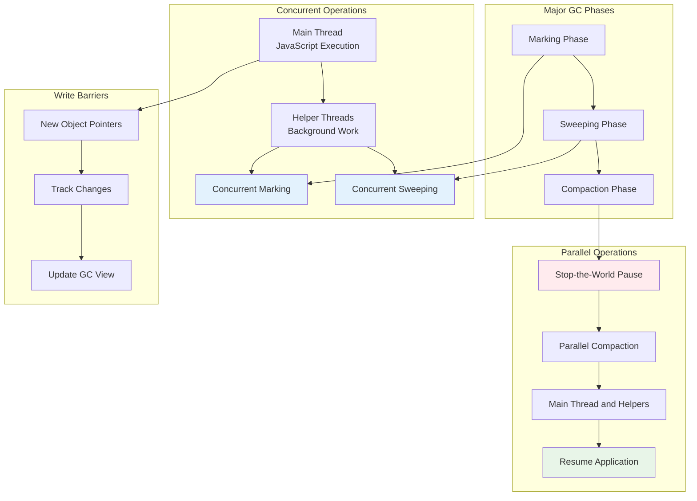

### 8.4 Advanced GC Techniques

**Black Allocation**: This is an optimization where objects that are expected to be long-lived (e.g., those being promoted to the Old Generation) are immediately marked "black" (live) and placed on special "black pages". The GC can then skip scanning these pages entirely during the next marking cycle, reducing the overall workload based on the strong assumption that these objects will survive.

**Remembered Sets**: To avoid scanning the entire large Old Generation heap just to find pointers into the small Young Generation during a scavenge, V8 maintains remembered sets. These are data structures that track all pointers that point from old objects to young objects. Orinoco improved this system to a per-page structure that is easier to process in parallel.

**Idle-Time GC**: V8 provides hooks for its embedder (like the Chrome browser) to trigger GC work during application idle time. This allows for proactive memory cleanup when the user is not interacting with the page, reducing the likelihood of a disruptive GC pause occurring during a critical animation or user input event.

## Section 9: The Evolution of V8's Compilation Pipeline

The historical trajectory of V8's compilation pipeline reveals a clear progression in engineering philosophy. The focus has shifted from an initial emphasis on raw peak performance to a more mature strategy centered on performance predictability and, ultimately, smoothness across the entire application lifecycle. Each new architectural iteration was a direct response to the performance gaps and engineering challenges revealed by its predecessor.

### 9.1 The Early Days: The Full-codegen and Crankshaft System

When V8 was first released in 2008, it introduced a novel approach of compiling JavaScript directly to machine code, bypassing an intermediate bytecode representation. This gave it a significant early performance advantage over competing engines. The architecture soon matured into a two-compiler system:

- **Full-codegen**: A fast but non-optimizing baseline compiler. Its primary function was to generate machine code for any JavaScript function as quickly as possible, ensuring a rapid application startup. However, the code it produced was unoptimized and verbose, leading to substantial memory overhead—a critical issue on memory-constrained devices like early smartphones.

- **Crankshaft**: An adaptive JIT optimizing compiler. Crankshaft would identify "hot" functions (frequently executed code) and recompile them to achieve high peak performance.

The primary failing of this system was its brittleness, which created the "performance cliff" problem. Crankshaft could only optimize a limited subset of the JavaScript language. If a developer used an unsupported feature, such as a try-catch block or certain patterns involving the arguments object, Crankshaft would "bail out." The function would then be permanently stuck running the slow, unoptimized code generated by Full-codegen. This created a highly unpredictable performance model where small, seemingly innocuous code changes could lead to drastic performance degradation, a major source of frustration for developers. The complex rules around arguments object aliasing, for example, were a canonical source of such bailouts.

### 9.2 The Ignition and TurboFan Revolution: A Paradigm Shift

Launched in 2017, the Ignition and TurboFan pipeline represented a complete architectural rewrite. The goals were not merely to improve peak performance but to create a more predictable, maintainable, and memory-efficient system that could optimize the entire JavaScript language, thereby widening the "fast path" and eliminating the performance cliffs of the past.

A cornerstone of this new architecture is the concept of bytecode as the "source of truth." Ignition, the new interpreter, generates a concise bytecode format from the Abstract Syntax Tree (AST). This bytecode becomes the single, stable input for the entire execution and optimization pipeline. This crucial design decision decoupled the optimizing compiler from the parser, eliminating the need for TurboFan to re-parse JavaScript source code—a major inefficiency of the Crankshaft era. Furthermore, it provided a much simpler and more robust target for deoptimization, a process of reverting from optimized code back to a baseline state.

With the launch of V8 v5.9, Full-codegen and Crankshaft were officially deprecated. They were no longer capable of keeping pace with the rapid evolution of the JavaScript language (ES2015+ features) and the sophisticated optimizations those features required.

### 9.3 Bridging the Gaps: The Modern Four-Tier Pipeline

While the Ignition/TurboFan pipeline was a massive improvement, it introduced a new performance gap. Code would execute relatively slowly in the Ignition interpreter until it became "hot" enough to justify the time-consuming and resource-intensive compilation by the top-tier TurboFan compiler. To create a smoother performance gradient, V8 introduced two intermediate tiers.

**Sparkplug (2021)**: This is a fast, non-optimizing baseline JIT compiler. Sparkplug's defining characteristic is that it compiles from bytecode, not from source code. It performs a single, linear pass over the bytecode, emitting machine code for each instruction, often by simply generating calls to pre-compiled builtins for more complex operations. Crucially, it generates no Intermediate Representation (IR) of its own, making its compilation speed orders of magnitude faster than TurboFan.

**Maglev (2023)**: To further smooth the performance curve, V8 introduced Maglev, a mid-tier optimizing compiler that sits between Sparkplug and TurboFan. Maglev is significantly faster to compile than TurboFan but produces much faster code than Sparkplug. It uses a traditional Static Single-Assignment (SSA) based Control-Flow Graph (CFG) IR and performs quick optimizations based on the type feedback collected by Ignition, without incurring the full cost of TurboFan's deep analyses.

This evolution results in the modern four-tier pipeline: **Ignition (interpreter) → Sparkplug (baseline JIT) → Maglev (mid-tier optimizing JIT) → TurboFan (top-tier optimizing JIT)**. This architecture allows V8 to make fine-grained decisions, providing a smooth performance gradient from fast startup to maximum execution speed.

| Era          | Baseline Tier                                                       | Optimizing Tier(s) | Key Characteristics/Rationale                                                                                                                                                                                      |
| ------------ | ------------------------------------------------------------------- | ------------------ | ------------------------------------------------------------------------------------------------------------------------------------------------------------------------------------------------------------------ |
| 2010–2017    | Full-codegen (fast, non-optimizing compiler)                        | Crankshaft         | Initial JIT architecture. Fast startup but suffered from high memory usage and "performance cliffs" due to Crankshaft's limited optimization scope.                                                                |
| 2017–2021    | Ignition (interpreter)                                              | TurboFan           | Complete rewrite. Introduced bytecode as the source of truth. Eliminated performance cliffs by supporting the full language. Created a new performance gap between slow interpretation and expensive optimization. |
| 2021–Present | Ignition, Sparkplug (baseline compiler), Maglev (mid-tier compiler) | TurboFan           | Multi-tiered pipeline to smooth the performance curve. Sparkplug provides fast baseline machine code, while Maglev offers intermediate optimization, bridging the gap to TurboFan.                                 |

**Table 3: Evolution of V8's Compiler Pipeline**

| Tier Name | Role                    | Input               | Output                        | Compilation Speed | Execution Speed | Key Characteristics                                                                                                                              |
| --------- | ----------------------- | ------------------- | ----------------------------- | ----------------- | --------------- | ------------------------------------------------------------------------------------------------------------------------------------------------ |
| Ignition  | Interpreter             | AST                 | Bytecode                      | Very Fast         | Slow            | Executes code immediately, collects type feedback for optimization, low memory overhead.                                                         |
| Sparkplug | Baseline JIT Compiler   | Bytecode            | Machine Code                  | Extremely Fast    | Fast            | Non-optimizing. Compiles bytecode via a single linear pass with no IR. Maintains interpreter stack layout for simple On-Stack Replacement (OSR). |
| Maglev    | Mid-Tier Optimizing JIT | Bytecode + Feedback | Optimized Machine Code        | Fast              | Faster          | SSA-based CFG IR. Performs fast optimizations based on type feedback. Bridges the gap between Sparkplug and TurboFan.                            |
| TurboFan  | Top-Tier Optimizing JIT | Bytecode + Feedback | Highly Optimized Machine Code | Slow              | Fastest         | Performs deep, speculative optimizations using a graph-based IR for peak performance on "hot" code.                                              |

**Table 4: V8's Modern Tiered Compilation Pipeline**

## Conclusion: Synthesis and Future Directions

The architecture of the V8 engine is a testament to the power of pragmatic, data-driven engineering. Its remarkable performance arises not from a single optimization, but from the deep, symbiotic interplay between its core components. The co-design of the Ignition interpreter and the TurboFan compiler, where the compiler's backend is used to generate the interpreter's high-performance handlers, creates a powerful feedback loop. The runtime's object model, built on hidden classes and inline caching, provides the essential bridge of predictability that allows a speculative compiler to operate safely on a dynamic language. The Orinoco garbage collector has been transformed from a mere utility into a first-class performance feature, with its hybrid parallel and concurrent strategies designed explicitly to minimize application latency.

The story of V8 is also one of continuous evolution. The pragmatic departure from a pure Sea of Nodes IR in favor of a more traditional CFG-based approach for newer compilers like Maglev and the in-development Turboshaft demonstrates a mature engineering culture that prioritizes practical results over adherence to a single design dogma. The recent additions of the Sparkplug and Maglev tiers show that the process of identifying and smoothing out performance bottlenecks is an unending pursuit.

V8 is more than just a JavaScript engine; it is a living embodiment of decades of research in the field of high-performance dynamic language runtimes. Its architecture represents a series of sophisticated and deeply integrated solutions to a fundamentally difficult problem, constantly adapting to power the ever-expanding landscape of the modern web.

## References

### Official V8 Blog

- [Launching Ignition and TurboFan](https://v8.dev/blog/launching-ignition-and-turbofan)
- [Ignition: An interpreter for V8](https://v8.dev/blog/ignition-interpreter)
- [Sparkplug](https://v8.dev/blog/sparkplug)
- [Maglev](https://v8.dev/blog/maglev)
- [Trash Talk: Orinoco: young generation garbage collection](https://v8.dev/blog/trash-talk)
- [Leaving the Sea of Nodes](https://v8.dev/blog/leaving-the-sea-of-nodes)

### Key Technical Articles & Talks

- [Understanding V8's Bytecode](https://medium.com/dailyjs/understanding-v8s-bytecode-317d46c94775)
- [V8 Behind the Scenes](https://benediktmeurer.de/2017/03/01/v8-behind-the-scenes-february-edition/)
- [An introduction to speculative optimization in V8](https://v8.dev/blog/speculative-optimization)
- [The Sea of Nodes](https://darksi.de/d.sea-of-nodes/)
- [Hidden Classes](https://v8.dev/docs/hidden-classes)
- [TurboFan](https://v8.dev/docs/turbofan)

```

```
