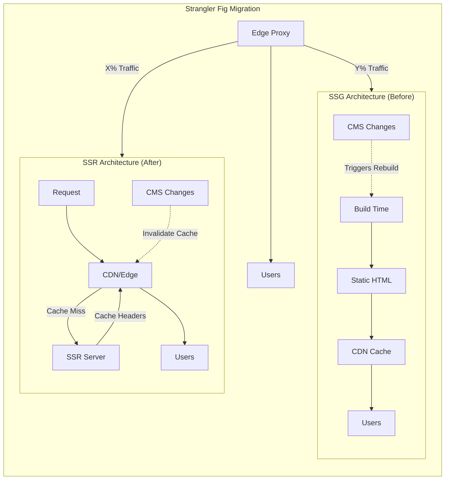
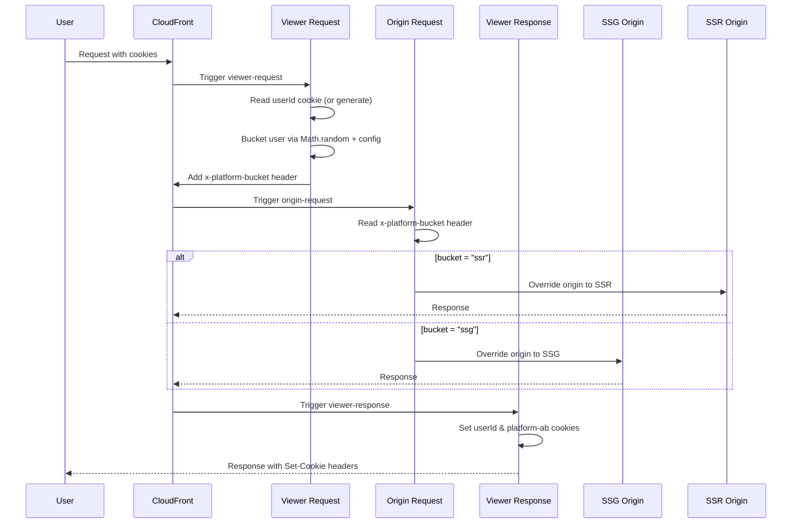

# Migrating E-commerce Platforms from SSG to SSR: A Strategic Architecture Transformation

This comprehensive guide outlines the strategic migration from Static Site Generation (SSG) to Server-Side Rendering (SSR) for enterprise e-commerce platforms. Drawing from real-world implementation experience where SSG limitations caused significant business impact including product rollout disruptions, ad rejections, and marketing campaign inefficiencies, this playbook addresses the critical business drivers, technical challenges, and operational considerations that make this architectural transformation essential for modern digital commerce.

Your marketing team launches a campaign at 9 AM. By 9:15, they discover the featured product shows yesterday's price because the site rebuild hasn't completed. By 10 AM, Google Ads has rejected the campaign for price mismatch. This scenario—and dozens like it—drove our migration from SSG to SSR. The lessons learned section documents our missteps—including a mid-project pivot from App Router to Pages Router—that shaped the final approach.

<figure>



<figcaption>High-level architecture comparison: SSG's build-time approach vs SSR's request-time rendering, with the Strangler Fig pattern enabling gradual traffic migration between platforms</figcaption>

</figure>

## Terminology

| Term | Definition |
|------|------------|
| SSG | Static Site Generation — HTML generated at build time, served from CDN |
| SSR | Server-Side Rendering — HTML generated on each request by the server |
| CDN | Content Delivery Network — edge servers caching and serving content globally |
| CLS | Cumulative Layout Shift — Core Web Vital measuring visual stability |
| LCP | Largest Contentful Paint — Core Web Vital measuring perceived load speed |
| INP | Interaction to Next Paint — Core Web Vital measuring interactivity responsiveness |
| TTFB | Time to First Byte — time from request to first byte of response |
| CTR | Click-Through Rate — ratio of clicks to impressions in advertising |
| ROAS | Return on Ad Spend — revenue generated per dollar spent on advertising |

## TLDR

**SSG-to-SSR migration** is a strategic architecture transformation that addresses fundamental limitations of build-time static generation for dynamic e-commerce platforms, enabling real-time content updates, zero-CLS personalization, and independent content/code lifecycles.

### Why Migrate from SSG

- **Build-time bottlenecks**: Full site rebuilds for every change create unacceptable delays for marketing teams
- **Content-code coupling**: Code rollbacks also roll back content, causing 404 errors and lost marketing spend
- **CLS issues**: Dynamic content (pricing, inventory) "pops in" after static shell loads, hurting Core Web Vitals
- **Ad rejections**: Static pricing mismatches between cached HTML and client-side updates trigger Google Ads violations

### SSR Benefits for E-commerce

- **Request-time rendering with CDN caching**: Server renders fresh content, CDN caches based on cache headers for performance
- **Edge middleware**: Zero-CLS A/B testing and personalization via URL rewrites at the edge
- **Cache invalidation**: CMS webhooks trigger CDN cache purges for immediate content updates
- **Content decoupling**: Marketing teams publish independently without engineering coordination

### Strangler Fig Migration Pattern

- **Gradual replacement**: Route X% of traffic to SSR while maintaining SSG for the rest
- **Instant rollback**: Adjust traffic distribution in minutes via edge middleware configuration
- **Risk mitigation**: Issues affect only a subset of users during phased rollout
- **Platform A/B testing**: Direct performance comparison between old and new systems

### Key Success Metrics

- **Core Web Vitals targets**: LCP < 2.5s, CLS < 0.1, INP < 200ms
- **Content publishing time**: Reduce from ~15 minutes to < 30 seconds
- **Business metrics**: Maintain or improve conversion rates, CTR, and ROAS throughout migration
- **Rollback triggers**: Quantitative thresholds (e.g., >10% drop in add-to-cart rate) for automatic decisions

## Part 1: The Strategic Imperative - Building the Business Case for Migration

While our specific journey involved migrating from Gatsby.js to Next.js, the principles and strategies outlined here apply to any SSG-to-SSR migration. The guide covers stakeholder alignment, risk mitigation, phased execution using platform A/B testing, and post-migration optimization, providing a complete roadmap for engineers undertaking this transformative journey.

The TLDR above summarizes the core drivers. This section provides the detailed evidence and quantified business impact that supports the migration case.

### The Business Impact of SSG Limitations - Real-World Production Experience

**Critical Business Problems from Actual Implementation**

Based on real production experience with our SSG implementation, several critical issues emerged that directly impacted revenue and operational efficiency:

- **Product Rollout Disruptions**: SSG bundles code and content as one snapshot, meaning any code issue requiring rollback also removes newly launched products, resulting in 404 errors and lost marketing spend. Fix-forward approaches take 2+ hours, during which email campaigns and marketing spend are wasted on broken product pages.

- **Product Retirement Complexity**: Retired products require external redirection management via Lambda functions, creating inconsistencies between redirects and in-app navigation, leading to poor user experience and potential SEO issues.

- **Ad Rejection Issues**: Static pricing at build time creates mismatches between cached HTML and client-side updates, leading to Google Ads rejections. The workaround of using `img.onError` callbacks and `data-pricing` attributes for DOM manipulation before React initialization is fragile and unsustainable.

- **Marketing Campaign Limitations**: Inability to optimize campaigns based on real-time inventory status, with all products appearing as "In Stock" in cached content. Client-side updates create CLS issues and poor user experience.

- **A/B Testing Scalability**: Page-level A/B testing becomes unfeasible due to template complexity and build-time constraints. Component-level A/B testing below the fold is possible but above-the-fold personalization affects SEO and causes CLS issues.

- **Personalization Constraints**: Above-the-fold personalization impossible without affecting SEO and causing CLS issues. Below-the-fold personalization requires client-side loading which impacts performance.

- **Responsive Design CLS Issues**: For content that differs between mobile and desktop, CLS is inevitable since build time can only generate one default version. Client-side detection and content switching creates layout shifts that negatively impact Core Web Vitals and user experience.

**Operational and Cost Issues**

- **Occasional Increased CloudFront Costs**: Home page launches with 200+ products caused ~10x cost for the day when content exceeded 10MB—CloudFront's automatic compression limit—resulting in uncompressed transfers and higher egress costs.

- **Content-Code Coupling**: Marketing teams cannot publish content independently, requiring engineering coordination for simple banner updates and page launches.

- **Time-Based Release Complexity**: Managing multiple content changes for a single page becomes problematic when all changes must be published simultaneously.

### SSR as the Strategic Solution

**Dynamic Rendering for Modern Commerce**

SSR provides a flexible, dynamic rendering model that directly addresses each of these challenges:

- **Server-Side Rendering**: Enables real-time data fetching for dynamic content like pricing and inventory
- **CDN Caching with Cache Headers**: SSR responses cached at the edge based on `Cache-Control` headers, combining fresh rendering with CDN performance
- **Edge Middleware**: Enables sophisticated routing, personalization, and A/B testing decisions at the edge
- **API Routes**: Built-in backend functionality for handling forms, cart management, and third-party integrations

**Quantifiable Business Benefits**

The migration from SSG to SSR delivers measurable improvements across key business metrics:

- **CTR (Click-Through Rate)**: Expected 5-10% increase through faster load times, better personalization, and stable UI
- **ROAS (Return on Ad Spend)**: Projected 8-12% improvement from reduced CPC, higher conversion rates, and fewer ad rejections
- **Content Publishing Agility**: 50% reduction in time-to-market for new campaigns and promotions
- **Developer Productivity**: 20% increase in development velocity through modern tooling and flexible architecture
- **Operational Costs**: Elimination of CloudFront cost spikes and improved resource utilization

## Part 2: Stakeholder Alignment and Project Governance

### Building Executive Buy-In

**The CFO Conversation**

Frame the migration as an investment with clear ROI:

- Direct revenue impact through improved conversion rates and reduced ad spend
- Operational cost reduction through faster content publishing and reduced developer dependencies
- Predictable hosting costs through modern serverless architecture
- Elimination of CloudFront cost spikes from large content deployments

**The CMO Conversation**

Emphasize marketing agility and performance:

- Rapid campaign launches without engineering bottlenecks
- Robust A/B testing without negative UX impact
- Superior SEO outcomes and organic traffic growth
- Real-time personalization capabilities
- Independent content publishing workflow

**The CTO Conversation**

Position as strategic de-risking:

- Moving away from architectural constraints toward industry-standard patterns
- Mitigating hiring challenges and improving developer retention
- Positioning technology stack for future innovation
- Reducing technical debt and operational complexity
- Solving critical production issues affecting revenue

### Assembling the Migration Task Force

**Core Team Structure**

- **Project Lead**: Ultimate ownership of technical vision and project success
- **Frontend Engineering Team**: Core execution team for component migration and new implementation
- **Backend/API Team**: Ensures backend services support SSR requirements
- **DevOps/Platform Engineering**: Infrastructure setup and CI/CD pipeline management
- **SEO Specialist**: Critical role for maintaining organic traffic and search rankings
- **QA Team**: Comprehensive testing across all user journeys and performance metrics
- **Product and Business Stakeholders**: Representatives from marketing, merchandising, and product management

**Operating Model**

- **Agile Methodology**: Two-week sprints with daily stand-ups and regular demonstrations
- **Cross-Functional Collaboration**: Regular sync meetings across all stakeholders
- **Clear Decision-Making Authority**: Defined roles for technical, business, and go/no-go decisions

### Risk Assessment and Mitigation

**High-Priority Risks and Mitigation Strategies**

| Risk Category          | Description                                         | Likelihood | Impact   | Mitigation Strategy                                                 |
| ---------------------- | --------------------------------------------------- | ---------- | -------- | ------------------------------------------------------------------- |
| SEO Impact             | Loss of organic traffic due to incomplete redirects | High       | Critical | Dedicated SEO specialist from Day 1, comprehensive redirect mapping |
| Performance Regression | New site performs worse than SSG benchmark          | Medium     | Critical | Strict performance budgets, automated testing in CI/CD              |
| Timeline Delays        | Underestimating build-time logic complexity         | High       | High     | Early spike analysis, phased rollout approach                       |
| Checkout Functionality | Critical revenue-generating flow breaks             | Low        | Critical | Keep checkout on legacy platform until final phase                  |

**Risk Management Framework**

- **Avoid**: Alter project plan to eliminate risk entirely
- **Reduce**: Implement actions to decrease likelihood or impact
- **Transfer**: Shift financial impact to third parties
- **Accept**: Consciously decide to accept low-priority risks

## Part 3: Technical Migration Execution

### Phase 0: Pre-Migration Foundation

**Comprehensive Site Audit**

- **Full Site Crawl**: Using tools like Screaming Frog to capture all URLs, meta data, and response codes
- **High-Value Page Identification**: Cross-referencing crawl data with analytics to prioritize critical pages
- **Backlink Profile Analysis**: Understanding external linking patterns for redirect strategy

**Performance Benchmarking**

Establish quantitative baselines for:

- **Core Web Vitals**: LCP, INP, and CLS scores for key page templates
- **Load Performance**: TTFB and FCP metrics
- **SEO Metrics**: Organic traffic, keyword rankings, indexed pages
- **Business Metrics**: Conversion rates, average order value, funnel progression

**Environment Setup**

- **Repository Initialization**: New Git repo with SSR framework project structure
- **Staging Environment**: Preview environment with production parity
- **CI/CD Pipeline**: Automated testing, linting, and deployment workflows

### Phase 1: Foundational Migration

**Project Structure and Asset Migration**

- Adopt modern SSR framework directory structure
- Migrate static assets from SSG to SSR public directory
- Create global layout with shared UI components

**Component Conversion**

- **Internal Links**: Convert SSG-specific link components to SSR equivalents
- **Images**: Replace SSG image components with SSR-optimized alternatives
- **Styling**: Handle CSS-in-JS compatibility with modern rendering patterns
- **SEO Metadata**: Implement static metadata objects for site-wide and page-specific tags

**Static Page Migration**

Begin with low-complexity pages:

- About Us, Contact, Terms of Service, Privacy Policy
- Simple marketing landing pages
- Static content sections

### Phase 2: Dynamic Functionality Implementation

**Data Fetching Paradigm Shift**

- Replace SSG's build-time data sourcing with SSR's request-time fetching
- Implement dynamic route generation for content-driven pages
- Convert static data sourcing to server-side data fetching

**Rendering Strategy Selection**

- **SSG**: For infrequently changing content (blog posts, marketing pages)
- **SSR with CDN caching**: For product pages requiring data freshness (pricing, inventory) with cache headers controlling TTL
- **SSR (no cache)**: For user-specific data (account dashboards, order history)
- **CSR**: For highly interactive components within rendered pages

**API Route Development**

- Form handling and submission processing
- Shopping cart state management
- Payment processor integration
- Third-party service communication

### Phase 3: Advanced E-commerce Features

**Zero-CLS A/B Testing Architecture**

The "rewrite at the edge" pattern delivers static performance with dynamic logic:

1. **Create Variants as Static Pages**: Pre-build each experiment variation
2. **Dynamic Route Generation**: Use SSR routing for variant paths
3. **Edge Middleware Decision Logic**: Implement experiment assignment and routing
4. **Transparent URL Rewriting**: Serve variants while maintaining user URLs

**Server-Side Personalization**

- Geo-location based content delivery
- User segment targeting
- Behavioral personalization
- Campaign-specific landing page variants

**Dynamic SEO and Structured Data**

- Real-time LD+JSON generation for accurate product information
- Dynamic canonical and hreflang tag management
- Core Web Vitals optimization through server-first rendering

### Phase 4: Content Decoupling Implementation

**On-Demand Revalidation Architecture**

- **CMS Webhook Integration**: Configure headless CMS to trigger revalidation
- **Secure API Route**: Verify authenticity and parse content change payloads
- **Cache Management**: Use revalidation APIs for targeted page updates
- **Independent Lifecycles**: Enable content and code teams to work autonomously

> **⚠️ Implementation Warning:** Real-time cache invalidation introduces race conditions with backend systems. If your product API lags behind CMS updates, SSR renders 404s for newly published products. See "Lessons Learned: Real-Time Content Updates Require Operational Readiness" for our solution using versioned content releases.

**Benefits of True Decoupling**

- Content updates publish in seconds, not minutes
- No engineering dependencies for marketing changes
- Reduced risk of content-code conflicts
- Improved team productivity and autonomy

## Part 4: The Strangler Fig Pattern - Phased Rollout Strategy with Platform A/B Testing

### Why Not "Big Bang" Migration?

A single cutover approach is unacceptably risky for mission-critical e-commerce platforms. The Strangler Fig pattern enables incremental migration with continuous value delivery and risk mitigation.

**Architecture Overview**

- **Routing Layer**: Edge middleware directing traffic between legacy and new systems
- **Gradual Replacement**: Piece-by-piece migration of site sections
- **Immediate Rollback**: Simple configuration changes for issue resolution
- **Platform A/B Testing**: Serve X% of users from SSR while maintaining SSG for others

### Platform A/B Testing Implementation

**Traffic Distribution Strategy**

The platform A/B approach allows for controlled, gradual migration:

- **User Segmentation**: Route users based on user ID hash, geographic location, or other deterministic criteria
- **Traffic Percentage Control**: Start with 5% of users on SSR, gradually increase to 100%
- **Real-Time Monitoring**: Track performance metrics for both platforms simultaneously
- **Instant Rollback**: Switch traffic back to SSG within minutes if issues arise

**Implementation Details**

Our implementation used AWS CloudFront with Lambda@Edge functions at three trigger points: Viewer Request, Origin Request, and Viewer Response. This architecture handles bucketing at the edge before requests reach either origin.

<figure>



<figcaption>CloudFront Lambda@Edge flow: Viewer Request handles user identification and bucketing, Origin Request routes to the appropriate origin, and Viewer Response persists cookies</figcaption>

</figure>

**Viewer Request Function** — Runs on every request before cache lookup:

```javascript title="viewer-request.js"
const BUCKET_CONFIG = {
  ssr: 25, // 25% to SSR
  ssg: 75, // 75% to SSG (default)
}

function handler(event) {
  const request = event.request
  const cookies = request.cookies || {}

  // Extract or generate userId
  let userId = cookies["userId"]?.value
  if (!userId) {
    userId = generateUUID()
  }

  // Check for existing bucket assignment
  let bucket = cookies["platform-ab"]?.value

  // New users: assign bucket based on random distribution
  if (!bucket) {
    const rand = Math.random() * 100
    bucket = rand < BUCKET_CONFIG.ssr ? "ssr" : "ssg"
  }

  // Pass bucket to origin-request via header
  request.headers["x-platform-bucket"] = { value: bucket }
  request.headers["x-user-id"] = { value: userId }

  return request
}
```

**Origin Request Function** — Runs on cache miss, selects origin:

```javascript title="origin-request.js"
const ORIGINS = {
  ssr: {
    domainName: "ssr-app.example.com",
    protocol: "https",
    port: 443,
    path: "",
    sslProtocols: ["TLSv1.2"],
  },
  ssg: {
    domainName: "ssg-bucket.s3.amazonaws.com",
    protocol: "https",
    port: 443,
    path: "",
    sslProtocols: ["TLSv1.2"],
  },
}

function handler(event) {
  const request = event.request
  const bucket = request.headers["x-platform-bucket"]?.value || "ssg"

  // Override origin based on bucket
  request.origin = { custom: ORIGINS[bucket] }

  // Required: update Host header to match new origin
  request.headers["host"] = { value: ORIGINS[bucket].domainName }

  return request
}
```

**Viewer Response Function** — Runs on every response, sets cookies:

```javascript title="viewer-response.js"
function handler(event) {
  const request = event.request
  const response = event.response

  const userId = request.headers["x-user-id"]?.value
  const bucket = request.headers["x-platform-bucket"]?.value

  // Set cookies for user persistence and bucket consistency
  const cookieOptions = "Path=/; Secure; SameSite=Lax; Max-Age=2592000" // 30 days

  response.cookies = response.cookies || {}
  response.cookies["userId"] = { value: userId, attributes: cookieOptions }
  response.cookies["platform-ab"] = { value: bucket, attributes: cookieOptions }

  return response
}
```

**Cache Policy Configuration** — Critical for correct bucketing:

The `platform-ab` cookie must be included in the CloudFront cache policy's cache key. Without this, users in different buckets would receive cached responses from the wrong origin. Configure the cache policy to include:

- **Cookies**: `platform-ab` (whitelist)
- **Headers**: None (or minimal for cache efficiency)
- **Query strings**: As needed for your application

> **Why cookies in cache key?** If user A (SSR bucket) requests `/product/123` and the response is cached, user B (SSG bucket) requesting the same URL would incorrectly receive the SSR-rendered page. Including `platform-ab` in the cache key creates separate cache entries per bucket.

**Benefits of Platform A/B Testing**

- **Risk Mitigation**: Issues affect only a subset of users
- **Performance Comparison**: Direct A/B testing of both platforms
- **Gradual Validation**: Build confidence before full migration
- **Business Continuity**: Maintain revenue while testing new platform

### Phased Rollout Plan

**Phase A: Low-Risk Content with Platform A/B (Weeks 1-4)**

- **Scope**: Blog, marketing pages, static content
- **Traffic Distribution**: 10% SSR, 90% SSG
- **Success Metrics**: LCP < 2.5s, organic traffic maintenance, keyword stability
- **Go/No-Go Criteria**: All P0/P1 bugs resolved, staging performance validated
- **Rollback Strategy**: Reduce SSR traffic to 0% if issues arise

**Phase B: Core E-commerce with Increased Traffic (Weeks 5-8)**

- **Scope**: Product Detail Pages with SSR and CDN caching
- **Traffic Distribution**: 25% SSR, 75% SSG
- **Success Metrics**: CLS < 0.1, add-to-cart rate maintenance, conversion stability
- **Approach**: Monitor business metrics closely, adjust traffic distribution based on performance
- **Rollback Trigger**: >10% drop in add-to-cart rate for 24 hours

**Phase C: High-Complexity Sections (Weeks 9-12)**

- **Scope**: Category pages, search functionality, checkout flow
- **Traffic Distribution**: 50% SSR, 50% SSG
- **Success Metrics**: TTFB < 400ms, funnel progression rates, error rates
- **Approach**: Sequential migration with extensive testing
- **Rollback Trigger**: Critical bugs affecting >5% of users

**Phase D: Final Migration and Legacy Decommissioning (Week 13+)**

- **Scope**: Complete migration and infrastructure cleanup
- **Traffic Distribution**: 100% SSR, 0% SSG
- **Success Criteria**: 100% traffic on new platform, stable performance for one business cycle
- **Final Steps**: Remove edge middleware, decommission SSG infrastructure

### Rollback Strategy

**Immediate Response Protocol**

- **Configuration Change**: Update edge middleware to route problematic paths back to legacy
- **Execution Time**: Minutes, not hours or days
- **Clear Triggers**: Quantitative thresholds for automatic rollback decisions
- **Communication**: Immediate stakeholder notification and status updates

**Platform A/B Rollback Benefits**

- **Instant Traffic Control**: Adjust SSR percentage from 0% to 100% in real-time
- **Granular Control**: Rollback specific user segments or geographic regions
- **Performance Monitoring**: Compare both platforms side-by-side during issues
- **Business Continuity**: Maintain revenue while resolving technical problems

## Part 5: Security and Performance Considerations

### Security Hardening for SSR

**HTTP Security Headers Implementation**

- **Content Security Policy**: Restrict resource origins and prevent XSS attacks
- **Strict Transport Security**: Force HTTPS and prevent downgrade attacks
- **Frame Ancestors**: Prevent clickjacking through CSP directives
- **Referrer Policy**: Minimize information leakage to external domains

**Framework-Specific Security Measures**

- **SSR Framework Hardening**: Enable strict mode, implement security headers API
- **Edge Function Security**: Runtime isolation and minimal permissions
- **API Route Protection**: Authentication, rate limiting, and input validation

**Attack Vector Mitigation**

| Attack Type     | SSR Risk Level | Primary Defenses              |
| --------------- | -------------- | ----------------------------- |
| Reflected XSS   | High           | CSP nonces, template encoding |
| CSRF            | High           | SameSite cookies, CSRF tokens |
| Clickjacking    | High           | frame-ancestors directive     |
| Cache Poisoning | Medium         | Proper Vary headers, WAF      |

### Performance Optimization

**Core Web Vitals Engineering**

- **LCP Optimization**: Priority loading for above-the-fold images, server-side rendering
- **INP Improvement**: Modern rendering patterns to reduce client-side JavaScript
- **CLS Prevention**: Server-side layout decisions, mandatory image dimensions

**Edge Performance Features**

- **Global CDN**: Worldwide content delivery with minimal latency
- **Edge Functions**: Logic execution close to users
- **Automatic Scaling**: Handle traffic spikes without performance degradation

**SSR Performance Considerations**

- **Throughput Optimization**: Start with 2 RPS, target 7+ RPS per pod
- **Deployment Stability**: Configure proper scaling parameters to prevent errors during scaling
- **BFF Integration**: Multi-team effort to move from cached to non-cached backend services

## Part 6: Success Measurement and Continuous Optimization

### The Unified Success Dashboard

**Multi-Layered KPI Framework**

- **Layer 1: Business Metrics**: Conversion rates, AOV, revenue per visitor
- **Layer 2: SEO Performance**: Organic traffic, keyword rankings, indexed pages
- **Layer 3: Web Performance**: Core Web Vitals, TTFB, FCP
- **Layer 4: Operational Health**: Error rates, build times, content publishing speed

**Recommended Instrumentation Stack**

- **Real User Monitoring (RUM):** Vercel Analytics, Datadog RUM, or New Relic Browser for Core Web Vitals from actual user sessions
- **Synthetic Monitoring:** Calibre, SpeedCurve, or Lighthouse CI for consistent baseline measurements
- **APM:** Instrument SSR functions with distributed tracing (Datadog APM, New Relic APM) to identify slow data fetches
- **Custom Metrics:** Track cache hit rates at CDN, SSR cold start frequency, and revalidation webhook latency

Key metrics to alert on: p95 TTFB > 800ms, cache hit rate < 90%, revalidation failures > 1% of requests.

**Key Performance Indicators**

| Metric Category         | Pre-Migration | Post-Migration Target | Business Impact                  |
| ----------------------- | ------------- | --------------------- | -------------------------------- |
| Overall Conversion Rate | 2.0%          | ≥ 2.1%                | Direct revenue increase          |
| CTR (Paid Campaigns)    | Baseline      | +5-10%                | Improved ad efficiency           |
| ROAS                    | Baseline      | +8-12%                | Better marketing ROI             |
| Content Publishing Time | ~15 minutes   | < 30 seconds          | Operational agility              |
| LCP (p75)               | 2.9s          | < 2.5s                | User experience improvement      |
| CloudFront Cost Spikes  | ~10x daily    | Eliminated            | Predictable infrastructure costs |

### Post-Launch Hypercare

**Real-Time Monitoring**

- **Dashboard Surveillance**: Daily monitoring of all KPI categories
- **Automated Alerts**: Configured for critical metric deviations
- **Issue Tracking**: Centralized logging and triage system

**Response Protocols**

- **Triage Lead**: Designated engineer for issue assessment and assignment
- **Priority Classification**: P0-P4 system for issue prioritization
- **Escalation Paths**: Clear communication channels for critical issues

### Continuous Platform Evolution

**Post-Migration Roadmap**

- **Experimentation Program**: Formal A/B testing framework and culture
- **Personalization Strategy**: Advanced user segmentation and targeting
- **Modern Rendering Patterns**: Progressive refactoring for performance optimization
- **Performance Tuning**: Ongoing optimization based on real user data

**Long-Term Benefits**

- **Business Agility**: Rapid response to market changes and competitive pressures
- **Innovation Velocity**: Faster feature development and deployment
- **Operational Efficiency**: Reduced maintenance overhead and improved reliability
- **Competitive Advantage**: Superior user experience and marketing effectiveness

## Lessons Learned: From Big Bang to Data-Backed Deployments

Our migration journey evolved significantly from the initial plan. What started as an ambitious big-bang release transformed into a phased, data-driven approach after encountering several hard-learned lessons.

### Lesson 1: Framework Familiarity Doesn't Guarantee Speed

**Initial Assumption**: Since both Gatsby and Next.js are React-based meta-frameworks, we assumed the migration would be straightforward and quick.

**Reality**: The migration took significantly longer than estimated. While the component code was largely portable, the differences in data fetching patterns, routing conventions, build configuration, and plugin ecosystems created unexpected complexity. Each framework has its own idioms, and "React-based" doesn't mean "interchangeable."

**Takeaway**: Budget for framework-specific learning curves even when the underlying technology stack appears similar. The devil is in the framework-specific details.

### Lesson 2: Separate Technology Migration from Behavior Changes

**What We Did Wrong**: During the migration, we attempted to simultaneously fix feature behaviors and implementation patterns that had been problematic in the old system. This seemed efficient—why migrate broken behavior?

**Why It Failed**: When analyzing post-migration metrics, we couldn't determine whether changes in conversion rates, engagement, or performance were due to:
- The Next.js migration itself
- The behavior changes we introduced
- The combination of both (which could be net negative if one improvement was offset by a regression)

This ambiguity forced us to roll back behavior changes and re-implement them separately, causing significant rework.

**Takeaway**: Keep technology migrations as pure as possible. A migration should produce functionally identical behavior on the new stack. Behavior changes should be separate, measurable experiments conducted after the migration stabilizes.

### Lesson 3: Start with Proven Patterns, Not Cutting-Edge Features

**Original Plan**: Deploy on App Router with streaming support and no caching—the most modern Next.js architecture available.

**Problems Encountered**:
1. **Unknown risks**: A big-bang release with streaming and no caching could have introduced performance or reliability issues that would be difficult to diagnose under production load
2. **Infrastructure load**: Without caching, every request hit the SSR servers, creating unpredictable scaling requirements
3. **Caching complexity**: We discovered that caching decisions required page-level data (product type, inventory status, personalization requirements) to determine appropriate TTLs
4. **Router limitations**: The App Router's data fetching patterns didn't align well with our need to inspect page data before setting cache headers. Unlike Pages Router's `getServerSideProps` which provides direct access to the response object (`res.setHeader('Cache-Control', '...')`), App Router initially had no equivalent mechanism—this limitation wasn't addressed until Next.js 14.2.10. This forced a pivot to Pages Router mid-project

**Result**: Significant rework as we migrated from App Router back to Pages Router mid-project.

**Takeaway**: Start with the most conservative, well-understood architecture that solves your immediate problems. Adopt newer patterns incrementally after the foundation is stable.

### Lesson 4: The Phased Approach That Worked

After these setbacks, we restructured the project into distinct, measurable phases:

**Phase 1: Pure Technology Migration**
- Gatsby to Next.js with Pages Router
- Full CDN caching enabled (matching SSG behavior)
- Zero behavior changes
- **Success Criteria**: Metrics parity with the old platform

**Phase 2a: Infrastructure and Performance Optimization**
- Gradually reduce cache TTLs based on measured server capacity
- Optimize SSR performance (response times, memory usage)
- Eventually move to no-cache for real-time content where needed
- Enable personalization capabilities
- **Success Criteria**: Server stability at reduced cache rates, improved freshness metrics

**Phase 2b: Feature A/B Testing (Parallel Track)**
- Behavior changes released as separate experiments
- Each change measured independently
- Clear attribution of metric movements
- **Success Criteria**: Statistically significant improvements per experiment

**Outcome**: This approach took longer than the original aggressive timeline, but every decision was backed by data. We could confidently attribute metric changes to specific modifications, roll back individual changes without affecting others, and build organizational trust in the migration through demonstrated incremental wins.

### Lesson 5: Real-Time Content Updates Require Operational Readiness

**What We Implemented**: Near real-time content updates from Contentful via webhooks that triggered cache invalidation whenever content was published.

**Problems Encountered**:

1. **Race conditions with backend systems**: Sometimes product data updates in backend systems (inventory, pricing) lagged behind CMS updates. When a content author published a new product page in Contentful, the webhook immediately invalidated the cache and SSR attempted to render the page—but the product API returned 404 because the backend hadn't synced yet. Users saw broken pages until the backend caught up.

2. **Content publishing order dependencies**: Real-time updates introduced ordering constraints that didn't exist with build-time SSG. For example, when creating a campaign banner on the home page linking to a new landing page:
   - **Correct order**: Publish landing page first → then publish home page banner
   - **Wrong order**: Publish home page banner first → banner immediately goes live linking to a 404 because the landing page doesn't exist yet

   With SSG, both changes would be bundled in the same build, so ordering didn't matter. With real-time updates, each publish is independent and immediate.

3. **Content author training gap**: Site operations teams were accustomed to SSG workflows where they could stage multiple changes and publish them together in a single build. The new real-time model required understanding dependency graphs between content pieces—a significant operational shift that we failed to address before launch.

**Our Solution: Versioned Content Releases**

Instead of real-time publishing, we built a versioned content release system:

1. **Staged content changes**: Content authors make changes in Contentful as usual, but changes don't go live immediately
2. **Release preview**: Site-ops can preview all pending changes bundled together before releasing—similar to the SSG experience but without requiring a full rebuild
3. **Explicit release action**: A deliberate "Release" action publishes all staged changes atomically, ensuring dependent content goes live together
4. **Version history**: Each release is versioned, enabling quick rollback to previous content states if issues arise

This approach preserved the operational simplicity of SSG's bundled publishing while gaining SSR's rendering flexibility. Content authors could work in familiar patterns without learning complex dependency ordering rules.

**Takeaway**: Real-time content publishing is a capability that requires organizational readiness, not just technical implementation. If your team isn't ready for real-time workflows, consider building intermediate solutions like versioned releases that provide control without requiring process changes. Before enabling true real-time updates:
- Document content dependency patterns and publish ordering rules
- Train content authors on the implications of immediate publishing
- Consider implementing safeguards like versioned releases, scheduled publishing windows, or dependency validation
- Ensure all upstream systems (product APIs, inventory services) can handle the same update velocity as the CMS

### Summary: Principles for Large-Scale Migrations

| Principle | Anti-Pattern | Recommended Approach |
|-----------|--------------|---------------------|
| Scope | Combine migration + improvements | Pure migration first, improvements as separate experiments |
| Architecture | Start with cutting-edge features | Start conservative, adopt modern patterns incrementally |
| Release | Big-bang deployment | Phased rollout with traffic splitting |
| Measurement | Ship and hope | Data-backed decisions at each phase |
| Timeline | Aggressive estimates based on surface similarity | Budget for framework-specific complexity |
| Operations | Deploy real-time features without training | Ensure operational readiness before enabling new capabilities |

The longer timeline was ultimately an investment in certainty. Every phase delivered measurable value, built stakeholder confidence, and reduced the risk of catastrophic failures that could have derailed the entire initiative.

## Conclusion

The migration from SSG to SSR represents more than a technology upgrade—it's a strategic transformation that addresses fundamental limitations in how e-commerce platforms operate. By moving from a static-first architecture to a dynamic, server-rendered approach, organizations unlock new capabilities for personalization, experimentation, and operational agility.

The success of this migration depends on thorough planning, stakeholder alignment, and disciplined execution. The Strangler Fig pattern with platform A/B testing enables risk mitigation while delivering continuous value, and the comprehensive monitoring framework ensures measurable business impact.

For engineers undertaking this journey, the investment in time and resources pays dividends through improved user experience, better marketing efficiency, and enhanced competitive positioning. The result is a platform that not only solves today's challenges but positions the organization for future growth and innovation in the dynamic world of digital commerce.

The migration from SSG to SSR is not just about solving technical problems—it's about building a foundation for business success in an increasingly competitive and dynamic e-commerce landscape.

## References

- [Next.js Pages Router - getServerSideProps](https://nextjs.org/docs/pages/building-your-application/data-fetching/get-server-side-props) - Official Next.js documentation on server-side rendering with the Pages Router
- [Next.js Middleware](https://nextjs.org/docs/app/building-your-application/routing/middleware) - Edge middleware for routing, A/B testing, and personalization (deprecated in Next.js 16+)
- [Next.js 16 Middleware to Proxy Migration](https://nextjs.org/docs/messages/middleware-to-proxy) - Official migration guide for updating middleware.ts to proxy.ts in Next.js 16+
- [Core Web Vitals - web.dev](https://web.dev/articles/vitals) - Google's official documentation on LCP, INP, and CLS thresholds and measurement
- [Core Web Vitals Thresholds](https://web.dev/articles/defining-core-web-vitals-thresholds) - How Google defined the "good", "needs improvement", and "poor" thresholds
- [Strangler Fig Pattern - AWS](https://docs.aws.amazon.com/prescriptive-guidance/latest/cloud-design-patterns/strangler-fig.html) - AWS Prescriptive Guidance on incremental migration using the Strangler Fig pattern
- [Strangler Fig Pattern - Microsoft Azure](https://learn.microsoft.com/en-us/azure/architecture/patterns/strangler-fig) - Azure Architecture Center's pattern documentation with implementation considerations
- [Strangler Fig Application - Martin Fowler](https://martinfowler.com/bliki/StranglerFigApplication.html) - Original pattern description by Martin Fowler
- [A/B Testing with Next.js and Vercel](https://vercel.com/blog/ab-testing-with-nextjs-and-vercel) - Edge-based A/B testing patterns using middleware rewrites
- [CloudFront Functions](https://docs.aws.amazon.com/AmazonCloudFront/latest/DeveloperGuide/cloudfront-functions.html) - AWS documentation on lightweight edge compute for viewer request/response manipulation
- [Lambda@Edge](https://docs.aws.amazon.com/AmazonCloudFront/latest/DeveloperGuide/lambda-at-the-edge.html) - AWS documentation on origin request/response functions for dynamic origin selection
- [CloudFront Cache Policy](https://docs.aws.amazon.com/AmazonCloudFront/latest/DeveloperGuide/controlling-the-cache-key.html) - Configuring cache keys with cookies and headers for A/B testing
- [Gatsby Build Performance Guide](https://www.gatsbyjs.com/docs/how-to/performance/improving-build-performance/) - Understanding SSG build time bottlenecks and optimization strategies
- [CloudFront Quotas](https://docs.aws.amazon.com/AmazonCloudFront/latest/DeveloperGuide/cloudfront-limits.html) - AWS documentation on CloudFront limits including the 10MB automatic compression threshold
