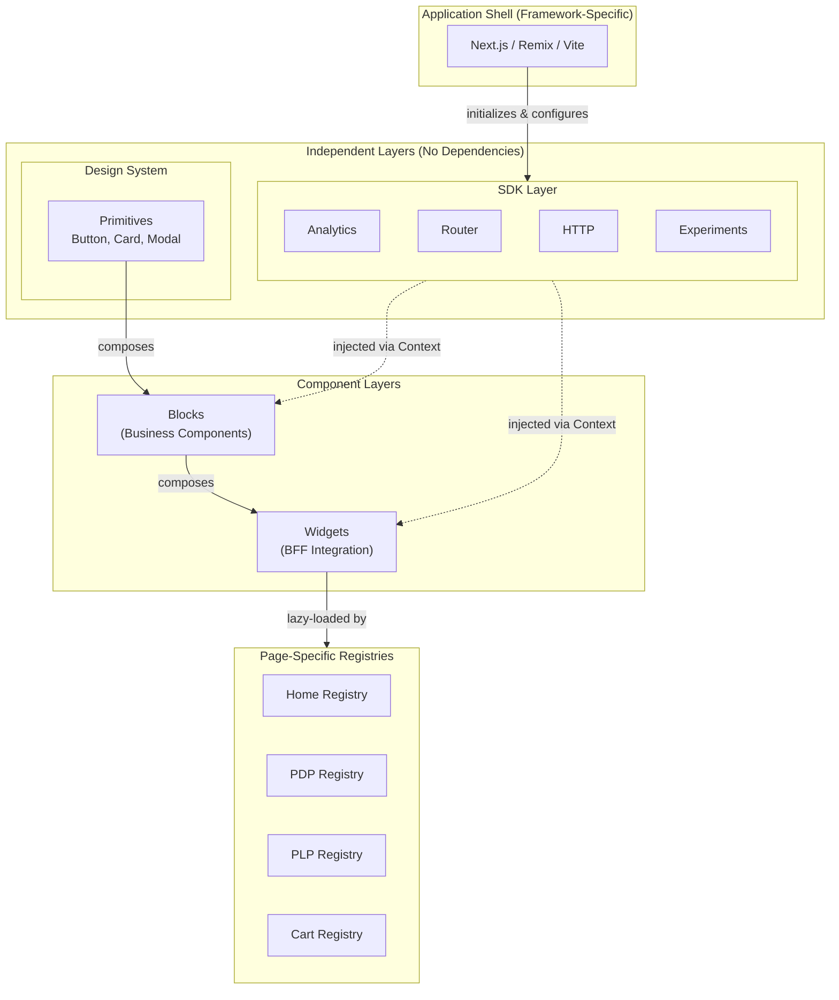

# Loosely Coupled UI Components: A Layered Architecture for React Applications

Modern frontend applications face a common challenge: as codebases grow, coupling between UI components, business logic, and framework-specific APIs creates maintenance nightmares and testing friction. This architecture addresses these issues through strict layering, dependency injection via React Context, and boundary enforcement via ESLint.

<figure>



<figcaption>Architecture overview: SDK Layer and Design System (Primitives) are independent with no dependencies. The Application Shell initializes SDK implementations, which are then injected via React Context into Blocks and Widgets. Each page type has its own widget registry for code splitting.</figcaption>

</figure>

## TLDR

**This architecture** provides a layered, framework-agnostic approach to building React applications where business logic is decoupled from UI primitives and meta-framework APIs are abstracted through injectable SDKs.

### Core Layers

- **Primitives**: Generic UI components (Button, Card, Modal) with no business logic, living in a separate design system package
- **Blocks**: Business-aware components (ProductCard, AddToCartButton) that compose primitives and contain domain logic
- **Widgets**: BFF-connected page sections that receive backend payloads and compose blocks
- **SDKs**: Internal abstractions for cross-cutting concerns (analytics, routing, experiments, HTTP) with injectable implementations

### Key Patterns

- **Dependency Injection via Context**: All external dependencies (analytics, HTTP, routing) are injected through React Context providers, enabling easy testing without complex mocking
- **Barrel Exports for Public APIs**: Each module exposes its public interface through `index.ts` files, hiding internal implementation details and enabling refactoring without breaking consumers
- **Boundary Enforcement**: ESLint rules using `eslint-plugin-boundaries` prevent architectural violations (e.g., Blocks importing Widgets)
- **Lazy-Loaded Registries**: Widget registries map BFF widget types to components using `React.lazy()` for code splitting

### Testing Strategy

- **Mock SDK Provider**: A `TestSdkProvider` wraps components with mocked implementations of all SDK services
- **No Framework Mocking**: Since components use SDK abstractions instead of framework APIs directly, tests don't need to mock Next.js/Remix internals
- **Isolation**: Each layer can be tested independently with appropriate mocks for its dependencies

### When to Use This Pattern

- Multiple teams contributing to the same application
- Components shared across applications using different meta-frameworks
- Need for framework migration without rewriting business logic
- Long-term maintainability prioritized over initial velocity

---

## Assumptions & Prerequisites

This guide assumes the following context. Adapt as needed for your specific situation.

### Technical Stack

| Aspect              | Assumption                               | Adaptable?                                            |
| ------------------- | ---------------------------------------- | ----------------------------------------------------- |
| **UI Library**      | React 18+                                | Core patterns apply to Vue, Svelte with modifications |
| **Language**        | TypeScript (strict mode)                 | Strongly recommended, not optional                    |
| **Meta-framework**  | Next.js, Remix, or similar SSR framework | Architecture is framework-agnostic                    |
| **Build Tool**      | Vite, Webpack, or Turbopack              | Any modern bundler works                              |
| **Package Manager** | npm, yarn, or pnpm                       | No specific requirement                               |

### Architectural Patterns

| Pattern                        | Description                                         | Required?   |
| ------------------------------ | --------------------------------------------------- | ----------- |
| **Design System**              | A separate library of generic UI components         | Yes         |
| **Backend-for-Frontend (BFF)** | A backend layer that serves UI-specific data        | Recommended |
| **Server-Driven UI**           | Backend defines page layout and widget composition  | Optional    |
| **Widget-Based Architecture**  | UI composed of self-contained, configurable modules | Yes         |

### Team Structure

This architecture works best when:

- Multiple teams contribute to the same application
- Clear ownership boundaries are needed
- Components are shared across multiple applications
- Long-term maintainability is prioritized over short-term velocity

---

## Glossary of Terms

### Core Concepts

| Term          | Definition                                                                                                                   |
| ------------- | ---------------------------------------------------------------------------------------------------------------------------- |
| **Primitive** | A generic, reusable UI component with no business logic (e.g., Button, Card, Modal). Lives in the design system.             |
| **Block**     | A business-aware component that composes Primitives and adds domain-specific behavior (e.g., ProductCard, AddToCartButton).  |
| **Widget**    | A self-contained page section that receives configuration from the backend and composes Blocks to render a complete feature. |
| **SDK**       | An internal abstraction layer that provides framework-agnostic access to cross-cutting concerns (routing, analytics, state). |

### Backend Concepts

| Term                           | Definition                                                                                                                                                              |
| ------------------------------ | ----------------------------------------------------------------------------------------------------------------------------------------------------------------------- |
| **BFF (Backend-for-Frontend)** | A backend service layer specifically designed to serve the needs of a particular frontend. It aggregates data from multiple services and formats it for UI consumption. |
| **Layout**                     | A data structure from the BFF that defines the page structure, including SEO metadata, analytics configuration, and the list of widgets to render.                      |
| **Widget Payload**             | The data contract between the BFF and a specific widget, containing all information needed to render that widget.                                                       |
| **Widget Registry**            | A mapping of widget type identifiers to their corresponding React components.                                                                                           |

### Architectural Concepts

| Term                     | Definition                                                                                      |
| ------------------------ | ----------------------------------------------------------------------------------------------- |
| **Boundary**             | A defined interface between architectural layers that controls what can be imported from where. |
| **Barrel Export**        | An `index.ts` file that explicitly defines the public API of a module.                          |
| **Dependency Injection** | A pattern where dependencies are provided to a component rather than created within it.         |
| **Provider Pattern**     | Using React Context to inject dependencies at runtime, enabling easy testing and configuration. |

---

## Design Principles

### 1. Framework Agnosticism

Components should not directly depend on meta-framework APIs (Next.js, Remix, etc.). Instead, framework-specific functionality is accessed through SDK abstractions.

**Why?**

- Enables migration between frameworks without rewriting components
- Simplifies testing by removing framework mocking
- Allows components to be shared across applications using different frameworks

**Example:**

```typescript
// ❌ Bad: Direct framework dependency
import { useRouter } from "next/navigation"
const router = useRouter()
router.push("/products")

// ✅ Good: SDK abstraction
import { useAppRouter } from "@sdk/router"
const router = useAppRouter()
router.push("/products")
```

### 2. Boundary Control

Each architectural layer has explicit rules about what it can import. These rules are enforced through tooling, not just documentation.

**Why?**

- Prevents circular dependencies
- Makes the codebase easier to understand
- Enables independent deployment of layers
- Reduces unintended coupling

### 3. Testability First

All external dependencies (HTTP clients, analytics, state management) are injected via providers, making components easy to test in isolation.

**Why?**

- Unit tests don't require complex mocking
- Test behavior, not implementation details
- Fast, reliable test execution

### 4. Single Responsibility

Each layer has one clear purpose:

- **Primitives**: Visual presentation
- **Blocks**: Business logic + UI composition
- **Widgets**: Backend contract interpretation + page composition
- **SDKs**: Cross-cutting concerns abstraction

### 5. Explicit Public APIs

Every module exposes its public API through a barrel file (`index.ts`). Internal implementation details are not importable from outside the module.

**Why?**

- Enables refactoring without breaking consumers
- Makes API surface area clear and intentional
- Provides a single entry point for consumers

> **⚠️ Trade-off Note:** While barrel files define clean APIs, they can [negatively impact tree-shaking](https://tkdodo.eu/blog/please-stop-using-barrel-files) in application code because bundlers may import the entire barrel file. For library packages, use `package.json` exports with multiple entry points. For performance-critical application paths, consider direct imports bypassing barrels.

---

## Architecture Overview

### Layer Diagram

```txt
┌─────────────────────────────────────────────────────────────────────────┐
│  Application Shell (Next.js / Remix / Vite)                             │
│  • Routing, SSR/SSG, Build configuration                                │
│  • Provides SDK implementations                                         │
└─────────────────────────────────────────────────────────────────────────┘
                                    │
                                    ▼ provides implementations
┌─────────────────────────────────────────────────────────────────────────┐
│  SDK Layer (@sdk/*)                                                     │
│  • Defines interfaces for cross-cutting concerns                        │
│  • Analytics, Routing, HTTP, State, Experiments                         │
│  • Framework-agnostic contracts                                         │
└─────────────────────────────────────────────────────────────────────────┘
          │                         │                         │
          ▼                         ▼                         ▼
┌─────────────────┐    ┌─────────────────────┐    ┌──────────────────────┐
│  Design System  │    │  Blocks Layer       │    │  Widgets Layer       │
│  (@company-name │◄───│  (@blocks/*)        │◄───│  (@widgets/*)        │
│  /design-system)│    │                     │    │                      │
│                 │    │  Business logic     │    │  BFF contract impl   │
│  Pure UI        │    │  Domain components  │    │  Page sections       │
└─────────────────┘    └─────────────────────┘    └──────────────────────┘
                                                             │
                                                             ▼
                                              ┌──────────────────────────┐
                                              │  Registries              │
                                              │  (@registries/*)         │
                                              │                          │
                                              │  Page-specific widget    │
                                              │  mappings                │
                                              └──────────────────────────┘
```

### Dependency Flow

```txt
Primitives ← Blocks ← Widgets ← Registries ← Layout Engine ← Pages
                ↑         ↑
                └─────────┴──── SDKs (injectable at all levels)
```

### Import Rules Matrix

| Source Layer                    | Can Import                                    | Cannot Import                                   |
| ------------------------------- | --------------------------------------------- | ----------------------------------------------- |
| **@sdk/\***                     | External libraries only                       | @blocks, @widgets, @registries                  |
| **@company-name/design-system** | Nothing from app                              | Everything in app                               |
| **@blocks/\***                  | Design system, @sdk/_, sibling @blocks/_      | @widgets/_, @registries/_                       |
| **@widgets/\***                 | Design system, @sdk/_, @blocks/_              | @registries/_, sibling @widgets/_ (discouraged) |
| **@registries/\***              | @widgets/\* (lazy imports only)               | @blocks/\* directly                             |
| **@layout/\***                  | Design system, @registries/\*, @widgets/types | @blocks/\*                                      |

---

## Layer Definitions

### Layer 0: SDKs (Cross-Cutting Concerns)

**Purpose:** Provide framework-agnostic abstractions for horizontal concerns.

**Characteristics:**

- Define TypeScript interfaces (contracts)
- Expose React hooks for consumption
- Implementations provided at application level
- No direct dependencies on application code

**Examples:**

- `@sdk/analytics` - Event tracking, page views, user identification
- `@sdk/experiments` - Feature flags, A/B testing
- `@sdk/router` - Navigation, URL parameters
- `@sdk/http` - API client abstraction
- `@sdk/state` - Global state management

### Layer 1: Primitives (Design System)

**Purpose:** Provide generic, reusable UI components.

**Characteristics:**

- No business logic
- No side effects
- No domain-specific assumptions
- Fully accessible and themeable
- Lives in a separate repository/package

**Examples:**

- Button, Input, Select, Checkbox
- Card, Modal, Drawer, Tooltip
- Typography, Grid, Stack, Divider
- Icons, Animations, Transitions

### Layer 2: Blocks (Business Components)

**Purpose:** Compose Primitives with business logic to create reusable domain components.

**Characteristics:**

- Business-aware but not page-specific
- Reusable across multiple widgets
- Can perform side effects via SDK hooks
- Contains domain validation and formatting
- Includes analytics and tracking

**Examples:**

- ProductCard, ProductPrice, ProductRating
- AddToCartButton, WishlistButton
- UserAvatar, UserMenu
- SearchInput, FilterChip

**When to Create a Block:**

- Component is used in 2+ widgets
- Component has business logic (not just styling)
- Component needs analytics/tracking
- Component interacts with global state

### Layer 3: Widgets (Page Sections)

**Purpose:** Implement BFF widget contracts and compose the page.

**Characteristics:**

- 1:1 mapping with BFF widget types
- Receives payload from backend
- Composes Blocks to render complete features
- Handles widget-level concerns (pagination, error states)
- Registered in page-specific registries

**Examples:**

- HeroBannerWidget, ProductCarouselWidget
- ProductGridWidget, FilterPanelWidget
- RecommendationsWidget, RecentlyViewedWidget
- ReviewsWidget, FAQWidget

### Layer 4: Registries (Widget Mapping)

**Purpose:** Map BFF widget types to component implementations per page type.

**Characteristics:**

- Page-specific (different widgets on different pages)
- Lazy-loaded components for code splitting
- Configurable error boundaries and loading states
- Simple Record<string, WidgetConfig> structure

---

## Internal SDKs

SDKs are the key to framework agnosticism. They define **what** your components need, while the application shell provides **how** it's implemented.

### SDK Structure

```
src/sdk/
├── index.ts                     # Re-exports all SDK hooks
├── core/
│   ├── sdk.types.ts             # Combined SDK interface
│   ├── sdk.provider.tsx         # Root provider
│   └── sdk.context.ts           # Shared context utilities
├── analytics/
│   ├── analytics.types.ts       # Interface definition
│   ├── analytics.provider.tsx   # Context provider
│   ├── analytics.hooks.ts       # useAnalytics() hook
│   └── index.ts                 # Public exports
├── experiments/
│   ├── experiments.types.ts
│   ├── experiments.provider.tsx
│   ├── experiments.hooks.ts
│   └── index.ts
├── router/
│   ├── router.types.ts
│   ├── router.provider.tsx
│   ├── router.hooks.ts
│   └── index.ts
├── http/
│   ├── http.types.ts
│   ├── http.provider.tsx
│   ├── http.hooks.ts
│   └── index.ts
├── state/
│   ├── state.types.ts
│   ├── state.provider.tsx
│   ├── state.hooks.ts
│   └── index.ts
└── testing/
    ├── test-sdk.provider.tsx    # Test wrapper
    ├── create-mock-sdk.ts       # Mock factory
    └── index.ts
```

### SDK Interface Definitions

```typescript
// src/sdk/core/sdk.types.ts

export interface SdkServices {
  analytics: AnalyticsSdk
  experiments: ExperimentsSdk
  router: RouterSdk
  http: HttpSdk
  state: StateSdk
}
```

```typescript
// src/sdk/analytics/analytics.types.ts

export interface AnalyticsSdk {
  /**
   * Track a custom event
   */
  track(event: string, properties?: Record<string, unknown>): void

  /**
   * Track a page view
   */
  trackPageView(page: string, properties?: Record<string, unknown>): void

  /**
   * Track component impression (visibility)
   */
  trackImpression(componentId: string, properties?: Record<string, unknown>): void

  /**
   * Identify a user for analytics
   */
  identify(userId: string, traits?: Record<string, unknown>): void
}
```

```typescript
// src/sdk/experiments/experiments.types.ts

export interface ExperimentsSdk {
  /**
   * Get the variant for an experiment
   * @returns variant name or null if not enrolled
   */
  getVariant(experimentId: string): string | null

  /**
   * Check if a feature flag is enabled
   */
  isFeatureEnabled(featureFlag: string): boolean

  /**
   * Track that user was exposed to an experiment
   */
  trackExposure(experimentId: string, variant: string): void
}
```

```typescript
// src/sdk/router/router.types.ts

export interface RouterSdk {
  /**
   * Navigate to a new URL (adds to history)
   */
  push(path: string): void

  /**
   * Replace current URL (no history entry)
   */
  replace(path: string): void

  /**
   * Go back in history
   */
  back(): void

  /**
   * Prefetch a route for faster navigation
   */
  prefetch(path: string): void

  /**
   * Current pathname
   */
  pathname: string

  /**
   * Current query parameters
   */
  query: Record<string, string | string[]>
}
```

```typescript
// src/sdk/http/http.types.ts

export interface HttpSdk {
  get<T>(url: string, options?: RequestOptions): Promise<T>
  post<T>(url: string, body: unknown, options?: RequestOptions): Promise<T>
  put<T>(url: string, body: unknown, options?: RequestOptions): Promise<T>
  delete<T>(url: string, options?: RequestOptions): Promise<T>
}

export interface RequestOptions {
  headers?: Record<string, string>
  signal?: AbortSignal
  cache?: RequestCache
}
```

```typescript
// src/sdk/state/state.types.ts

export interface StateSdk {
  /**
   * Get current state for a key
   */
  getState<T>(key: string): T | undefined

  /**
   * Set state for a key
   */
  setState<T>(key: string, value: T): void

  /**
   * Subscribe to state changes
   * @returns unsubscribe function
   */
  subscribe<T>(key: string, callback: (value: T) => void): () => void
}
```

### SDK Provider Implementation

```typescript title="src/sdk/core/sdk.provider.tsx" collapse={1-6, 16-19}
// src/sdk/core/sdk.provider.tsx

import { createContext, useContext, type FC, type PropsWithChildren } from 'react';
import type { SdkServices } from './sdk.types';

const SdkContext = createContext<SdkServices | null>(null);

// Key pattern: useSdk hook with runtime validation
export const useSdk = (): SdkServices => {
  const ctx = useContext(SdkContext);
  if (!ctx) {
    throw new Error('useSdk must be used within SdkProvider');
  }
  return ctx;
};

export interface SdkProviderProps {
  services: SdkServices;
}

// Provider wraps application, injecting services
export const SdkProvider: FC<PropsWithChildren<SdkProviderProps>> = ({
  children,
  services,
}) => (
  <SdkContext.Provider value={services}>
    {children}
  </SdkContext.Provider>
);
```

### SDK Hook Examples

```typescript
// src/sdk/analytics/analytics.hooks.ts

import { useSdk } from "../core/sdk.provider"
import type { AnalyticsSdk } from "./analytics.types"

export const useAnalytics = (): AnalyticsSdk => {
  const sdk = useSdk()
  return sdk.analytics
}
```

```typescript title="src/sdk/experiments/experiments.hooks.ts" collapse={1-4}
// src/sdk/experiments/experiments.hooks.ts

import { useEffect } from "react"
import { useSdk } from "../core/sdk.provider"

export const useExperiment = (experimentId: string): string | null => {
  const { experiments } = useSdk()
  const variant = experiments.getVariant(experimentId)

  useEffect(() => {
    if (variant !== null) {
      experiments.trackExposure(experimentId, variant)
    }
  }, [experimentId, variant, experiments])

  return variant
}

export const useFeatureFlag = (flagName: string): boolean => {
  const { experiments } = useSdk()
  return experiments.isFeatureEnabled(flagName)
}
```

### Application-Level SDK Implementation

The application shell provides concrete implementations:

```typescript title="app/providers.tsx" collapse={1-8, 15-42, 53-80}
// app/providers.tsx (framework-specific, outside src/)

'use client'; // Next.js specific

import { useMemo, type FC, type PropsWithChildren } from 'react';
import { useRouter, usePathname, useSearchParams } from 'next/navigation'; // Framework import OK here
import { SdkProvider, type SdkServices } from '@sdk/core';

/**
 * Creates SDK service implementations using framework-specific APIs.
 * This is the ONLY place where framework imports are allowed.
 */
const createSdkServices = (): SdkServices => ({
  analytics: {
    track: (event, props) => {
      // Integrate with your analytics provider
      // e.g., segment.track(event, props)
      console.log('[Analytics] Track:', event, props);
    },
    trackPageView: (page, props) => {
      console.log('[Analytics] Page View:', page, props);
    },
    trackImpression: (id, props) => {
      console.log('[Analytics] Impression:', id, props);
    },
    identify: (userId, traits) => {
      console.log('[Analytics] Identify:', userId, traits);
    },
  },

  experiments: {
    getVariant: (experimentId) => {
      // Integrate with your experimentation platform
      // e.g., return optimizely.getVariant(experimentId);
      return null;
    },
    isFeatureEnabled: (flag) => {
      // e.g., return launchDarkly.isEnabled(flag);
      return false;
    },
    trackExposure: (experimentId, variant) => {
      console.log('[Experiments] Exposure:', experimentId, variant);
    },
  },

  // Key pattern: Router abstraction hides Next.js/Remix differences
  router: {
    push: (path) => window.location.href = path, // Simplified; use framework router
    replace: (path) => window.location.replace(path),
    back: () => window.history.back(),
    prefetch: (path) => { /* Framework-specific prefetch */ },
    pathname: typeof window !== 'undefined' ? window.location.pathname : '/',
    query: {},
  },

  http: {
    get: async (url, opts) => {
      const res = await fetch(url, { ...opts, method: 'GET' });
      return res.json();
    },
    post: async (url, body, opts) => {
      const res = await fetch(url, {
        ...opts,
        method: 'POST',
        headers: { 'Content-Type': 'application/json', ...opts?.headers },
        body: JSON.stringify(body),
      });
      return res.json();
    },
    put: async (url, body, opts) => {
      const res = await fetch(url, {
        ...opts,
        method: 'PUT',
        headers: { 'Content-Type': 'application/json', ...opts?.headers },
        body: JSON.stringify(body),
      });
      return res.json();
    },
    delete: async (url, opts) => {
      const res = await fetch(url, { ...opts, method: 'DELETE' });
      return res.json();
    },
  },

  state: createStateAdapter(), // Implement based on your state management choice
});

// Application root wires up concrete implementations
export const AppProviders: FC<PropsWithChildren> = ({ children }) => {
  const services = useMemo(() => createSdkServices(), []);

  return (
    <SdkProvider services={services}>
      {children}
    </SdkProvider>
  );
};
```

---

## Folder Structure

### Complete Structure

```txt
src/
├── sdk/                                    # Internal SDKs
│   ├── index.ts                            # Public barrel: all SDK hooks
│   ├── core/
│   │   ├── sdk.types.ts
│   │   ├── sdk.provider.tsx
│   │   └── index.ts
│   ├── analytics/
│   │   ├── analytics.types.ts
│   │   ├── analytics.provider.tsx
│   │   ├── analytics.hooks.ts
│   │   └── index.ts
│   ├── experiments/
│   │   ├── experiments.types.ts
│   │   ├── experiments.provider.tsx
│   │   ├── experiments.hooks.ts
│   │   └── index.ts
│   ├── router/
│   │   ├── router.types.ts
│   │   ├── router.provider.tsx
│   │   ├── router.hooks.ts
│   │   └── index.ts
│   ├── http/
│   │   ├── http.types.ts
│   │   ├── http.provider.tsx
│   │   ├── http.hooks.ts
│   │   └── index.ts
│   ├── state/
│   │   ├── state.types.ts
│   │   ├── state.provider.tsx
│   │   ├── state.hooks.ts
│   │   └── index.ts
│   └── testing/
│       ├── test-sdk.provider.tsx
│       ├── create-mock-sdk.ts
│       └── index.ts
│
├── blocks/                                 # Business-aware building blocks
│   ├── index.ts                            # Public barrel
│   ├── blocks.types.ts                     # Shared Block types
│   │
│   ├── providers/                          # Block-level providers (if needed)
│   │   ├── blocks.provider.tsx
│   │   └── index.ts
│   │
│   ├── testing/                            # Block test utilities
│   │   ├── test-blocks.provider.tsx
│   │   ├── render-block.tsx
│   │   └── index.ts
│   │
│   ├── product-card/
│   │   ├── product-card.component.tsx      # Container
│   │   ├── product-card.view.tsx           # Pure render
│   │   ├── product-card.hooks.ts           # Side effects
│   │   ├── product-card.types.ts           # Types
│   │   ├── product-card.test.tsx           # Tests
│   │   └── index.ts                        # Public API
│   │
│   ├── add-to-cart-button/
│   │   ├── add-to-cart-button.component.tsx
│   │   ├── add-to-cart-button.view.tsx
│   │   ├── add-to-cart-button.hooks.ts
│   │   ├── add-to-cart-button.types.ts
│   │   ├── add-to-cart-button.test.tsx
│   │   └── index.ts
│   │
│   └── [other-blocks]/
│
├── widgets/                                # BFF-driven widgets
│   ├── index.ts                            # Public barrel
│   │
│   ├── types/                              # Shared widget types
│   │   ├── widget.types.ts
│   │   ├── payload.types.ts
│   │   └── index.ts
│   │
│   ├── hero-banner/
│   │   ├── hero-banner.widget.tsx          # Widget container
│   │   ├── hero-banner.view.tsx            # Pure render
│   │   ├── hero-banner.hooks.ts            # Widget logic
│   │   ├── hero-banner.types.ts            # Payload types
│   │   ├── hero-banner.test.tsx
│   │   └── index.ts
│   │
│   ├── product-carousel/
│   │   ├── product-carousel.widget.tsx
│   │   ├── product-carousel.view.tsx
│   │   ├── product-carousel.hooks.ts
│   │   ├── product-carousel.types.ts
│   │   └── index.ts
│   │
│   └── [other-widgets]/
│
├── registries/                             # Page-specific widget registries
│   ├── index.ts
│   ├── registry.types.ts                   # Registry type definitions
│   ├── home.registry.ts                    # Home page widgets
│   ├── pdp.registry.ts                     # Product detail page widgets
│   ├── plp.registry.ts                     # Product listing page widgets
│   ├── cart.registry.ts                    # Cart page widgets
│   └── checkout.registry.ts                # Checkout page widgets
│
├── layout-engine/                          # BFF layout composition
│   ├── index.ts
│   ├── layout-renderer.component.tsx
│   ├── widget-renderer.component.tsx
│   ├── layout.types.ts
│   └── layout.hooks.ts
│
└── shared/                                 # Non-UI utilities
    ├── types/
    │   └── common.types.ts
    └── utils/
        ├── format.utils.ts
        └── validation.utils.ts
```

### File Naming Convention

| File Type             | Pattern                | Example                      |
| --------------------- | ---------------------- | ---------------------------- |
| Component (container) | `{name}.component.tsx` | `product-card.component.tsx` |
| View (pure render)    | `{name}.view.tsx`      | `product-card.view.tsx`      |
| Widget container      | `{name}.widget.tsx`    | `hero-banner.widget.tsx`     |
| Hooks                 | `{name}.hooks.ts`      | `product-card.hooks.ts`      |
| Types                 | `{name}.types.ts`      | `product-card.types.ts`      |
| Provider              | `{name}.provider.tsx`  | `sdk.provider.tsx`           |
| Registry              | `{name}.registry.ts`   | `home.registry.ts`           |
| Tests                 | `{name}.test.tsx`      | `product-card.test.tsx`      |
| Utilities             | `{name}.utils.ts`      | `format.utils.ts`            |
| Barrel export         | `index.ts`             | `index.ts`                   |

---

## Implementation Patterns

### Type Definitions

#### Block Types

```typescript title="src/blocks/blocks.types.ts" collapse={1-3}
// src/blocks/blocks.types.ts

import type { FC, PropsWithChildren } from "react"

/**
 * A Block component - business-aware building block
 */
export type BlockComponent<TProps = object> = FC<TProps>

/**
 * A Block View - pure presentational, no side effects
 */
export type BlockView<TProps = object> = FC<TProps>

/**
 * Block with children
 */
export type BlockWithChildren<TProps = object> = FC<PropsWithChildren<TProps>>

/**
 * Standard hook result for data-fetching blocks
 */
export interface BlockHookResult<TData, TActions = object> {
  data: TData | null
  isLoading: boolean
  error: Error | null
  actions: TActions
}

/**
 * Props for analytics tracking (optional on all blocks)
 */
export interface TrackingProps {
  /** Unique identifier for analytics */
  trackingId?: string
  /** Additional tracking data */
  trackingData?: Record<string, unknown>
}
```

#### Widget Types

```typescript title="src/widgets/types/widget.types.ts" collapse={1-3}
// src/widgets/types/widget.types.ts

import type { ComponentType, ReactNode } from "react"

/**
 * Base BFF widget payload structure
 */
export interface WidgetPayload<TData = unknown> {
  /** Unique widget instance ID */
  id: string
  /** Widget type identifier (matches registry key) */
  type: string
  /** Widget-specific data from BFF */
  data: TData
  /** Optional pagination info */
  pagination?: WidgetPagination
}

export interface WidgetPagination {
  cursor: string | null
  hasMore: boolean
  pageSize: number
}

/**
 * Widget component type
 */
export type WidgetComponent<TData = unknown> = ComponentType<{
  payload: WidgetPayload<TData>
}>

/**
 * Widget view - pure render layer
 */
export type WidgetView<TProps = object> = ComponentType<TProps>

/**
 * Widget hook result with pagination support
 */
export interface WidgetHookResult<TData> {
  data: TData | null
  isLoading: boolean
  error: Error | null
  pagination: {
    loadMore: () => Promise<void>
    hasMore: boolean
    isLoadingMore: boolean
  } | null
}
```

#### Registry Types

```typescript title="src/registries/registry.types.ts" collapse={1-4}
// src/registries/registry.types.ts

import type { ComponentType, ReactNode } from "react"
import type { WidgetPayload } from "@widgets/types"

/**
 * Configuration for a registered widget
 */
export interface WidgetConfig {
  /** The widget component to render */
  component: ComponentType<{ payload: WidgetPayload }>

  /** Optional custom error boundary */
  errorBoundary?: ComponentType<{
    children: ReactNode
    fallback?: ReactNode
    onError?: (error: Error) => void
  }>

  /** Optional suspense fallback (loading state) */
  suspenseFallback?: ReactNode

  /** Optional skeleton component for loading */
  skeleton?: ComponentType

  /** Whether to wrap in error boundary (default: true) */
  withErrorBoundary?: boolean

  /** Whether to wrap in suspense (default: true) */
  withSuspense?: boolean
}

/**
 * Widget registry - maps widget type IDs to configurations
 */
export type WidgetRegistry = Record<string, WidgetConfig>
```

### Block Implementation Example

```typescript title="src/blocks/add-to-cart-button/add-to-cart-button.types.ts" collapse={1-3}
// src/blocks/add-to-cart-button/add-to-cart-button.types.ts

import type { TrackingProps, BlockHookResult } from "../blocks.types"

export interface AddToCartButtonProps extends TrackingProps {
  sku: string
  quantity?: number
  variant?: "primary" | "secondary" | "ghost"
  size?: "sm" | "md" | "lg"
  disabled?: boolean
  onSuccess?: () => void
  onError?: (error: Error) => void
}

export interface AddToCartViewProps {
  onAdd: () => void
  isLoading: boolean
  error: string | null
  variant: "primary" | "secondary" | "ghost"
  size: "sm" | "md" | "lg"
  disabled: boolean
}

export interface AddToCartActions {
  addToCart: () => Promise<void>
  reset: () => void
}

export type UseAddToCartResult = BlockHookResult<{ cartId: string }, AddToCartActions>
```

```typescript title="src/blocks/add-to-cart-button/add-to-cart-button.hooks.ts" collapse={1-5, 14-18, 40-52}
// src/blocks/add-to-cart-button/add-to-cart-button.hooks.ts

import { useState, useCallback } from "react"
import { useAnalytics, useHttpClient } from "@sdk"
import type { UseAddToCartResult } from "./add-to-cart-button.types"

export const useAddToCart = (
  sku: string,
  quantity: number = 1,
  callbacks?: { onSuccess?: () => void; onError?: (error: Error) => void },
): UseAddToCartResult => {
  const analytics = useAnalytics()
  const http = useHttpClient()

  const [isLoading, setIsLoading] = useState(false)
  const [error, setError] = useState<Error | null>(null)
  const [data, setData] = useState<{ cartId: string } | null>(null)

  // Key pattern: Business logic uses SDK abstractions, not framework APIs
  const addToCart = useCallback(async (): Promise<void> => {
    setIsLoading(true)
    setError(null)

    try {
      const response = await http.post<{ cartId: string }>("/api/cart/add", {
        sku,
        quantity,
      })

      setData(response)
      analytics.track("add_to_cart", { sku, quantity, cartId: response.cartId })
      callbacks?.onSuccess?.()
    } catch (e) {
      const error = e instanceof Error ? e : new Error("Failed to add to cart")
      setError(error)
      analytics.track("add_to_cart_error", { sku, error: error.message })
      callbacks?.onError?.(error)
      throw error
    } finally {
      setIsLoading(false)
    }
  }, [sku, quantity, http, analytics, callbacks])

  const reset = useCallback((): void => {
    setError(null)
    setData(null)
  }, [])

  return {
    data,
    isLoading,
    error,
    actions: { addToCart, reset },
  }
}
```

```typescript title="src/blocks/add-to-cart-button/add-to-cart-button.view.tsx" collapse={1-5}
// src/blocks/add-to-cart-button/add-to-cart-button.view.tsx

import type { FC } from 'react';
import { Button, Spinner, Text, Stack } from '@company-name/design-system';
import type { AddToCartViewProps } from './add-to-cart-button.types';

export const AddToCartButtonView: FC<AddToCartViewProps> = ({
  onAdd,
  isLoading,
  error,
  variant,
  size,
  disabled,
}) => (
  <Stack gap="xs">
    <Button
      variant={variant}
      size={size}
      onClick={onAdd}
      disabled={disabled || isLoading}
      aria-busy={isLoading}
      aria-describedby={error ? 'add-to-cart-error' : undefined}
    >
      {isLoading ? (
        <>
          <Spinner size="sm" aria-hidden />
          <span>Adding...</span>
        </>
      ) : (
        'Add to Cart'
      )}
    </Button>

    {error && (
      <Text id="add-to-cart-error" color="error" size="sm" role="alert">
        {error}
      </Text>
    )}
  </Stack>
);
```

```typescript title="src/blocks/add-to-cart-button/add-to-cart-button.component.tsx" collapse={1-6}
// src/blocks/add-to-cart-button/add-to-cart-button.component.tsx

import type { FC } from 'react';
import { useAddToCart } from './add-to-cart-button.hooks';
import { AddToCartButtonView } from './add-to-cart-button.view';
import type { AddToCartButtonProps } from './add-to-cart-button.types';

export const AddToCartButton: FC<AddToCartButtonProps> = ({
  sku,
  quantity = 1,
  variant = 'primary',
  size = 'md',
  disabled = false,
  onSuccess,
  onError,
}) => {
  const { isLoading, error, actions } = useAddToCart(sku, quantity, {
    onSuccess,
    onError
  });

  return (
    <AddToCartButtonView
      onAdd={actions.addToCart}
      isLoading={isLoading}
      error={error?.message ?? null}
      variant={variant}
      size={size}
      disabled={disabled}
    />
  );
};
```

```typescript
// src/blocks/add-to-cart-button/index.ts

export { AddToCartButton } from "./add-to-cart-button.component"
export { AddToCartButtonView } from "./add-to-cart-button.view"
export { useAddToCart } from "./add-to-cart-button.hooks"
export type { AddToCartButtonProps, AddToCartViewProps } from "./add-to-cart-button.types"
```

### Widget Implementation Example

```typescript title="src/widgets/product-carousel/product-carousel.types.ts" collapse={1-3}
// src/widgets/product-carousel/product-carousel.types.ts

import type { WidgetPayload, WidgetHookResult } from "../types"

export interface ProductCarouselData {
  title: string
  subtitle?: string
  products: ProductItem[]
}

export interface ProductItem {
  id: string
  sku: string
  name: string
  price: number
  originalPrice?: number
  imageUrl: string
  rating?: number
  reviewCount?: number
}

export type ProductCarouselPayload = WidgetPayload<ProductCarouselData>

export interface ProductCarouselViewProps {
  title: string
  subtitle?: string
  products: ProductItem[]
  onLoadMore?: () => void
  hasMore: boolean
  isLoadingMore: boolean
}

export type UseProductCarouselResult = WidgetHookResult<ProductCarouselData>
```

```typescript title="src/widgets/product-carousel/product-carousel.hooks.ts" collapse={1-5, 11-17, 52-61}
// src/widgets/product-carousel/product-carousel.hooks.ts

import { useState, useCallback, useEffect } from "react"
import { useAnalytics, useHttpClient } from "@sdk"
import type { ProductCarouselPayload, UseProductCarouselResult } from "./product-carousel.types"

export const useProductCarousel = (payload: ProductCarouselPayload): UseProductCarouselResult => {
  const analytics = useAnalytics()
  const http = useHttpClient()

  const [data, setData] = useState(payload.data)
  const [isLoading, setIsLoading] = useState(false)
  const [isLoadingMore, setIsLoadingMore] = useState(false)
  const [error, setError] = useState<Error | null>(null)
  const [cursor, setCursor] = useState(payload.pagination?.cursor ?? null)
  const [hasMore, setHasMore] = useState(payload.pagination?.hasMore ?? false)

  // Track impression when widget becomes visible
  useEffect(() => {
    analytics.trackImpression(payload.id, {
      widgetType: payload.type,
      productCount: data.products.length,
    })
  }, [payload.id, payload.type, analytics, data.products.length])

  // Key pattern: Widget handles pagination via SDK http abstraction
  const loadMore = useCallback(async (): Promise<void> => {
    if (!hasMore || isLoadingMore) return

    setIsLoadingMore(true)

    try {
      const response = await http.get<{
        products: ProductItem[]
        cursor: string | null
        hasMore: boolean
      }>(`/api/widgets/${payload.id}/paginate?cursor=${cursor}`)

      setData((prev) => ({
        ...prev,
        products: [...prev.products, ...response.products],
      }))
      setCursor(response.cursor)
      setHasMore(response.hasMore)

      analytics.track("widget_load_more", {
        widgetId: payload.id,
        itemsLoaded: response.products.length,
      })
    } catch (e) {
      setError(e instanceof Error ? e : new Error("Failed to load more"))
    } finally {
      setIsLoadingMore(false)
    }
  }, [payload.id, cursor, hasMore, isLoadingMore, http, analytics])

  return {
    data,
    isLoading,
    error,
    pagination: payload.pagination ? { loadMore, hasMore, isLoadingMore } : null,
  }
}
```

```typescript title="src/widgets/product-carousel/product-carousel.view.tsx" collapse={1-6}
// src/widgets/product-carousel/product-carousel.view.tsx

import type { FC } from 'react';
import { Section, Carousel, Button, Skeleton } from '@company-name/design-system';
import { ProductCard } from '@blocks/product-card';
import type { ProductCarouselViewProps } from './product-carousel.types';

export const ProductCarouselView: FC<ProductCarouselViewProps> = ({
  title,
  subtitle,
  products,
  onLoadMore,
  hasMore,
  isLoadingMore,
}) => (
  <Section>
    <Section.Header>
      <Section.Title>{title}</Section.Title>
      {subtitle && <Section.Subtitle>{subtitle}</Section.Subtitle>}
    </Section.Header>

    <Carousel itemsPerView={{ base: 2, md: 3, lg: 4 }}>
      {products.map((product) => (
        <Carousel.Item key={product.id}>
          <ProductCard
            productId={product.id}
            sku={product.sku}
            name={product.name}
            price={product.price}
            originalPrice={product.originalPrice}
            imageUrl={product.imageUrl}
            rating={product.rating}
            reviewCount={product.reviewCount}
          />
        </Carousel.Item>
      ))}

      {isLoadingMore && (
        <Carousel.Item>
          <Skeleton variant="product-card" />
        </Carousel.Item>
      )}
    </Carousel>

    {hasMore && onLoadMore && (
      <Section.Footer>
        <Button
          variant="ghost"
          onClick={onLoadMore}
          loading={isLoadingMore}
        >
          Load More
        </Button>
      </Section.Footer>
    )}
  </Section>
);
```

```typescript title="src/widgets/product-carousel/product-carousel.widget.tsx" collapse={1-6}
// src/widgets/product-carousel/product-carousel.widget.tsx

import type { FC } from 'react';
import { useProductCarousel } from './product-carousel.hooks';
import { ProductCarouselView } from './product-carousel.view';
import type { ProductCarouselPayload } from './product-carousel.types';

interface ProductCarouselWidgetProps {
  payload: ProductCarouselPayload;
}

export const ProductCarouselWidget: FC<ProductCarouselWidgetProps> = ({ payload }) => {
  const { data, error, pagination } = useProductCarousel(payload);

  if (error) {
    // Let error boundary handle this
    throw error;
  }

  if (!data) {
    return null;
  }

  return (
    <ProductCarouselView
      title={data.title}
      subtitle={data.subtitle}
      products={data.products}
      onLoadMore={pagination?.loadMore}
      hasMore={pagination?.hasMore ?? false}
      isLoadingMore={pagination?.isLoadingMore ?? false}
    />
  );
};
```

### Registry Implementation

```typescript title="src/registries/home.registry.ts" collapse={1-4}
// src/registries/home.registry.ts

import { lazy } from "react"
import type { WidgetRegistry } from "./registry.types"

export const homeRegistry: WidgetRegistry = {
  HERO_BANNER: {
    component: lazy(() => import("@widgets/hero-banner").then((m) => ({ default: m.HeroBannerWidget }))),
    withErrorBoundary: true,
    withSuspense: true,
  },

  PRODUCT_CAROUSEL: {
    component: lazy(() => import("@widgets/product-carousel").then((m) => ({ default: m.ProductCarouselWidget }))),
    withErrorBoundary: true,
    withSuspense: true,
  },

  CATEGORY_GRID: {
    component: lazy(() => import("@widgets/category-grid").then((m) => ({ default: m.CategoryGridWidget }))),
  },

  PROMOTIONAL_BANNER: {
    component: lazy(() => import("@widgets/promotional-banner").then((m) => ({ default: m.PromotionalBannerWidget }))),
  },

  NEWSLETTER_SIGNUP: {
    component: lazy(() => import("@widgets/newsletter-signup").then((m) => ({ default: m.NewsletterSignupWidget }))),
    withErrorBoundary: false, // Non-critical widget
  },
}
```

```typescript title="src/registries/index.ts" collapse={1-11}
// src/registries/index.ts

import type { WidgetRegistry } from "./registry.types"

export { homeRegistry } from "./home.registry"
export { pdpRegistry } from "./pdp.registry"
export { plpRegistry } from "./plp.registry"
export { cartRegistry } from "./cart.registry"
export { checkoutRegistry } from "./checkout.registry"

export type { WidgetRegistry, WidgetConfig } from "./registry.types"

/**
 * Get registry by page type identifier
 */
export const getRegistryByPageType = (pageType: string): WidgetRegistry => {
  const registries: Record<string, () => Promise<{ default: WidgetRegistry }>> = {
    home: () => import("./home.registry").then((m) => ({ default: m.homeRegistry })),
    pdp: () => import("./pdp.registry").then((m) => ({ default: m.pdpRegistry })),
    plp: () => import("./plp.registry").then((m) => ({ default: m.plpRegistry })),
    cart: () => import("./cart.registry").then((m) => ({ default: m.cartRegistry })),
    checkout: () => import("./checkout.registry").then((m) => ({ default: m.checkoutRegistry })),
  }

  // For synchronous access, import directly
  // For async/code-split access, use the loader above
  const syncRegistries: Record<string, WidgetRegistry> = {}

  return syncRegistries[pageType] ?? {}
}
```

---

## Boundary Control & Enforcement

### ESLint Configuration

```javascript title="eslint.config.js" collapse={1-5, 49-74, 95-120, 123-162}
// eslint.config.js

import boundaries from "eslint-plugin-boundaries"
import tseslint from "typescript-eslint"

export default [
  ...tseslint.configs.strictTypeChecked,

  // Key pattern: Define architectural layers as boundary elements
  {
    plugins: { boundaries },
    settings: {
      "boundaries/elements": [
        { type: "sdk", pattern: "src/sdk/*" },
        { type: "blocks", pattern: "src/blocks/*" },
        { type: "widgets", pattern: "src/widgets/*" },
        { type: "registries", pattern: "src/registries/*" },
        { type: "layout", pattern: "src/layout-engine/*" },
        { type: "shared", pattern: "src/shared/*" },
        { type: "primitives", pattern: "node_modules/@company-name/design-system/*" },
      ],
      "boundaries/ignore": ["**/*.test.tsx", "**/*.test.ts", "**/*.spec.tsx", "**/*.spec.ts"],
    },
    rules: {
      // Enforces dependency rules between layers
      "boundaries/element-types": [
        "error",
        {
          default: "disallow",
          rules: [
            // SDK: no internal dependencies
            { from: "sdk", allow: [] },

            // Blocks: primitives, sdk, sibling blocks, shared
            { from: "blocks", allow: ["primitives", "sdk", "blocks", "shared"] },

            // Widgets: primitives, sdk, blocks, shared
            { from: "widgets", allow: ["primitives", "sdk", "blocks", "shared"] },

            // Registries: widgets only (lazy imports)
            { from: "registries", allow: ["widgets"] },

            // Layout: primitives, registries, shared
            { from: "layout", allow: ["primitives", "registries", "shared"] },

            // Shared: primitives only
            { from: "shared", allow: ["primitives"] },
          ],
        },
      ],
    },
  },

  // Enforce barrel exports (no deep imports)
  {
    rules: {
      "no-restricted-imports": [
        "error",
        {
          patterns: [
            {
              group: ["@blocks/*/*"],
              message: "Import from @blocks/{name} only, not internal files",
            },
            {
              group: ["@widgets/*/*", "!@widgets/types", "!@widgets/types/*"],
              message: "Import from @widgets/{name} only, not internal files",
            },
            {
              group: ["@sdk/*/*"],
              message: "Import from @sdk or @sdk/{name} only, not internal files",
            },
          ],
        },
      ],
    },
  },

  // Block framework imports in components
  {
    files: ["src/blocks/**/*", "src/widgets/**/*", "src/sdk/**/*"],
    rules: {
      "no-restricted-imports": [
        "error",
        {
          patterns: [
            {
              group: ["next/*", "next"],
              message: "Use @sdk abstractions instead of Next.js imports",
            },
            {
              group: ["@remix-run/*"],
              message: "Use @sdk abstractions instead of Remix imports",
            },
            {
              group: ["react-router", "react-router-dom"],
              message: "Use @sdk/router instead of react-router",
            },
          ],
        },
      ],
    },
  },

  // Blocks cannot import widgets
  {
    files: ["src/blocks/**/*"],
    rules: {
      "no-restricted-imports": [
        "error",
        {
          patterns: [
            { group: ["@widgets", "@widgets/*"], message: "Blocks cannot import widgets" },
            { group: ["@registries", "@registries/*"], message: "Blocks cannot import registries" },
            { group: ["@layout", "@layout/*"], message: "Blocks cannot import layout-engine" },
          ],
        },
      ],
    },
  },

  // Widget-to-widget imports are discouraged
  {
    files: ["src/widgets/**/*"],
    rules: {
      "no-restricted-imports": [
        "warn",
        {
          patterns: [
            {
              group: ["@widgets/*", "!@widgets/types", "!@widgets/types/*"],
              message: "Widget-to-widget imports are discouraged. Extract shared logic to @blocks.",
            },
          ],
        },
      ],
    },
  },

  // Strict TypeScript for SDK, Blocks, and Widgets
  {
    files: [
      "src/sdk/**/*.ts",
      "src/sdk/**/*.tsx",
      "src/blocks/**/*.ts",
      "src/blocks/**/*.tsx",
      "src/widgets/**/*.ts",
      "src/widgets/**/*.tsx",
    ],
    languageOptions: {
      parserOptions: {
        project: "./tsconfig.json",
      },
    },
    rules: {
      "@typescript-eslint/explicit-function-return-type": "error",
      "@typescript-eslint/no-explicit-any": "error",
      "@typescript-eslint/strict-boolean-expressions": "error",
      "@typescript-eslint/no-floating-promises": "error",
      "@typescript-eslint/no-unsafe-assignment": "error",
      "@typescript-eslint/no-unsafe-member-access": "error",
      "@typescript-eslint/no-unsafe-call": "error",
      "@typescript-eslint/no-unsafe-return": "error",
      "@typescript-eslint/prefer-nullish-coalescing": "error",
      "@typescript-eslint/prefer-optional-chain": "error",
      "@typescript-eslint/no-unnecessary-condition": "error",
    },
  },
]
```

---

## Testability

### Test SDK Provider

```typescript title="src/sdk/testing/create-mock-sdk.ts" collapse={1-4}
// src/sdk/testing/create-mock-sdk.ts

import { vi } from "vitest"
import type { SdkServices } from "../core/sdk.types"

type DeepPartial<T> = {
  [P in keyof T]?: T[P] extends object ? DeepPartial<T[P]> : T[P]
}

export const createMockSdk = (overrides: DeepPartial<SdkServices> = {}): SdkServices => ({
  analytics: {
    track: vi.fn(),
    trackPageView: vi.fn(),
    trackImpression: vi.fn(),
    identify: vi.fn(),
    ...overrides.analytics,
  },
  experiments: {
    getVariant: vi.fn().mockReturnValue(null),
    isFeatureEnabled: vi.fn().mockReturnValue(false),
    trackExposure: vi.fn(),
    ...overrides.experiments,
  },
  router: {
    push: vi.fn(),
    replace: vi.fn(),
    back: vi.fn(),
    prefetch: vi.fn(),
    pathname: "/",
    query: {},
    ...overrides.router,
  },
  http: {
    get: vi.fn().mockResolvedValue({}),
    post: vi.fn().mockResolvedValue({}),
    put: vi.fn().mockResolvedValue({}),
    delete: vi.fn().mockResolvedValue({}),
    ...overrides.http,
  },
  state: {
    getState: vi.fn().mockReturnValue(undefined),
    setState: vi.fn(),
    subscribe: vi.fn().mockReturnValue(() => {}),
    ...overrides.state,
  },
})
```

```typescript title="src/sdk/testing/test-sdk.provider.tsx" collapse={1-6, 8-14}
// src/sdk/testing/test-sdk.provider.tsx

import type { FC, PropsWithChildren } from 'react';
import { SdkProvider } from '../core/sdk.provider';
import { createMockSdk } from './create-mock-sdk';
import type { SdkServices } from '../core/sdk.types';

type DeepPartial<T> = {
  [P in keyof T]?: T[P] extends object ? DeepPartial<T[P]> : T[P];
};

interface TestSdkProviderProps {
  overrides?: DeepPartial<SdkServices>;
}

// Key pattern: Test provider wraps components with mocked SDK
export const TestSdkProvider: FC<PropsWithChildren<TestSdkProviderProps>> = ({
  children,
  overrides = {},
}) => (
  <SdkProvider services={createMockSdk(overrides)}>
    {children}
  </SdkProvider>
);
```

### Block Test Example

```typescript title="src/blocks/add-to-cart-button/add-to-cart-button.test.tsx" collapse={1-6, 8-14, 57-98}
// src/blocks/add-to-cart-button/add-to-cart-button.test.tsx

import { render, screen, fireEvent, waitFor } from '@testing-library/react';
import { vi, describe, it, expect, beforeEach } from 'vitest';
import { TestSdkProvider } from '@sdk/testing';
import { AddToCartButton } from './add-to-cart-button.component';

describe('AddToCartButton', () => {
  const mockPost = vi.fn();
  const mockTrack = vi.fn();

  beforeEach(() => {
    vi.clearAllMocks();
  });

  // Key pattern: TestSdkProvider injects mocked SDK services
  const renderComponent = (props = {}) => {
    return render(
      <TestSdkProvider
        overrides={{
          http: { post: mockPost },
          analytics: { track: mockTrack },
        }}
      >
        <AddToCartButton sku="TEST-SKU" {...props} />
      </TestSdkProvider>
    );
  };

  // Key pattern: Tests verify behavior, not implementation
  it('adds item to cart on click', async () => {
    mockPost.mockResolvedValueOnce({ cartId: 'cart-123' });

    renderComponent();

    fireEvent.click(screen.getByRole('button', { name: /add to cart/i }));

    await waitFor(() => {
      expect(mockPost).toHaveBeenCalledWith('/api/cart/add', {
        sku: 'TEST-SKU',
        quantity: 1,
      });
    });
  });

  it('tracks analytics on successful add', async () => {
    mockPost.mockResolvedValueOnce({ cartId: 'cart-123' });

    renderComponent({ quantity: 2 });

    fireEvent.click(screen.getByRole('button'));

    await waitFor(() => {
      expect(mockTrack).toHaveBeenCalledWith('add_to_cart', {
        sku: 'TEST-SKU',
        quantity: 2,
        cartId: 'cart-123',
      });
    });
  });

  it('displays error on failure', async () => {
    mockPost.mockRejectedValueOnce(new Error('Network error'));

    renderComponent();

    fireEvent.click(screen.getByRole('button'));

    await waitFor(() => {
      expect(screen.getByRole('alert')).toHaveTextContent(/network error/i);
    });
  });

  it('disables button while loading', async () => {
    mockPost.mockImplementation(() => new Promise(() => {})); // Never resolves

    renderComponent();

    fireEvent.click(screen.getByRole('button'));

    await waitFor(() => {
      expect(screen.getByRole('button')).toBeDisabled();
      expect(screen.getByRole('button')).toHaveAttribute('aria-busy', 'true');
    });
  });

  it('calls onSuccess callback', async () => {
    mockPost.mockResolvedValueOnce({ cartId: 'cart-123' });
    const onSuccess = vi.fn();

    renderComponent({ onSuccess });

    fireEvent.click(screen.getByRole('button'));

    await waitFor(() => {
      expect(onSuccess).toHaveBeenCalled();
    });
  });
});
```

---

## Configuration

### TypeScript Configuration

```jsonc
// tsconfig.json

{
  "compilerOptions": {
    // Strict mode (required)
    "strict": true,
    "noImplicitAny": true,
    "strictNullChecks": true,
    "strictFunctionTypes": true,
    "strictBindCallApply": true,
    "strictPropertyInitialization": true,
    "noImplicitThis": true,
    "alwaysStrict": true,

    // Additional checks
    "noUnusedLocals": true,
    "noUnusedParameters": true,
    "noImplicitReturns": true,
    "noFallthroughCasesInSwitch": true,
    "noUncheckedIndexedAccess": true,
    "noPropertyAccessFromIndexSignature": true,

    // Path aliases
    "baseUrl": ".",
    "paths": {
      "@company-name/design-system": ["node_modules/@company-name/design-system"],
      "@company-name/design-system/*": ["node_modules/@company-name/design-system/*"],
      "@sdk": ["src/sdk"],
      "@sdk/*": ["src/sdk/*"],
      "@blocks": ["src/blocks"],
      "@blocks/*": ["src/blocks/*"],
      "@widgets": ["src/widgets"],
      "@widgets/*": ["src/widgets/*"],
      "@registries": ["src/registries"],
      "@registries/*": ["src/registries/*"],
      "@layout": ["src/layout-engine"],
      "@layout/*": ["src/layout-engine/*"],
      "@shared": ["src/shared"],
      "@shared/*": ["src/shared/*"],
    },

    // Module resolution
    "target": "ES2020",
    "lib": ["DOM", "DOM.Iterable", "ES2020"],
    "module": "ESNext",
    "moduleResolution": "bundler",
    "resolveJsonModule": true,
    "allowJs": false,

    // React
    "jsx": "react-jsx",

    // Interop
    "esModuleInterop": true,
    "allowSyntheticDefaultImports": true,
    "forceConsistentCasingInFileNames": true,
    "isolatedModules": true,

    // Output
    "declaration": true,
    "declarationMap": true,
    "sourceMap": true,
    "skipLibCheck": true,
  },
  "include": ["src/**/*"],
  "exclude": ["node_modules", "**/*.test.ts", "**/*.test.tsx"],
}
```

### Package Scripts

```jsonc
// package.json (scripts section)

{
  "scripts": {
    "dev": "next dev",
    "build": "next build",
    "start": "next start",

    "typecheck": "tsc --noEmit",
    "typecheck:watch": "tsc --noEmit --watch",

    "lint": "eslint src/",
    "lint:fix": "eslint src/ --fix",
    "lint:strict": "eslint src/sdk src/blocks src/widgets --max-warnings 0",

    "test": "vitest",
    "test:ui": "vitest --ui",
    "test:coverage": "vitest --coverage",
    "test:ci": "vitest --run --coverage",

    "validate": "npm run typecheck && npm run lint:strict && npm run test:ci",
    "prepare": "husky install",
  },
}
```

---

## Summary

### Quick Reference

| Aspect            | Convention                                                 |
| ----------------- | ---------------------------------------------------------- |
| **Design System** | Import from `@company-name/design-system`                  |
| **Routing**       | Use `@sdk/router` hooks                                    |
| **Analytics**     | Use `@sdk/analytics` hooks                                 |
| **HTTP Calls**    | Use `@sdk/http` hooks                                      |
| **Feature Flags** | Use `@sdk/experiments` hooks                               |
| **State**         | Use `@sdk/state` hooks                                     |
| **File Naming**   | kebab-case with qualifiers (`.component.tsx`, `.hooks.ts`) |
| **Exports**       | Barrel files (`index.ts`) only                             |
| **Testing**       | Wrap with `TestSdkProvider`                                |
| **TypeScript**    | Strict mode, no `any`                                      |

### Layer Responsibilities

| Layer          | Purpose                | Framework Dependency |
| -------------- | ---------------------- | -------------------- |
| **Primitives** | Generic UI             | None                 |
| **SDKs**       | Cross-cutting concerns | Interfaces only      |
| **Blocks**     | Business components    | None (uses SDKs)     |
| **Widgets**    | BFF integration        | None (uses SDKs)     |
| **Registries** | Widget mapping         | None                 |

### Benefits

- ✅ **Portability**: Migrate between frameworks without rewriting components
- ✅ **Testability**: Test components in isolation with mocked dependencies
- ✅ **Maintainability**: Clear boundaries prevent spaghetti dependencies
- ✅ **Scalability**: Teams can work independently on different layers
- ✅ **Consistency**: Enforced patterns through tooling, not just documentation

---

## References

- [eslint-plugin-boundaries](https://github.com/javierbrea/eslint-plugin-boundaries) - ESLint plugin for enforcing architectural boundaries between modules
- [React Context for Dependency Injection](https://testdouble.com/insights/react-context-for-dependency-injection-not-state-management) - Using React Context for DI instead of state management
- [Dependency Injection in React](https://blog.logrocket.com/dependency-injection-react/) - LogRocket guide covering props, Context, and custom hooks patterns
- [Please Stop Using Barrel Files](https://tkdodo.eu/blog/please-stop-using-barrel-files) - TkDodo on barrel file trade-offs and tree-shaking implications
- [React Patterns](https://krasimir.gitbooks.io/react-in-patterns/content/) - Krasimir Tsonev's guide to React patterns including dependency injection
- [TypeScript Strict Mode](https://www.typescriptlang.org/tsconfig#strict) - Official TypeScript documentation on strict type checking
- [Next.js optimizePackageImports](https://nextjs.org/docs/app/api-reference/config/next-config-js/optimizePackageImports) - Next.js configuration for optimizing barrel file imports
- [Vitest Testing Framework](https://vitest.dev/) - Modern testing framework compatible with Vite and React
