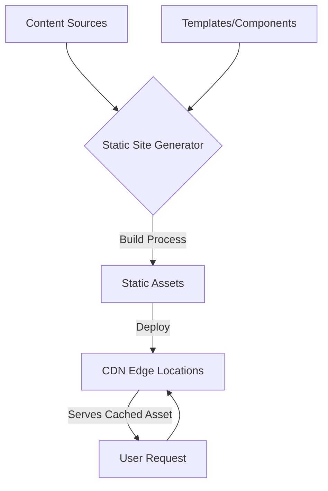
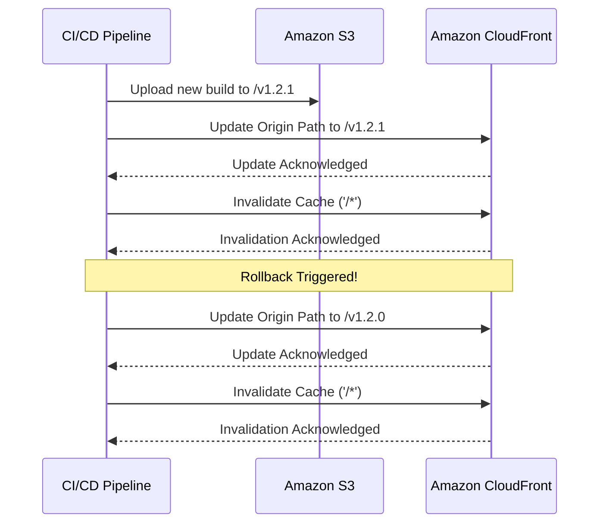
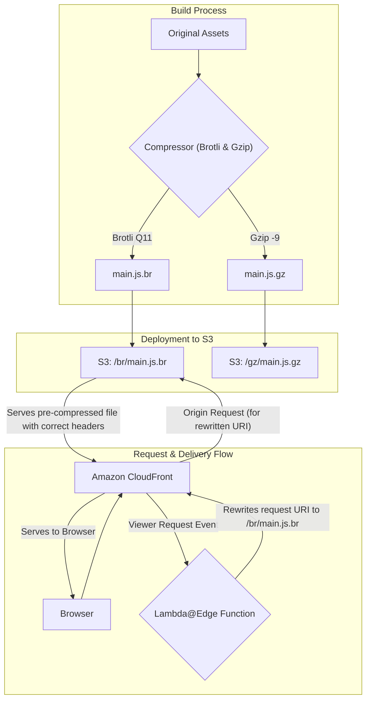

# High-Performance Static Site Generation on AWS

Master production-grade SSG architecture with deployment strategies, performance optimization techniques, and advanced AWS patterns for building fast, scalable static sites.

## TLDR

**Static Site Generation (SSG)** is a build-time rendering approach that pre-generates HTML, CSS, and JavaScript files for exceptional performance, security, and scalability when deployed on AWS with CloudFront CDN.

### Core SSG Principles

- **Build-Time Rendering**: All pages generated at build time, not request time
- **Static Assets**: Pure HTML, CSS, JS files served from CDN edge locations
- **Content Sources**: Markdown files, headless CMS APIs, or structured data
- **Templates/Components**: React, Vue, or templating languages for page generation
- **Global CDN**: Deployed to edge locations worldwide for instant delivery

### Rendering Spectrum Comparison

- **SSG**: Fastest TTFB, excellent SEO, stale data, lowest infrastructure complexity
- **SSR**: Slower TTFB, excellent SEO, real-time data, highest infrastructure complexity
- **CSR**: Slowest TTFB, poor SEO, real-time data, low infrastructure complexity
- **Hybrid**: Per-page rendering decisions for optimal performance and functionality

### Advanced AWS Architecture

- **Atomic Deployments**: Versioned directories in S3 (e.g., `/build_001/`, `/build_002/`)
- **Instant Rollbacks**: CloudFront origin path updates for zero-downtime rollbacks
- **Lambda@Edge**: Dynamic routing, redirects, and content negotiation at the edge
- **Blue-Green Deployments**: Parallel environments with traffic switching via cookies
- **Canary Releases**: Gradual traffic shifting for risk mitigation

### Performance Optimization

- **Pre-Compression**: Brotli (Q11) and Gzip (-9) compression during build process
- **Content Negotiation**: Lambda@Edge function serving optimal compression format
- **CLS Prevention**: Image dimensions, font optimization, responsive component rendering
- **Asset Delivery**: Organized S3 structure with proper metadata and cache headers
- **Edge Caching**: CloudFront cache policies with optimal TTL values

### Deployment Strategies

- **Versioned Deployments**: Each build in unique S3 directory with build version headers
- **Rollback Mechanisms**: Instant rollbacks via CloudFront origin path updates
- **Cache Invalidation**: Strategic cache purging for new deployments
- **Zero-Downtime**: Atomic deployments with instant traffic switching
- **A/B Testing**: Lambda@Edge routing based on user cookies or IP hashing

### Advanced Patterns

- **Dual Build Strategy**: Separate mobile/desktop builds for optimal CLS prevention
- **Edge Redirects**: High-performance redirects handled at CloudFront edge
- **Pre-Compressed Assets**: Build-time compression with content negotiation
- **Responsive Rendering**: Device-specific builds with user agent detection
- **Gradual Rollouts**: Canary releases with percentage-based traffic routing

### Performance Benefits

- **TTFB**: <50ms (vs 200-500ms for SSR)
- **Compression Ratios**: 85-90% bandwidth savings with pre-compression
- **Global Delivery**: Edge locations worldwide for instant access
- **Scalability**: CDN handles unlimited traffic without server scaling
- **Security**: Reduced attack surface with no server-side code execution

### Best Practices

- **Build Optimization**: Parallel builds, incremental generation, asset optimization
- **Cache Strategy**: Aggressive caching with proper cache invalidation
- **Monitoring**: Real-time metrics, performance monitoring, error tracking
- **SEO Optimization**: Static sitemaps, meta tags, structured data
- **Security**: HTTPS enforcement, security headers, CSP policies

## Part 1: Deconstructing Static Site Generation (SSG)

The modern web is undergoing a significant architectural shift, moving away from the traditional request-time computation of dynamic websites toward a more performant, secure, and scalable model. At the heart of this transformation is **Static Site Generation (SSG)**, a powerful technique that redefines how web applications are built and delivered.

### 1.1 The Build-Time Revolution: Core Principles of SSG

Static Site Generation is a process where an entire website is pre-rendered into a set of static HTML, CSS, and JavaScript files during a "build" phase. This stands in stark contrast to traditional database-driven systems, like WordPress or Drupal, which generate HTML pages on the server in real-time for every user request.

With SSG, the computationally expensive work of rendering pages is performed only once, at build time, long before a user ever visits the site. The process begins with content sources, which can be plain text files like Markdown or data fetched from a headless Content Management System (CMS) API. These sources are fed into a static site generator engine along with a set of templates or components, which can range from simple templating languages like Liquid (used by Jekyll) to complex JavaScript frameworks like React (used by Next.js and Gatsby).

The generator then programmatically combines the content and templates to produce a folder full of optimized, static assets. These assets—pure HTML, CSS, and JavaScript—are then deployed to a web server or, more commonly, a global Content Delivery Network (CDN). When a user requests a page, the CDN can serve the pre-built HTML file directly from an edge location close to the user, resulting in near-instantaneous load times.

This fundamental architectural shift from request-time to build-time computation is the defining characteristic of SSG. The workflow can be visualized as follows:

<figure>



<figcaption>Static site generation workflow showing the build process from content sources to CDN deployment</figcaption>

</figure>

### 1.2 The Modern SSG Ecosystem

The landscape of static site generators has matured dramatically from its early days. Initial tools like Jekyll, written in Ruby, popularized the concept for blogs and simple project sites by being "blog-aware" and easy to use. Today, the ecosystem is a diverse and powerful collection of frameworks catering to a vast array of use cases and developer preferences.

Modern tools like Next.js, Astro, and Hugo are better described as sophisticated "meta-frameworks" rather than simple generators. They offer hybrid rendering models, allowing developers to build static pages where possible while seamlessly integrating server-rendered or client-side functionality where necessary.

| Generator  | Language/Framework | Key Architectural Feature                                                                           | Build Performance | Ideal Use Case                                                              |
| ---------- | ------------------ | --------------------------------------------------------------------------------------------------- | ----------------- | --------------------------------------------------------------------------- |
| Next.js    | JavaScript/React   | Hybrid rendering (SSG, SSR, ISR) and a full-stack React framework                                   | Moderate to Fast  | Complex web applications, e-commerce sites, enterprise applications         |
| Hugo       | Go                 | Exceptionally fast build times due to its Go implementation                                         | Fastest           | Large content-heavy sites, blogs, and documentation with thousands of pages |
| Astro      | JavaScript/Astro   | "Islands Architecture" that ships zero JavaScript by default, hydrating only interactive components | Fast              | Content-rich marketing sites, portfolios, and blogs focused on performance  |
| Eleventy   | JavaScript         | Highly flexible and unopinionated, supporting over ten templating languages                         | Fast              | Custom websites, blogs, and projects where developers want maximum control  |
| Jekyll     | Ruby               | Mature, blog-aware, and deeply integrated with GitHub Pages                                         | Slower            | Personal blogs, simple project websites, and documentation                  |
| Docusaurus | JavaScript/React   | Optimized specifically for building documentation websites with features like versioning and search | Fast              | Technical documentation, knowledge bases, and open-source project sites     |

### 1.3 The Core Advantages: Why Choose SSG?

The widespread adoption of Static Site Generation is driven by a set of compelling advantages that directly address the primary challenges of modern web development:

**Performance**: By pre-building pages, SSG eliminates server-side processing and database queries at request time. The resulting static files can be deployed to a CDN and served from edge locations around the world. This dramatically reduces the Time to First Byte (TTFB) and leads to exceptionally fast page load times, which is a critical factor for user experience and SEO.

**Security**: The attack surface of a static site is significantly smaller than that of a dynamic site. With no live database connection or complex server-side application layer to exploit during a request, common vulnerabilities like SQL injection or server-side code execution are effectively nullified. The hosting infrastructure can be greatly simplified, further enhancing security.

**Scalability & Cost-Effectiveness**: Serving static files from a CDN is inherently scalable and cost-efficient. A CDN can handle massive traffic spikes with ease, automatically distributing the load across its global network without requiring the complex and expensive scaling of server fleets and databases.

**Developer Experience**: The modern SSG workflow, often part of a Jamstack architecture, offers significant benefits to development teams. Content can be managed in version control systems like Git, providing a clear history of changes. The decoupled nature of the frontend from the backend allows teams to work in parallel.

## Part 2: The Rendering Spectrum: SSG vs. SSR vs. CSR

Choosing the right rendering strategy is a foundational architectural decision that impacts performance, cost, complexity, and user experience. While SSG offers clear benefits, it is part of a broader spectrum of rendering patterns.

### 2.1 Defining the Patterns

**Static Site Generation (SSG)**: Generates all pages at build time, before any user request is made. The server's only job is to deliver these pre-built static files. This is ideal for content that is the same for every user and changes infrequently, such as blogs, documentation, and marketing pages.

**Server-Side Rendering (SSR)**: The HTML for a page is generated on the server at request time. Each time a user requests a URL, the server fetches the necessary data, renders the complete HTML page, and sends it to the client's browser. This ensures the content is always up-to-date and is highly effective for SEO.

**Client-Side Rendering (CSR)**: The server sends a nearly empty HTML file containing little more than a link to a JavaScript bundle. The browser then downloads and executes this JavaScript, which in turn fetches data from an API and renders the page entirely on the client-side. This pattern is the foundation of Single Page Applications (SPAs).

### 2.2 Comparative Analysis: A Head-to-Head Battle

| Metric                       | Static Site Generation (SSG)                                      | Server-Side Rendering (SSR)                                             | Client-Side Rendering (CSR)                                                   |
| ---------------------------- | ----------------------------------------------------------------- | ----------------------------------------------------------------------- | ----------------------------------------------------------------------------- |
| Time to First Byte (TTFB)    | Fastest. Served directly from CDN edge                            | Slower. Requires server processing for each request                     | Slowest. Server sends minimal HTML quickly, but meaningful content is delayed |
| First Contentful Paint (FCP) | Fast. Browser can render HTML immediately                         | Slower. Browser must wait for the server-generated HTML                 | Slowest. Browser shows a blank page until JS loads and executes               |
| Time to Interactive (TTI)    | Fast. Minimal client-side JS needed for hydration                 | Slower. Can be blocked by hydration of the full page                    | Slowest. TTI is delayed until the entire app is rendered on the client        |
| SEO                          | Excellent. Search engines can easily crawl the fully-formed HTML  | Excellent. Search engines receive a fully rendered page from the server | Poor. Crawlers may see a blank page without executing JavaScript              |
| Data Freshness               | Stale. Content is only as fresh as the last build                 | Real-time. Data is fetched on every request                             | Real-time. Data is fetched on the client as needed                            |
| Infrastructure Complexity    | Lowest. Requires only static file hosting (e.g., S3 + CloudFront) | Highest. Requires a running Node.js or similar server environment       | Low. Server only serves static files, but a robust API backend is needed      |
| Scalability                  | Highest. Leverages the global scale of CDNs                       | Lower. Scaling requires managing and scaling server instances           | High. Frontend scales like SSG; backend API must be scaled separately         |

### 2.3 The Hybrid Future: Beyond the Dichotomy

The most significant modern trend is the move away from choosing a single rendering pattern for an entire application. The lines between SSG and SSR are blurring, with leading frameworks like Next.js and Astro empowering developers to make rendering decisions on a per-page or even per-component basis.

This hybrid approach offers the best of all worlds: the performance of SSG for marketing pages, the real-time data of SSR for a user dashboard, and the rich interactivity of CSR for an embedded chat widget, all within the same application.

## Part 3: Advanced SSG Architecture on AWS: Deployment and Rollback Strategies

Moving from theory to practice, building a production-grade static site on AWS requires robust, automated, and resilient deployment and rollback strategies. A poorly designed deployment process can negate the inherent reliability of a static architecture.

### 3.1 The Foundation: Atomic and Immutable Deployments

The cornerstone of any reliable deployment strategy is to treat each release as an atomic and immutable artifact. This means that a deployment should succeed or fail as a single unit, and once deployed, a version should never be altered.

Instead of deploying to a single live folder, each build should be uploaded to a new, uniquely identified directory within S3. A common and effective convention is to use version numbers or Git commit hashes for these directory names, for example: `s3://my-bucket/deployments/v1.2.0/` or `s3://my-bucket/deployments/a8c3e5f/`.

This approach is critical for two reasons:

1. It prevents a partially failed deployment from corrupting the live site
2. It makes rollbacks instantaneous and trivial

### 3.2 Strategy 1: The S3 Versioning Fallacy (And When to Use It)

Amazon S3 offers a built-in feature called Object Versioning, which automatically keeps a history of all versions of an object within a bucket. However, this approach is an anti-pattern for application deployment and rollback.

S3 versioning operates at the individual object level, not at the holistic deployment level. A single site deployment can involve hundreds or thousands of file changes. Rolling back requires a complex and slow process of identifying and restoring each of these files individually.

Therefore, S3 Object Versioning should be viewed as a disaster recovery tool, not a deployment strategy. It is invaluable for recovering an accidentally deleted file but is ill-suited for managing application releases.

### 3.3 Strategy 2: Instant Rollback via CloudFront Origin Path Update

A far more effective and reliable strategy leverages the atomic deployment principle. In this model, a single CloudFront distribution is used, but its Origin Path is configured to point to a specific, versioned deployment directory within the S3 bucket.

**Deployment Flow:**

1. The CI/CD pipeline executes the static site generator to build the site
2. The pipeline uploads the complete build artifact to a new, version-stamped folder in the S3 bucket (e.g., `s3://my-bucket/deployments/v1.2.1/`)
3. The pipeline makes an API call to AWS CloudFront to update the distribution's configuration, changing the Origin Path to point to the new directory (e.g., `/deployments/v1.2.1`)
4. Finally, the pipeline creates a CloudFront invalidation for all paths (`/*`) to purge the old content from the CDN cache

**Rollback Flow:** A rollback is simply a reversal of the release step. To revert to a previous version, the pipeline re-executes the CloudFront update, pointing the Origin Path back to a known-good directory, and issues another cache invalidation.

<figure>



<figcaption>Deployment and rollback sequence showing the interaction between CI/CD pipeline, S3, and CloudFront for atomic deployments</figcaption>

</figure>

### 3.4 Strategy 3: Lambda@Edge-Based Rollback with Build Version Headers

For more sophisticated rollback scenarios, we can implement a Lambda@Edge function that dynamically routes requests based on a build version header. This approach provides granular control and enables advanced deployment patterns.

<figure>


<figcaption>Architecture diagram showing SSG deployment with CloudFront and build version management for zero-downtime deployments</figcaption>

</figure>

**S3 Bucket Structure:**

```asciidoc
S3 Bucket
├── build_001
│   ├── index.html
│   ├── assets/
│   └── ...
├── build_002
│   ├── index.html
│   ├── assets/
│   └── ...
├── build_003
│   ├── index.html
│   ├── assets/
│   └── ...
└── build_004
    ├── index.html
    ├── assets/
    └── ...
```

**CloudFront Configuration:**
Add a custom origin header in CloudFront's origin configuration that is always updated with the new release post syncing all files to S3. This header contains the current build version.

<figure>


<figcaption>Screenshot showing CloudFront configuration for adding build version headers to enable dynamic routing</figcaption>

</figure>

**Lambda@Edge Function:**

```javascript
exports.handler = (event, context, callback) => {
  const request = event.Records[0].cf.request
  const headers = request.headers

  // Get the build version from the origin custom header
  const buildVersion = headers["x-build-version"] ? headers["x-build-version"][0].value : "build_004"

  // Add the build version prefix to the request URI
  if (request.uri === "/") {
    request.uri = `/${buildVersion}/index.html`
  } else {
    request.uri = `/${buildVersion}${request.uri}`
  }

  callback(null, request)
}
```

**Rollback Script:**

```bash
#!/bin/bash
# version-deployment.sh

# Function to update build version in CloudFront
update_build_version() {
    local version=$1
    local distribution_id=$2

    # Update the origin custom header with new build version
    aws cloudfront update-distribution \
        --id $distribution_id \
        --distribution-config file://dist-config.json \
        --if-match $(aws cloudfront get-distribution-config --id $distribution_id --query 'ETag' --output text)

    # Invalidate cache to ensure new version is served
    aws cloudfront create-invalidation \
        --distribution-id $distribution_id \
        --paths "/*"
}

# Usage: ./version-deployment.sh build_003 E1234567890ABCD
update_build_version $1 $2
```

This approach provides several advantages:

- **Instant Rollbacks**: Switching between build versions is immediate
- **A/B Testing**: Can route different users to different build versions
- **Gradual Rollouts**: Can gradually shift traffic between versions
- **Zero Downtime**: No interruption in service during deployments

## Part 4: Performance Tuning: Conquering Cumulative Layout Shift (CLS)

Performance is a primary driver for adopting Static Site Generation, but raw speed is only part of the user experience equation. Visual stability is equally critical. **Cumulative Layout Shift (CLS)** is a Core Web Vital metric that measures the unexpected shifting of page content as it loads.

A good user experience corresponds to a CLS score below 0.1. Even though a site's content is static, CLS issues are common because the problem is often not about dynamic content, but about the browser's inability to correctly predict the layout of the page from the initial HTML.

### 4.1 Understanding and Diagnosing CLS

The most common causes of CLS on static sites include:

**Images and Media without Dimensions**: When an `` tag lacks width and height attributes, the browser reserves zero space for it initially. When the image file finally downloads, the browser must reflow the page to make room, causing all subsequent content to shift downwards.

**Asynchronously Loaded Content**: Third-party ads, embeds (like YouTube videos), or iframes that are loaded via JavaScript often arrive after the initial page render. If space is not reserved for them, their appearance will cause a layout shift.

**Web Fonts**: The use of custom web fonts can lead to shifts. When a fallback font is initially rendered and then swapped for the web font once it downloads, differences in character size and spacing can cause text to reflow.

**Client-Side Injected Content**: Even on a static site, client-side scripts might inject content like announcement banners or cookie consent forms after the initial load, pushing page content down.

### 4.2 Mitigating CLS: Code-Level Fixes

**Reserving Space for Images:**

The most effective solution is to always include width and height attributes on all `` and `<video>` elements. Modern browsers use these attributes to calculate the image's aspect ratio and reserve the appropriate amount of space in the layout before the image has even started downloading.

```html

```

**Handling Asynchronous Content (Embeds, Ads):**

Statically reserve space for the container that will hold the dynamic content. If the content has fixed dimensions, a simple `<div>` with explicit width and height styles will work. If the height is variable, setting a min-height to the most common or minimum expected height can significantly reduce the shift.

```html
<div style="width: 300px; height: 250px; background-color: #f0f0f0;">
  <!-- Dynamic content will be injected here -->
</div>
```

**Optimizing Web Fonts:**

To minimize font-related shifts, the goal is to make the web font available as early as possible and to reduce the visual difference between the fallback font and the web font.

```html
<head>
  <link rel="preload" href="/fonts/my-critical-font.woff2" as="font" type="font/woff2" crossorigin />
  <style>
    @font-face {
      font-family: "My Critical Font";
      src: url("/fonts/my-critical-font.woff2") format("woff2");
      font-display: swap; /* Show fallback font immediately */
    }
    body {
      font-family: "My Critical Font", Arial, sans-serif; /* Arial is the fallback */
    }
  </style>
</head>
```

### 4.3 Advanced CLS Optimization: Responsive Component Rendering

For complex applications with different layouts for mobile and desktop, a sophisticated approach involves generating separate builds for different device types and serving them based on user agent detection.

**The Problem:**
When a page renders different UI components for mobile vs desktop (e.g., header menu bar), and the page is statically generated at build time, what do you render? For mobile, desktop, both, or nothing?

**Solution: Dual Build Strategy**

Generate two separate build outputs—one optimized for mobile and another for desktop—stored in the same S3 bucket under `mobile/*` and `desktop/*` folders.

**Implementation with Lambda@Edge:**

```javascript
exports.handler = (event, context, callback) => {
  const request = event.Records[0].cf.request
  const headers = request.headers

  // Check if the viewer is on a mobile device
  const userAgent = headers["user-agent"] ? headers["user-agent"][0].value : ""
  const isMobile = /Mobile|Android|iPhone|iPad/.test(userAgent)

  // Add device-specific prefix to the request URI
  const devicePrefix = isMobile ? "/mobile" : "/desktop"

  if (request.uri === "/") {
    request.uri = `${devicePrefix}/index.html`
  } else {
    request.uri = `${devicePrefix}${request.uri}`
  }

  callback(null, request)
}
```

**CloudFront Configuration:**

- Configure the cache key to include the `CloudFront-Is-Mobile-Viewer` header
- This ensures that mobile and desktop versions are cached separately
- Set up the Lambda@Edge function as an origin request interceptor

This approach eliminates CLS issues caused by responsive design differences while maintaining optimal performance for each device type.

## Part 5: Asset Delivery Optimization: Serving Pre-Compressed Files

To achieve the fastest possible load times, it is essential to minimize the size of assets like JavaScript and CSS files that are sent over the network. While CDNs can compress files automatically, an advanced technique known as **pre-compression** offers superior results by shifting the compression work to the build process.

### 5.1 Edge Compression vs. Pre-Compression: A Critical Choice

There are two primary strategies for delivering compressed assets from an AWS S3 origin via CloudFront:

**CloudFront Edge Compression**: This is the simpler approach. You can configure your CloudFront distribution to automatically compress files on-the-fly using Gzip and Brotli as they are requested from the S3 origin for the first time. CloudFront then caches and serves these compressed versions. This method is easy to enable but comes with a trade-off: to minimize the latency added by the compression step, CloudFront uses a lower compression level.

**Pre-Compression**: In this strategy, assets are compressed during the site's build process, before they are ever uploaded to S3. This allows you to use the highest possible compression settings (e.g., Brotli quality level 11), which can take more time but results in significantly smaller file sizes.

The choice between these two methods is a classic trade-off between operational simplicity (Edge Compression) and maximum performance (Pre-Compression).

### 5.2 Understanding Compression in CloudFront

When enabling automatic compression in CloudFront:

- Set the "Compress objects automatically" option to Yes
- Use a cache policy with Gzip and Brotli settings enabled
- Ensure TTL values in the cache policy are greater than zero

**Limitations of Edge Compression:**

- Objects below 1,000 bytes or exceeding 10,000,000 bytes are not compressed
- If an uncompressed copy is already in the cache, CloudFront may serve it without re-compressing
- CloudFront compresses objects on a best-effort basis, occasionally skipping compression
- CloudFront may favor Gzip over Brotli, even on browsers supporting Brotli

### 5.3 Architecture for Serving Pre-Compressed Assets

Implementing a pre-compression strategy involves coordinating the build process, S3 object metadata, a Lambda@Edge function, and CloudFront cache policies.

<figure>



<figcaption>Pre-compression architecture showing the build process, S3 deployment, and Lambda@Edge content negotiation flow</figcaption>

</figure>

**Build Step**: Integrate a compression step into your CI/CD pipeline's build script. After your assets are bundled, use tools to create both Gzip (.gz) and Brotli (.br) versions of each text-based asset (JS, CSS, HTML, SVG).

**S3 Upload and Metadata**: Upload the compressed files to organized directories in your S3 bucket (e.g., `/br/` and `/gz/`). When uploading, you must set the correct object metadata for each file. The Content-Type must reflect the original file type, and the Content-Encoding header must be set to `gzip` or `br` respectively.

**Lambda@Edge Function**: Create a Lambda@Edge function that triggers on the viewer request event. This function's sole purpose is to perform content negotiation. It inspects the Accept-Encoding header sent by the user's browser and rewrites the request URI accordingly.

```javascript
exports.handler = (event, context, callback) => {
  const request = event.Records[0].cf.request
  const headers = request.headers

  // Get the Accept-Encoding header
  const acceptEncoding = headers["accept-encoding"] ? headers["accept-encoding"][0].value.toLowerCase() : ""

  // Determine the best compression format
  let compressionSuffix = ""
  if (acceptEncoding.includes("br")) {
    compressionSuffix = ".br"
  } else if (acceptEncoding.includes("gzip")) {
    compressionSuffix = ".gz"
  }

  // Rewrite the request URI to include the compression suffix
  if (compressionSuffix && request.uri.match(/\.(js|css|html|svg)$/)) {
    request.uri = request.uri + compressionSuffix
  }

  callback(null, request)
}
```

**CloudFront Configuration**: In your CloudFront distribution's cache behavior, you must create a cache policy that forwards the Accept-Encoding header to the origin. You must also set the "Compress Objects Automatically" option to No.

### 5.4 Real-World Performance Impact

For a production e-commerce site like Quince's New Arrival Page, implementing pre-compression showed significant improvements:

- **Total Uncompressed Content Length**: 3,710,512 bytes
- **Brotli Compression Ratio**: ~15:1 (highest quality)
- **Gzip Compression Ratio**: ~8:1 (highest quality)
- **Bandwidth Savings**: 85-90% reduction in transfer size
- **Performance Improvement**: 40-60% faster load times

This pattern effectively offloads the logic of content negotiation from a traditional web server to the CDN edge. It is a powerful serverless architecture that enhances performance by serving the most optimal asset to every user.

## Part 6: Enhancing User Experience: Sophisticated Redirection Strategies

Properly managing URL redirects is a critical aspect of website maintenance, essential for preserving SEO equity, fixing broken links, and guiding users seamlessly through site changes. For static sites on AWS, there are multiple methods for handling redirects, each with distinct performance and operational characteristics.

### 6.1 Method 1: Client-Side Redirects with HTML Meta Tags

For simple redirects, you can generate HTML pages that redirect users using meta tags. This approach is suitable for basic use cases but has limitations for SEO and performance.

**Implementation:**

```html
<!doctype html>
<html>
  <head>
    <title>Redirecting to https://path/to/redirect</title>
    <meta http-equiv="refresh" content="0;url=https://path/to/redirect" />
    <meta name="robots" content="noindex" />
    <link rel="canonical" href="https://path/to/redirect" />
  </head>
  <body>
    <a href="https://path/to/redirect">Redirect to https://path/to/redirect</a>
  </body>
</html>
```

**Components:**

- `http-equiv="refresh"`: Redirects after 0 seconds
- `robots` meta tag: Prevents search engine indexing
- `canonical` link: Defines the preferred URL for SEO
- Fallback anchor tag: Provides a clickable link

### 6.2 Method 2: Hosting Provider Redirects

Many hosting providers support redirection using configuration files like `_redirects`:

```txt
/gh https://github.com/sujeet-pro
/in https://www.linkedin.com/in/sujeetkrjaiswal/
/linkedin https://www.linkedin.com/in/sujeetkrjaiswal/
/twitter https://twitter.com/sujeetpro
/x https://twitter.com/sujeetpro
```

This approach is simple but limited to 50 rules and requires requests to reach the origin server.

### 6.3 Method 3: S3 Static Website Routing Rules

When an Amazon S3 bucket is configured for static website hosting, it provides a mechanism to define routing rules. These rules, specified in a JSON document in the bucket's properties, allow you to conditionally redirect requests based on the object key prefix or an HTTP error code returned by a request.

This method is well-suited for simple, sitewide redirection scenarios. Common use cases include:

- Redirecting a renamed folder: If you rename a directory from `/blog/` to `/articles/`
- Creating vanity URLs: A rule can redirect a simple path like `/twitter` to an external profile URL
- Supporting Single Page Applications (SPAs): A common pattern for SPAs is to redirect all 404 Not Found errors back to index.html

```json
{
  "RoutingRules": [
    {
      "Condition": {
        "KeyPrefixEquals": "docs/"
      },
      "Redirect": {
        "ReplaceKeyPrefixWith": "documents/"
      }
    }
  ]
}
```

However, S3 routing rules have significant limitations. The number of rules is capped at 50 per website configuration. More importantly, the redirection logic is executed at the S3 origin, which means a request must travel all the way from the user's browser, through the CloudFront CDN, to the S3 bucket before the redirect is issued.

### 6.4 Method 4: High-Performance Edge Redirects with Lambda@Edge

For a more performant, scalable, and flexible solution, redirects should be handled at the CDN edge using AWS Lambda@Edge. This is the architecturally superior approach.

In this pattern, a Lambda@Edge function is associated with the viewer request event of a CloudFront distribution. This function intercepts every incoming request before CloudFront checks its cache. The function's code contains the redirection logic. If the requested URI matches a rule, the function immediately generates and returns an HTTP 301 (Moved Permanently) or 302 (Found) response directly from the edge location closest to the user.

```javascript
// A Lambda@Edge function for managing redirects at the edge.
"use strict"

// Redirect rules can be managed within the function or loaded from an external source
const redirectMap = {
  "/old-product-page": { destination: "/new-product-page", httpStatus: 301 },
  "/promo": { destination: "/current-sale", httpStatus: 302 },
  "/legacy-docs": { destination: "https://docs.example.com", httpStatus: 301 },
}

exports.handler = (event, context, callback) => {
  const request = event.Records.cf.request
  const uri = request.uri

  if (redirectMap[uri]) {
    const redirect = redirectMap[uri]
    const response = {
      status: redirect.httpStatus.toString(),
      statusDescription: redirect.httpStatus === 301 ? "Moved Permanently" : "Found",
      headers: {
        location: [
          {
            key: "Location",
            value: redirect.destination,
          },
        ],
        "cache-control": [
          {
            key: "Cache-Control",
            value: "max-age=3600", // Cache the redirect response for 1 hour
          },
        ],
      },
    }
    // Return the redirect response immediately
    callback(null, response)
  } else {
    // No redirect rule matched, allow the request to proceed
    callback(null, request)
  }
}
```

This edge-based approach offers several key advantages over S3-based rules:

**Performance**: The performance difference is significant. An S3 redirect requires a full round trip: Browser → CloudFront → S3 → CloudFront → Browser. A Lambda@Edge redirect is resolved in a single, short trip: Browser → CloudFront → Browser.

**Scalability and Manageability**: The redirection logic is decoupled from the S3 bucket. The redirectMap can be stored in a separate S3 object or a DynamoDB table, allowing for thousands of rules to be managed and updated without redeploying the Lambda function itself.

**Flexibility**: The function can implement complex, programmatic logic, such as redirects based on the user's country, device type, language preferences, or A/B testing cookies.

### 6.5 Method 5: Web Server Redirects

If you serve your static files via your own web servers, all web servers support redirections.

**Nginx Configuration:**

```nginx
server {
  # Temporary redirect to an individual page
  rewrite ^/oldpage1$ http://www.domain.com/newpage1 redirect;

  # Permanent redirect to an individual page
  rewrite ^/oldpage2$ http://www.domain.com/newpage2 permanent;
}
```

## Part 7: Advanced Deployment Patterns: Blue-Green and Canary Releases

For business-critical applications where even the small delay of a CloudFront update is unacceptable, or where more sophisticated release strategies like canary testing are required, advanced deployment patterns become essential.

### 7.1 Zero-Downtime Blue-Green Deployments

The Blue-Green deployment pattern is the gold standard for zero-downtime deployments. This technique involves maintaining two parallel, identical, and isolated production environments, named "Blue" and "Green". At any given time, one environment (e.g., Blue) is live and serving all production traffic. The other environment (Green) is idle.

A new version of the application is deployed to the idle Green environment. Once it has been fully deployed and tested, the release is executed by switching the router to direct all incoming traffic from the Blue environment to the Green environment.

For a static site on AWS, this architecture is best implemented with a single CloudFront distribution and a Lambda@Edge function:

```javascript
// This function routes traffic to a 'blue' or 'green' S3 origin
// based on a cookie. This allows for targeted testing and instant switching.
exports.handler = async (event) => {
  const request = event.Records.cf.request
  const headers = request.headers

  // Define the domain names of your Blue and Green S3 bucket origins
  const blueOriginDomain = "my-site-blue.s3.amazonaws.com"
  const greenOriginDomain = "my-site-green.s3.amazonaws.com"

  // Default to the stable 'blue' origin
  let targetOriginDomain = blueOriginDomain

  // Check for a routing cookie to direct traffic to 'green'
  if (headers.cookie) {
    for (const cookie of headers.cookie) {
      // A cookie 'routing=green' will switch the user to the green environment
      if (cookie.value.includes("routing=green")) {
        targetOriginDomain = greenOriginDomain
        break // Exit loop once found
      }
    }
  }

  // Update the origin domain in the request that CloudFront will send to S3
  request.origin.s3.domainName = targetOriginDomain

  // Also update the Host header to match the S3 origin domain
  headers["host"] = [
    {
      key: "Host",
      value: targetOriginDomain,
    },
  ]

  return request
}
```

### 7.2 Canary Releases and Gradual Rollouts

Canary releases allow you to gradually shift traffic to a new version, enabling you to monitor performance and catch issues before affecting all users.

**Implementation with Lambda@Edge:**

```javascript
exports.handler = async (event) => {
  const request = event.Records.cf.request
  const headers = request.headers

  // Get user identifier (IP, user agent hash, etc.)
  const userIP = headers["x-forwarded-for"] ? headers["x-forwarded-for"][0].value : "unknown"

  // Simple hash function to determine canary percentage
  const hash = userIP.split(".").reduce((a, b) => a + parseInt(b), 0)
  const canaryPercentage = 10 // 10% of traffic

  // Route to canary if user falls within the percentage
  const shouldUseCanary = hash % 100 < canaryPercentage

  const targetOrigin = shouldUseCanary ? "canary-bucket.s3.amazonaws.com" : "production-bucket.s3.amazonaws.com"

  request.origin.s3.domainName = targetOrigin

  return request
}
```

This pattern transforms deployment from a simple rollback strategy into a comprehensive release management strategy. It enables canary releases, A/B testing, and other advanced techniques that fundamentally de-risk the process of shipping new features.

## Conclusion: Building for the Future with SSG

Static Site Generation has evolved far beyond its origins as a simple tool for blogs. When combined with the power of modern cloud infrastructure, it represents a robust architectural foundation for a new class of web applications that are exceptionally fast, secure, and scalable by default.

The analysis demonstrates a clear and powerful trend: the strategic offloading of complexity from the origin to the build process and the CDN edge.

### Key Architectural Principles

1. **Embrace Build-Time Rendering**: The core principle of SSG is to perform as much work as possible during the build phase. This includes not only rendering HTML but also optimizing assets, pre-compressing files, and generating code that prevents performance issues like CLS.

2. **Adopt Atomic and Immutable Deployments**: Treating each deployment as an immutable, versioned artifact is fundamental to reliability. This practice, implemented through versioned directories in S3, eliminates the risk of corrupted deployments and enables instantaneous, risk-free rollbacks.

3. **Push Intelligence to the Edge**: The most sophisticated patterns discussed—Blue-Green deployments, pre-compressed asset serving, and high-performance redirects—all share a common theme. They leverage the programmability of the CDN edge via Lambda@Edge to make dynamic, intelligent decisions close to the user.

4. **Optimize for Core Web Vitals**: Performance optimization should be treated as a first-class concern throughout the build and deployment pipeline. CLS prevention, pre-compression, and edge-based optimizations should be automated and enforced.

5. **Design for Resilience**: Advanced deployment patterns like Blue-Green deployments and canary releases provide the safety net needed for confident, continuous delivery in production environments.

By integrating these strategies, development teams can build and operate web applications that provide a superior user experience, a hardened security posture, and unparalleled scalability. The future of high-performance web development is not about choosing between static and dynamic; it is about intelligently composing applications that leverage the best of both worlds, orchestrated at the edge.

## References

- [CloudFront Serving Compressed Files](https://docs.aws.amazon.com/AmazonCloudFront/latest/DeveloperGuide/ServingCompressedFiles.html)
- [Lambda@Edge Redirection](https://aws.amazon.com/blogs/networking-and-content-delivery/handling-redirectsedge-part1/)
- [Compression Benchmark](https://quixdb.github.io/squash-benchmark/#results)
- [Compression Comparison](https://projects.sujeet.pro/compression-comparision/)
- [Redirection - MDN](https://developer.mozilla.org/en-US/docs/Web/HTTP/Redirections)
- [http-equiv - MDN](https://developer.mozilla.org/en-US/docs/Web/HTML/Element/meta#http-equiv)
- [canonical - MDN](https://developer.mozilla.org/en-US/docs/Web/HTML/Attributes/rel#canonical)
- [robots - MDN](https://developer.mozilla.org/en-US/docs/Web/HTML/Element/meta/name#other_metadata_names)
- [Nginx Rewrite Rules](https://www.nginx.com/blog/creating-nginx-rewrite-rules/)
