# Modern Video Playback Stack

Learn the complete video delivery pipeline from codecs and compression to adaptive streaming protocols, DRM systems, and ultra-low latency technologies for building modern video applications.

```mermaid
flowchart LR
    subgraph "Content Preparation"
        SRC[Source Video] --> ENC[Encoding<br/>H.264/H.265/AV1]
        ENC --> PKG[Packaging<br/>fMP4/CMAF]
        PKG --> DRM[DRM Encryption<br/>CENC]
    end

    subgraph "Delivery"
        DRM --> CDN[CDN Edge<br/>Global PoPs]
        CDN --> MAN[Manifest<br/>HLS/DASH]
    end

    subgraph "Playback"
        MAN --> ABR[ABR Selection]
        ABR --> DEC[Decryption<br/>+ Decoding]
        DEC --> PLAY[Playback]
    end

    style SRC fill:#e1d5e7,stroke:#9673a6
    style ENC fill:#dae8fc,stroke:#6c8ebf
    style PKG fill:#dae8fc,stroke:#6c8ebf
    style DRM fill:#f8cecc,stroke:#b85450
    style CDN fill:#fff2cc,stroke:#d6b656
    style MAN fill:#fff2cc,stroke:#d6b656
    style ABR fill:#d5e8d4,stroke:#82b366
    style DEC fill:#d5e8d4,stroke:#82b366
    style PLAY fill:#d5e8d4,stroke:#82b366
```

<figure>



<figcaption>End-to-end video playback pipeline from source encoding through CDN delivery to adaptive client playback</figcaption>

</figure>

## TLDR

**Modern Video Playback** is a sophisticated pipeline combining codecs, adaptive streaming protocols, DRM systems, and ultra-low latency technologies to deliver high-quality video experiences across all devices and network conditions.

### Core Video Stack Components

- **Codecs**: H.264 (universal), H.265/HEVC (4K/HDR), AV1 (royalty-free, best compression)
- **Audio Codecs**: AAC (high-quality), Opus (low-latency, real-time)
- **Container Formats**: MPEG-TS (HLS), Fragmented MP4 (DASH), CMAF (unified)
- **Adaptive Streaming**: HLS (Apple ecosystem), MPEG-DASH (open standard)
- **DRM Systems**: Widevine (Google), FairPlay (Apple), PlayReady (Microsoft)

### Video Codecs Comparison

- **H.264 (AVC)**: Universal compatibility, baseline compression, licensed
- **H.265 (HEVC)**: 50% better compression than H.264, 4K/HDR support, complex licensing
- **AV1**: 30% better than HEVC, royalty-free, slow encoding, growing hardware support
- **VP9**: Google's codec, good compression, limited hardware support

### Adaptive Bitrate Streaming

- **ABR Principles**: Multiple quality variants, dynamic segment selection, network-aware switching
- **HLS Protocol**: Apple's standard, .m3u8 manifests, MPEG-TS segments, universal compatibility
- **MPEG-DASH**: Open standard, XML manifests, codec-agnostic, flexible representation
- **CMAF**: Unified container format for both HLS and DASH, reduces storage costs

### Streaming Protocols

- **HLS (HTTP Live Streaming)**: Apple ecosystem, .m3u8 manifests, MPEG-TS/fMP4 segments
- **MPEG-DASH**: Open standard, XML manifests, codec-agnostic, flexible
- **Low-Latency HLS**: 2-5 second latency, partial segments, blocking playlist reloads
- **WebRTC**: Sub-500ms latency, UDP-based, peer-to-peer, interactive applications

### Digital Rights Management (DRM)

- **Multi-DRM Strategy**: Widevine (Chrome/Android), FairPlay (Apple), PlayReady (Windows)
- **Encryption Process**: AES-128 encryption, Content Key generation, license acquisition
- **Common Encryption (CENC)**: Single encrypted file compatible with multiple DRM systems
- **License Workflow**: Secure handshake, key exchange, content decryption

### Ultra-Low Latency Technologies

- **Low-Latency HLS**: 2-5 second latency, HTTP-based, scalable, broadcast applications
- **WebRTC**: <500ms latency, UDP-based, interactive, conferencing applications
- **Partial Segments**: Smaller chunks for faster delivery and reduced latency
- **Preload Hints**: Server guidance for optimal content delivery

### Video Pipeline Architecture

- **Content Preparation**: Encoding, transcoding, segmentation, packaging
- **Storage Strategy**: Origin servers, CDN distribution, edge caching
- **Delivery Network**: Global CDN, edge locations, intelligent routing
- **Client Playback**: Adaptive selection, buffer management, quality switching

### Performance Optimization

- **Compression Efficiency**: Codec selection, bitrate optimization, quality ladder design
- **Network Adaptation**: Real-time bandwidth monitoring, quality switching, buffer management
- **CDN Optimization**: Edge caching, intelligent routing, geographic distribution
- **Quality of Experience**: Smooth playback, minimal buffering, optimal quality selection

### Production Considerations

- **Scalability**: CDN distribution, origin offloading, global reach
- **Reliability**: Redundancy, fault tolerance, monitoring, analytics
- **Cost Optimization**: Storage efficiency, bandwidth management, encoding strategies
- **Compatibility**: Multi-device support, browser compatibility, DRM integration

### Future Trends

- **Open Standards**: Royalty-free codecs, standardized containers, interoperable protocols
- **Ultra-Low Latency**: Sub-second streaming, interactive applications, real-time communication
- **Quality Focus**: QoE optimization, intelligent adaptation, personalized experiences
- **Hybrid Systems**: Dynamic protocol selection, adaptive architectures, intelligent routing

## Introduction

Initial attempts at web video playback were straightforward but deeply flawed. The most basic method involved serving a complete video file, such as an MP4, directly from a server. While modern browsers can begin playback before the entire file is downloaded, this approach is brittle. It offers no robust mechanism for seeking to un-downloaded portions of the video, fails completely upon network interruption, and locks the user into a single, fixed quality.

A slightly more advanced method, employing HTTP Range Requests, addressed the issues of seekability and resumability by allowing the client to request specific byte ranges of the file. This enabled a player to jump to a specific timestamp or resume a download after an interruption.

However, both of these early models shared a fatal flaw: they were built around a single, monolithic file with a fixed bitrate. This "one-size-fits-all" paradigm was economically and experientially unsustainable. Serving a high-quality, high-bitrate file to a user on a low-speed mobile network resulted in constant buffering and a poor experience, while simultaneously incurring high bandwidth costs for the provider.

This pressure gave rise to Adaptive Bitrate (ABR) streaming, the foundational technology of all modern video platforms. ABR inverted the delivery model. Instead of the server pushing a single file, the video is pre-processed into multiple versions at different quality levels. Each version is then broken into small, discrete segments. The client player is given a manifest file—a map to all available segments—and is empowered to dynamically request the most appropriate segment based on its real-time assessment of network conditions, screen size, and CPU capabilities.

## The Foundation - Codecs and Compression

At the most fundamental layer of the video stack lies the codec (coder-decoder), the compression algorithm that makes the transmission of high-resolution video over bandwidth-constrained networks possible. Codecs work by removing spatial and temporal redundancy from video data, dramatically reducing file size.

### Video Codecs: A Comparative Analysis

#### H.264 (AVC - Advanced Video Coding)

Released in 2003, H.264 remains the most widely used video codec in the world. Its enduring dominance is not due to superior compression but to its unparalleled compatibility. For nearly two decades, hardware manufacturers have built dedicated H.264 decoding chips into virtually every device, from smartphones and laptops to smart TVs and set-top boxes.

**Key Characteristics:**

- **Compression Efficiency**: Baseline (reference point for comparison)
- **Ideal Use Case**: Universal compatibility, live streaming, ads
- **Licensing Model**: Licensed (Reasonable)
- **Hardware Support**: Ubiquitous
- **Key Pro**: Maximum compatibility
- **Key Con**: Lower efficiency for HD/4K

#### H.265 (HEVC - High Efficiency Video Coding)

Developed as the direct successor to H.264 and standardized in 2013, HEVC was designed to meet the demands of 4K and High Dynamic Range (HDR) content. It achieves this with a significant improvement in compression efficiency, reducing bitrate by 25-50% compared to H.264 at a similar level of visual quality.

**Key Characteristics:**

- **Compression Efficiency**: ~50% better than H.264
- **Ideal Use Case**: 4K/UHD & HDR streaming
- **Licensing Model**: Licensed (Complex & Expensive)
- **Hardware Support**: Widespread
- **Key Pro**: Excellent efficiency for 4K
- **Key Con**: Complex licensing

#### AV1 (AOMedia Video 1)

AV1, released in 2018, is the product of the Alliance for Open Media (AOM), a consortium of tech giants including Google, Netflix, Amazon, Microsoft, and Meta. Its creation was a direct strategic response to the licensing complexities of HEVC.

**Key Characteristics:**

- **Compression Efficiency**: ~30% better than HEVC
- **Ideal Use Case**: High-volume VOD, bandwidth savings
- **Licensing Model**: Royalty-Free
- **Hardware Support**: Limited but growing rapidly
- **Key Pro**: Best-in-class compression, no fees
- **Key Con**: Slow encoding speed

### Audio Codecs: The Sonic Dimension

#### AAC (Advanced Audio Coding)

AAC is the de facto standard for audio in video streaming, much as H.264 is for video. It is the default audio codec for MP4 containers and is supported by nearly every device and platform.

**Key Characteristics:**

- **Primary Use Case**: High-quality music/video on demand
- **Performance at Low Bitrate (<96kbps)**: Fair; quality degrades significantly
- **Performance at High Bitrate (>128kbps)**: Excellent; industry standard for high fidelity
- **Latency**: Higher; not ideal for real-time
- **Compatibility**: Near-universal; default for most platforms
- **Licensing**: Licensed

#### Opus

Opus is a highly versatile, open-source, and royalty-free audio codec developed by the IETF. Its standout feature is its exceptional performance at low bitrates.

**Key Characteristics:**

- **Primary Use Case**: Real-time communication (VoIP), low-latency streaming
- **Performance at Low Bitrate (<96kbps)**: Excellent; maintains high quality and intelligibility
- **Performance at High Bitrate (>128kbps)**: Excellent; competitive with AAC
- **Latency**: Very low; designed for interactivity
- **Compatibility**: Strong browser support, less on other hardware
- **Licensing**: Royalty-Free & Open Source

## Packaging and Segmentation

Once the audio and video have been compressed by their respective codecs, they must be packaged into a container format and segmented into small, deliverable chunks. This intermediate stage is critical for enabling adaptive bitrate streaming.

### Container Formats: The Digital Shipping Crates

#### MPEG Transport Stream (.ts)

The MPEG Transport Stream, or .ts, is the traditional container format used for HLS. Its origins lie in the digital broadcast world (DVB), where its structure of small, fixed-size packets was designed for resilience against transmission errors over unreliable networks.

#### Fragmented MP4 (fMP4)

Fragmented MP4 is the modern, preferred container for both HLS and DASH streaming. It is a variant of the standard ISO Base Media File Format (ISOBMFF), which also forms the basis of the ubiquitous MP4 format.

For streaming, the key element within an MP4 file is the `moov` atom, which contains the metadata required for playback, such as duration and seek points. For a video to begin playing before it has fully downloaded (a practice known as "fast start" or pseudostreaming), this `moov` atom must be located at the beginning of the file.

#### The Role of CMAF (Common Media Application Format)

The Common Media Application Format (CMAF) is not a new container format itself, but rather a standardization of fMP4 for streaming. Its introduction was a watershed moment for the industry.

Historically, to support both Apple devices (requiring HLS with .ts segments) and all other devices (typically using DASH with .mp4 segments), content providers were forced to encode, package, and store two complete, separate sets of video files. This doubled storage costs and dramatically reduced the efficiency of CDN caches.

CMAF solves this problem by defining a standardized fMP4 container that can be used by both HLS and DASH. A provider can now create a single set of CMAF-compliant fMP4 media segments and serve them with two different, very small manifest files: a .m3u8 for HLS clients and an .mpd for DASH clients.

### The Segmentation Process: A Practical Guide with ffmpeg

The open-source tool ffmpeg is the workhorse of the video processing world. Here's a detailed breakdown of generating a multi-bitrate HLS stream:

```bash file=./hls.bash collapse={8-15}
ffmpeg -i ./video/big-buck-bunny.mp4 \
-filter_complex \
"[0:v]split=7[v1][v2][v3][v4][v5][v6][v7]; \
[v1]scale=640:360[v1out]; [v2]scale=854:480[v2out]; \
[v3]scale=1280:720[v3out]; [v4]scale=1920:1080[v4out]; \
[v5]scale=1920:1080[v5out]; [v6]scale=3840:2160[v6out]; \
[v7]scale=3840:2160[v7out]" \
-map "[v1out]" -c:v:0 h264 -r 30 -b:v:0 800k \
-map "[v2out]" -c:v:1 h264 -r 30 -b:v:1 1400k \
-map "[v3out]" -c:v:2 h264 -r 30 -b:v:2 2800k \
-map "[v4out]" -c:v:3 h264 -r 30 -b:v:3 5000k \
-map "[v5out]" -c:v:4 h264 -r 30 -b:v:4 7000k \
-map "[v6out]" -c:v:5 h264 -r 15 -b:v:5 10000k \
-map "[v7out]" -c:v:6 h264 -r 15 -b:v:6 20000k \
-map a:0 -map a:0 -map a:0 -map a:0 -map a:0 -map a:0 -map a:0 \
-c:a aac -b:a 128k \
-var_stream_map "v:0,a:0 v:1,a:1 v:2,a:2 v:3,a:3 v:4,a:4 v:5,a:5 v:6,a:6" \
-master_pl_name master.m3u8 \
-f hls \
-hls_time 6 \
-hls_list_size 0 \
-hls_segment_filename "video/hls/v%v/segment%d.ts" \
video/hls/v%v/playlist.m3u8
```

**Command Breakdown:**

- `-i ./video/big-buck-bunny.mp4`: Specifies the input video file
- `-filter_complex "...":` Initiates a complex filtergraph for transcoding
- `[0:v]split=7[...]:` Takes the video stream and splits it into seven identical streams
- `[v1]scale=640:360[v1out];...`: Each stream is scaled to different resolutions
- `-map "[vXout]":` Maps the output of a filtergraph to an output stream
- `-c:v:0 h264 -r 30 -b:v:0 800k`: Sets codec, frame rate, and bitrate for each stream
- `-var_stream_map "v:0,a:0 v:1,a:1...":` Pairs video and audio streams for ABR playlists
- `-f hls`: Specifies HLS format output
- `-hls_time 6`: Sets segment duration to 6 seconds
- `-hls_segment_filename "video/hls/v%v/segment%d.ts":` Defines segment naming pattern

## The Protocols of Power - HLS and MPEG-DASH

The protocols for adaptive bitrate streaming define the rules of communication between the client and server. They specify the format of the manifest file and the structure of the media segments.

### HLS (HTTP Live Streaming): An In-Depth Look

Created by Apple, HLS is the most common streaming protocol in use today, largely due to its mandatory status for native playback on Apple's vast ecosystem of devices. It works by breaking video into a sequence of small HTTP-based file downloads, which makes it highly scalable as it can leverage standard HTTP servers and CDNs.

#### Master Playlist

The master playlist is the entry point for the player. It lists the different quality variants available for the stream:

```m3u8 file=./master.m3u8
#EXTM3U
#EXT-X-VERSION:3

# 360p Variant
#EXT-X-STREAM-INF:BANDWIDTH=928000,AVERAGE-BANDWIDTH=900000,RESOLUTION=640x360,CODECS="avc1.4d401e,mp4a.40.2"
v0/playlist.m3u8

# 480p Variant
#EXT-X-STREAM-INF:BANDWIDTH=1528000,AVERAGE-BANDWIDTH=1500000,RESOLUTION=854x480,CODECS="avc1.4d401f,mp4a.40.2"
v1/playlist.m3u8

# 720p Variant
#EXT-X-STREAM-INF:BANDWIDTH=2928000,AVERAGE-BANDWIDTH=2900000,RESOLUTION=1280x720,CODECS="avc1.640028,mp4a.40.2"
v2/playlist.m3u8

# 1080p Variant
#EXT-X-STREAM-INF:BANDWIDTH=5128000,AVERAGE-BANDWIDTH=5100000,RESOLUTION=1920x1080,CODECS="avc1.640028,mp4a.40.2"
v3/playlist.m3u8
```

#### Media Playlist

Once the player selects a variant, it downloads the corresponding media playlist containing the actual media segments:

```m3u8 file=./playlist.m3u8
#EXTM3U
#EXT-X-VERSION:3
#EXT-X-TARGETDURATION:10
#EXT-X-MEDIA-SEQUENCE:0

#EXTINF:9.6,
segment0.ts
#EXTINF:10.0,
segment1.ts
#EXTINF:9.8,
segment2.ts
...
#EXT-X-ENDLIST
```

### MPEG-DASH: The Codec-Agnostic International Standard

Dynamic Adaptive Streaming over HTTP (DASH), standardized by MPEG as ISO/IEC 23009-1, was developed to create a unified, international standard for adaptive streaming. Unlike HLS, which was created by a single company, DASH was developed through an open, collaborative process.

Its most significant feature is that it is codec-agnostic, meaning it can deliver video and audio compressed with any format (e.g., H.264, HEVC, AV1, VP9).

The manifest file in DASH is called a Media Presentation Description (MPD), which is an XML document:

```xml
<MPD type="static" mediaPresentationDuration="PT600S" profiles="urn:mpeg:dash:profile:isoff-on-demand:2011">
  <Period duration="PT600S">
    <AdaptationSet contentType="video" mimeType="video/mp4" codecs="avc1.640028">
      <Representation id="video-1080p" bandwidth="5000000" width="1920" height="1080">
        <BaseURL>video/1080p/</BaseURL>
        <SegmentTemplate media="segment-$Number$.m4s" initialization="init.mp4" startNumber="1" />
      </Representation>
      <Representation id="video-720p" bandwidth="2800000" width="1280" height="720">
        <BaseURL>video/720p/</BaseURL>
        <SegmentTemplate media="segment-$Number$.m4s" initialization="init.mp4" startNumber="1" />
      </Representation>
    </AdaptationSet>
    <AdaptationSet contentType="audio" mimeType="audio/mp4" codecs="mp4a.40.2" lang="en">
      <Representation id="audio-en" bandwidth="128000">
        <BaseURL>audio/en/</BaseURL>
        <SegmentTemplate media="segment-$Number$.m4s" initialization="init.mp4" startNumber="1" />
      </Representation>
    </AdaptationSet>
  </Period>
</MPD>
```

### Head-to-Head: A Technical Showdown

| Feature               | HLS (HTTP Live Streaming)                            | MPEG-DASH                                     |
| --------------------- | ---------------------------------------------------- | --------------------------------------------- |
| Creator/Standard Body | Apple Inc.                                           | MPEG (ISO/IEC Standard)                       |
| Manifest Format       | .m3u8 (Text-based)                                   | .mpd (XML-based)                              |
| Codec Support         | H.264, H.265/HEVC required; others possible          | Codec-agnostic (supports any codec)           |
| Container Support     | MPEG-TS, Fragmented MP4 (fMP4/CMAF)                  | Fragmented MP4 (fMP4/CMAF), WebM              |
| Primary DRM           | Apple FairPlay                                       | Google Widevine, Microsoft PlayReady          |
| Apple Device Support  | Native, universal support                            | Not supported natively in Safari/iOS          |
| Low Latency Extension | LL-HLS                                               | LL-DASH                                       |
| Key Advantage         | Universal compatibility, especially on Apple devices | Flexibility, open standard, powerful manifest |
| Key Disadvantage      | Less flexible, proprietary origins                   | Lack of native support on Apple platforms     |

## Securing the Stream: Digital Rights Management

For premium content, preventing unauthorized copying and distribution is a business necessity. Digital Rights Management (DRM) is the technology layer that provides content protection through encryption and controlled license issuance.

### The Multi-DRM Triumvirate

Three major DRM systems dominate the market, each tied to a specific corporate ecosystem:

1. **Google Widevine**: Required for protected playback on Chrome browser, Android devices, and platforms like Android TV and Chromecast
2. **Apple FairPlay**: The only DRM technology supported for native playback within Apple's ecosystem, including Safari on macOS and iOS
3. **Microsoft PlayReady**: Native DRM for Edge browser and Windows operating systems, as well as devices like Xbox

### The DRM Workflow: Encryption and Licensing

The DRM process involves two main phases:

1. **Encryption and Packaging**: Video content is encrypted using AES-128, with a Content Key and Key ID generated
2. **License Acquisition**: When a user presses play, the player initiates a secure handshake with the license server to obtain the Content Key

A critical technical standard in this process is Common Encryption (CENC), which allows a single encrypted file to contain the necessary metadata to be decrypted by multiple DRM systems.

## The New Frontier: Ultra-Low Latency

For decades, internet streaming has lagged significantly behind traditional broadcast television, with latencies of 15-30 seconds or more being common for HLS. The industry is now aggressively pushing to close this gap with two key technologies: Low-Latency HLS (LL-HLS) and WebRTC.

### Low-Latency HLS (LL-HLS)

LL-HLS is an extension to the existing HLS standard, designed to reduce latency while preserving the massive scalability of HTTP-based delivery. It achieves this through several optimizations:

- **Partial Segments**: Breaking segments into smaller "parts" that can be downloaded and played before the full segment is available
- **Blocking Playlist Reloads**: Server can "block" player requests until new content is available
- **Preload Hints**: Server can tell the player the URI of the next part that will become available

### WebRTC (Web Real-Time Communication)

WebRTC is fundamentally different from HLS. It is designed for true real-time, bidirectional communication with sub-second latency (<500ms). Its technical underpinnings are optimized for speed:

- **UDP-based Transport**: Uses UDP for "fire-and-forget" packet delivery
- **Stateful, Peer-to-Peer Connections**: Establishes persistent connections between peers

| Characteristic      | Low-Latency HLS (LL-HLS)                              | WebRTC                                                        |
| ------------------- | ----------------------------------------------------- | ------------------------------------------------------------- |
| Typical Latency     | 2-5 seconds                                           | < 500 milliseconds (sub-second)                               |
| Underlying Protocol | TCP (via HTTP/1.1 or HTTP/2)                          | Primarily UDP (via SRTP)                                      |
| Scalability Model   | Highly scalable via standard HTTP CDNs                | Complex; requires media servers (SFUs) for scale              |
| Primary Use Case    | Large-scale one-to-many broadcast (live sports, news) | Interactive many-to-many communication (conferencing, gaming) |
| Quality Focus       | Prioritizes stream reliability and ABR quality        | Prioritizes minimal delay; quality can be secondary           |
| Compatibility       | Growing support, built on HLS foundation              | Native in all modern browsers                                 |
| Cost at Scale       | More cost-effective for large audiences               | Can be expensive due to server infrastructure needs           |

## Architecting a Resilient Video Pipeline

Building a production-grade video streaming service requires adherence to robust system design principles. A modern video pipeline should be viewed as a high-throughput, real-time data pipeline.

### The Critical Role of the Content Delivery Network (CDN)

A CDN is an absolute necessity for any streaming service operating at scale. It provides:

- **Reduced Latency**: By minimizing physical distance data must travel
- **Origin Offload**: Protecting central origin servers from being overwhelmed

### Designing for Scale, Reliability, and QoE

Key principles include:

- **Streaming-First Architecture**: Designed around continuous, real-time data flow
- **Redundancy and Fault Tolerance**: Distributed architecture with no single point of failure
- **Robust Adaptive Bitrate (ABR) Ladder**: Wide spectrum of bitrates and resolutions
- **Intelligent Buffer Management**: Balance between smoothness and latency
- **Comprehensive Monitoring and Analytics**: Continuous, real-time monitoring beyond simple health checks

## Conclusion

The architecture of video playback has undergone a dramatic transformation, evolving from a simple file transfer into a highly specialized and complex distributed system. The modern video stack is a testament to relentless innovation driven by user expectations and economic realities.

Key trends defining the future of video streaming include:

1. **Open Standards and Commoditization**: The rise of royalty-free codecs like AV1 and standardization via CMAF
2. **Ultra-Low Latency**: Technologies like LL-HLS and WebRTC enabling new classes of applications
3. **Quality of Experience (QoE) Focus**: Every technical decision ultimately serves the goal of improving user experience

The future of video playback lies in building intelligent, hybrid, and complex systems that can dynamically select the right tool for the right job. The most successful platforms will be those that master this complexity, architecting resilient and adaptive pipelines capable of delivering a flawless, high-quality stream to any user, on any device, under any network condition.

## References

- [HTTP Live Streaming (HLS) - Apple Developer](https://developer.apple.com/streaming/) - Official HLS specification and implementation guides
- [MPEG-DASH Specification - ISO/IEC 23009-1](https://www.iso.org/standard/79329.html) - International standard for adaptive streaming
- [AV1 Codec - Alliance for Open Media](https://aomedia.org/av1/) - Royalty-free video codec specification
- [H.264/AVC - ITU-T H.264](https://www.itu.int/rec/T-REC-H.264) - Advanced Video Coding standard
- [H.265/HEVC - ITU-T H.265](https://www.itu.int/rec/T-REC-H.265) - High Efficiency Video Coding standard
- [CMAF - ISO/IEC 23000-19](https://www.iso.org/standard/79106.html) - Common Media Application Format
- [Common Encryption (CENC) - ISO/IEC 23001-7](https://www.iso.org/standard/68042.html) - Multi-DRM encryption standard
- [Widevine DRM - Google](https://www.widevine.com/) - Google's DRM solution documentation
- [FairPlay Streaming - Apple](https://developer.apple.com/streaming/fps/) - Apple's DRM implementation
- [Low-Latency HLS - Apple Developer](https://developer.apple.com/documentation/http-live-streaming/enabling-low-latency-http-live-streaming-hls) - LL-HLS implementation guide
- [WebRTC - W3C](https://www.w3.org/TR/webrtc/) - Web Real-Time Communication specification
- [FFmpeg Documentation](https://ffmpeg.org/documentation.html) - Video processing toolkit
