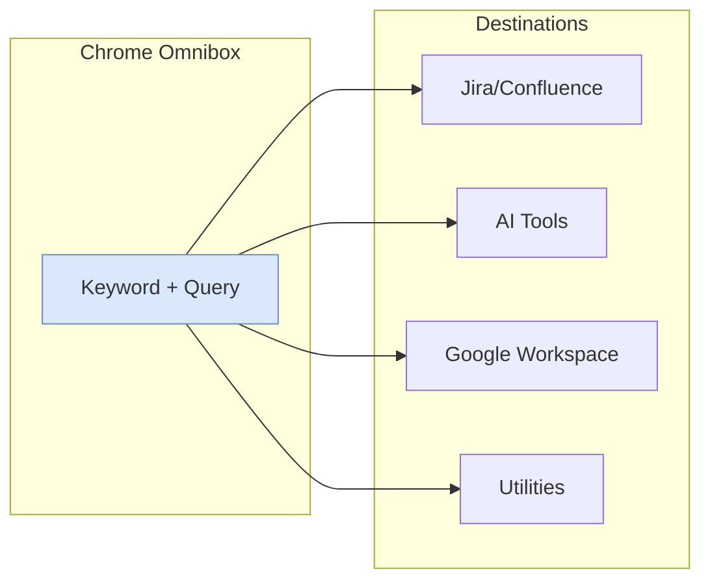

# Chrome Power User Setup

My Chrome configuration for maximum productivity: address bar keywords for instant navigation and essential extensions for a seamless cross-browser workflow.

<figure>

<figcaption>Address bar keywords route queries directly to target services</figcaption>

</figure>

## TLDR

**Address bar keywords** transform Chrome's omnibox into a command palette for instant navigation to any service.

### Keyboard Shortcuts

- **Development**: `j 123` jumps to Jira ticket, `cf onboarding` searches Confluence
- **AI tools**: `c explain this` opens Claude, `p latest react` queries Perplexity
- **Google Workspace**: `sheet Q1 budget` finds spreadsheets, `gm invoice` searches Gmail

### Cross-Browser Workflow

- **Raindrop.io** syncs bookmarks across all browsers (Chrome, Arc, Firefox, Brave)
- **Bitwarden** provides password + passkey management with desktop app for system-wide autofill
- Browser-agnostic tools eliminate lock-in when testing different browsers

### Claude Integration

- **Desktop app** (`Opt + Space`) for quick questions without context-switching
- **CLI + IDE extensions** for all coding tasks: debugging, refactoring, generation
- **Browser extension** for automation: navigating sites, filling forms, extracting data

---

## Address Bar Keywords

Address bar keywords let you search any site directly from Chrome's omnibox. Instead of navigating to Jira, then searching, type `j login bug` and hit Enter.

**Setup:** `chrome://settings/searchEngines` → **Site search** → **Add**

### Development & Work Tools

> Replace `<your-company-name>` and `<your-project-code>` with your actual Jira/Atlassian values.

| Tool                                               | Keyword | Shortcut URL (Copy & Paste)                                                                              | Usage                                        |
| :------------------------------------------------- | :------ | :------------------------------------------------------------------------------------------------------- | :------------------------------------------- |
| **Jira (Smart Search)**                            | `j`     | `https://<your-company-name>.atlassian.net/secure/QuickSearch.jspa?searchString=%s`                      | `j 123` (jumps to ticket) or `j login bug`   |
| **Jira (Project: <your-project-code>)**            | `jp`    | `https://<your-company-name>.atlassian.net/issues?jql=textfields~"%s" AND project="<your-project-code>"` | `jp checkout` (searches only this project)   |
| **Jira Ticket for a project <your-project-code>)** | `jt`    | `https://<your-company-name>.atlassian.net/browse/<your-project-code>-%s`                                | `jt 125` (opens ticket `<project-code>-125`) |
| **Confluence**                                     | `cf`    | `https://<your-company-name>.atlassian.net/wiki/search?text=%s`                                          | `cf onboarding`                              |
| **Bitbucket**                                      | `bb`    | `https://bitbucket.org/search?q=%s`                                                                      | `bb repo_name`                               |
| **Chrome Store**                                   | `ext`   | `https://chrome.google.com/webstore/search/%s`                                                           | `ext json viewer`                            |

### AI Tools

| Tool           | Keyword  | Shortcut URL (Copy & Paste)             | Usage                     |
| :------------- | :------- | :-------------------------------------- | :------------------------ |
| **Claude**     | `c`      | `https://claude.ai/new?q=%s`            | `c explain this code`     |
| **Perplexity** | `p`      | `https://www.perplexity.ai/search?q=%s` | `p latest react features` |
| **ChatGPT**    | `gpt`    | `https://chatgpt.com/?q=%s`             | `gpt write a poem`        |
| **Gemini**     | `gemini` | `https://gemini.google.com/app?q=%s`    | `gemini summarize this`   |

**Notes:**

- ChatGPT & Claude keywords create a draft prompt—you still need to press Enter to submit
- Perplexity auto-submits the search
- Gemini's `?q=` parameter support varies—test in your browser or use the [Gemini Ultimate extension](https://chromewebstore.google.com/detail/gemini-ultimate/jhpkldiddcobahfolmjiobbacjbgdegl)
- I set Perplexity as default search engine on my personal profile, ChatGPT on work profile (via "ChatGPT Search" extension)

### Google Office & Drive

| Tool              | Keyword | Shortcut URL (Copy & Paste)                      | Usage                   |
| :---------------- | :------ | :----------------------------------------------- | :---------------------- |
| **Google Sheets** | `sheet` | `https://docs.google.com/spreadsheets/u/0/?q=%s` | `sheet Q1 budget`       |
| **Google Docs**   | `doc`   | `https://docs.google.com/document/u/0/?q=%s`     | `doc meeting notes`     |
| **Google Drive**  | `dr`    | `https://drive.google.com/drive/search?q=%s`     | `dr project proposal`   |
| **Gmail**         | `gm`    | `https://mail.google.com/mail/u/0/#search/%s`    | `gm invoice from apple` |

> **Pro Tip:** Type `sheet.new` or `doc.new` directly in the address bar to create a blank file instantly (no setup required).

### Entertainment & Shopping

| Tool              | Keyword | Shortcut URL (Copy & Paste)                       | Usage                |
| :---------------- | :------ | :------------------------------------------------ | :------------------- |
| **YouTube**       | `yt`    | `https://www.youtube.com/results?search_query=%s` | `yt coding tutorial` |
| **YouTube Music** | `ym`    | `https://music.youtube.com/search?q=%s`           | `ym lo-fi beats`     |
| **Amazon**        | `az`    | `https://www.amazon.com/s?k=%s`                   | `az running shoes`   |

### Utilities

| Tool                | Keyword | Shortcut URL (Copy & Paste)                          | Usage                  |
| :------------------ | :------ | :--------------------------------------------------- | :--------------------- |
| **Google Maps**     | `map`   | `https://www.google.com/maps/search/%s`              | `map coffee near me`   |
| **Google Calendar** | `cal`   | `https://calendar.google.com/calendar/r/search?q=%s` | `cal standup`          |
| **Google Images**   | `img`   | `https://www.google.com/search?tbm=isch&q=%s`        | `img transparent logo` |
| **Thesaurus**       | `def`   | `https://www.google.com/search?q=define+%s`          | `def esoteric`         |

> **Pro Tip:** `cal.new` creates a new calendar event instantly.

---

## Essential Extensions

I frequently switch browsers to test features (Arc, Firefox, Brave, etc.), so browser-agnostic tools are essential. Chrome remains my daily driver.

### Cross-Browser Sync

| Extension | Purpose |
| :-------- | :------ |
| **[Raindrop.io](https://raindrop.io/)** | Bookmark manager that syncs across all browsers. When testing Arc's spaces or Brave's privacy features, I still have access to my entire bookmark library. |
| **[Bitwarden](https://bitwarden.com/)** | Password manager + passkey storage. Set as default password manager with the companion desktop app for system-wide autofill. Works identically across browsers. |

### Development

| Extension | Purpose |
| :-------- | :------ |
| **[React Developer Tools](https://chromewebstore.google.com/detail/react-developer-tools/fmkadmapgofadopljbjfkapdkoienihi)** | Inspect React component hierarchy, props, and state. Essential for debugging React applications. |
| **[uBlock Origin Lite](https://chromewebstore.google.com/detail/ublock-origin-lite/ddkjiahejlhfcafbddmgiahcphecmpfh)** | Manifest V3-compliant ad blocker. Uses declarative filtering rules (DNR API) instead of dynamic blocking—less flexible than the original uBlock Origin, but the only option since Chrome disabled MV2 extensions in mid-2025. Blocks most ads and trackers effectively; cosmetic filtering is ~20% less effective. For full uBlock Origin, use Firefox, Edge, or Brave. |

### AI Integration

| Extension | Purpose |
| :-------- | :------ |
| **[Claude](https://claude.com/chrome)** | Browser automation and AI assistant. Claude works in a side panel while you browse—automating tasks, clicking buttons, filling forms, navigating websites, and extracting data on your behalf. Requires a paid subscription. |

**My Claude Workflow:**

I'm a heavy Claude user across multiple surfaces:

- **Desktop app** (`Opt + Space`) — Quick questions and searches without leaving current context
- **Claude Code CLI + IDE extensions** — All coding tasks: debugging, refactoring, code generation
- **Browser extension** — Browser automation: navigating sites, filling forms, clicking buttons, extracting data

This combination covers every AI use case without context-switching between tools.

## References

- [Chrome Site Search Settings](https://support.google.com/chrome/answer/95426) - Official Chrome documentation on custom search engines
- [GPT and Claude from your URL bar](https://treyhunner.com/2024/07/chatgpt-and-claude-from-your-browser-url-bar/) - Trey Hunner's guide to AI tool URL shortcuts
- [Raindrop.io](https://raindrop.io/) - Cross-browser bookmark manager
- [Bitwarden](https://bitwarden.com/) - Open-source password manager
- [Claude in Chrome](https://claude.com/chrome) - Anthropic's official browser extension page
- [Piloting Claude in Chrome](https://www.anthropic.com/news/claude-for-chrome) - Anthropic's announcement of Claude browser extension
- [uBlock Origin vs uBlock Origin Lite](https://adblock-tester.com/ad-blockers/ublock-origin-vs-ublock-origin-lite/) - Comparison of MV2 vs MV3 ad blocking capabilities
- [Manifest V2 support timeline](https://developer.chrome.com/docs/extensions/develop/migrate/mv2-deprecation-timeline) - Chrome's MV2 deprecation schedule
