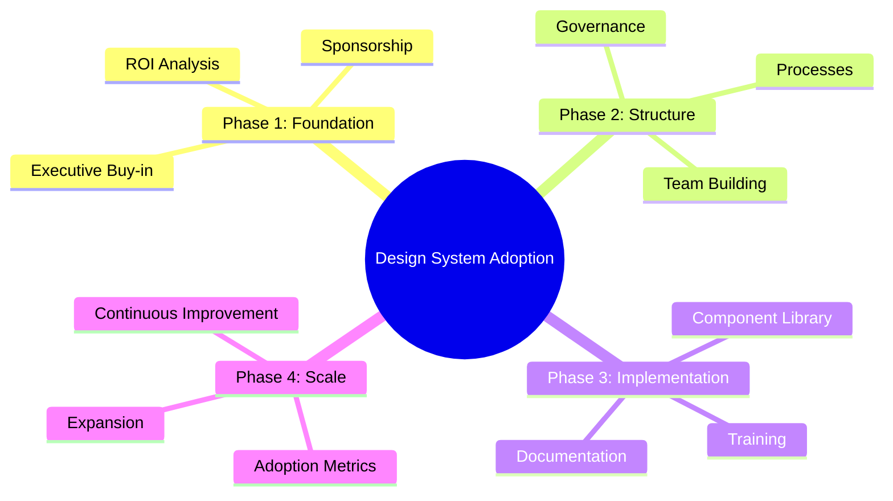
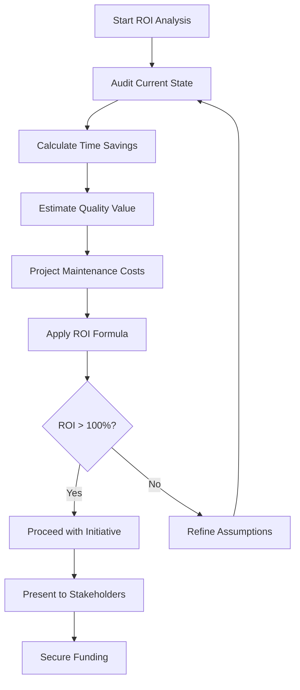
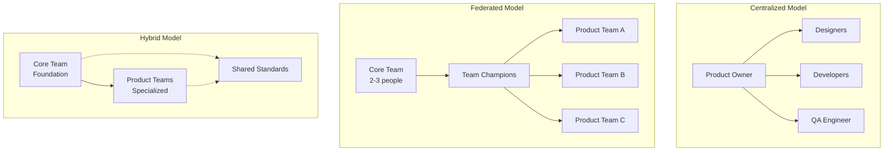

# Design System Adoption Guide: A Strategic Framework for Enterprise Success

A design system is not merely a component library—it's a strategic asset that scales design, accelerates development, and unifies user experience across an enterprise. Yet, the path from inception to widespread adoption is fraught with organizational, technical, and cultural challenges that can derail even the most well-intentioned initiatives.

This guide provides a comprehensive framework for anyone tasked with driving design system adoption from conception to sustained success. We'll explore the critical questions you need to answer at each stage, the metrics to track, and the strategic decisions that determine long-term success.

## Overview



## Table of Contents

## Phase 1: Foundation and Strategic Alignment

### 1.1 Defining the Problem Space

**Critical Questions to Answer:**

- What specific pain points does your organization face with UI consistency?
- Which teams and products will benefit most from a design system?
- What is the current state of design and development workflows?
- How much technical debt exists in your UI components?

**What to Measure:**

- **UI Inconsistency Index**: Audit existing products to quantify visual inconsistencies
- **Component Duplication Count**: Number of similar components built multiple times
- **Development Velocity**: Time spent on UI-related tasks vs. feature development
- **Design Debt**: Number of design variations for common elements (buttons, forms, etc.)

**When to Act:**

- Conduct the audit when you have executive support for the initiative
- Present findings within 2-3 weeks to maintain momentum
- Use data to build your business case

**Example Audit Findings:**

```
- 15 different button styles across 8 products
- 23 form implementations with varying validation patterns
- 40+ hours/month spent on UI consistency fixes
- 3 different color palettes in active use
```

### 1.2 Building the Business Case

**Critical Questions to Answer:**

- How will the design system align with business objectives?
- What is the expected ROI over 3-5 years?
- Which stakeholders need to be convinced?
- What resources will be required for initial implementation?

**What to Measure:**

- **Development Time Savings**: Projected hours saved per team per month
- **Quality Improvements**: Expected reduction in UI-related bugs
- **Onboarding Acceleration**: Time saved for new team members
- **Maintenance Cost Reduction**: Ongoing savings from centralized component management

**ROI Calculation Framework:**

$$
\text{ROI} = \frac{\text{TS} + \text{QV} - \text{MC}}{\text{MC}} \times 100
$$

**Variable Definitions:**

- **TS** = Annual Time & Cost Savings
- **QV** = Quality Improvements Value
- **MC** = Design System Maintenance Cost

**Business Context:**

- **TS**: Total annual savings from reduced development time and costs
- **QV**: Value of improved quality, reduced bugs, and better user experience
- **MC**: Ongoing costs to maintain and evolve the design system

**ROI Calculation Process:**



**When to Act:**

- Present ROI analysis to finance and engineering leadership
- Secure initial funding commitment before proceeding
- Establish quarterly review cadence for ROI validation

### 1.3 Securing Executive Sponsorship

**Critical Questions to Answer:**

- Who are the key decision-makers in your organization?
- What motivates each stakeholder (CTO, CFO, Head of Product)?
- What level of sponsorship do you need?
- How will you maintain executive engagement over time?

**What to Measure:**

- **Sponsorship Level**: Executive time allocated to design system initiatives
- **Budget Allocation**: Percentage of engineering budget dedicated to design system
- **Leadership Participation**: Attendance at design system review meetings
- **Policy Support**: Number of design system requirements in team processes

**When to Act:**

- Secure sponsorship before any technical work begins
- Maintain monthly executive updates during implementation
- Escalate issues that require leadership intervention within 24 hours

## Phase 2: Team Structure and Governance

### 2.1 Building the Core Team

**Critical Questions to Answer:**

- What roles are essential for the design system team?
- How will you balance centralized control with distributed contribution?
- What governance model fits your organization's culture?
- How will you handle conflicts between consistency and flexibility?

**Team Composition Options:**

```
Centralized Model:
- 1 Product Owner (full-time)
- 1-2 Designers (full-time)
- 1-2 Developers (full-time)
- 1 QA Engineer (part-time)

Federated Model:
- 1 Core Team (2-3 people)
- Design System Champions in each product team
- Contribution guidelines and review processes

Hybrid Model:
- Core team owns foundational elements
- Product teams contribute specialized components
- Clear boundaries between core and product-specific
```

**Team Structure Visualization:**



**What to Measure:**

- **Team Velocity**: Components delivered per sprint
- **Response Time**: Time to address team requests
- **Quality Metrics**: Bug rate in design system components
- **Team Satisfaction**: Net Promoter Score from internal users

**When to Act:**

- Start with minimal viable team (1 designer + 1 developer)
- Expand team based on adoption success and workload
- Reassess team structure every 6 months

### 2.2 Establishing Governance

**Critical Questions to Answer:**

- How will design decisions be made?
- What is the contribution process for new components?
- How will you handle breaking changes?
- What quality standards must components meet?

**Governance Framework:**

```
Decision Matrix:
- Core Components: Central team approval required
- Product-Specific: Team autonomy with design review
- Breaking Changes: RFC process with stakeholder input
- Quality Gates: Automated testing + design review + accessibility audit
```

**What to Measure:**

- **Decision Velocity**: Time from request to decision
- **Contribution Rate**: Number of contributions from product teams
- **Quality Compliance**: Percentage of components meeting standards
- **Breaking Change Frequency**: Number of breaking changes per quarter

**When to Act:**

- Establish governance framework before component development
- Review and adjust governance every quarter
- Escalate governance conflicts within 48 hours

## Phase 3: Technical Architecture and Implementation

### 3.1 Making Architectural Decisions

**Critical Questions to Answer:**

- Should you build framework-specific or framework-agnostic components?
- How will you handle multiple frontend technologies?
- What is your migration strategy for existing applications?
- How will you ensure backward compatibility?

**Architecture Options:**

```
Framework-Specific (React, Angular, Vue):
Pros: Better developer experience, seamless integration
Cons: Vendor lock-in, maintenance overhead, framework dependency

Framework-Agnostic (Web Components):
Pros: Future-proof, technology-agnostic, single codebase
Cons: Steeper learning curve, limited ecosystem integration

Hybrid Approach:
- Core tokens and principles as platform-agnostic
- Framework-specific component wrappers
- Shared design language across platforms
```

**What to Measure:**

- **Integration Complexity**: Time to integrate components into existing projects
- **Performance Impact**: Bundle size and runtime performance
- **Browser Compatibility**: Cross-browser testing results
- **Developer Experience**: Time to implement common patterns

**When to Act:**

- Make architectural decisions before any component development
- Prototype both approaches with a small team
- Validate decisions with 2-3 pilot projects

### 3.2 Design Token Strategy

**Critical Questions to Answer:**

- How will you structure your design tokens?
- What is the relationship between tokens and components?
- How will you handle theme variations?
- What build process will generate platform-specific outputs?

**Token Architecture:**

```
Foundation Tokens (Raw Values):
- color-blue-500: #0070f3
- spacing-unit: 8px
- font-size-base: 16px

Semantic Tokens (Context):
- color-primary: {color-blue-500}
- spacing-small: {spacing-unit}
- text-body: {font-size-base}

Component Tokens (Specific):
- button-padding: {spacing-small}
- card-border-radius: 4px
```

**What to Measure:**

- **Token Coverage**: Percentage of UI elements using tokens
- **Consistency Score**: Visual consistency across products
- **Theme Support**: Number of supported themes
- **Build Performance**: Time to generate platform-specific outputs

**When to Act:**

- Start with foundation tokens before components
- Validate token structure with design team
- Implement automated token generation within first month

### 3.3 Migration Strategy

**Critical Questions to Answer:**

- Which applications should migrate first?
- How will you handle legacy code integration?
- What is your rollback strategy?
- How will you measure migration progress?

**Migration Approaches:**

```
Strangler Fig Pattern:
- New features built exclusively with design system
- Existing features migrated incrementally
- Legacy code gradually replaced over time

Greenfield First:
- Start with new projects
- Build momentum and success stories
- Use success to justify legacy migrations

Parallel Development:
- Maintain legacy systems during migration
- Gradual feature-by-feature replacement
- Full decommissioning after validation
```

**What to Measure:**

- **Migration Progress**: Percentage of UI using design system
- **Feature Parity**: Functionality maintained during migration
- **Performance Impact**: Load time and runtime performance
- **User Experience**: User satisfaction scores during transition

**When to Act:**

- Start migration with 1-2 pilot applications
- Plan for 6-12 month migration timeline
- Monitor progress weekly, adjust strategy monthly

## Phase 4: Adoption and Change Management

### 4.1 Building Adoption Momentum

**Critical Questions to Answer:**

- How will you create early adopters?
- What incentives will encourage teams to use the system?
- How will you handle resistance and pushback?
- What support mechanisms do teams need?

**Adoption Strategies:**

```
Champion Program:
- Identify advocates in each team
- Provide training and early access
- Empower champions to help their teams

Pilot Program:
- Start with 1-2 willing teams
- Provide dedicated support and resources
- Document and share success stories

Incentive Structure:
- Recognition for adoption milestones
- Reduced review cycles for design system usage
- Integration with team performance metrics
```

**What to Measure:**

- **Adoption Rate**: Percentage of teams using design system
- **Component Usage**: Frequency of component usage across products
- **User Satisfaction**: Net Promoter Score from internal users
- **Support Requests**: Number and type of help requests

**When to Act:**

- Launch champion program before component release
- Start pilot program within 2 weeks of initial release
- Review adoption metrics weekly, adjust strategy monthly

### 4.2 Training and Support

**Critical Questions to Answer:**

- What skills do teams need to adopt the system?
- How will you provide ongoing support?
- What documentation and resources are essential?
- How will you handle questions and feedback?

**Support Infrastructure:**

```
Documentation Portal:
- Component library with examples
- Integration guides for each framework
- Best practices and design principles
- Troubleshooting and FAQ sections

Training Programs:
- Onboarding sessions for new teams
- Advanced workshops for power users
- Regular office hours and Q&A sessions
- Video tutorials and interactive demos

Support Channels:
- Dedicated Slack/Discord channel
- Office hours schedule
- Escalation process for complex issues
- Feedback collection mechanisms
```

**What to Measure:**

- **Documentation Usage**: Page views and search queries
- **Training Completion**: Percentage of team members trained
- **Support Response Time**: Time to resolve support requests
- **Knowledge Retention**: Post-training assessment scores

**When to Act:**

- Launch documentation portal before component release
- Schedule training sessions within first month
- Establish support channels before any team adoption

## Phase 5: Measurement and Continuous Improvement

### 5.1 Key Performance Indicators

**Critical Questions to Answer:**

- What metrics indicate design system success?
- How will you track adoption and usage?
- What quality metrics are most important?
- How will you measure business impact?

**KPI Framework:**

```
Adoption Metrics:
- Component Coverage: % of UI using design system
- Team Adoption: Number of active teams
- Usage Frequency: Components used per project
- Detachment Rate: % of components customized

Efficiency Metrics:
- Development Velocity: Time to implement features
- Bug Reduction: UI-related bug count
- Onboarding Time: Time for new team members
- Maintenance Overhead: Time spent on UI consistency

Quality Metrics:
- Accessibility Score: WCAG compliance
- Visual Consistency: Design audit scores
- Performance Impact: Bundle size and load time
- User Satisfaction: Internal and external feedback
```

**What to Measure:**

- **Real-time Metrics**: Component usage, error rates, performance
- **Weekly Metrics**: Adoption progress, support requests, quality scores
- **Monthly Metrics**: ROI validation, team satisfaction, business impact
- **Quarterly Metrics**: Strategic alignment, governance effectiveness, roadmap progress

**When to Act:**

- Establish baseline metrics before launch
- Review metrics weekly, adjust strategy monthly
- Present comprehensive reports quarterly

### 5.2 Feedback Loops and Iteration

**Critical Questions to Answer:**

- How will you collect user feedback?
- What is your process for prioritizing improvements?
- How will you handle conflicting requirements?
- What is your release and update strategy?

**Feedback Mechanisms:**

```
Continuous Collection:
- In-app feedback widgets
- Regular user surveys
- Support channel monitoring
- Usage analytics and patterns

Structured Reviews:
- Quarterly user research sessions
- Monthly stakeholder meetings
- Weekly team retrospectives
- Annual strategic planning

Prioritization Framework:
- Impact vs. Effort matrix
- User request volume and frequency
- Business priority alignment
- Technical debt considerations
```

**What to Measure:**

- **Feedback Volume**: Number of suggestions and requests
- **Response Time**: Time to acknowledge and address feedback
- **Implementation Rate**: Percentage of feedback implemented
- **User Satisfaction**: Satisfaction with feedback handling

**When to Act:**

- Collect feedback continuously
- Review and prioritize weekly
- Implement high-impact changes within 2 weeks
- Communicate roadmap updates monthly

## Phase 6: Scaling and Evolution

### 6.1 Managing Growth

**Critical Questions to Answer:**

- How will the system scale with organizational growth?
- What happens when new teams or products join?
- How will you maintain consistency across diverse needs?
- What is your long-term vision for the system?

**Scaling Strategies:**

```
Organizational Scaling:
- Expand core team based on adoption growth
- Implement federated governance for large organizations
- Create regional or product-specific champions
- Establish clear contribution guidelines

Technical Scaling:
- Modular architecture for component management
- Automated testing and quality gates
- Performance monitoring and optimization
- Documentation and knowledge management

Process Scaling:
- Standardized onboarding for new teams
- Automated compliance checking
- Self-service tools and resources
- Clear escalation paths for complex issues
```

**What to Measure:**

- **Scalability Metrics**: System performance under load
- **Maintenance Overhead**: Time spent on system maintenance
- **Team Efficiency**: Developer productivity with system
- **Quality Consistency**: Quality metrics across all products

**When to Act:**

- Plan for scaling before reaching capacity limits
- Review scaling needs quarterly
- Implement scaling improvements incrementally

### 6.2 Future-Proofing

**Critical Questions to Answer:**

- How will you handle technology changes?
- What is your strategy for design evolution?
- How will you maintain backward compatibility?
- What is your sunset strategy for deprecated components?

**Future-Proofing Strategies:**

```
Technology Evolution:
- Framework-agnostic core architecture
- Plugin system for framework-specific features
- Regular technology stack assessments
- Migration paths for major changes

Design Evolution:
- Design token versioning strategy
- Component deprecation policies
- Migration guides for design updates
- A/B testing for design changes

Compatibility Management:
- Semantic versioning for all changes
- Deprecation warnings and timelines
- Automated migration tools
- Comprehensive testing across versions
```

**What to Measure:**

- **Technology Relevance**: Framework usage across organization
- **Design Currency**: Alignment with current design trends
- **Migration Success**: Success rate of automated migrations
- **User Impact**: Impact of changes on user experience

**When to Act:**

- Monitor technology trends continuously
- Plan for major changes 6-12 months in advance
- Communicate changes 3 months before implementation

## Conclusion: The Path to Sustained Success

Design system adoption is not a one-time project but a continuous journey of organizational transformation. Success requires balancing technical excellence with cultural change, strategic vision with tactical execution, and centralized control with distributed autonomy.

The role of leading design system adoption is to act as both architect and evangelist—building robust technical foundations while nurturing the collaborative culture that sustains long-term adoption. By following this structured approach, measuring progress systematically, and adapting strategies based on real-world feedback, you can transform your design system from a technical initiative into a strategic asset that delivers compounding value over time.

Remember: the goal is not just to build a design system, but to create an organization that thinks, designs, and builds with systematic consistency. When you achieve that, the design system becomes not just a tool, but a fundamental part of your organization's DNA.

---

**Key Takeaways for Design System Leaders:**

1. **Start with the problem, not the solution** - Build your case on concrete pain points and measurable business impact
2. **People before technology** - Focus on cultural change and stakeholder alignment before technical implementation
3. **Measure everything** - Establish clear metrics and track progress systematically
4. **Iterate continuously** - Use feedback to improve both the system and your adoption strategy
5. **Think long-term** - Design for evolution and scale from the beginning
6. **Lead by example** - Demonstrate the value of systematic thinking in everything you do

The journey to design system adoption is challenging, but with the right approach, it becomes one of the most impactful initiatives any leader can drive. The key is to remember that you're not just building a component library—you're transforming how your organization approaches design and development at a fundamental level.
