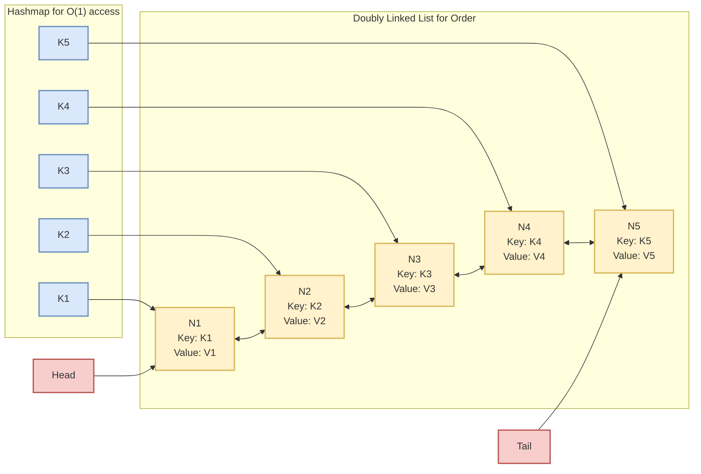

# LRU Implementation

Implement a in-memory cache in JS with LRU as cache-eviction policy



## Table of Contents

## Intro

LRU stands for Least Recently Used. In the context of a cache, the Least Recently Used policy dictates that when the cache reaches its maximum capacity and a new item needs to be added, the least recently accessed item in the cache will be removed to make space for the new item. This helps optimize cache performance by keeping the most frequently accessed items in the cache while discarding the least recently used ones.

## Implementation

### Utilizing the property of JS Map to maintain order of insertion

```ts
class LRUCache {
  capacity: number
  cache: Map<number, number>

  constructor(capacity: number) {
    this.capacity = capacity
    this.cache = new Map()
  }

  get(key: number): number {
    if (!this.cache.has(key)) {
      return -1
    } else {
      const value = this.cache.get(key)
      this.cache.delete(key)
      this.cache.set(key, value)
      return value
    }
  }

  put(key: number, value: number): void {
    if (this.cache.has(key)) {
      this.cache.delete(key)
    } else if (this.cache.size >= this.capacity) {
      const keyToRemove = this.cache.keys().next().value
      this.cache.delete(keyToRemove)
    }
    this.cache.set(key, value)
  }
}
```

### Using a Doubly Linked List & Map

```ts collapse={44-54, 59-104}
class LRUCache {
  capacity: number
  cache: Map<number, ListNode>
  list: DoublyLinkedList

  constructor(capacity: number) {
    this.capacity = capacity
    this.cache = new Map()
    this.list = new DoublyLinkedList()
  }

  get(key: number): number {
    if (!this.cache.has(key)) {
      return -1
    } else {
      const node = this.cache.get(key)!
      this.list.removeNode(node)
      this.list.addToHead(node)
      return node.value
    }
  }

  put(key: number, value: number): void {
    if (this.cache.has(key)) {
      const node = this.cache.get(key)!
      node.value = value
      this.list.removeNode(node)
      this.list.addToHead(node)
    } else {
      if (this.cache.size >= this.capacity) {
        const removed = this.list.removeTail()
        if (removed) {
          this.cache.delete(removed.key)
        }
      }
      const node = new ListNode(key, value, null, null)
      this.list.addToHead(node)
      this.cache.set(key, node)
    }
  }
}

class ListNode {
  key: number
  value: number
  prev: ListNode | null
  next: ListNode | null

  constructor(key: number, value: number) {
    this.key = key
    this.value = value
    this.prev = null
    this.next = null
  }
}

// coll
class DoublyLinkedList {
  head: ListNode | null
  tail: ListNode | null

  constructor() {
    this.head = null
    this.tail = null
  }

  addToHead(node: ListNode): void {
    node.next = this.head
    if (this.head) {
      this.head.prev = node
    }
    this.head = node
    if (!this.tail) {
      this.tail = node
    }
  }

  removeNode(node: ListNode): void {
    if (node === this.head) {
      this.head = node.next
    } else if (node === this.tail) {
      this.tail = node.prev
    } else {
      if (node.prev) node.prev.next = node.next
      if (node.next) node.next.prev = node.prev
    }
  }

  removeTail(): ListNode | null {
    if (this.tail) {
      const removed = this.tail
      if (this.head === this.tail) {
        this.head = null
        this.tail = null
      } else {
        this.tail = this.tail.prev
        if (this.tail) {
          this.tail.next = null
        }
      }
      return removed
    }
    return null
  }
}
```
