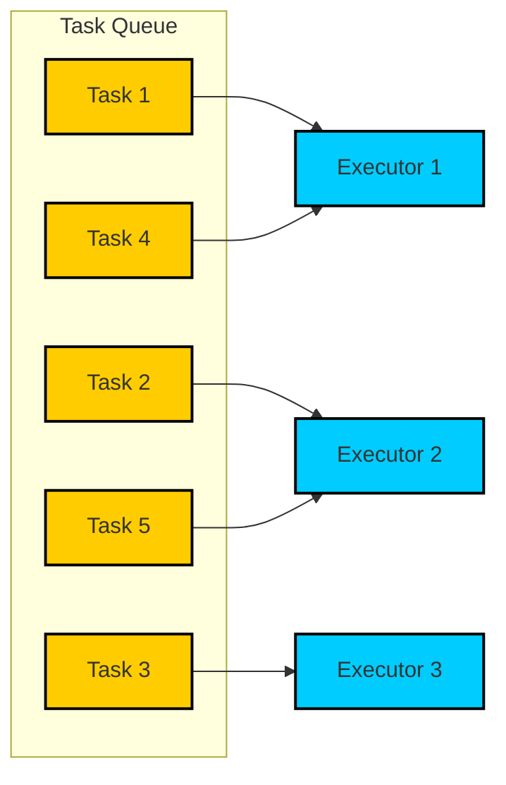

# Async Task Queue

An async task queue manages and controls the execution of asynchronous tasks, ensuring they run according to specified concurrency limits and order.



## Table of Contents

## Intro

An async task queue is a data structure that manages the execution of asynchronous tasks in a controlled manner. It allows you to add tasks to the queue and ensures that they are executed according to specified rules, such as concurrency limits or execution order. Here are some key points about async task queues:

- **Task Management**: Tasks are added to the queue and are executed asynchronously. Each task is typically represented as a promise or a function that returns a promise.
- **Concurrency Control**: The queue can limit the number of tasks that are executed concurrently. This is useful for managing resource usage and preventing overload.
- **Order of Execution**: Tasks can be executed in the order they were added (FIFO - First In, First Out) or based on priority.
- **Error Handling**: The queue can handle errors in task execution, allowing for retries or logging of failures.
- **Background Processing**: Tasks can be processed in the background, allowing the main application to remain responsive.
- **Rate Limiting**: The queue can control the rate at which tasks are executed, which is useful for interacting with rate-limited APIs.
- **Workflow Orchestration**: Complex workflows with dependencies between tasks can be managed using an async task queue.

Overall, async task queues are a powerful tool for managing asynchronous operations in a controlled and efficient manner.

## Implementation

```ts file=./2025-01-24-code-sample.ts collapse={47-52, 56-64, 67-75, 80-89, 101-106, 110-112}

```

## References

- [MDN With Resolvers](https://developer.mozilla.org/en-US/docs/Web/JavaScript/Reference/Global_Objects/Promise/withResolvers)
