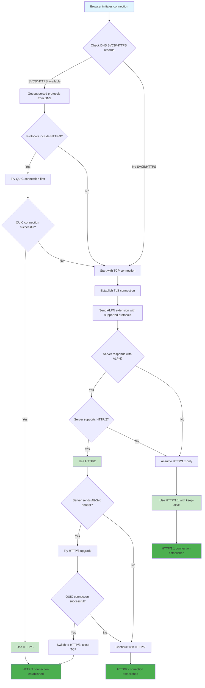

# Switching HTTP Versions on browser

How and when browser decides to switch HTTP Versions



## Table of Contents

## HTTP/1.x

Both HTTP/1.1 and HTTP/1.0 use compatible request formats. After the first request, the server's response will indicate the version it supports, plus headers such as "Connection: keep-alive" indicating which features may be used.

## HTTP/2

Browsers have decided to only support HTTP/2 over a TLS connection. This allows them to use a new TLS feature called **ALPN (application-layer protocol negotiation)**.

When Chrome establishes the TLS connection, it sends a list of supported protocols (http/1.1 and h2) as part of the TLS handshake, and the server responds with the one it wishes to use – e.g. "h2" indicating that it's now expecting HTTP/2.

In case the server doesn't return an ALPN extension at all, the browser assumes that it only supports HTTP/1.x. (This is the reason why enabling HTTP/2 support on servers used to require upgrading OpenSSL.)

The HTTP/2 protocol itself does support being used over a plaintext connection by using the HTTP Upgrade mechanism. In most cases, the first request has to be HTTP/1.1, with an Upgrade: header again listing protocols that the client wants to switch to.

The response will also be HTTP/1.1, either "101 Switching Protocols" indicating that the server now expects HTTP/2 on the same connections, or something else indicating that HTTP/2 isn't supported.

Browsers do not use HTTP Upgrade in this way, they simply don't support HTTP/2 without TLS. (However, the Apache HTTPD webserver can be configured to accept 'h2c' connections for testing.)

## HTTP/3

HTTP/3 uses a different transport protocol (QUIC vs TCP), so an inline upgrade is not possible. The browser doesn't know whether the server might support QUIC, so it still makes an initial TCP connection and negotiates HTTP/1.1 vs HTTP/2 using TLS ALPN as above.

The upgrade to HTTP/3 is actually server-initiated – in its HTTP resposes the server sends the **Alt-Svc header (or a special ALTSVC frame in HTTP/2)** indicating that it supports HTTP/3 on the specified UDP/QUIC port. The browser might follow that suggestion and try to establish a QUIC connection, and if successful closes the TCP one.

## Improving using SVCB DNS Record

```
example.com 3600 IN HTTPS 1 . alpn=”h3,h2”
```

The DNS record above advertises support for the HTTP/3 and HTTP/2 protocols for the example.com origin.

### What if we are using DNS Load balancing?

If an origin can be served by multiple CDNs it might happen that the responses for A and/or AAAA records come from one CDN, while the HTTPS record comes from another.

Eg: if the HTTPS record from one of the CDNs advertises support for HTTP/3, but the CDN the client ends up connecting to doesn't support it

```txt
example.com 3600 IN HTTPS 1 . alpn=”h3,h2” ipv4hint=”192.0.2.1” ipv6hint=”2001:db8::1”
```

In addition to all this, SVCB and HTTPS can also be used to define alternative endpoints that are authoritative for a service, in a similar vein to SRV records:

```txt
example.com 3600 IN HTTPS 1 example.net alpn=”h3,h2”
example.com 3600 IN HTTPS 2 example.org alpn=”h2”
```

## References

- [Speeding up HTTPS and HTTP/3 negotiation with... DNS](https://blog.cloudflare.com/speeding-up-https-and-http-3-negotiation-with-dns/)
- [How does browser know which version of HTTP it should use when sending a request?](https://superuser.com/questions/1659248/how-does-browser-know-which-version-of-http-it-should-use-when-sending-a-request)
- [How is the HTTP version of a browser request and the HTTP version of a server response determined?](https://superuser.com/questions/670889/how-is-the-http-version-of-a-browser-request-and-the-http-version-of-a-server-re)
- [Service binding and parameter specification via the DNS (DNS SVCB and HTTPS RRs)](https://datatracker.ietf.org/doc/html/draft-ietf-dnsop-svcb-https-12)
