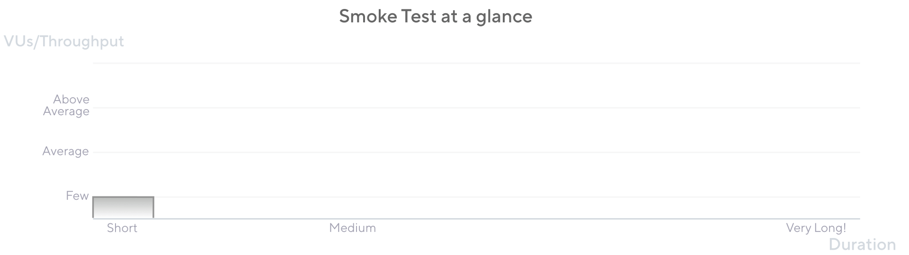
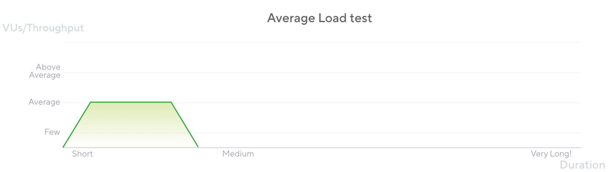
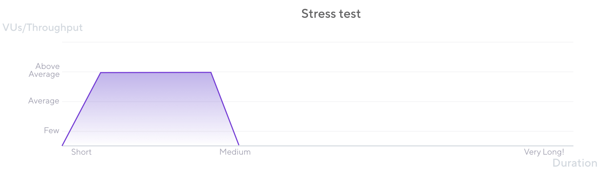
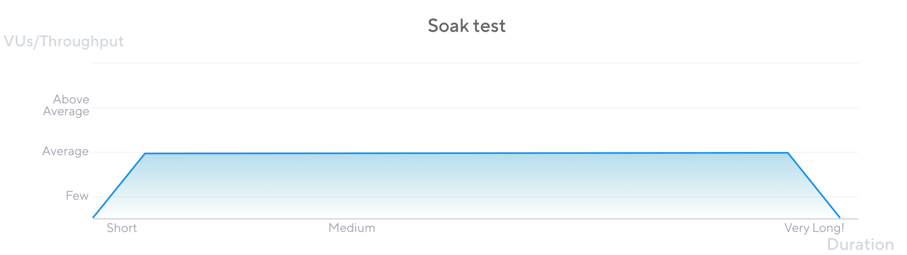
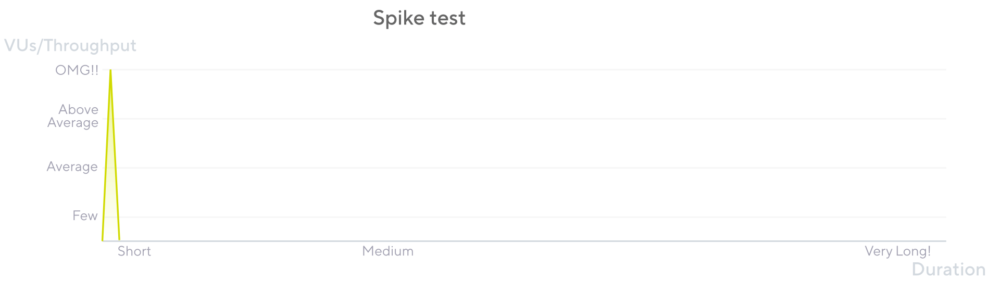

# Performance Testing With K6

Learn about how to use Grafana's K6 to do various Performance Testing

## Table of Contents

## Introduction to Performance Testing

**Performance testing** is a type of software testing that assesses how a system performs in terms of responsiveness, stability, and scalability under various workloads.

Here's a breakdown of key aspects of performance testing:

### Goals of Performance Testing

- **Determine responsiveness**: Measure how quickly the application responds to user requests.
- **Evaluate stability**: Assess the application's ability to remain stable and avoid crashes under normal and peak loads.
- **Test scalability**: Determine if the application can handle increasing user loads and data volumes without performance degradation.
- **Identify bottlenecks**: Pinpoint areas in the system that are causing performance issues.
- **Meet performance requirements**: Verify that the application meets predefined performance criteria.

### Types of Performance Testing

- **Load testing**: Simulates expected user traffic to evaluate the application's performance under normal conditions.
- **Stress testing**: Subjects the application to extreme loads to identify its breaking point and assess its behavior under stress.
- **Endurance (Soak) testing**: Evaluates the application's performance over an extended period to uncover issues like memory leaks or resource exhaustion.
- **Spike testing**: Tests the application's reaction to sudden spikes in user traffic.
- **Scalability testing**: Determines the application's ability to handle increasing loads and data volumes.

### Key Metrics in Performance Testing

- **Response time**: The time it takes for the application to respond to a user request.
- **Throughput**: The number of transactions or requests the application can handle within a given time frame.
- **Resource utilization**: The amount of CPU, memory, and network bandwidth the application consumes.
- **Error rate**: The number of errors encountered during testing.

> For this blog, we will only focus on doing the tests.
> The metrics should ideally be read from the integrated observability tools, like Datadog, etc.

## Introduction to K6

Grafana k6 is an open-source, developer-friendly, and extensible load testing tool. While you write k6 scripts in JavaScript, under the hood k6 is actually written in Go.

It uses `Goja`, which is a pure Golang implementation of ES2015 (ES6) JavaScript. This means that k6 can execute JavaScript code, but it doesn't run on a Node.js engine. Instead, it uses a Go JavaScript compiler.

This combination of Go for the core engine and JavaScript for scripting provides k6 with several advantages:

- **Performance**: Go is known for its efficiency and concurrency, making k6 capable of handling a large number of virtual users with minimal resource consumption.
- **Developer-friendliness**: JavaScript is a widely used language, making it easy for developers to write and understand k6 scripts.

So, in essence, k6 leverages the power of Go for its performance and the familiarity of JavaScript for its scripting.

### Installing K6

```sh title="Install K6"
brew install k6 # Mac
docker pull grafana/k6 # Docker
docker pull grafana/k6:master-with-browser # Docker with browser
```

> Official [Setup Documents](https://grafana.com/docs/k6/latest/set-up/install-k6/)

### Your First Script

```js file=./2025-02-19-performance-testing-with-k6/one-time.js

```

```bash title="output" file=./2025-02-19-performance-testing-with-k6/one-time.txt collapse={1-20}

```

### Running it for N Iterations

- Run the test for a fixed number of iterations.
- This is useful when you want to run a test for a specific number of times.

import iterationCode from './code-and-output/iteration.js?raw'
import iterationOutput from './code-and-output/iteration.txt?raw'

```js file=./2025-02-19-performance-testing-with-k6/iteration.js collapse={1-2, 7-10}

```

```bash title="output"  file=./2025-02-19-performance-testing-with-k6/iteration.txt collapse={1-22}

```

### Constant Users

- Run a test with a constant number of Virtual Users (VUs).
- This is useful when you want to maintain a constant load on the system. (Constant Request that the system handles at a time)

```js file=./2025-02-19-performance-testing-with-k6/n-users.js collapse={1-2, 8-11}

```

```bash title="output" file=./2025-02-19-performance-testing-with-k6/n-users.txt collapse={1-22}

```

### Ramping Users

```js file=./2025-02-19-performance-testing-with-k6/ramp-up-users.js collapse={1-2, 10-13}

```

```bash title="output"  file=./2025-02-19-performance-testing-with-k6/ramp-up-users.txt collapse={1-22}

```

### Constant Rate

- Run at a constant RPS (Requests Per Second).
- This is useful when you want to maintain a constant load on the system. (in terms of incoming requests)
- This can be used when doing "Stress" tests.

How is it different from `Constant Users`?

- In `Constant Users`, the number of VUs is constant, but the rate of requests can vary based on the response time.
- In `Constant Rate`, the rate of requests is constant, but the number of VUs can vary based on the response time.

```js file=./2025-02-19-performance-testing-with-k6/constant-rate.js collapse={1-2, 16-19}

```

```bash title="output"  file=./2025-02-19-performance-testing-with-k6/constant-rate.txt collapse={1-23}

```

```bash title="output"  file=./2025-02-19-performance-testing-with-k6/constant-rate-less-vus.txt collapse={1-23}

```

### Ramping Rate

- Start with a small number of VUs and gradually increase them over time.
- This is useful for simulating a gradual increase in user traffic to test how the system handles the load.
- This can be used when doing "Scaling" tests.
- This is also helpful, when you want to get metrics like latency for different loads

import rampingRateCode from './code-and-output/ramping-rate.js?raw'
import rampingRateOutput from './code-and-output/ramping-rate.txt?raw'

```js file=./2025-02-19-performance-testing-with-k6/ramping-rate.js collapse={1-2, 23-26}

```

```bash title="output"  file=./2025-02-19-performance-testing-with-k6/ramping-rate.txt collapse={1-23}

```

### Multiple Scenarios

Run more than one scenario in a single test.

- Both scenarios runs in parallel.
- Each scenario has its own VUs and iterations.

```js file=./2025-02-19-performance-testing-with-k6/multiple-scenario.js collapse={1-2, 27-30}

```

```bash title="output"  file=./2025-02-19-performance-testing-with-k6/multiple-scenario.txt collapse={1-24}

```

## Performance Scenarios

### Smoke Testing

Smoke tests have a minimal load.
Run them to verify that the system works well under minimal load and to gather baseline performance values.



```js title="smoke-test.js" collapse={1-3, 8-17}
import http from "k6/http";
import { check, sleep } from "k6";

export const options = {
  vus: 3, // Key for Smoke test. Keep it at 2, 3, max 5 VUs
  duration: "1m", // This can be shorter or just a few iterations
};

export default () => {
  const urlRes = http.get("https://test-api.k6.io");
  sleep(1);
  // MORE STEPS
  // Here you can have more steps or complex script
  // Step1
  // Step2
  // etc.
};
```

### Average Load Testing

An average-load test assesses how the system performs under typical load.
Typical load might be a regular day in production or an average moment.

- This is generally achieved through a "ramp-up Users" scenario.
  - A ramp-up rate scenario can also work.
- Sometimes, a constant rate scenario can also be used based on the Average RPS.



```js title="avg-load-test.js" collapse={1-3, 12-21}
import http from "k6/http";
import { sleep } from "k6";

export const options = {
  // Key configurations for avg load test in this section
  stages: [
    { duration: "5m", target: 100 }, // traffic ramp-up from 1 to 100 users over 5 minutes.
    { duration: "30m", target: 100 }, // stay at 100 users for 30 minutes
    { duration: "5m", target: 0 }, // ramp-down to 0 users
  ],
};

export default () => {
  const urlRes = http.get("https://test-api.k6.io");
  sleep(1);
  // MORE STEPS
  // Here you can have more steps or complex script
  // Step1
  // Step2
  // etc.
};
```

### Stress testing

Stress testing assesses how the system performs when loads are heavier than usual.



```js title="stress-test.js" collapse={1-3, 12-21}
import http from "k6/http";
import { sleep } from "k6";

export const options = {
  // Key configurations for Stress in this section
  stages: [
    { duration: "10m", target: 200 }, // traffic ramp-up from 1 to a higher 200 users over 10 minutes.
    { duration: "30m", target: 200 }, // stay at higher 200 users for 30 minutes
    { duration: "5m", target: 0 }, // ramp-down to 0 users
  ],
};

export default () => {
  const urlRes = http.get("https://test-api.k6.io");
  sleep(1);
  // MORE STEPS
  // Here you can have more steps or complex script
  // Step1
  // Step2
  // etc.
};
```

### Soak Testing

Soak testing is another variation of the Average-Load test. It focuses on extended periods, analyzing the following:

- The system's degradation of performance and resource consumption over extended periods.
- The system's availability and stability during extended periods.



```js title="soak-test.js" collapse={1-3, 12-21}
import http from "k6/http";
import { sleep } from "k6";

export const options = {
  // Key configurations for Soak test in this section
  stages: [
    { duration: "5m", target: 100 }, // traffic ramp-up from 1 to 100 users over 5 minutes.
    { duration: "8h", target: 100 }, // stay at 100 users for 8 hours!!!
    { duration: "5m", target: 0 }, // ramp-down to 0 users
  ],
};

export default () => {
  const urlRes = http.get("https://test-api.k6.io");
  sleep(1);
  // MORE STEPS
  // Here you can have more steps or complex script
  // Step1
  // Step2
  // etc.
};
```

### Spike Testing

A spike test verifies whether the system survives and performs under sudden and massive rushes of utilization.



```js title="spike-test.js" collapse={1-3, 12-21}
import http from "k6/http";
import { sleep } from "k6";

export const options = {
  // Key configurations for spike in this section
  stages: [
    { duration: "2m", target: 2000 }, // fast ramp-up to a high point
    // No plateau
    { duration: "1m", target: 0 }, // quick ramp-down to 0 users
  ],
};

export default () => {
  const urlRes = http.get("https://test-api.k6.io");
  sleep(1);
  // MORE STEPS
  // Add only the processes that will be on high demand
  // Step1
  // Step2
  // etc.
};
```

## References

- [K6 Setup Doc](https://grafana.com/docs/k6/latest/set-up/install-k6/)
- [K6 Options Reference Doc](https://grafana.com/docs/k6/latest/using-k6/k6-options/reference/)
- [Smoke Testing](https://grafana.com/docs/k6/latest/testing-guides/test-types/smoke-testing/)
- [Average Load Testing](https://grafana.com/docs/k6/latest/testing-guides/test-types/load-testing/)
- [Stress Testing](https://grafana.com/docs/k6/latest/testing-guides/test-types/stress-testing/)
- [Soak Testing](https://grafana.com/docs/k6/latest/testing-guides/test-types/soak-testing/)
- [Spike Testing](https://grafana.com/docs/k6/latest/testing-guides/test-types/spike-testing/)
