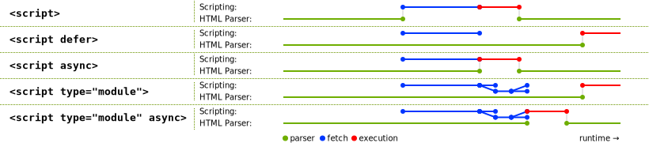
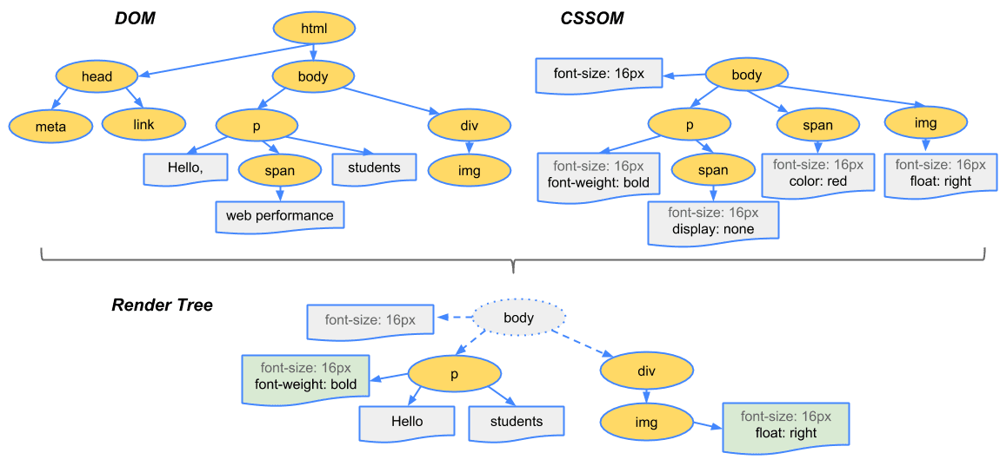

# Critical Rendering Path

Learn how browsers convert HTML, CSS, and JavaScript into pixels, understanding DOM construction, CSSOM building, layout calculations, and paint operations for optimal web performance.

## Table of Contents

## Introduction: What is the Critical Rendering Path?

The Critical Rendering Path is the browser's process of converting HTML, CSS, and JavaScript into a visual representation. This process involves multiple stages where the browser constructs data structures, calculates styles, determines layout, and finally paints pixels to the screen.

| Metric                          | What CRP Stage Influences It Most    | What Causes Blocking              |
| ------------------------------- | ------------------------------------ | --------------------------------- |
| First Contentful Paint (FCP)    | HTML → DOM, CSS → CSSOM              | Render-blocking CSS               |
| Largest Contentful Paint (LCP)  | Layout → Paint                       | Heavy images, slow resource fetch |
| Interaction to Next Paint (INP) | Style-Calc, Layout, Paint, Composite | Long tasks, forced reflows        |
| Frame Budget (≈16 ms)           | Style → Layout → Paint → Composite   | Expensive paints, too many layers |

## The Six-Stage Rendering Pipeline

The modern CRP consists of six distinct stages. Each stage must complete before the next can begin, creating potential bottlenecks in the rendering process.

### 1. DOM Construction (Parsing HTML)

The browser begins by parsing the raw HTML bytes it receives from the network. This process involves:

- **Conversion**: Translating bytes into characters using the specified encoding (e.g., UTF-8).
- **Tokenizing**: Breaking the character stream into tokens (e.g., `<html>`, `<body>`, text nodes) as per the HTML5 standard.
- **Lexing**: Converting tokens into nodes with properties and rules.
- **DOM Tree Construction**: Linking nodes into a tree structure that represents the document's structure and parent-child relationships.

**Incremental Parsing:** The browser does not wait for the entire HTML document to download before starting to build the DOM. It parses and builds incrementally, which allows it to discover resources (like CSS and JS) early and start fetching them sooner.

```html
<!doctype html>
<html>
  <head>
    <meta name="viewport" content="width=device-width,initial-scale=1" />
    <link href="style.css" rel="stylesheet" />
    <title>Critical Path</title>
  </head>
  <body>
    <p>Hello <span>web performance</span> students!</p>
    <div></div>
  </body>
</html>
```


### 2. CSSOM Construction (Parsing CSS)

As the browser encounters `<link rel="stylesheet">` or `<style>` tags, it fetches and parses CSS into the CSS Object Model (CSSOM):

- **CSSOM**: A tree of all CSS selectors and their computed properties.
- **Cascading**: Later CSS rules can override earlier ones, so the browser must have the complete picture before rendering.
- **NOT Parser-Blocking**: CSS is not parser-blocking—the HTML parser continues to process the document while CSS is being fetched.
- **Render-Blocking**: CSS is render-blocking by default. The browser must download and parse all CSS before it can safely render any content. This prevents Flash of Unstyled Content (FOUC) and ensures correct cascading.
- **JS-Blocking**: If a `<script>` tag is encountered that needs to access computed styles (e.g., via `getComputedStyle()`), the browser must wait for all CSS to be loaded and parsed before executing that script. This is because the script may depend on the final computed styles, which are only available after the CSSOM is complete.

**Example**: If a script tries to read an element's color or size, the browser must ensure all CSS is applied before running the script, otherwise the script could get incorrect or incomplete style information.

**Summary**: CSS blocks rendering and can block JS execution, but does not block the HTML parser itself.

**Sample CSS:**

```css
body {
  font-size: 16px;
}
p {
  font-weight: bold;
}
span {
  color: red;
}
p span {
  display: none;
}
img {
  float: right;
}
```


**Non-Render-Blocking CSS:**

- Use the `media` attribute (e.g., `media="print"`) to load non-critical CSS without blocking rendering.
- Chrome 105+ supports `blocking=render` for explicit control.

---

### JavaScript Loading Modes: async, defer, and module

JavaScript can be loaded in several modes, each affecting how and when scripts are executed relative to HTML parsing and CSS loading.

#### 1. Parser-Blocking (Default)

- `<script src="main.js"></script>`
- **Blocks the HTML parser** until the script is downloaded and executed.
- **Order is preserved** for multiple scripts.
- **JS execution is also blocked on CSS** if the script may access computed styles (see above).

#### 2. Async

- `<script src="main.js" async></script>`
- **Does not block the HTML parser**; script is fetched in parallel.
- **Executes as soon as it is downloaded**, possibly before or after DOM is parsed.
- **Order is NOT preserved** for multiple async scripts.
- **Still blocked on CSS** if the script accesses computed styles.

#### 3. Defer

- `<script src="main.js" defer></script>`
- **Does not block the HTML parser**; script is fetched in parallel.
- **Executes after the DOM is fully parsed**, in the order they appear in the document.
- **Still blocked on CSS** if the script accesses computed styles.

#### 4. Module

- `<script type="module" src="main.js"></script>`
- **Deferred by default** (like `defer`).
- **Supports import/export syntax** and top-level await.
- **Executed after the DOM is parsed** and after all dependencies are loaded.
- **Order is not guaranteed** for multiple modules unless imported explicitly.



| Script Mode | Blocks Parser | Order Preserved | Executes After DOM | Blocks on CSS   | Notes                          |
| ----------- | ------------- | --------------- | ------------------ | --------------- | ------------------------------ |
| Default     | Yes           | Yes             | No                 | Yes (if needed) | Inline or external             |
| Async       | No            | No              | No                 | Yes (if needed) | Fastest, unordered             |
| Defer       | No            | Yes             | Yes                | Yes (if needed) | Best for scripts that need DOM |
| Module      | No            | No              | Yes                | Yes (if needed) | Supports imports               |

**Summary:**

- Use `defer` for scripts that depend on the DOM and should execute in order.
- Use `async` for independent scripts (e.g., analytics) that do not depend on DOM or other scripts.
- Use `type="module"` for modern, modular JavaScript.

---

### 3. Render Tree Construction

With the DOM and CSSOM ready, the browser combines them to create the Render Tree:

- **Render Tree**: Contains only visible nodes and their computed styles.
- **Excludes**: Non-visual nodes (like `<head>`, `<script>`, `<meta>`) and nodes with `display: none`.
- **Difference**: `display: none` removes nodes from the render tree; `visibility: hidden` keeps them in the tree but makes them invisible (they still occupy space).



### 4. Layout (Reflow)

The browser walks the Render Tree to calculate the exact size and position of each node:

- **Box Model**: Determines width, height, and coordinates for every element.
- **Triggers**: Any change affecting geometry (e.g., resizing, changing font size, adding/removing elements) can trigger a reflow.
- **Performance**: Layout is expensive, especially if triggered repeatedly (see Layout Thrashing below).

### 5. Paint (Rasterization)

With geometry calculated, the browser fills in the pixels for each node:

- **Painting**: Drawing text, colors, images, borders, etc., onto layers in memory.
- **Optimization**: Modern browsers only repaint invalidated regions, not the entire screen.
- **Output**: Bitmaps/textures representing different parts of the page.

### 6. Compositing (Layers)

Modern browsers paint certain elements onto separate layers, which are then composited together:

- **Compositor Thread**: Separate from the main thread, handles assembling layers into the final image.
- **Triggers for Layers**: CSS properties like `transform`, `opacity`, `will-change`, 3D transforms, `<video>`, `<canvas>`, `position: fixed/sticky`, and CSS filters.
- **Performance**: Animations using only `transform` and `opacity` can be handled entirely by the compositor, skipping layout and paint for smooth 60fps animations.

---

## Parallelism: The Preload Scanner

Modern browsers employ a preload scanner—a speculative, parallel HTML parser that discovers and fetches resources (images, scripts, styles) even while the main parser is blocked. This optimization is only effective if resources are declared in the initial HTML. Anti-patterns that defeat the preload scanner include:

- Loading critical images via CSS `background-image` (use `` with `src` instead).
- Dynamically injecting scripts with JavaScript.
- Fully client-side rendered markup (SPAs without SSR/SSG).
- Incorrect lazy-loading of above-the-fold images.
- Excessive inlining of large resources.

**Best Practice:** Declare all critical resources in the initial HTML. Use SSR/SSG for critical content, and `` for important images.

---

## Understanding Blocking in the CRP

### What Causes Render Blocking?

**CSS Render Blocking:**

CSS is render-blocking because the browser needs to know the final computed styles before it can paint any pixels. If CSS were not render-blocking, users might see:

1. **Flash of Unstyled Content (FOUC)**: Content appears briefly without styles applied
2. **Layout Shifts**: Elements changing position as styles load
3. **Incorrect Layout**: Elements positioned incorrectly due to missing style information

**JavaScript Parser Blocking:**

JavaScript can block HTML parsing because:

1. **DOM Access**: Scripts may need to access DOM elements that haven't been parsed yet
2. **Style Access**: Scripts may need to read computed styles that depend on CSS
3. **Order Dependencies**: Scripts may depend on the order of elements in the DOM

### Why Blocking Occurs

**CSS Blocking Rendering:**

```html
<head>
  <link rel="stylesheet" href="styles.css" />
  <!-- Browser must wait for CSS to load and parse before rendering -->
</head>
<body>
  <h1>This won't render until CSS is loaded</h1>
</body>
```

**JavaScript Blocking Parsing:**

```html
<head>
  <script src="app.js"></script>
  <!-- HTML parser stops here until script loads and executes -->
</head>
<body>
  <h1>This won't be parsed until script completes</h1>
</body>
```

**JavaScript Blocking on CSS:**

```html
<head>
  <link rel="stylesheet" href="styles.css" />
  <script>
    // This script must wait for CSS to load because it accesses styles
    const element = document.querySelector(".styled-element")
    const color = getComputedStyle(element).color
  </script>
</head>
```

### Layout Thrashing: Why It Happens

Layout thrashing occurs when JavaScript forces the browser to recalculate layout repeatedly:

```javascript
// This causes layout thrashing
const elements = document.querySelectorAll(".item")
for (let i = 0; i < elements.length; i++) {
  const width = elements[i].offsetWidth // Forces layout calculation
  elements[i].style.width = width * 2 + "px" // Changes layout
  // Next iteration will force another layout calculation
}
```

**Why it's expensive:**

- Each `offsetWidth` read forces the browser to calculate layout
- Layout calculations involve traversing the entire render tree
- Multiple layout calculations in a loop create exponential performance degradation

### Style Recalculation Bottlenecks

**Invalidation Scope Issues:**

```javascript
// Forces recalculation of entire document
document.body.classList.add("dark-theme")
```

**Why it's expensive:**

- Changing styles on high-level elements affects the entire document tree
- Browser must recalculate styles for all descendant elements
- Can cause massive performance hits on large documents

**Large CSS Selectors:**

```css
/* Expensive selector - requires more computation */
body div.container div.content div.article div.paragraph span.text {
  color: red;
}
```

**Why it's expensive:**

- Complex selectors require more computation during style calculation
- Browser must traverse more nodes to match the selector
- Performance impact increases with DOM size and selector complexity

---

## Network Protocols and Their Impact

The protocol used to deliver resources fundamentally impacts CRP:

- **HTTP/1.1**: Multiple TCP connections, limited parallelism, head-of-line blocking.
- **HTTP/2**: Multiplexing over a single TCP connection, but still subject to TCP head-of-line blocking.
- **HTTP/3 (QUIC)**: Multiplexing over UDP, eliminates head-of-line blocking, faster handshakes, resilient to network changes.

| Feature      | HTTP/1.1     | HTTP/2          | HTTP/3 (QUIC)     |
| ------------ | ------------ | --------------- | ----------------- |
| Connection   | Multiple TCP | Single TCP      | Single QUIC (UDP) |
| Multiplexing | No           | Yes             | Yes (Improved)    |
| HOL Blocking | Yes          | Yes (TCP-level) | No (per-stream)   |
| Handshake    | Slow         | Slow            | Fast (0-RTT)      |

## Understanding Browser Threading Model

### Main Thread Responsibilities

The main thread handles:

- **HTML Parsing**: Converting HTML into DOM
- **CSS Parsing**: Converting CSS into CSSOM
- **JavaScript Execution**: Running JavaScript code
- **Style Calculation**: Computing final styles
- **Layout**: Calculating element positions and sizes
- **Paint**: Drawing pixels to the screen

### Compositor Thread

The compositor thread handles:

- **Layer Assembly**: Combining painted layers into final image
- **Scrolling**: Smooth scrolling animations
- **Transform/Opacity Animations**: GPU-accelerated animations

### Why Threading Matters

**Main Thread Blocking:**

- Long JavaScript tasks block all rendering
- Heavy style calculations prevent layout and paint
- Layout thrashing forces repeated main thread work

**Compositor Thread Benefits:**

- Transform/opacity animations run on separate thread
- Scrolling remains smooth even with main thread work
- GPU acceleration for visual effects

---

## Diagnosing CRP with Chrome DevTools

### Performance Panel

- **Main thread**: Shows DOM construction, style calculation, layout, paint, and compositing.
- **Long purple blocks**: Indicate heavy style/layout work (often due to layout thrashing).
- **Green blocks**: Paint and compositing.

### Network Panel

- **Waterfall**: Visualizes resource dependencies and blocking.

### Lighthouse Panel

- **Eliminate render-blocking resources**: Lists CSS/JS files delaying First Contentful Paint.
- **Critical request chain**: Shows dependency graph for initial render.

### Layers Panel

- **Visualize compositor layers**: Diagnose layer explosions and compositing issues.

**Best Practice:** Always test under simulated mobile network and CPU conditions.

---

## Conclusions

Understanding the Critical Rendering Path is fundamental to web development. The key insights are:

- **CSS blocks rendering** because browsers need complete style information before painting
- **JavaScript blocks parsing** when it needs to access DOM or styles
- **Layout thrashing** occurs when JavaScript forces repeated layout calculations
- **The main thread** handles parsing, styling, layout, and painting sequentially
- **The compositor thread** handles GPU-accelerated animations and scrolling
- **Network protocols** affect how resources are delivered and can create bottlenecks
- **The preload scanner** helps parallelize resource discovery but only works with declarative resources

The CRP is not a simple linear process—it involves multiple threads, speculative parsing, and complex dependencies between resources. Understanding these relationships helps developers write more efficient code and avoid common performance pitfalls.

---

## References

- [MDN](https://developer.mozilla.org/en-US/docs/Web/Performance/Critical_rendering_path)
- [Understanding the critical path](https://web.dev/learn/performance/understanding-the-critical-path)
- [Optimizing Resource Loading](https://web.dev/learn/performance/optimize-resource-loading)
- [Optimizing the Critical Rendering Path](https://web.dev/articles/critical-rendering-path/optimizing-critical-rendering-path)
- [Constructing the Object Model](https://web.dev/articles/critical-rendering-path/constructing-the-object-model)
- [You Don't Need the DOM Ready Event](https://thanpol.as/javascript/you-dont-need-dom-ready)
- [HTML Spec - Blocking Attribute](https://html.spec.whatwg.org/multipage/urls-and-fetching.html#blocking-attributes)
- [HTML Living Standard](https://html.spec.whatwg.org/multipage/scripting.html)
- [Analysing CRP](https://web.dev/articles/critical-rendering-path/analyzing-crp?hl=en)

#### From ByteByteGo

- Downloaded from [Alex Xu](https://twitter.com/alexxubyte/status/1534201523713867777) Twitter post.


<iframe
  width='560'
  height='315'
  class='yt-embed'
  src='https://www.youtube.com/embed/25fkjIIk2_o?si=3cxf1u6rv_7UK_MU'
  title='YouTube video player'
  frameborder='0'
  allow='accelerometer; autoplay; clipboard-write; encrypted-media; gyroscope; picture-in-picture; web-share'
  referrerpolicy='strict-origin-when-cross-origin'
  allowfullscreen
></iframe>
