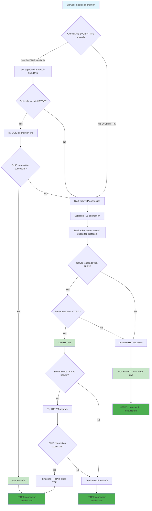
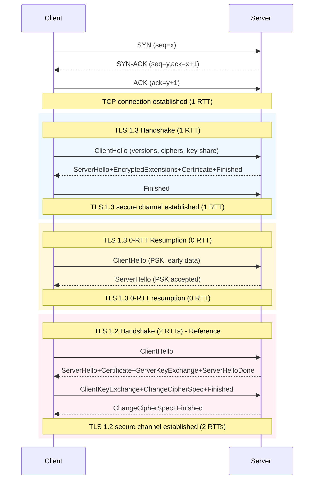
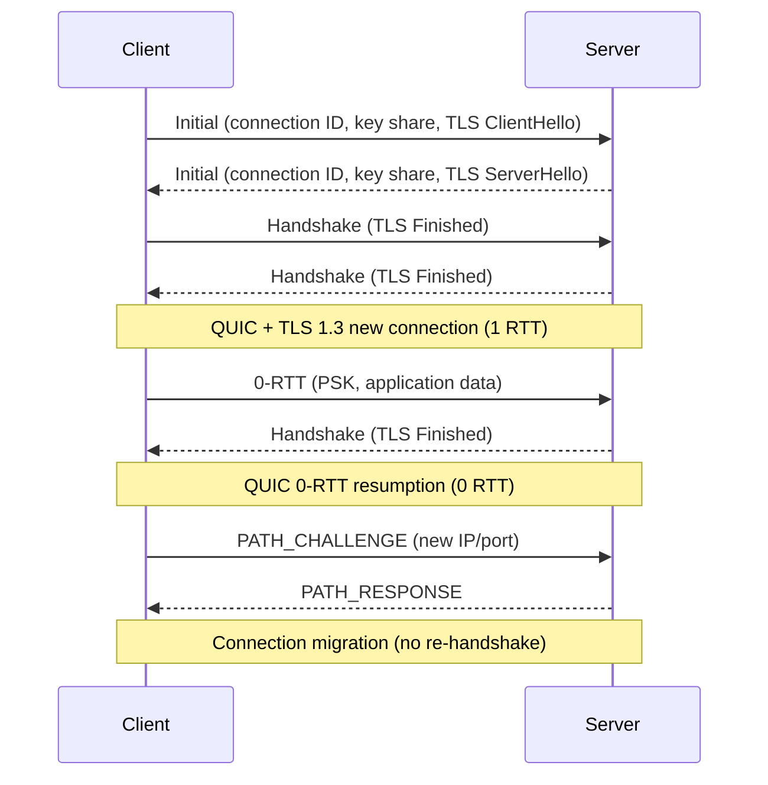
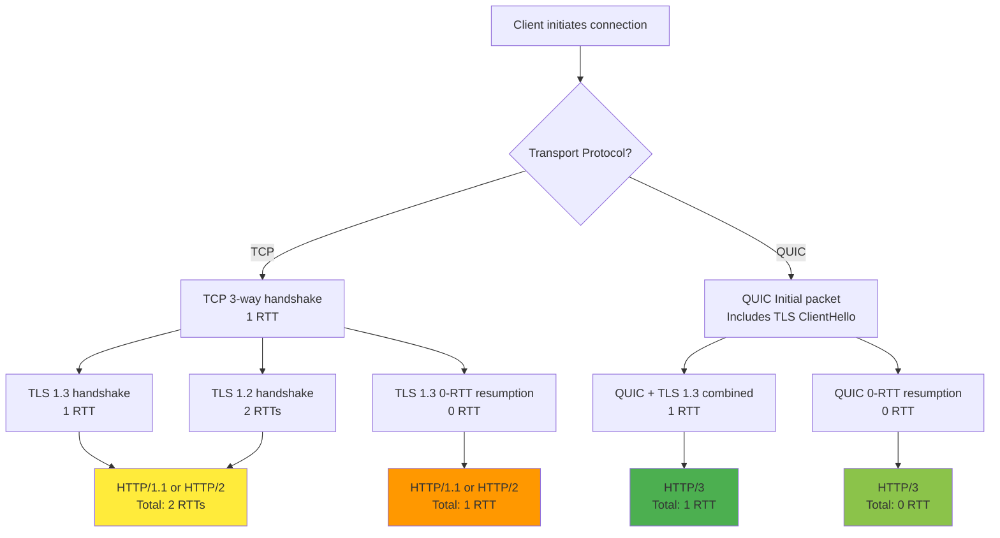
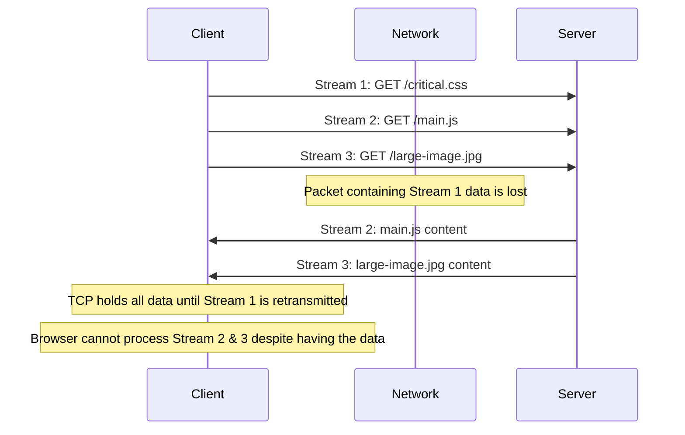
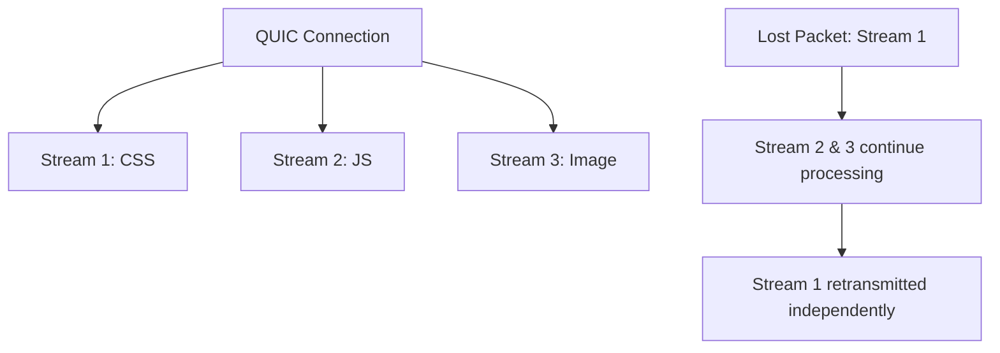
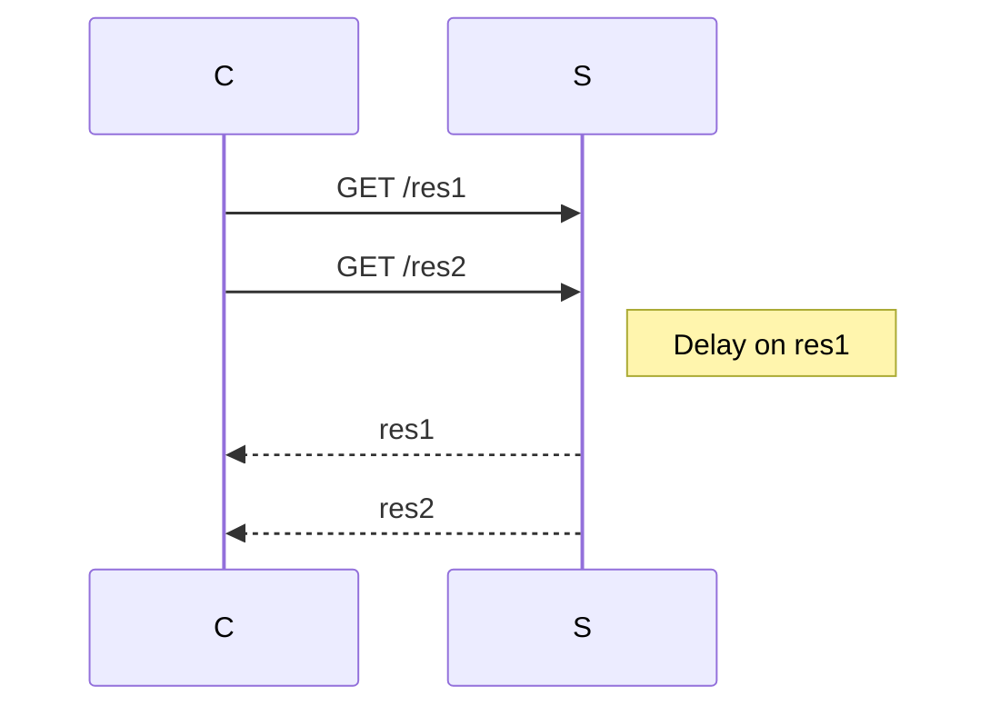
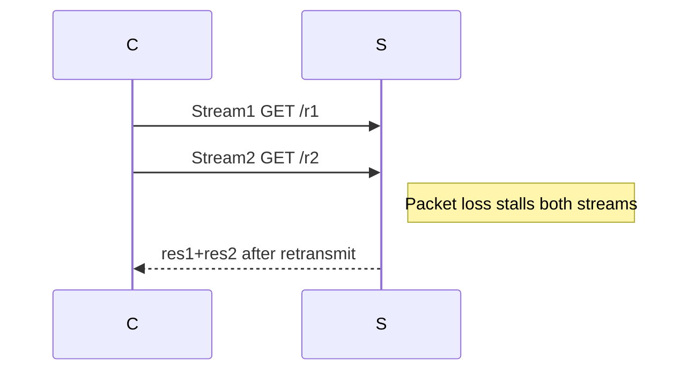

# HTTP Evolution: HTTP/1.1 to HTTP/3

Master HTTP protocol evolution from HTTP/1.1 through HTTP/2 to HTTP/3, understanding TLS handshakes, head-of-line blocking, and browser protocol selection algorithms.

## Table of Contents

- [1. Browser HTTP Version Selection Flow](#1-browser-http-version-selection-flow)
- [2. Unified TLS Connection Establishment: TCP vs QUIC](#2-unified-tls-connection-establishment-tcp-vs-quic)
- [3. Protocol Evolution and Architectural Foundations](#3-protocol-evolution-and-architectural-foundations)
- [4. HTTP/1.1: The Foundation and Its Inherent Bottlenecks](#4-http11-the-foundation-and-its-inherent-bottlenecks)
- [5. HTTP/2: Multiplexing and Its Transport-Layer Limitations](#5-http2-multiplexing-and-its-transport-layer-limitations)
- [6. HTTP/3: The QUIC Revolution](#6-http3-the-quic-revolution)
- [7. Head-of-Line Blocking Analysis](#7-head-of-line-blocking-analysis)
- [8. Protocol Negotiation and Upgrade Mechanisms](#8-protocol-negotiation-and-upgrade-mechanisms)
- [9. DNS-Based Protocol Discovery and Load Balancing](#9-dns-based-protocol-discovery-and-load-balancing)
- [10. Browser Protocol Negotiation Mechanisms](#10-browser-protocol-negotiation-mechanisms)
- [11. Performance Characteristics and Decision Factors](#11-performance-characteristics-and-decision-factors)
- [12. Security Implications and Network Visibility](#12-security-implications-and-network-visibility)
- [13. Strategic Implementation Considerations](#13-strategic-implementation-considerations)
- [14. Conclusion and Best Practices](#14-conclusion-and-best-practices)

## 1. Browser HTTP Version Selection Flow

Selecting the optimal HTTP and TLS versions—and leveraging DNS-based discovery—demands deep understanding of connection establishment costs, head-of-line blocking at application and transport layers, protocol negotiation mechanisms, and DNS service records. This document synthesizes the evolution, trade-offs, constraints, and benefits of each protocol version, comparison tables, mermaid diagrams, and a complete browser decision flow.



## 2. Unified TLS Connection Establishment: TCP vs QUIC

The establishment of secure connections varies significantly between TCP-based (HTTP/1.1, HTTP/2) and QUIC-based (HTTP/3) protocols. This section shows the unified view of how TLS is established over different transport layers.

### 2.1 TCP + TLS Connection Establishment



### 2.2 QUIC + TLS Connection Establishment



### 2.3 Unified Connection Establishment Comparison



**Trade-offs & Constraints**

- **TCP + TLS**: Reliable, ordered delivery but adds 1 RTT (TCP) + 1-2 RTTs (TLS)
- **QUIC + TLS**: Integrated transport and security, 1 RTT for new connections, 0 RTT for resumption
- **TLS 1.3**: Mandates forward secrecy, eliminates legacy algorithms, reduces handshake complexity
- **0-RTT**: Enables immediate data transmission but introduces replay attack risks

## 3. Protocol Evolution and Architectural Foundations

The evolution of HTTP from version 1.1 to 3 represents a systematic approach to solving performance bottlenecks at successive layers of the network stack. Each iteration addresses specific limitations while introducing new architectural paradigms that fundamentally change how browsers and servers communicate.

### 3.1 The Bottleneck Shifting Principle

A fundamental principle in protocol design is that solving a performance issue at one layer often reveals a new constraint at a lower layer. This is precisely what happened in the HTTP evolution:

1. **HTTP/1.1**: Application-layer Head-of-Line (HOL) blocking
2. **HTTP/2**: Transport-layer HOL blocking (TCP-level)
3. **HTTP/3**: Eliminates transport-layer blocking entirely

### 3.2 HTTP Protocol Versions Overview

| Version | Transport | Framing | Multiplexing     | Header Codec | Key Features                                                            |
| ------- | --------- | ------- | ---------------- | ------------ | ----------------------------------------------------------------------- |
| 0.9     | TCP       | Plain   | No               | N/A          | GET only; single resource per connection.                               |
| 1.0     | TCP       | Text    | No               | No           | Methods (GET,POST,HEAD); conditional keep-alive.                        |
| 1.1     | TCP       | Text    | Pipelining (HOL) | No           | Default persistent; chunked encoding.                                   |
| 2       | TCP       | Binary  | Yes (streams)    | HPACK        | Multiplexing; server push; header compression.                          |
| 3       | QUIC/UDP  | Binary  | Yes (streams)    | QPACK        | Zero HOL at transport; 0-RTT; connection migration; TLS 1.3 integrated. |

### 3.3 TLS Protocol Versions Overview

| Version | Handshake RTTs    | Key Exchange     | Ciphers & MAC        | Forward Secrecy | Notes                                                   |
| ------- | ----------------- | ---------------- | -------------------- | --------------- | ------------------------------------------------------- |
| TLS 1.0 | 2                 | RSA/DHE optional | CBC+HMAC-SHA1        | Optional        | Vulnerable to BEAST                                     |
| TLS 1.1 | 2                 | RSA/DHE          | CBC with explicit IV | Optional        | BEAST mitigations                                       |
| TLS 1.2 | 2                 | RSA/DHE/ECDHE    | AEAD (AES-GCM)       | Optional        | Widely supported; more cipher suite complexity          |
| TLS 1.3 | 1 (0-RTT resumes) | (EC)DHE only     | AEAD only            | Mandatory       | Reduced latency; PSK resumption; no insecure primitives |

**TLS 1.2 vs TLS 1.3**:

- **Handshake Cost**: 2 RTTs vs 1 RTT.
- **Security**: TLS 1.3 enforces forward secrecy and drops legacy weak ciphers.
- **Trade-off**: TLS 1.3 adoption requires updates; session resumption 0-RTT introduces replay risks.

## 4. HTTP/1.1: The Foundation and Its Inherent Bottlenecks

Standardized in 1997, HTTP/1.1 has been the workhorse of the web for decades. Its core mechanism is a text-based, sequential request-response protocol over TCP.

### 4.1 Architectural Limitations

**Head-of-Line Blocking at Application Layer**: The most significant architectural flaw is that a single TCP connection acts as a single-lane road. If a large resource (e.g., a 5MB image) is being transmitted, all subsequent requests for smaller resources (CSS, JS, small images) are blocked until the large transfer completes.

**Connection Overhead**: To circumvent HOL blocking, browsers open multiple parallel TCP connections (typically 6 per hostname). Each connection incurs:

- TCP 3-way handshake overhead
- TLS handshake overhead (for HTTPS)
- Slow-start algorithm penalties
- Memory and CPU overhead on both client and server

**Inefficient Resource Utilization**: Multiple connections often close before reaching maximum throughput, leaving substantial bandwidth unused.

### 4.2 Browser Workarounds

```javascript
// HTTP/1.1 era optimizations that browsers and developers used:
// 1. Domain sharding
const domains = ["cdn1.example.com", "cdn2.example.com", "cdn3.example.com"]

// 2. File concatenation
const megaBundle = css1 + css2 + css3 + js1 + js2 + js3

// 3. Image spriting
const spriteSheet = combineImages([icon1, icon2, icon3, icon4])

// 4. Connection pooling implementation
class HTTP11ConnectionPool {
  constructor(maxConnections = 6) {
    this.connections = new Map()
    this.maxConnections = maxConnections
  }

  async getConnection(hostname) {
    if (this.connections.has(hostname)) {
      const conn = this.connections.get(hostname)
      if (conn.isAvailable()) return conn
    }

    if (this.connections.size < this.maxConnections) {
      const conn = await this.createConnection(hostname)
      this.connections.set(hostname, conn)
      return conn
    }

    // Wait for available connection
    return this.waitForAvailableConnection()
  }
}
```

### 4.3 Protocol Negotiation in HTTP/1.1

HTTP/1.1 uses a simple, text-based negotiation mechanism:

```http
GET /index.html HTTP/1.1
Host: example.com
Connection: keep-alive
```

The server responds with its supported version and features:

```http
HTTP/1.1 200 OK
Connection: keep-alive
Content-Type: text/html
```

**Key Points**:

- Both HTTP/1.1 and HTTP/1.0 use compatible request formats
- The server's response indicates the version it supports
- Headers like "Connection: keep-alive" indicate available features
- No complex negotiation - the server simply responds with its capabilities

## 5. HTTP/2: Multiplexing and Its Transport-Layer Limitations

Finalized in 2015, HTTP/2 introduced a binary framing layer that fundamentally changed data exchange patterns.

### 5.1 Core Innovations

**Binary Framing Layer**: Replaces text-based messages with binary-encoded frames, enabling:

- **True Multiplexing**: Multiple request-response pairs can be interleaved over a single TCP connection
- **Header Compression (HPACK)**: Reduces protocol overhead through static and dynamic tables
- **Stream Prioritization**: Allows clients to signal relative importance of resources

**Server Push**: Enables proactive resource delivery, though implementation maturity has been inconsistent.

### 5.2 The TCP Bottleneck Emerges

While HTTP/2 solved application-layer HOL blocking, it exposed a more fundamental issue: **TCP-level Head-of-Line Blocking**.



**Technical Analysis of TCP HOL Blocking**

```javascript
// HTTP/2 frame structure showing the problem
const http2Frame = {
  length: 16384, // 16KB frame
  type: 0x0, // DATA frame
  flags: 0x1, // END_STREAM
  streamId: 1, // Stream identifier
  payload: "...", // Actual data
}

// When a packet is lost, TCP retransmission affects all streams
class TCPRetransmission {
  handlePacketLoss(lostPacket) {
    // TCP must retransmit before delivering subsequent packets
    // This blocks ALL HTTP/2 streams, not just the affected one
    this.retransmit(lostPacket)
    this.blockDeliveryUntilRetransmit()
  }
}

// HTTP/2 stream prioritization can't overcome TCP HOL
const streamPriorities = {
  critical: { weight: 256, dependency: 0 }, // CSS, JS
  important: { weight: 128, dependency: 0 }, // Images
  normal: { weight: 64, dependency: 0 }, // Analytics
}
```

**The Problem**: TCP guarantees in-order delivery. If a single packet is lost, all subsequent packets (even those containing data for different HTTP/2 streams) are held back until the lost packet is retransmitted and received.

### 5.3 HTTP/2 Upgrade Mechanism

Browsers have standardized on using HTTP/2 exclusively over TLS connections, leveraging the **ALPN (Application-Layer Protocol Negotiation)** extension.

#### TLS ALPN Negotiation Process

```javascript
// Browser initiates TLS connection with ALPN extension
const tlsConnection = {
  clientHello: {
    supportedProtocols: ["h2", "http/1.1"],
    alpnExtension: true,
  },
}

// Server responds with its preferred protocol
const serverResponse = {
  serverHello: {
    selectedProtocol: "h2", // Server chooses HTTP/2
    alpnExtension: true,
  },
}
```

#### HTTP Upgrade Mechanism (Theoretical)

While browsers don't use it, HTTP/2 does support plaintext connections via the HTTP Upgrade mechanism:

```http
GET /index.html HTTP/1.1
Host: example.com
Connection: Upgrade, HTTP2-Settings
Upgrade: h2c
HTTP2-Settings: <base64url encoding of HTTP/2 SETTINGS payload>
```

**Server Response Options**:

```http
# Accepts upgrade
HTTP/1.1 101 Switching Protocols
Connection: Upgrade
Upgrade: h2c

# Rejects upgrade
HTTP/1.1 200 OK
Content-Type: text/html
# ... normal HTTP/1.1 response
```

**Key Points**:

- Browsers require TLS for HTTP/2 (no plaintext support)
- ALPN provides seamless protocol negotiation during TLS handshake
- HTTP Upgrade mechanism exists but is unused by browsers
- Server must support ALPN extension for HTTP/2 to work

## 6. HTTP/3: The QUIC Revolution

HTTP/3 represents a fundamental paradigm shift by abandoning TCP entirely in favor of QUIC (Quick UDP Internet Connections), a new transport protocol built on UDP.

### 6.1 QUIC Architecture: User-Space Transport

**Key Innovation**: QUIC implements transport logic in user space rather than the OS kernel, enabling:

- **Rapid Evolution**: New features can be deployed with browser/server updates
- **Protocol Ossification Resistance**: No dependency on network middlebox updates
- **Integrated Security**: TLS 1.3 is built into the transport layer

### 6.2 Core QUIC Mechanisms

#### Stream Independence



**Elimination of HOL Blocking**: Each QUIC stream is independent at the transport layer. Packet loss on one stream doesn't affect others.

```javascript
// QUIC stream structure and independence
class QUICStream {
  constructor(streamId, type) {
    this.streamId = streamId
    this.type = type // unidirectional or bidirectional
    this.state = "open"
    this.flowControl = new FlowControl()
  }

  sendData(data) {
    // Each stream has independent flow control and retransmission
    const packet = this.createPacket(data)
    this.sendPacket(packet)
  }

  handlePacketLoss(packet) {
    // Only this stream is affected, others continue
    this.retransmitPacket(packet)
    // Other streams remain unaffected
  }
}

// QUIC connection manages multiple independent streams
class QUICConnection {
  constructor() {
    this.streams = new Map()
    this.connectionId = this.generateConnectionId()
  }

  createStream(streamId) {
    const stream = new QUICStream(streamId)
    this.streams.set(streamId, stream)
    return stream
  }

  // Packet loss on one stream doesn't block others
  handlePacketLoss(streamId, packet) {
    const stream = this.streams.get(streamId)
    if (stream) {
      stream.handlePacketLoss(packet)
    }
    // Other streams continue processing normally
  }
}
```

#### Connection Migration

```javascript
// QUIC enables seamless connection migration
const quicConnection = {
  connectionId: "unique-cid-12345",
  migrateToNewPath: (newIP, newPort) => {
    // Connection persists across network changes
    // No re-handshake required
    return true
  },
}
```

**Session Continuity**: Connections persist across IP/port changes (e.g., WiFi to cellular), enabling uninterrupted sessions.

```javascript
// Detailed QUIC connection migration implementation
class QUICConnectionMigration {
  constructor() {
    this.connectionId = this.generateConnectionId()
    this.activePaths = new Map()
    this.preferredPath = null
  }

  // Handle network interface changes
  async migrateToNewPath(newIP, newPort) {
    const newPath = { ip: newIP, port: newPort }

    // Validate new path
    if (!this.isPathValid(newPath)) {
      throw new Error("Invalid path for migration")
    }

    // Send PATH_CHALLENGE to validate connectivity
    const challenge = await this.sendPathChallenge(newPath)

    if (challenge.successful) {
      // Update preferred path
      this.preferredPath = newPath
      this.activePaths.set(this.getPathKey(newPath), newPath)

      // Notify all streams of path change
      this.notifyStreamsOfMigration(newPath)

      return true
    }

    return false
  }

  // Streams continue operating during migration
  notifyStreamsOfMigration(newPath) {
    this.streams.forEach((stream) => {
      stream.updatePath(newPath)
      // No interruption to data flow
    })
  }
}

// Example: WiFi to cellular handover
const migrationExample = {
  scenario: "User moves from WiFi to cellular",
  steps: [
    "1. QUIC detects network interface change",
    "2. Sends PATH_CHALLENGE to new IP/port",
    "3. Validates connectivity on new path",
    "4. Updates preferred path without re-handshake",
    "5. All streams continue seamlessly",
  ],
}
```

#### Advanced Handshakes

- **1-RTT Handshake**: Combined transport and cryptographic setup
- **0-RTT Resumption**: Immediate data transmission for returning visitors

```javascript
// QUIC handshake implementation
class QUICHandshake {
  constructor() {
    this.state = "initial"
    this.psk = null // Pre-shared key for 0-RTT
  }

  // 1-RTT handshake for new connections
  async perform1RTTHandshake() {
    // Client sends Initial packet with key share
    const initialPacket = {
      type: "initial",
      connectionId: this.generateConnectionId(),
      token: null,
      length: 1200,
      packetNumber: 0,
      keyShare: this.generateKeyShare(),
      supportedVersions: ["0x00000001"], // QUIC v1
    }

    // Server responds with handshake packet
    const handshakePacket = {
      type: "handshake",
      connectionId: this.connectionId,
      keyShare: this.serverKeyShare,
      certificate: this.certificate,
      finished: this.calculateFinished(),
    }

    // Connection established in 1 RTT
    this.state = "connected"
    return true
  }

  // 0-RTT resumption for returning clients
  async perform0RTTHandshake() {
    if (!this.psk) {
      throw new Error("No PSK available for 0-RTT")
    }

    // Client can send data immediately
    const zeroRTTPacket = {
      type: "0-rtt",
      connectionId: this.connectionId,
      data: this.applicationData, // Can include HTTP requests
      psk: this.psk,
    }

    // Server validates PSK and processes data
    this.state = "connected"
    return true
  }
}

// Performance comparison
const handshakeComparison = {
  "TCP+TLS1.2": { rtts: 3, latency: "high" },
  "TCP+TLS1.3": { rtts: 2, latency: "medium" },
  "QUIC+TLS1.3": { rtts: 1, latency: "low" },
  "QUIC+0RTT": { rtts: 0, latency: "minimal" },
}
```

### 6.3 Congestion Control Evolution

QUIC's user-space implementation enables pluggable congestion control algorithms:

```javascript
// CUBIC vs BBR performance characteristics
const congestionControl = {
  CUBIC: {
    type: "loss-based",
    behavior: "aggressive increase, drastic reduction on loss",
    bestFor: "stable, wired networks",
  },
  BBR: {
    type: "model-based",
    behavior: "probes network, maintains optimal pacing",
    bestFor: "lossy networks, mobile connections",
  },
}
```

```javascript
// Pluggable congestion control implementation
class QUICCongestionControl {
  constructor(algorithm = "cubic") {
    this.algorithm = this.createAlgorithm(algorithm)
    this.cwnd = 10 // Initial congestion window
    this.ssthresh = 65535 // Slow start threshold
  }

  createAlgorithm(type) {
    switch (type) {
      case "cubic":
        return new CUBICAlgorithm()
      case "bbr":
        return new BBRAlgorithm()
      case "newreno":
        return new NewRenoAlgorithm()
      default:
        return new CUBICAlgorithm()
    }
  }

  onPacketAcked(packet) {
    this.algorithm.onAck(packet)
    this.updateWindow()
  }

  onPacketLost(packet) {
    this.algorithm.onLoss(packet)
    this.updateWindow()
  }
}

// CUBIC implementation
class CUBICAlgorithm {
  constructor() {
    this.Wmax = 0 // Maximum window size before loss
    this.K = 0 // Time to reach Wmax
    this.t = 0 // Time since last congestion event
  }

  onAck(packet) {
    this.t += packet.rtt
    const Wcubic = this.calculateCubicWindow()
    this.cwnd = Math.min(Wcubic, this.ssthresh)
  }

  onLoss(packet) {
    this.Wmax = this.cwnd
    this.K = Math.cbrt((this.Wmax * 0.3) / 0.4) // CUBIC constant
    this.t = 0
    this.cwnd = this.Wmax * 0.7 // Multiplicative decrease
  }

  calculateCubicWindow() {
    return 0.4 * Math.pow(this.t - this.K, 3) + this.Wmax
  }
}

// BBR implementation
class BBRAlgorithm {
  constructor() {
    this.bw = 0 // Estimated bottleneck bandwidth
    this.rtt = 0 // Minimum RTT
    this.btlbw = 0 // Bottleneck bandwidth
    this.rtprop = 0 // Round-trip propagation time
  }

  onAck(packet) {
    this.updateBandwidth(packet)
    this.updateRTT(packet)
    this.updateWindow()
  }

  updateBandwidth(packet) {
    const deliveryRate = packet.delivered / packet.deliveryTime
    this.bw = Math.max(this.bw, deliveryRate)
  }

  updateRTT(packet) {
    if (packet.rtt < this.rtt || this.rtt === 0) {
      this.rtt = packet.rtt
    }
  }

  updateWindow() {
    // BBR uses bandwidth-delay product
    this.cwnd = this.bw * this.rtt
  }
}
```

## 7. Head-of-Line Blocking Analysis



- **HTTP/1.1 Pipelining**: second request cannot complete until the first's response arrives.

### 5.2 Transport-Layer



- **HTTP/2**: multiplexed on TCP; a lost packet blocks all streams.
- **HTTP/3**: multiplexed on QUIC; per-stream reliability avoids TCP HOL.

## 6. Protocol Negotiation and Upgrade

### 6.1 ALPN (TLS Extension)

- Negotiates "h3", "h2", "http/1.1" within TLS ClientHello/ServerHello.
- **Benefit**: no extra RTT.
- **Constraint**: only for HTTPS.

### 6.2 HTTP/1.1 Upgrade Header (h2c)

```http
GET / HTTP/1.1
Host: example.com
Connection: Upgrade
Upgrade: h2c
```

- **Benefit**: clear-text HTTP/2 negotiation.
- **Limitation**: extra handshake; rarely used.

## 7. DNS-Based Protocol Discovery and Load Balancing

### 7.1 SVCB/HTTPS Service Records

```txt
example.com. 3600 IN HTTPS 1 svc1.example.net. (
  "alpn=h2,h3"
  "port=8443"
  "ipv4hint=192.0.2.1,192.0.2.2"
  "echconfig=..."
)
```

- **Benefits**: advertise ALPN, port, ECH config, multiple endpoints.
- **Constraints**: requires DNS server/client support; operational complexity.

### 7.2 DNS Load Balancing Strategies

- **Round-Robin/Weighted**: simple distribution; limited health awareness.
- **GeoDNS/Latency-Based**: client-centric; higher complexity.
- **Health-Aware with Low TTL**: rapid failover; increased DNS load.
- **Integration with SVCB**: combine protocol discovery and endpoint prioritization.

## 8. Protocol Negotiation and Upgrade Mechanisms

### 8.1 ALPN (Application-Layer Protocol Negotiation)

ALPN enables seamless protocol negotiation during the TLS handshake without additional round trips:

```javascript
// TLS handshake with ALPN extension
const tlsHandshake = {
  clientHello: {
    supportedProtocols: ["h2", "http/1.1"],
    alpnExtension: true,
  },
  serverHello: {
    selectedProtocol: "h2", // Server chooses HTTP/2
    alpnExtension: true,
  },
}
```

**Benefits**: No extra RTT, seamless protocol selection
**Constraints**: Only works for HTTPS connections

### 8.2 HTTP/1.1 Upgrade Mechanism (h2c)

For clear-text HTTP/2 connections (rarely used by browsers):

```http
GET / HTTP/1.1
Host: example.com
Connection: Upgrade
Upgrade: h2c
HTTP2-Settings: <base64url encoding of HTTP/2 SETTINGS payload>
```

**Server Response Options**:

```http
# Accepts upgrade
HTTP/1.1 101 Switching Protocols
Connection: Upgrade
Upgrade: h2c

# Rejects upgrade
HTTP/1.1 200 OK
Content-Type: text/html
# ... normal HTTP/1.1 response
```

### 8.3 Alt-Svc Header for HTTP/3 Upgrade

HTTP/3 uses server-initiated upgrade through HTTP headers:

```http
# HTTP/1.1 response with Alt-Svc header
HTTP/1.1 200 OK
Content-Type: text/html
Alt-Svc: h3=":443"; ma=86400

# HTTP/2 response with ALTSVC frame
HTTP/2 200 OK
ALTSVC: h3=":443"; ma=86400
```

**Upgrade Process**:

```javascript
// Browser protocol upgrade logic
const upgradeToHTTP3 = async (altSvcHeader) => {
  const quicConfig = parseAltSvc(altSvcHeader)

  try {
    // Attempt QUIC connection to same hostname
    const quicConnection = await establishQUIC(quicConfig.host, quicConfig.port)

    if (quicConnection.successful) {
      // Close TCP connection, use QUIC
      closeTCPConnection()
      return "HTTP/3"
    }
  } catch (error) {
    // Fallback to existing TCP connection
    console.log("QUIC connection failed, continuing with TCP")
  }

  return "HTTP/2" // or HTTP/1.1
}
```

## 9. Protocol Evolution and Architectural Foundations

The evolution of HTTP from version 1.1 to 3 represents a systematic approach to solving performance bottlenecks at successive layers of the network stack. Each iteration addresses specific limitations while introducing new architectural paradigms that fundamentally change how browsers and servers communicate.

### The Bottleneck Shifting Principle

A fundamental principle in protocol design is that solving a performance issue at one layer often reveals a new constraint at a lower layer. This is precisely what happened in the HTTP evolution:

1. **HTTP/1.1**: Application-layer Head-of-Line (HOL) blocking
2. **HTTP/2**: Transport-layer HOL blocking (TCP-level)
3. **HTTP/3**: Eliminates transport-layer blocking entirely

## 10. Browser Protocol Negotiation Mechanisms

Browsers employ sophisticated mechanisms to determine the optimal HTTP version for each connection.

### 1. DNS-Based Protocol Discovery (SVCB/HTTPS Records)

```bash
; Modern DNS records for protocol negotiation
example.com. 3600 IN HTTPS 1 . alpn="h3,h2" port=443
example.com. 3600 IN SVCB 1 . alpn="h3,h2" port=443
```

**Benefits**:

- Eliminates initial TCP connection for HTTP/3-capable servers
- Reduces connection establishment latency
- Enables parallel connection attempts

#### DNS Load Balancing Considerations

When using multiple CDNs or load balancers, DNS responses might come from different sources:

```bash
; A record from CDN A
example.com. 300 IN A 192.0.2.1

; HTTPS record from CDN B
example.com. 3600 IN HTTPS 1 . alpn="h3,h2"
```

**Problem**: If the HTTPS record advertises HTTP/3 support but the client connects to a CDN that doesn't support it, the connection will fail.

**Solution**: Include IP hints in the HTTPS record:

```bash
example.com. 3600 IN HTTPS 1 . alpn="h3,h2" ipv4hint="192.0.2.1" ipv6hint="2001:db8::1"
```

```javascript
// DNS resolver implementation for SVCB/HTTPS records
class DNSResolver {
  constructor() {
    this.cache = new Map()
    this.resolvers = ["8.8.8.8", "1.1.1.1"]
  }

  async resolveHTTPS(domain) {
    const cacheKey = `https:${domain}`
    if (this.cache.has(cacheKey)) {
      return this.cache.get(cacheKey)
    }

    const response = await this.queryDNS(domain, "HTTPS")
    const parsed = this.parseHTTPSRecord(response)

    this.cache.set(cacheKey, parsed)
    return parsed
  }

  parseHTTPSRecord(record) {
    return {
      priority: record.priority,
      target: record.target,
      alpn: this.parseALPN(record.alpn),
      port: record.port || 443,
      ipv4hint: record.ipv4hint?.split(","),
      ipv6hint: record.ipv6hint?.split(","),
      echconfig: record.echconfig,
    }
  }

  parseALPN(alpnString) {
    return alpnString?.split(",") || []
  }

  // Validate that advertised protocols match endpoint capabilities
  async validateEndpoint(domain, ip, protocols) {
    try {
      const connection = await this.testConnection(ip, protocols)
      return connection.successful
    } catch (error) {
      console.warn(`Endpoint validation failed for ${ip}:`, error)
      return false
    }
  }
}

// Load balancing with protocol awareness
class ProtocolAwareLoadBalancer {
  constructor() {
    this.endpoints = new Map()
    this.dnsResolver = new DNSResolver()
  }

  async selectEndpoint(domain, clientIP) {
    // Get HTTPS record
    const httpsRecord = await this.dnsResolver.resolveHTTPS(domain)

    // Filter endpoints by protocol support
    const compatibleEndpoints =
      this.endpoints.get(domain)?.filter((ep) => ep.supportsProtocols.some((p) => httpsRecord.alpn.includes(p))) || []

    // Apply load balancing logic
    return this.balanceLoad(compatibleEndpoints, clientIP)
  }

  balanceLoad(endpoints, clientIP) {
    // Geographic load balancing
    const geoEndpoint = this.findClosestEndpoint(endpoints, clientIP)

    // Health check
    if (geoEndpoint.isHealthy()) {
      return geoEndpoint
    }

    // Fallback to next best endpoint
    return this.findNextBestEndpoint(endpoints, geoEndpoint)
  }
}
```

#### Alternative Service Endpoints

SVCB and HTTPS records can also define alternative endpoints:

```bash
; Primary endpoint with HTTP/3 support
example.com. 3600 IN HTTPS 1 example.net alpn="h3,h2"

; Fallback endpoint with HTTP/2 only
example.com. 3600 IN HTTPS 2 example.org alpn="h2"
```

### 2. TLS ALPN (Application-Layer Protocol Negotiation)

```javascript
// TLS handshake with ALPN extension
const tlsHandshake = {
  clientHello: {
    supportedProtocols: ["h2", "http/1.1"],
    alpnExtension: true,
  },
  serverHello: {
    selectedProtocol: "h2", // Server chooses HTTP/2
    alpnExtension: true,
  },
}
```

**Fallback Mechanism**: If ALPN is unavailable, browsers assume HTTP/1.1 support.

### 3. Alt-Svc Header for HTTP/3 Upgrade

```http
HTTP/2 200 OK
Alt-Svc: h3=":443"; ma=86400
```

**Server-Initiated Upgrade**: Servers advertise HTTP/3 availability, allowing browsers to attempt QUIC connections.

### HTTP/3 Upgrade Mechanism

HTTP/3 uses a fundamentally different transport protocol (QUIC over UDP), making inline upgrades impossible. The upgrade process is server-initiated and requires multiple steps.

#### Initial TCP Connection

Since browsers can't know a priori if a server supports QUIC, they must establish an initial TCP connection:

```javascript
// Browser always starts with TCP + TLS
const initialConnection = {
  transport: "TCP",
  protocol: "TLS 1.3",
  alpn: ["h2", "http/1.1"], // Note: no h3 in initial ALPN
  purpose: "discover HTTP/3 support",
}
```

#### Server-Initiated HTTP/3 Advertisement

The server advertises HTTP/3 support through HTTP headers:

```http
# HTTP/1.1 response with Alt-Svc header
HTTP/1.1 200 OK
Content-Type: text/html
Alt-Svc: h3=":443"; ma=86400

# HTTP/2 response with ALTSVC frame
HTTP/2 200 OK
ALTSVC: h3=":443"; ma=86400
```

#### Browser QUIC Connection Attempt

Upon receiving the Alt-Svc header, the browser attempts a QUIC connection:

```javascript
// Browser protocol upgrade logic
const upgradeToHTTP3 = async (altSvcHeader) => {
  const quicConfig = parseAltSvc(altSvcHeader)

  try {
    // Attempt QUIC connection to same hostname
    const quicConnection = await establishQUIC(quicConfig.host, quicConfig.port)

    if (quicConnection.successful) {
      // Close TCP connection, use QUIC
      closeTCPConnection()
      return "HTTP/3"
    }
  } catch (error) {
    // Fallback to existing TCP connection
    console.log("QUIC connection failed, continuing with TCP")
  }

  return "HTTP/2" // or HTTP/1.1
}
```

#### DNS-Based HTTP/3 Discovery

Modern browsers can discover HTTP/3 support through DNS records, eliminating the need for initial TCP connections:

```bash
; SVCB record for HTTP/3 discovery
example.com. 3600 IN SVCB 1 . alpn="h3,h2" port=443

; HTTPS record (alternative format)
example.com. 3600 IN HTTPS 1 . alpn="h3,h2" port=443
```

**Key Points**:

- HTTP/3 upgrade is server-initiated, not client-initiated
- Requires initial TCP connection for discovery (unless DNS records are used)
- Alt-Svc header or ALTSVC frame advertises QUIC support
- Browser attempts QUIC connection and falls back to TCP if it fails
- DNS-based discovery can eliminate the initial TCP connection requirement

## 11. Performance Characteristics and Decision Factors

### Quantitative Performance Analysis

**Latency Improvements**:

- **HTTP/2 vs HTTP/1.1**: 200-400ms improvement for typical web pages
- **HTTP/3 vs HTTP/2**: 200-1200ms improvement, scaling with network latency
- **0-RTT Resumption**: Additional 100-300ms improvement for returning visitors

**Throughput Characteristics**:

```javascript
const performanceProfile = {
  "stable-broadband": {
    http1: "baseline",
    http2: "significant improvement",
    http3: "minimal additional benefit",
  },
  "mobile-lossy": {
    http1: "baseline",
    http2: "moderate improvement",
    http3: "dramatic improvement",
  },
  "high-latency": {
    http1: "baseline",
    http2: "good improvement",
    http3: "excellent improvement",
  },
}
```

### Browser Decision Logic

```javascript
// Comprehensive browser protocol selection logic
class ProtocolSelector {
  constructor() {
    this.dnsResolver = new DNSResolver()
    this.connectionManager = new ConnectionManager()
    this.protocolCache = new Map()
  }

  async selectProtocol(hostname) {
    const cacheKey = `protocol:${hostname}`
    if (this.protocolCache.has(cacheKey)) {
      return this.protocolCache.get(cacheKey)
    }

    // 1. Check DNS SVCB/HTTPS records
    const dnsInfo = await this.dnsResolver.resolveHTTPS(hostname)
    if (dnsInfo && dnsInfo.alpn.includes("h3")) {
      const quicSuccess = await this.tryQUIC(hostname, dnsInfo)
      if (quicSuccess) {
        this.protocolCache.set(cacheKey, "HTTP/3")
        return "HTTP/3"
      }
    }

    // 2. Fallback to TCP + TLS ALPN
    const tlsInfo = await this.establishTLS(hostname)
    if (tlsInfo.supportsHTTP2) {
      // 3. Check for Alt-Svc upgrade
      const altSvc = await this.checkAltSvc(hostname)
      if (altSvc && (await this.tryQUIC(hostname))) {
        this.protocolCache.set(cacheKey, "HTTP/3")
        return "HTTP/3"
      }
      this.protocolCache.set(cacheKey, "HTTP/2")
      return "HTTP/2"
    }

    this.protocolCache.set(cacheKey, "HTTP/1.1")
    return "HTTP/1.1"
  }

  async tryQUIC(hostname, dnsInfo = null) {
    const config = {
      hostname,
      port: dnsInfo?.port || 443,
      timeout: 5000,
      retries: 2,
    }

    for (let attempt = 0; attempt < config.retries; attempt++) {
      try {
        const connection = await this.connectionManager.createQUICConnection(config)
        if (connection.isEstablished()) {
          return true
        }
      } catch (error) {
        console.warn(`QUIC attempt ${attempt + 1} failed:`, error)
      }
    }
    return false
  }

  async establishTLS(hostname) {
    const tlsConfig = {
      hostname,
      port: 443,
      alpn: ["h2", "http/1.1"],
      timeout: 10000,
    }

    const connection = await this.connectionManager.createTLSConnection(tlsConfig)
    return {
      supportsHTTP2: connection.negotiatedProtocol === "h2",
      supportsHTTP11: connection.negotiatedProtocol === "http/1.1",
    }
  }

  async checkAltSvc(hostname) {
    // Make initial request to check for Alt-Svc header
    const response = await this.connectionManager.makeRequest(hostname, "/")
    return response.headers["alt-svc"]
  }
}

// Connection manager for different protocols
class ConnectionManager {
  constructor() {
    this.activeConnections = new Map()
  }

  async createQUICConnection(config) {
    const connection = new QUICConnection(config)
    await connection.handshake()
    this.activeConnections.set(config.hostname, connection)
    return connection
  }

  async createTLSConnection(config) {
    const connection = new TLSConnection(config)
    await connection.handshake()
    this.activeConnections.set(config.hostname, connection)
    return connection
  }

  async makeRequest(hostname, path) {
    const connection = this.activeConnections.get(hostname)
    if (!connection) {
      throw new Error("No active connection")
    }
    return connection.request(path)
  }
}
```

## 12. Security Implications and Network Visibility

### The Encryption Paradigm Shift

HTTP/3's pervasive encryption challenges traditional network security models:

```javascript
// Traditional network inspection vs HTTP/3
const securityModel = {
  traditional: {
    inspection: "deep packet inspection",
    visibility: "full protocol metadata",
    filtering: "SNI-based, header-based",
  },
  http3: {
    inspection: "endpoint-based only",
    visibility: "minimal transport metadata",
    filtering: "application-layer required",
  },
}
```

### 0-RTT Security Considerations

```javascript
// 0-RTT replay attack mitigation
const zeroRTTPolicy = {
  allowedMethods: ["GET", "HEAD", "OPTIONS"], // Idempotent only
  forbiddenMethods: ["POST", "PUT", "DELETE"],
  replayDetection: "application-level nonces required",
}
```

## 13. Strategic Implementation Considerations

### Server Support Matrix

| Server | HTTP/2     | HTTP/3      | Configuration Complexity |
| ------ | ---------- | ----------- | ------------------------ |
| Nginx  | ✅ Mature  | ✅ v1.25.0+ | 🔴 High (custom build)   |
| Caddy  | ✅ Default | ✅ Default  | 🟢 Minimal               |
| Apache | ✅ Mature  | ❌ None     | 🟡 CDN-dependent         |

### CDN Strategy

```javascript
// CDN-based HTTP/3 adoption
const cdnStrategy = {
  benefits: [
    "no server configuration required",
    "automatic protocol negotiation",
    "built-in security and optimization",
  ],
  considerations: [
    "reduced visibility into origin connection",
    "potential for suboptimal routing",
    "dependency on CDN provider capabilities",
  ],
}
```

### Performance Monitoring

```javascript
// Key metrics for protocol performance analysis
const performanceMetrics = {
  userCentric: ["LCP", "TTFB", "PLT", "CLS"],
  networkLevel: ["RTT", "packetLoss", "bandwidth"],
  serverSide: ["CPU utilization", "memory usage", "connection count"],
}
```

## 14. Conclusion and Best Practices

### Performance Optimization Strategies

**Reduce Handshake Overhead**:

- Deploy TLS 1.3 with 0-RTT resumption for returning visitors
- Adopt HTTP/3 when network conditions permit (especially for mobile/lossy networks)
- Implement session resumption with appropriate PSK management

**Mitigate HOL Blocking**:

- Leverage HTTP/2 or HTTP/3 multiplexing for concurrent resource loading
- Implement intelligent resource prioritization based on critical rendering path
- Use server push judiciously to preempt critical resources

**DNS and Protocol Discovery**:

- Publish DNS SVCB/HTTPS records to drive clients to optimal protocol versions
- Include IP hints in DNS records to ensure protocol-capable endpoints
- Implement intelligent DNS load balancing combining geographic, weighted, and health-aware strategies

### Security Considerations

```javascript
// 0-RTT security policy implementation
class ZeroRTTSecurityPolicy {
  constructor() {
    this.allowedMethods = ["GET", "HEAD", "OPTIONS"] // Idempotent only
    this.forbiddenMethods = ["POST", "PUT", "DELETE", "PATCH"]
    this.replayWindow = 60000 // 60 seconds
  }

  validate0RTTRequest(request) {
    // Only allow idempotent methods
    if (!this.allowedMethods.includes(request.method)) {
      return { allowed: false, reason: "Non-idempotent method" }
    }

    // Check replay window
    if (Date.now() - request.timestamp > this.replayWindow) {
      return { allowed: false, reason: "Replay window expired" }
    }

    // Validate nonce if present
    if (request.nonce && !this.validateNonce(request.nonce)) {
      return { allowed: false, reason: "Invalid nonce" }
    }

    return { allowed: true }
  }
}
```

### Monitoring and Observability

```javascript
// Protocol performance monitoring
class ProtocolMonitor {
  constructor() {
    this.metrics = {
      http1: new MetricsCollector(),
      http2: new MetricsCollector(),
      http3: new MetricsCollector(),
    }
  }

  recordConnection(protocol, metrics) {
    this.metrics[protocol].record({
      handshakeTime: metrics.handshakeTime,
      timeToFirstByte: metrics.ttfb,
      totalLoadTime: metrics.loadTime,
      packetLoss: metrics.packetLoss,
      connectionErrors: metrics.errors,
    })
  }

  generateReport() {
    return {
      http1: this.metrics.http1.getSummary(),
      http2: this.metrics.http2.getSummary(),
      http3: this.metrics.http3.getSummary(),
      recommendations: this.generateRecommendations(),
    }
  }

  generateRecommendations() {
    const recommendations = []

    if (this.metrics.http3.getAverage("handshakeTime") < this.metrics.http2.getAverage("handshakeTime") * 0.8) {
      recommendations.push("Consider enabling HTTP/3 for better performance")
    }

    if (this.metrics.http2.getAverage("packetLoss") > 0.01) {
      recommendations.push("High packet loss detected - HTTP/3 may provide better performance")
    }

    return recommendations
  }
}
```

### Implementation Checklist

**Server Configuration**:

- [ ] Enable TLS 1.3 with modern cipher suites
- [ ] Configure ALPN for HTTP/2 and HTTP/3
- [ ] Implement 0-RTT resumption with proper security policies
- [ ] Set up Alt-Svc headers for HTTP/3 advertisement
- [ ] Configure appropriate session ticket lifetimes

**DNS Configuration**:

- [ ] Publish SVCB/HTTPS records with ALPN information
- [ ] Include IP hints for protocol-capable endpoints
- [ ] Set up health-aware DNS load balancing
- [ ] Configure appropriate TTL values for failover scenarios

**Monitoring Setup**:

- [ ] Track protocol adoption rates and performance metrics
- [ ] Monitor connection establishment times and success rates
- [ ] Implement alerting for protocol-specific issues
- [ ] Set up A/B testing for protocol performance comparison

**Security Hardening**:

- [ ] Implement strict 0-RTT policies for non-idempotent requests
- [ ] Configure appropriate certificate transparency monitoring
- [ ] Set up HSTS with appropriate max-age values
- [ ] Implement certificate pinning where appropriate

### Continuous Benchmarking

Use tools like `wrk`, `openssl s_time`, and SSL Labs to verify latency, throughput, and security posture align with application requirements:

```bash
# Benchmark HTTP/2 vs HTTP/3 performance
wrk -t12 -c400 -d30s --latency https://example.com

# Test TLS handshake performance
openssl s_time -connect example.com:443 -new -time 30

# Verify security configuration
curl -s https://www.ssllabs.com/ssltest/analyze.html?d=example.com
```

## Conclusion

The browser's HTTP version selection process represents a sophisticated balance of performance optimization, security requirements, and network adaptability. Understanding this process is crucial for:

1. **Infrastructure Planning**: Choosing appropriate server configurations and CDN strategies
2. **Performance Optimization**: Implementing protocol-specific optimizations
3. **Security Architecture**: Adapting to the new encrypted transport paradigm
4. **Monitoring Strategy**: Developing appropriate observability for each protocol

The evolution from HTTP/1.1 to HTTP/3 demonstrates how protocol design must address both immediate performance bottlenecks and long-term architectural constraints. For expert engineers, this knowledge enables informed decisions about when and how to adopt new protocols based on specific use cases, user demographics, and technical capabilities.

## References

- [Speeding up HTTPS and HTTP/3 negotiation with... DNS](https://blog.cloudflare.com/speeding-up-https-and-http-3-negotiation-with-dns/)
- [How does browser know which version of HTTP it should use when sending a request?](https://superuser.com/questions/1659248/how-does-browser-know-which-version-of-http-it-should-use-when-sending-a-request)
- [How is the HTTP version of a browser request and the HTTP version of a server response determined?](https://superuser.com/questions/670889/how-is-the-http-version-of-a-browser-request-and-the-http-version-of-a-server-re)
- [Service binding and parameter specification via the DNS (DNS SVCB and HTTPS RRs)](https://datatracker.ietf.org/doc/html/draft-ietf-dnsop-svcb-https-12)
- [QUIC: A UDP-Based Multiplexed and Secure Transport](https://datatracker.ietf.org/doc/html/rfc9000)
- [HTTP/3](https://datatracker.ietf.org/doc/html/rfc9114)
