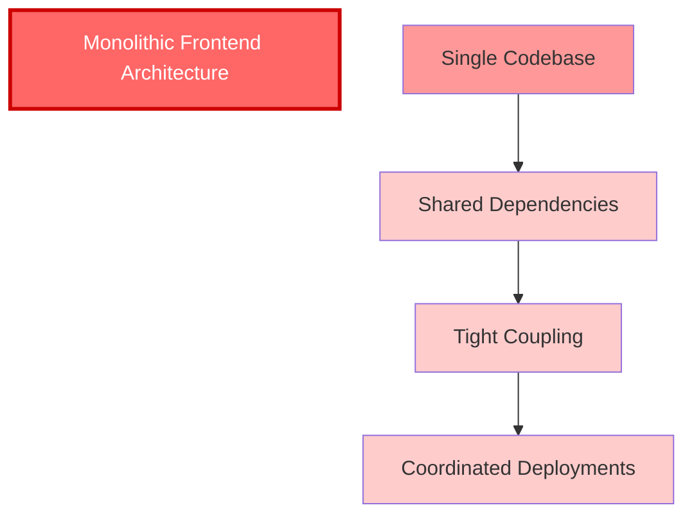
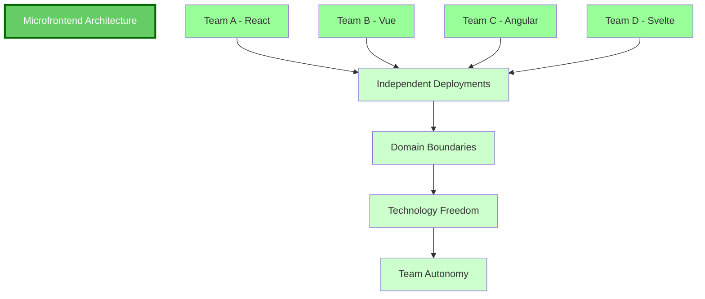
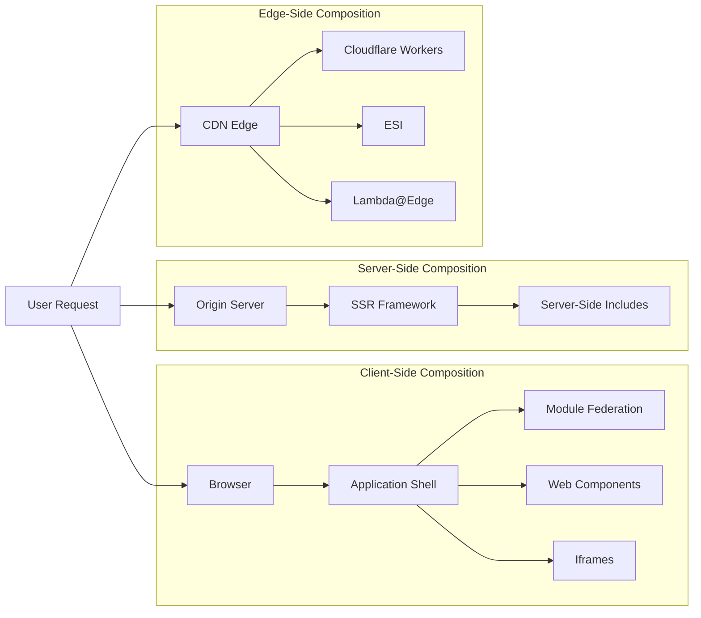
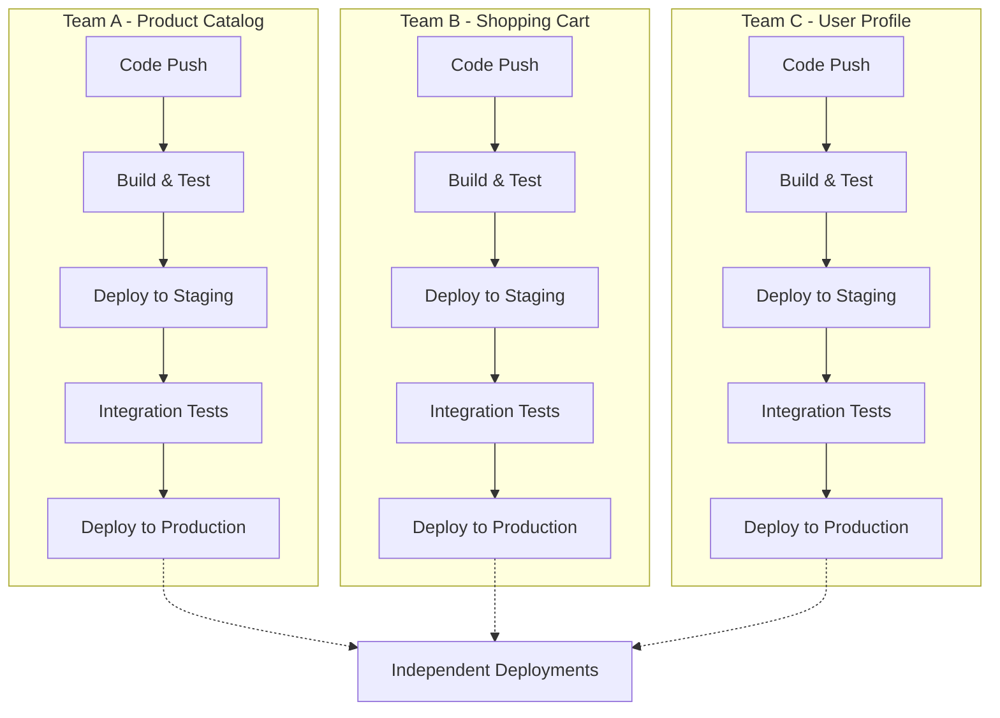
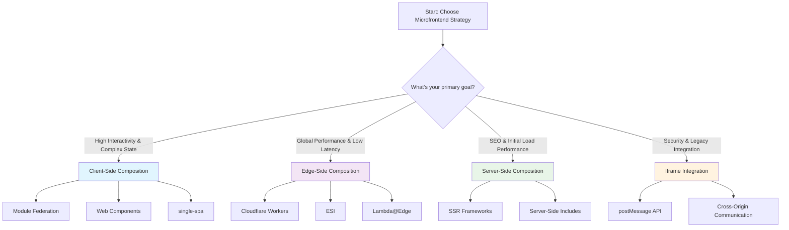

# Microfrontend Architecture: Composition Strategies, Deployment Patterns, and Enterprise Implementation

The microfrontend architectural style is far more than a trend; it is a strategic answer to a fundamental challenge in modern software development: how to scale frontend development without collapsing under the weight of a monolithic codebase. Inspired by the principles of microservices, this approach deconstructs a large frontend application into a composition of smaller, independently deliverable features.

For expert practitioners, the value proposition extends beyond mere code organization. It's about enabling organizational scaling through autonomous teams, facilitating independent deployment cadences, and enhancing the resilience of the entire system.

By aligning frontend modules with specific business domains, cross-functional teams can own their slice of the application end-to-end, fostering innovation and reducing development bottlenecks. This paradigm shift requires a deep understanding of not just the "what," but the "how"—specifically, the critical decisions around composition, deployment, and the management of cross-cutting concerns.

## Table of Contents

## Core Principles of Microfrontend Architecture

A successful microfrontend implementation is built on a foundation of core principles that ensure scalability and team independence.

### Technology Agnosticism

Each team should have the freedom to choose the technology stack best suited for their specific domain, without being constrained by the choices of other teams. Custom Elements are often used to create a neutral interface between these potentially disparate stacks.

### Isolate Team Code

To prevent the tight coupling that plagues monoliths, microfrontends should not share a runtime. Each should be built as an independent, self-contained application, avoiding reliance on shared state or global variables.

### Independent Deployments

A cornerstone of the architecture is the ability for each team to deploy their microfrontend independently. This decouples release cycles, accelerates feature delivery, and empowers teams with true ownership.

### Domain-Driven Boundaries

Microfrontends should be modeled around business domains, not technical layers. This ensures that teams are focused on delivering business value and that the boundaries between components are logical and clear.





## The Composition Conundrum: Where to Assemble the Puzzle?

The method by which independent microfrontends are stitched together into a cohesive user experience is known as composition. The location of this assembly process is a primary architectural decision, leading to three distinct models.

| Composition Strategy | Primary Location   | Key Technologies                                           | Ideal Use Case                                                                                                                                        |
| -------------------- | ------------------ | ---------------------------------------------------------- | ----------------------------------------------------------------------------------------------------------------------------------------------------- |
| **Client-Side**      | User's Browser     | Module Federation, iframes, Web Components, single-spa     | Highly interactive, complex Single-Page Applications (SPAs) where teams are familiar with the frontend ecosystem                                      |
| **Server-Side**      | Origin Server      | Server-Side Includes (SSI), SSR Frameworks (e.g., Next.js) | SEO-critical applications where initial load performance is paramount and state-sharing complexity is high                                            |
| **Edge-Side**        | CDN / Edge Network | ESI, Cloudflare Workers, AWS Lambda@Edge                   | Applications with global audiences that require high availability, low latency, and the ability to offload scalability challenges to the CDN provider |



## A Deep Dive into Integration Techniques

The choice of composition model dictates the available integration techniques, each with its own set of trade-offs regarding performance, isolation, and developer experience.

### Client-Side Integration

In this model, an application shell is loaded in the browser, which then dynamically fetches and renders the various microfrontends.

#### Iframes: The Classic Approach

Iframes offer the strongest possible isolation in terms of styling and JavaScript execution. This makes them an excellent choice for integrating legacy applications or third-party content where trust is low. However, they introduce complexity in communication (requiring `postMessage` APIs) and can create a disjointed user experience.

```html
<!-- Example: Iframe-based microfrontend integration -->
<div class="app-shell">
  <header>
    <h1>E-commerce Platform</h1>
  </header>

  <main>
    <!-- Product catalog microfrontend -->
    <iframe
      src="https://catalog.microfrontend.com"
      id="catalog-frame"
      style="width: 100%; height: 600px; border: none;"
    >
    </iframe>

    <!-- Shopping cart microfrontend -->
    <iframe src="https://cart.microfrontend.com" id="cart-frame" style="width: 300px; height: 400px; border: none;">
    </iframe>
  </main>
</div>

<script>
  // Communication between iframes using postMessage
  document.getElementById("catalog-frame").contentWindow.postMessage(
    {
      type: "ADD_TO_CART",
      productId: "12345",
    },
    "https://catalog.microfrontend.com",
  )

  window.addEventListener("message", (event) => {
    if (event.origin !== "https://cart.microfrontend.com") return

    if (event.data.type === "CART_UPDATED") {
      console.log("Cart updated:", event.data.cart)
    }
  })
</script>
```

#### Web Components: Framework-Agnostic Integration

By using a combination of Custom Elements and the Shadow DOM, Web Components provide a standards-based, framework-agnostic way to create encapsulated UI widgets. They serve as a neutral interface, allowing a React-based shell to seamlessly host a component built in Vue or Angular.

```javascript
// Example: Custom Element for a product card microfrontend
class ProductCard extends HTMLElement {
  constructor() {
    super()
    this.attachShadow({ mode: "open" })
  }

  connectedCallback() {
    this.render()
  }

  render() {
    this.shadowRoot.innerHTML = `
      <style>
        .product-card {
          border: 1px solid #ddd;
          border-radius: 8px;
          padding: 16px;
          margin: 8px;
          max-width: 300px;
        }
        .product-title {
          font-size: 18px;
          font-weight: bold;
          margin-bottom: 8px;
        }
        .product-price {
          color: #e44d26;
          font-size: 20px;
          font-weight: bold;
        }
        .add-to-cart-btn {
          background: #007bff;
          color: white;
          border: none;
          padding: 8px 16px;
          border-radius: 4px;
          cursor: pointer;
        }
      </style>

      <div class="product-card">
        <div class="product-title">${this.getAttribute("title")}</div>
        <div class="product-price">$${this.getAttribute("price")}</div>
        <button class="add-to-cart-btn" onclick="this.addToCart()">
          Add to Cart
        </button>
      </div>
    `
  }

  addToCart() {
    // Dispatch custom event for communication
    this.dispatchEvent(
      new CustomEvent("addToCart", {
        detail: {
          productId: this.getAttribute("product-id"),
          title: this.getAttribute("title"),
          price: this.getAttribute("price"),
        },
        bubbles: true,
      }),
    )
  }
}

customElements.define("product-card", ProductCard)
```

#### Webpack Module Federation: Revolutionary Code Sharing

A revolutionary feature in Webpack 5+, Module Federation allows a JavaScript application to dynamically load code from a completely separate build at runtime. It enables true code sharing between independent applications.

**How it works:** A host application consumes code from a remote application. The remote exposes specific modules (like components or functions) via a `remoteEntry.js` file. Crucially, both can define shared dependencies (e.g., React), allowing the host and remote to negotiate and use a single version, preventing the library from being downloaded multiple times.

```javascript
// Host application webpack.config.js
const ModuleFederationPlugin = require("webpack/lib/container/ModuleFederationPlugin")

module.exports = {
  plugins: [
    new ModuleFederationPlugin({
      name: "host",
      remotes: {
        productCatalog: "productCatalog@http://localhost:3001/remoteEntry.js",
        shoppingCart: "shoppingCart@http://localhost:3002/remoteEntry.js",
      },
      shared: {
        react: { singleton: true, requiredVersion: "^18.0.0" },
        "react-dom": { singleton: true, requiredVersion: "^18.0.0" },
      },
    }),
  ],
}

// Remote application webpack.config.js
const ModuleFederationPlugin = require("webpack/lib/container/ModuleFederationPlugin")

module.exports = {
  plugins: [
    new ModuleFederationPlugin({
      name: "productCatalog",
      filename: "remoteEntry.js",
      exposes: {
        "./ProductList": "./src/components/ProductList",
        "./ProductCard": "./src/components/ProductCard",
      },
      shared: {
        react: { singleton: true, requiredVersion: "^18.0.0" },
        "react-dom": { singleton: true, requiredVersion: "^18.0.0" },
      },
    }),
  ],
}
```

```javascript
// Host application consuming remote components
import React, { Suspense } from "react"

const ProductList = React.lazy(() => import("productCatalog/ProductList"))
const ShoppingCart = React.lazy(() => import("shoppingCart/ShoppingCart"))

function App() {
  return (
    <div className="app">
      <header>
        <h1>E-commerce Platform</h1>
      </header>

      <main>
        <Suspense fallback={<div>Loading products...</div>}>
          <ProductList />
        </Suspense>

        <Suspense fallback={<div>Loading cart...</div>}>
          <ShoppingCart />
        </Suspense>
      </main>
    </div>
  )
}
```

**Use Case:** This is the dominant technique for building complex, interactive SPAs that feel like a single, cohesive application. It excels at optimizing bundle sizes through dependency sharing and enables rich, integrated state management. The trade-off is tighter coupling at the JavaScript level, requiring teams to coordinate on shared dependency versions.

### Edge-Side Integration

This hybrid model moves the assembly logic from the origin server to the CDN layer, physically closer to the end-user.

#### Edge Side Includes (ESI): Legacy XML-Based Assembly

A legacy XML-based markup language, ESI allows an edge proxy to stitch a page together from fragments with different caching policies. An `<esi:include>` tag in the HTML instructs the ESI processor to fetch and inject content from another URL.

```html
<!-- Example: ESI-based page assembly -->
<!DOCTYPE html>
<html>
  <head>
    <title>E-commerce Platform</title>
    <link rel="stylesheet" href="/styles/main.css" />
  </head>
  <body>
    <header>
      <esi:include src="https://header.microfrontend.com" />
    </header>

    <main>
      <div class="product-catalog">
        <esi:include src="https://catalog.microfrontend.com/products" />
      </div>

      <aside class="shopping-cart">
        <esi:include src="https://cart.microfrontend.com" />
      </aside>
    </main>

    <footer>
      <esi:include src="https://footer.microfrontend.com" />
    </footer>
  </body>
</html>
```

While effective for caching, ESI is limited by its declarative nature and inconsistent vendor support.

#### Programmable Edge: Modern JavaScript-Based Assembly

The modern successor to ESI, programmable edge environments provide a full JavaScript runtime on the CDN. Using APIs like Cloudflare's `HTMLRewriter`, a worker can stream an application shell, identify placeholder elements, and stream microfrontend content directly into them from different origins.

```javascript
// Example: Cloudflare Worker for edge-side composition
addEventListener("fetch", (event) => {
  event.respondWith(handleRequest(event.request))
})

async function handleRequest(request) {
  const url = new URL(request.url)

  // Get the application shell
  let response = await fetch("https://shell.microfrontend.com" + url.pathname)
  let html = await response.text()

  // Use HTMLRewriter to inject microfrontend content
  return new HTMLRewriter()
    .on('[data-microfrontend="header"]', {
      element(element) {
        element.replace(`<esi:include src="https://header.microfrontend.com" />`, {
          html: true,
        })
      },
    })
    .on('[data-microfrontend="catalog"]', {
      element(element) {
        element.replace(`<esi:include src="https://catalog.microfrontend.com/products" />`, {
          html: true,
        })
      },
    })
    .on('[data-microfrontend="cart"]', {
      element(element) {
        element.replace(`<esi:include src="https://cart.microfrontend.com" />`, {
          html: true,
        })
      },
    })
    .transform(new Response(html, response))
}
```

This approach offers the performance benefits of server-side rendering with the scalability of a global CDN. A powerful pattern called "Fragment Piercing" even allows for the incremental modernization of legacy client-side apps by server-rendering new microfrontends at the edge and "piercing" them into the existing application's DOM.

## Deployment Strategies: From Code to Production

A core tenet of microfrontends is independent deployability, which necessitates a robust and automated CI/CD strategy.

### Independent Pipelines

Each microfrontend must have its own dedicated CI/CD pipeline, allowing its owning team to build, test, and deploy without coordinating with others. This is fundamental to achieving team autonomy.



### Repository Strategy

Teams often face a choice between a single monorepo or multiple repositories (polyrepo). A monorepo can simplify dependency management and ensure consistency, but it can also reduce team autonomy and create tight coupling if not managed carefully.

```yaml
# Example: GitHub Actions workflow for independent deployment
name: Deploy Product Catalog Microfrontend

on:
  push:
    branches: [main]
    paths:
      - "microfrontends/product-catalog/**"

jobs:
  build-and-deploy:
    runs-on: ubuntu-latest

    steps:
      - uses: actions/checkout@v3

      - name: Setup Node.js
        uses: actions/setup-node@v3
        with:
          node-version: "18"
          cache: "npm"
          cache-dependency-path: "microfrontends/product-catalog/package-lock.json"

      - name: Install dependencies
        run: |
          cd microfrontends/product-catalog
          npm ci

      - name: Run tests
        run: |
          cd microfrontends/product-catalog
          npm test

      - name: Build application
        run: |
          cd microfrontends/product-catalog
          npm run build

      - name: Deploy to staging
        run: |
          cd microfrontends/product-catalog
          npm run deploy:staging

      - name: Run integration tests
        run: |
          npm run test:integration

      - name: Deploy to production
        if: success()
        run: |
          cd microfrontends/product-catalog
          npm run deploy:production
```

### Automation and Tooling

A mature automation culture is non-negotiable.

**Selective Builds:** CI/CD systems should be intelligent enough to identify and build only the components that have changed, avoiding unnecessary full-application rebuilds.

**Versioning:** Shared dependencies and components must be strictly versioned to prevent conflicts and allow teams to adopt updates at their own pace.

**Infrastructure:** Container orchestration platforms like Kubernetes are often used to manage and scale the various services that constitute the microfrontend ecosystem.

## Navigating Cross-Cutting Concerns

While decomposition solves many problems, it introduces new challenges, particularly around state, routing, and user experience.

### State Management and Communication

Managing state is one of the most complex aspects of a microfrontend architecture. The primary goal is to maintain isolation and avoid re-introducing the tight coupling the architecture was meant to solve.

#### Local State First

The default and most resilient pattern is for each microfrontend to manage its own state independently.

```javascript
// Example: Local state management in a React microfrontend
import React, { useState, useEffect } from "react"

function ProductCatalog() {
  const [products, setProducts] = useState([])
  const [loading, setLoading] = useState(true)
  const [filters, setFilters] = useState({})

  useEffect(() => {
    fetchProducts(filters)
  }, [filters])

  const fetchProducts = async (filters) => {
    setLoading(true)
    try {
      const response = await fetch(`/api/products?${new URLSearchParams(filters)}`)
      const data = await response.json()
      setProducts(data)
    } catch (error) {
      console.error("Failed to fetch products:", error)
    } finally {
      setLoading(false)
    }
  }

  const handleFilterChange = (newFilters) => {
    setFilters(newFilters)
    // Update URL for shareable state
    window.history.replaceState(null, "", `?${new URLSearchParams(newFilters)}`)
  }

  return (
    <div className="product-catalog">
      <FilterPanel filters={filters} onFilterChange={handleFilterChange} />
      {loading ? <div>Loading products...</div> : <ProductGrid products={products} />}
    </div>
  )
}
```

#### URL-Based State

For ephemeral state that needs to be shared across fragments (e.g., search filters), the URL is the ideal, stateless medium.

```javascript
// Example: URL-based state management
class URLStateManager {
  constructor() {
    this.listeners = new Set()
    window.addEventListener("popstate", this.handlePopState.bind(this))
  }

  setState(key, value) {
    const url = new URL(window.location)
    if (value === null || value === undefined) {
      url.searchParams.delete(key)
    } else {
      url.searchParams.set(key, JSON.stringify(value))
    }
    window.history.pushState(null, "", url)
    this.notifyListeners()
  }

  getState(key) {
    const url = new URL(window.location)
    const value = url.searchParams.get(key)
    return value ? JSON.parse(value) : null
  }

  subscribe(listener) {
    this.listeners.add(listener)
    return () => this.listeners.delete(listener)
  }

  notifyListeners() {
    this.listeners.forEach((listener) => listener())
  }

  handlePopState() {
    this.notifyListeners()
  }
}

// Usage across microfrontends
const stateManager = new URLStateManager()

// In product catalog
stateManager.setState("category", "electronics")
stateManager.setState("priceRange", { min: 100, max: 500 })

// In shopping cart
const category = stateManager.getState("category")
```

#### Custom Events

For client-side communication after composition, native browser events provide a simple and effective publish-subscribe mechanism, allowing fragments to communicate without direct knowledge of one another.

```javascript
// Example: Event-based communication between microfrontends
class MicrofrontendEventBus {
  constructor() {
    this.events = {}
  }

  on(event, callback) {
    if (!this.events[event]) {
      this.events[event] = []
    }
    this.events[event].push(callback)
  }

  emit(event, data) {
    if (this.events[event]) {
      this.events[event].forEach((callback) => callback(data))
    }
  }

  off(event, callback) {
    if (this.events[event]) {
      this.events[event] = this.events[event].filter((cb) => cb !== callback)
    }
  }
}

// Global event bus
window.microfrontendEvents = new MicrofrontendEventBus()

// Product catalog emits events
function addToCart(product) {
  window.microfrontendEvents.emit("addToCart", {
    productId: product.id,
    name: product.name,
    price: product.price,
    quantity: 1,
  })
}

// Shopping cart listens for events
window.microfrontendEvents.on("addToCart", (productData) => {
  updateCart(productData)
})

window.microfrontendEvents.on("removeFromCart", (productId) => {
  removeFromCart(productId)
})
```

#### Shared Global Store (Use with Caution)

For truly global state like user authentication, a shared store (e.g., Redux) can be used. However, this should be a last resort, as it introduces a strong dependency between fragments and the shared module, reducing modularity.

```javascript
// Example: Shared Redux store (use sparingly)
import { createStore, combineReducers } from "redux"

// Shared user state
const userReducer = (state = null, action) => {
  switch (action.type) {
    case "SET_USER":
      return action.payload
    case "LOGOUT":
      return null
    default:
      return state
  }
}

// Shared cart state
const cartReducer = (state = [], action) => {
  switch (action.type) {
    case "ADD_TO_CART":
      const existingItem = state.find((item) => item.id === action.payload.id)
      if (existingItem) {
        return state.map((item) => (item.id === action.payload.id ? { ...item, quantity: item.quantity + 1 } : item))
      }
      return [...state, { ...action.payload, quantity: 1 }]
    case "REMOVE_FROM_CART":
      return state.filter((item) => item.id !== action.payload)
    default:
      return state
  }
}

const rootReducer = combineReducers({
  user: userReducer,
  cart: cartReducer,
})

// Shared store instance
window.sharedStore = createStore(rootReducer)
```

### Routing

Routing logic is intrinsically tied to the composition model.

#### Client-Side Routing

In architectures using an application shell (common with Module Federation or single-spa), a global router within the shell manages navigation between different microfrontends, while each microfrontend can handle its own internal, nested routes.

```javascript
// Example: Client-side routing with single-spa
import { registerApplication, start } from "single-spa"

// Register microfrontends
registerApplication({
  name: "product-catalog",
  app: () => import("./product-catalog"),
  activeWhen: ["/products", "/"],
  customProps: {
    domElement: document.getElementById("product-catalog-container"),
  },
})

registerApplication({
  name: "shopping-cart",
  app: () => import("./shopping-cart"),
  activeWhen: ["/cart"],
  customProps: {
    domElement: document.getElementById("shopping-cart-container"),
  },
})

registerApplication({
  name: "user-profile",
  app: () => import("./user-profile"),
  activeWhen: ["/profile"],
  customProps: {
    domElement: document.getElementById("user-profile-container"),
  },
})

// Start the application
start()
```

#### Server/Edge-Side Routing

In server or edge-composed systems, routing is typically handled by the webserver or edge worker. Each URL corresponds to a page that is assembled from a specific set of fragments, simplifying the client-side logic at the cost of a full network round trip for each navigation.

```javascript
// Example: Server-side routing with Next.js
// pages/products/[category].js
export default function ProductCategory({ products, category }) {
  return (
    <div className="product-category-page">
      <header>
        <h1>{category} Products</h1>
      </header>

      <main>
        <ProductCatalog products={products} />
        <ShoppingCart />
      </main>
    </div>
  )
}

export async function getServerSideProps({ params }) {
  const { category } = params

  // Fetch products for this category
  const products = await fetchProductsByCategory(category)

  return {
    props: {
      products,
      category,
    },
  }
}
```

## Choosing Your Path: A Use-Case Driven Analysis

The "best" microfrontend approach is context-dependent. The decision should be driven by application requirements, team structure, and performance goals.

### Choose Client-Side Composition (e.g., Module Federation) when:

- Your application is a highly interactive, complex SPA that needs to feel like a single, seamless product
- Multiple fragments need to share complex state
- Optimizing the total JavaScript payload via dependency sharing is a key concern
- Teams are familiar with the frontend ecosystem and can coordinate on shared dependencies

### Choose Edge-Side Composition when:

- Your primary goals are global low latency, high availability, and superior initial load performance
- You're building e-commerce sites, news portals, or any application serving a geographically diverse audience
- Offloading scalability to a CDN is a strategic advantage
- You need to incrementally modernize legacy applications

### Choose Server-Side Composition when:

- SEO and initial page load time are the absolute highest priorities
- You're building content-heavy sites with less dynamic interactivity
- Delivering a fully-formed HTML document to web crawlers is critical
- State-sharing complexity is high and you want to avoid client-side coordination

### Choose Iframes when:

- You need to integrate a legacy application into a modern shell
- You're embedding untrusted third-party content
- The unparalleled security sandboxing of iframes is required
- You need complete isolation between different parts of the application



## Conclusion

Microfrontends offer a powerful path to building scalable, maintainable, and resilient frontend applications. However, they are not a silver bullet. Success requires careful planning, a mature CI/CD culture, and a deep understanding of the trade-offs between different composition and deployment strategies.

By deliberately choosing the architecture that best aligns with your organization's specific needs, you can unlock the full potential of this transformative approach. The key is to start with a clear understanding of your goals, constraints, and team capabilities, then select the composition strategy that provides the best balance of performance, maintainability, and developer experience for your specific use case.

Remember that microfrontends are not just a technical decision—they're an organizational decision that requires changes to how teams work together, how code is deployed, and how applications are architected. With the right approach and careful implementation, microfrontends can enable unprecedented scalability and team autonomy in frontend development.
