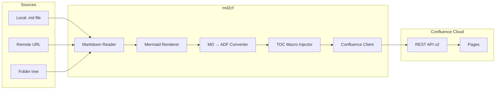

# md2cf

Engineering teams write documentation in Markdown because it lives alongside code, diffs cleanly in pull requests, and works with every editor. But many organizations mandate Confluence as the single source of truth for internal documentation. md2cf bridges this gap — it converts Markdown to Atlassian Document Format (ADF) and publishes directly to Confluence Cloud via the REST API v2, so teams can author in Markdown and publish to Confluence without ever opening the wiki editor.

md2cf works as both a CLI tool and a Node.js library. Point it at a Markdown file, a remote URL, or an entire folder, and it handles conversion, page creation, updates, and even Mermaid diagram rendering. It fits naturally into CI/CD pipelines for automated documentation deployment.

## Overview

<figure>



<figcaption>md2cf pipeline: Markdown sources are read, Mermaid diagrams rendered to PNG, content converted to ADF, TOC sections replaced with Confluence macros, and pages created or updated via the REST API v2.</figcaption>
</figure>

## What It Does

md2cf takes Markdown content from three source types — local files, remote URLs, or entire directory trees — and publishes it to Confluence Cloud pages.

**Single-file sync** updates an existing page or creates a new one. The CLI determines the action from the URL shape and flags: a page URL means update, a space URL with `--create` means create, and a page URL with `--create` means create a child page.

**Recursive folder sync** mirrors a local directory structure to Confluence. Folders become container pages, Markdown files become content pages, and the parent-child hierarchy is preserved. Existing pages are updated by title match; new pages are created automatically.

**Mermaid diagram support** detects fenced `mermaid` code blocks, renders them to PNG via the `mmdc` CLI (bundled as a dependency), uploads the images as Confluence attachments, and injects the correct ADF media references. Failed renders include collapsible source code blocks so diagrams are never silently lost.

**TOC macro injection** detects Markdown Table of Contents sections (common in README files) and replaces them with Confluence's native TOC macro, which stays in sync with the page's heading structure automatically.

**Title resolution** follows a priority chain: explicit `--title` flag, then the first H1 heading in the Markdown, then the filename converted to title case.

## Why It Exists

Confluence's WYSIWYG editor is a productivity bottleneck for engineering teams. Documentation written in Markdown lives in version control, gets reviewed in pull requests, and works with every developer's editor. But when the organization requires Confluence, someone has to manually copy-paste and reformat content — a tedious, error-prone process that discourages documentation updates.

Existing Markdown-to-Confluence tools largely target the legacy Storage Format API or the older REST API v1. md2cf targets the current Confluence Cloud REST API v2 with native Atlassian Document Format (ADF) conversion, which is the format Confluence Cloud actually uses internally. This means content renders correctly without the subtle formatting issues that come from Storage Format workarounds.

The tool also solves the folder-sync problem that most alternatives ignore. Engineering documentation often has a directory structure — API docs, guides, architecture decision records — and manually recreating that hierarchy in Confluence is tedious. md2cf's recursive folder sync handles the entire tree in a single command.

## How It Works

md2cf is structured as two layers: a CLI built with Commander.js and a library that exports the core modules.

### Conversion Pipeline

The Markdown-to-ADF conversion uses [marklassian](https://github.com/jamsinclair/marklassian) as the core converter. Before conversion, md2cf preprocesses the Markdown in two passes:

1. **Mermaid extraction** — Fenced `mermaid` blocks are detected via regex, rendered to PNG using the `mmdc` CLI (from `@mermaid-js/mermaid-cli`), and replaced with placeholder strings. After the page is created, PNGs are uploaded as attachments, and a second API call injects the correct `mediaSingle` ADF nodes with file references.

2. **TOC stripping** — Table of Contents sections (detected by heading text like "Table of Contents" or "TOC") are replaced with a placeholder. After ADF conversion, the placeholder is swapped for a Confluence `extension` node that renders the native TOC macro.

### Confluence API Client

The `ConfluenceClient` class wraps the REST API v2 with Basic Auth (email + API token). It handles page CRUD, child page listing, attachment uploads (via the v1 attachment endpoint, since v2 doesn't expose attachments), and pre-flight access checks. Attachment uploads use a create-or-update strategy: if an upload returns HTTP 400 (duplicate), the client automatically finds and updates the existing attachment.

### URL Parsing

The URL parser extracts the action context from Confluence URLs. It recognizes three patterns: page URLs (`/wiki/spaces/SPACE/pages/ID`), folder URLs (`/wiki/spaces/SPACE/folder/ID`), and space URLs (`/wiki/spaces/SPACE`). The parsed result, combined with the `--create` flag, determines whether to create or update.

### Configuration

Credentials are stored in `~/.md2cf/config.json` and validated with Zod schemas. The `config` subcommand provides interactive setup, individual key get/set, listing (with masked tokens), and reset.

## Key Features

| Feature | Description |
| --- | --- |
| **Recursive folder sync** | Mirrors local directory trees to Confluence page hierarchies in a single command |
| **Mermaid rendering** | Renders diagrams to PNG, uploads as attachments, and embeds in pages with collapsible source |
| **Dry-run mode** | `--dry-run` previews all actions without making API calls — useful for CI validation |
| **Overwrite protection** | Prompts before updating existing pages; `--yes` skips prompts for automation |
| **Remote source support** | Syncs from raw GitHub URLs or any HTTP-accessible Markdown file |
| **AI agent skills** | `--install-skill claude` installs a SKILL.md for Claude Code, Codex, or Gemini agents |
| **Library API** | Core modules (`ConfluenceClient`, `convertMarkdownToAdf`, `readMarkdownSource`) exported for programmatic use |
| **TOC macro injection** | Replaces Markdown TOC sections with Confluence's native TOC macro |

## Getting Started

Install globally via npm (requires Node.js 24+):

```bash
npm install -g md2cf
```

Configure your Confluence credentials:

```bash
md2cf config
```

This prompts for your Atlassian email, an API token (generated at [id.atlassian.com](https://id.atlassian.com/manage/api-tokens)), and your Confluence base URL.

Sync a Markdown file to an existing page:

```bash
md2cf ./README.md https://company.atlassian.net/wiki/spaces/ENG/pages/12345
```

Create a new page in a space:

```bash
md2cf ./docs/guide.md https://company.atlassian.net/wiki/spaces/ENG --create
```

Sync an entire docs folder:

```bash
md2cf ./docs/ https://company.atlassian.net/wiki/spaces/ENG/pages/12345
```

Preview without making changes:

```bash
md2cf ./README.md https://company.atlassian.net/wiki/spaces/ENG/pages/12345 --dry-run
```

## Appendix

### Tech Stack

| Component | Technology |
| --- | --- |
| **Language** | TypeScript (strict mode, ES2022 target) |
| **Runtime** | Node.js 24+ (ESM only) |
| **Bundler** | Vite (two entry points: `cli.js` and `index.js`) |
| **CLI framework** | Commander.js |
| **Markdown → ADF** | marklassian |
| **Diagram rendering** | @mermaid-js/mermaid-cli (mmdc) |
| **Validation** | Zod |
| **Interactive prompts** | @inquirer/prompts |
| **Testing** | Vitest (90% coverage thresholds) |

### References

- [md2cf on npm](https://www.npmjs.com/package/md2cf)
- [GitHub Repository](https://github.com/sujeet-pro/markdown-to-confluence-sync)
- [Confluence REST API v2 Documentation](https://developer.atlassian.com/cloud/confluence/rest/v2/intro/)
- [Atlassian Document Format (ADF) Specification](https://developer.atlassian.com/cloud/jira/platform/apis/document/structure/)
- [marklassian — Markdown to ADF Converter](https://github.com/jamsinclair/marklassian)
- [Full Documentation](https://sujeet-pro.github.io/markdown-to-confluence-sync/)
