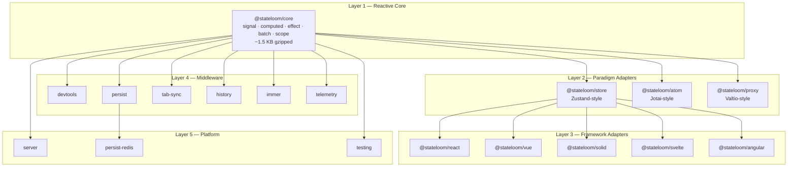

# StateLoom

Frontend state management is fragmented. Teams pick Zustand for stores, Jotai for atoms, or Valtio for proxies — then discover they can't share middleware, mix paradigms, or migrate between frameworks without rewriting state logic. Each library implements its own reactivity model, its own persistence story, and its own SSR workarounds. StateLoom unifies all three paradigms on a single signal-based reactive core, with framework adapters for React, Vue, Solid, Svelte, and Angular, and composable middleware for persistence, devtools, sync, and more.

The core thesis: the signal graph is the universal primitive for state management. Stores, atoms, and proxies are all compositions of signals and computed values. By building on a ~1.5 KB push-pull hybrid core aligned with the TC39 Signals proposal, StateLoom achieves paradigm unification without paradigm compromise — pick the mental model that fits your problem, use it in any framework, and compose cross-cutting concerns as independent middleware packages.

## Overview

<figure>



<figcaption>StateLoom's 5-layer architecture: a signal-based reactive core (Layer 1) supports three paradigm adapters (Layer 2), five framework adapters (Layer 3), composable middleware (Layer 4), and platform-specific backends (Layer 5). Dependencies flow strictly downward.</figcaption>
</figure>

## What It Does

StateLoom is a universal state management SDK published as 18 packages under the `@stateloom/*` npm scope. It provides three distinct API paradigms — all backed by the same reactive dependency graph:

**Store paradigm** (`@stateloom/store`) — A Zustand-style single-object store with actions, selectors, and full middleware support. Best for app-wide state where actions and state live together.

**Atom paradigm** (`@stateloom/atom`) — A Jotai-style bottom-up composition model with base atoms, derived atoms, writable atoms, and atom families. Best for fine-grained derived state where each piece of data is independently subscribable.

**Proxy paradigm** (`@stateloom/proxy`) — A Valtio-style mutable proxy with structural sharing snapshots. Mutate state with normal JavaScript assignment syntax while the proxy tracks changes and produces immutable snapshots for rendering.

Each paradigm translates its API into operations on core signals. Framework adapters (React, Vue, Solid, Svelte, Angular) bridge the universal `Subscribable<T>` interface to framework-specific reactivity — each adapter is 50-200 lines of code. Middleware packages (persistence, devtools, history, tab-sync, telemetry) compose into a pipeline around state operations without coupling to any paradigm or framework.

## Why It Exists

The JavaScript state management ecosystem has converged on three dominant patterns — stores (Zustand/Redux), atoms (Jotai/Recoil), and proxies (Valtio/MobX) — but each pattern lives in its own library with its own reactivity model, its own persistence strategy, and its own SSR story.

This creates several concrete problems for teams:

**Paradigm lock-in.** Choosing Zustand for stores means you can't use Jotai-style derived atoms without adding a second library with a completely separate reactive graph. State that crosses paradigm boundaries requires manual synchronization.

**Framework lock-in.** Most state libraries have first-class React support and afterthought adapters (or none) for other frameworks. Teams running multiple frameworks — or migrating between them — end up rewriting state management logic.

**Middleware fragmentation.** Each library has its own persistence plugin, its own devtools integration, and its own middleware API. A `persist` middleware built for Zustand doesn't work with Jotai. Cross-cutting concerns get reimplemented per library.

**SSR as an afterthought.** Many state libraries use module-level singletons, causing the "shared store in serverless" bug class where state from one request leaks into another. Fixing this requires per-request store creation patterns that break the library's design assumptions.

StateLoom addresses these by grounding all paradigms in a single reactive core. The `Subscribable<T>` contract (`get()` + `subscribe()`) lets framework adapters and middleware work identically across stores, atoms, and proxies. The `Scope` model provides per-request isolation as a core primitive, not a bolted-on pattern.

## How It Works

### Reactive Core: Push-Pull Hybrid

The core implements four primitives — `signal`, `computed`, `effect`, and `batch` — using a push-pull hybrid algorithm aligned with the approach proven by Preact Signals.

When `signal.set()` is called, the **push phase** eagerly marks downstream nodes as dirty through the dependency graph using a doubly-linked list structure. Signals mark their direct subscribers `DIRTY`. Computed nodes relay the mark as `MAYBE_DIRTY` to their own subscribers — indicating "my source might have changed, but I haven't recomputed yet."

The **pull phase** fires when a computed value is actually read. If marked `MAYBE_DIRTY`, the computed checks its source versions against its cached copies. If no source actually changed (the upstream recomputation produced the same value), the computed returns its cached result without recomputing. This avoids unnecessary work in diamond-shaped dependency graphs.

Batching coalesces multiple signal writes into a single notification cycle. Values update immediately (reads within a batch see new values), but subscriber notifications and effect re-execution are deferred until the outermost batch completes. Nested batches are safe — only the outermost completion triggers the flush.

### Middleware Pipeline

The store middleware system uses an `onSet` interception chain built bottom-up. Each middleware wraps the next `set` function in the pipeline:

```typescript title="middleware-composition.ts" collapse={1-2}
// Conceptual: built during createStore initialization
let chain = rawSet;
for (let i = middlewares.length - 1; i >= 0; i--) {
  const mw = middlewares[i];
  if (mw.onSet) {
    const nextSet = chain;
    chain = (partial) => mw.onSet(api, nextSet, partial);
  }
}
```

This gives middleware full control over state writes — the `persist` middleware can debounce writes to storage, the `devtools` middleware can snapshot state before and after, and the `history` middleware can push undo entries — all without any middleware knowing about the others.

### SSR Scope Model

The `Scope` primitive provides per-request state isolation. Each scope maintains a `Map<Subscribable, value>` that overrides global signal values within that scope's execution context. `fork()` creates child scopes that inherit parent values. `serialize()` extracts the scope's state for client hydration using stable keys.

On the server, `@stateloom/server` adds TTL-based eviction and LRU capacity limits for managed scopes, preventing memory leaks under load.

## Key Features

| Feature | Description |
| --- | --- |
| **~1.5 KB core** | Signal, computed, effect, batch, and scope in a tree-shakeable core with zero platform API dependencies |
| **Three paradigms, one graph** | Store (Zustand-style), Atom (Jotai-style), and Proxy (Valtio-style) all backed by the same signal dependency graph |
| **Five framework adapters** | Thin, idiomatic adapters for React (`useSyncExternalStore`), Vue (`shallowRef`), Solid (`createSignal`), Svelte (`$store` contract), and Angular (`Observable` + DI) |
| **Composable middleware** | Persistence (localStorage, sessionStorage, IndexedDB, cookies, Redis), devtools (Redux DevTools protocol), history (undo/redo), tab-sync (BroadcastChannel), Immer integration, and telemetry |
| **SSR-first scopes** | Per-request isolation via `Scope` with fork, serialize, and framework-level `ScopeProvider` components — no shared mutable state between server requests |
| **TC39 Signals alignment** | Core API matches the TC39 Signals proposal (Stage 1), enabling future delegation to native engine signals with zero API changes |
| **TypeScript-first** | Strict types with full inference, no `any`, no enums, named exports only. Types flow through middleware composition and selector chains |
| **Structural typing for middleware** | Middleware declares its own `MiddlewareAPI<T>` that structurally matches the store, avoiding runtime imports and keeping middleware framework-agnostic |

## Getting Started

Install the core and the packages for your paradigm and framework:

```bash title="install.sh"
# Store paradigm + React (most common)
pnpm add @stateloom/core @stateloom/store @stateloom/react

# Atom paradigm (bottom-up composition)
pnpm add @stateloom/core @stateloom/atom

# Proxy paradigm (mutable syntax)
pnpm add @stateloom/core @stateloom/proxy
```

Create a store with the Zustand-style API:

```typescript title="counter-store.ts"
import { createStore } from '@stateloom/store';

const counterStore = createStore((set) => ({
  count: 0,
  increment: () => set((state) => ({ count: state.count + 1 })),
  reset: () => set({ count: 0 }),
}));

counterStore.getState().increment();
console.log(counterStore.getState().count); // 1
```

Use it in React:

```typescript title="Counter.tsx" collapse={1-2}
import { useStore } from '@stateloom/react';
import { counterStore } from './counter-store';

function Counter() {
  const count = useStore(counterStore, (s) => s.count);
  const increment = useStore(counterStore, (s) => s.increment);
  return <button onClick={increment}>Count: {count}</button>;
}
```

Add middleware for persistence and devtools:

```typescript title="counter-store-with-middleware.ts" collapse={1-3}
import { createStore } from '@stateloom/store';
import { persist, localStorageBackend } from '@stateloom/persist';
import { devtools } from '@stateloom/devtools';

const counterStore = createStore(
  (set) => ({
    count: 0,
    increment: () => set((s) => ({ count: s.count + 1 })),
  }),
  {
    middleware: [
      persist({ key: 'counter', storage: localStorageBackend() }),
      devtools({ name: 'Counter' }),
    ],
  }
);
```

Or use the atom paradigm for fine-grained derived state:

```typescript title="atoms.ts"
import { atom, derived } from '@stateloom/atom';

const countAtom = atom(0);
const doubledAtom = derived((get) => get(countAtom) * 2);

countAtom.set(5);
console.log(doubledAtom.get()); // 10
```

## Appendix

### Tech Stack

| Component | Technology |
| --- | --- |
| **Language** | TypeScript (strict mode, `verbatimModuleSyntax`) |
| **Reactive core** | Custom push-pull hybrid signal graph (~1.5 KB gzipped) |
| **Build** | tsup (per-package ESM + CJS dual output) |
| **Monorepo** | pnpm workspaces + Turborepo (parallel builds, caching) |
| **Testing** | Vitest (95% coverage target) |
| **Linting** | ESLint 9 + typescript-eslint |
| **Documentation** | VitePress with Mermaid plugin |
| **Versioning** | Changesets (independent package versioning) |
| **CI** | GitHub Actions |

### References

- [StateLoom GitHub Repository](https://github.com/sujeet-pro/stateloom)
- [StateLoom on npm](https://www.npmjs.com/org/stateloom)
- [StateLoom Documentation](https://projects.sujeet.pro/stateloom/)
- [TC39 Signals Proposal](https://github.com/tc39/proposal-signals)
- [Preact Signals — Push-Pull Hybrid Reactivity](https://preactjs.com/blog/signal-boosting)
- [Zustand](https://github.com/pmndrs/zustand) — Store paradigm influence
- [Jotai](https://github.com/pmndrs/jotai) — Atom paradigm influence
- [Valtio](https://github.com/pmndrs/valtio) — Proxy paradigm influence
- [Effector Fork API](https://effector.dev/docs/api/effector/fork/) — SSR scope model influence
