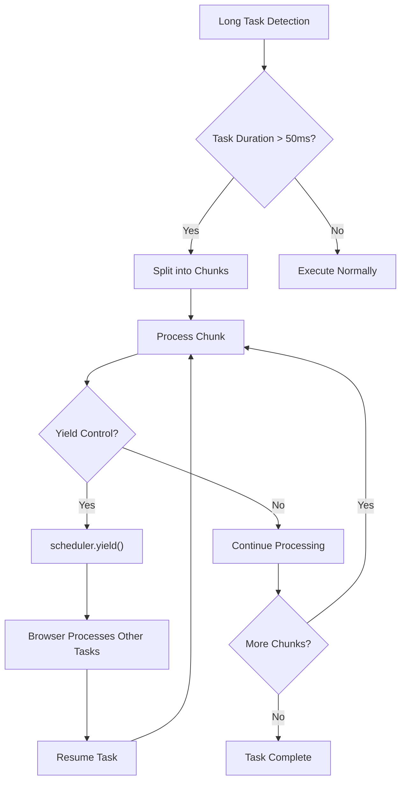
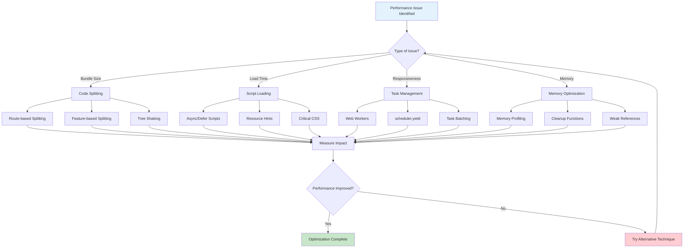

# JavaScript Performance Optimization

Master advanced JavaScript optimization techniques including bundle splitting, long task management, React optimization, and Web Workers for building high-performance web applications.


1. [Script Loading Strategies and Execution Order](#script-loading-strategies-and-execution-order)
2. [Long-Running Task Optimization with scheduler.yield()](#long-running-task-optimization-with-scheduleryield)
3. [Code Splitting and Dynamic Loading](#code-splitting-and-dynamic-loading)
4. [Tree Shaking and Dead Code Elimination](#tree-shaking-and-dead-code-elimination)
5. [Web Workers for Non-Splittable Tasks](#web-workers-for-non-splittable-tasks)
6. [React and Next.js Optimization Strategies](#react-and-nextjs-optimization-strategies)
7. [Modern Browser APIs for Performance Enhancement](#modern-browser-apis-for-performance-enhancement)
8. [Performance Measurement and Monitoring](#performance-measurement-and-monitoring)
9. [Optimization Technique Selection Matrix](#optimization-technique-selection-matrix)

## Script Loading Strategies and Execution Order

The foundation of JavaScript performance optimization begins with understanding how scripts are loaded and executed by the browser. The choice between different loading strategies can dramatically impact your application's initial load performance and perceived responsiveness.

### Understanding Execution Order Preservation

**Normal Script Loading**: Traditional script tags block HTML parsing during both download and execution phases. This creates a synchronous bottleneck where the browser cannot continue processing the document until the script completes.

```html
<!-- Blocks HTML parsing during download AND execution -->
<script src="heavy-library.js"></script>
<div id="content">This won't render until script completes</div>
```

**Async Scripts**: Scripts with the `async` attribute download in parallel with HTML parsing but execute immediately upon completion, potentially interrupting the parsing process. Critically, async scripts do not preserve execution order—they execute in the order they finish downloading, not the order they appear in the document.

```html
<!-- These may execute in any order based on download completion -->
<script src="library-a.js" async></script>
<script src="library-b.js" async></script>
<!-- May run before library-a -->
```

**Defer Scripts**: Scripts marked with `defer` download in parallel but execute only after HTML parsing is complete, preserving their document order. This makes defer ideal for scripts that depend on the DOM or other scripts.

```html
<!-- These will execute in document order after DOM is ready -->
<script src="dependency.js" defer></script>
<script src="main-app.js" defer></script>
<!-- Guaranteed to run after dependency.js -->
```

**ES Modules**: Scripts with `type="module"` are deferred by default and support modern import/export syntax. They enable better dependency management and tree shaking opportunities.

```html
<!-- Automatically deferred, supports imports -->
<script type="module" src="app.js"></script>
```

### Advanced Loading Patterns

For complex applications requiring specific loading behaviors, combining these strategies yields optimal results:

```html
<head>
  <!-- Critical CSS and fonts -->
  <link rel="preload" href="critical.css" as="style" />
  <link rel="preconnect" href="https://fonts.googleapis.com" />

  <!-- Analytics and tracking (independent) -->
  <script src="analytics.js" async></script>

  <!-- Application dependencies (order-dependent) -->
  <script src="polyfills.js" defer></script>
  <script src="framework.js" defer></script>
  <script src="app.js" defer></script>

  <!-- Modern module-based entry point -->
  <script type="module" src="modern-app.js"></script>
</head>
```

### Script Loading Timeline Comparison

```mermaid
gantt
    title Script Loading Strategies Timeline
    dateFormat X
    axisFormat %s

    section Normal Script
    DOM Parsing           :active, normal, 0, 10
    Download              :crit, normal, 10, 100
    Execute               :crit, normal, 100, 160
    DOM Parsing           :active, normal, 160, 300

    section Async Script
    DOM Parsing           :active, normal, 0, 100
    Download              :active, normal, 10, 100
    Execute               :crit, async, 100, 160
    DOM Parsing           :active, normal, 160, 210

    section Defer Script
    DOM Parsing           :active, normal, 0, 150
    Download              :active, normal, 10, 100
    Execute               :exec, 150, 190

    section Module Script
    DOM Parsing           :active, normal, 0, 150
    Download              :active, normal, 10, 100
    Execute               :module, 150, 210
```



<figcaption>

**Figure 1:** Script loading strategies timeline comparison showing how different script loading methods affect HTML parsing and execution timing. Normal, async, and module scripts execute before DOM Load Complete, while defer scripts execute after DOM Load Complete.

</figcaption>

### Standard `<script>`

- **Blocking behavior:** HTML parsing pauses on fetch+execute.
- **Order:** Sequential; later scripts wait for earlier ones.

### `async`

- **Blocking:** Does _not_ block parsing; execution occurs immediately upon download, pausing parsing only at execution time.
- **Order:** Unpredictable—scripts execute as they arrive.
- **Use Case:** Independent analytics or ads that don't depend on DOM or other scripts.
- **Trade-off:** Lack of order can break inter-script dependencies; use only when order is irrelevant.

### `defer`

- **Blocking:** Downloads in background without interrupting parsing; execution deferred until after HTML parsing, just before `DOMContentLoaded`.
- **Order:** Preserves document order.
- **Use Case:** Application initialization scripts that depend on DOM but not immediate rendering.
- **Trade-off:** Slightly delayed execution.

### `<script type="module">`

- **Blocking:** Scripts download asynchronously. Execution deferred until parsing finishes; top-level `await` supported.
- **Order:** Relative order preserved among modules; dependency graph dictates additional fetches.
- **Use Case:** ES module workflows with tree-shaking and scope encapsulation.
- **Trade-off:** Legacy-browser fallback requires `nomodule` or polyfills, increasing complexity.

## Long-Running Task Optimization with scheduler.yield()

One of the most significant performance improvements in modern JavaScript comes from properly managing long-running tasks that can block the main thread and degrade user experience. Tasks exceeding 50ms are considered "long tasks" and can cause noticeable jank in animations and delayed responses to user interactions.

### The scheduler.yield() API

The `scheduler.yield()` API represents a paradigm shift in how we handle task scheduling. Unlike traditional approaches using `setTimeout()` or `requestIdleCallback()`, `scheduler.yield()` provides prioritized continuation of work, ensuring that yielded tasks resume before new tasks begin.

```javascript
async function processLargeDataset(items) {
  const results = []

  for (let i = 0; i < items.length; i++) {
    // Process item
    const result = await computeExpensiveOperation(items[i])
    results.push(result)

    // Yield control every 50 items or after 5ms of work
    if (i % 50 === 0) {
      await scheduler.yield()
    }
  }

  return results
}
```

### Advanced Yielding Strategies

For more sophisticated control over task execution, implement adaptive yielding based on remaining time:

```javascript
async function adaptiveProcessing(workQueue) {
  const startTime = performance.now()
  const timeSlice = 5 // 5ms time slice

  while (workQueue.length > 0) {
    const currentTime = performance.now()

    // Process items until time slice is exhausted
    while (workQueue.length > 0 && performance.now() - currentTime < timeSlice) {
      processWorkItem(workQueue.shift())
    }

    // Yield if we have more work
    if (workQueue.length > 0) {
      await scheduler.yield()
    }
  }
}
```

### Integration with Prioritized Task Scheduling

The `scheduler.yield()` API integrates seamlessly with `scheduler.postTask()` for explicit priority control:

```javascript
async function backgroundDataSync() {
  // Low priority background task
  scheduler.postTask(
    async () => {
      const data = await fetchLargeDataset()

      for (const chunk of data.chunks) {
        await processChunk(chunk)
        // Maintains low priority after yielding
        await scheduler.yield()
      }
    },
    { priority: "background" },
  )
}
```

### Long Task Management Comparison



<figcaption>

**Figure 2:** Long task management workflow showing how tasks exceeding 50ms are detected, split into chunks, and processed using scheduler.yield() to maintain responsive user experience.

</figcaption>

## Code Splitting and Dynamic Loading

Code splitting is a technique that allows you to split your JavaScript bundle into smaller chunks that can be loaded on demand. This reduces the initial bundle size and improves the time to interactive.

### Route-Based Code Splitting

The most common form of code splitting is route-based, where each route loads only the code it needs:

```javascript
// React Router with lazy loading
import { lazy, Suspense } from "react"
import { Routes, Route } from "react-router-dom"

const Home = lazy(() => import("./pages/Home"))
const About = lazy(() => import("./pages/About"))
const Contact = lazy(() => import("./pages/Contact"))

function App() {
  return (
    <Suspense fallback={<div>Loading...</div>}>
      <Routes>
        <Route path="/" element={<Home />} />
        <Route path="/about" element={<About />} />
        <Route path="/contact" element={<Contact />} />
      </Routes>
    </Suspense>
  )
}
```

### Component-Level Code Splitting

For more granular control, split individual components:

```javascript
// Lazy load heavy components
const HeavyChart = lazy(() => import("./components/HeavyChart"))
const DataTable = lazy(() => import("./components/DataTable"))

function Dashboard() {
  const [showChart, setShowChart] = useState(false)
  const [showTable, setShowTable] = useState(false)

  return (
    <div>
      <button onClick={() => setShowChart(true)}>Show Chart</button>
      <button onClick={() => setShowTable(true)}>Show Table</button>

      {showChart && (
        <Suspense fallback={<div>Loading chart...</div>}>
          <HeavyChart />
        </Suspense>
      )}

      {showTable && (
        <Suspense fallback={<div>Loading table...</div>}>
          <DataTable />
        </Suspense>
      )}
    </div>
  )
}
```

### Dynamic Imports with Webpack

For more control over chunking, use dynamic imports:

```javascript
// Dynamic import with custom chunk name
const loadModule = async (moduleName) => {
  switch (moduleName) {
    case "chart":
      return import(/* webpackChunkName: "chart" */ "./modules/chart")
    case "table":
      return import(/* webpackChunkName: "table" */ "./modules/table")
    case "form":
      return import(/* webpackChunkName: "form" */ "./modules/form")
    default:
      throw new Error(`Unknown module: ${moduleName}`)
  }
}

// Usage
const { ChartComponent } = await loadModule("chart")
```

### Preloading Critical Chunks

Preload critical chunks to improve perceived performance:

```javascript
// Preload next likely route
function preloadNextRoute() {
  const nextRoute = getNextRoute()
  if (nextRoute) {
    import(/* webpackPrefetch: true */ `./pages/${nextRoute}`)
  }
}

// Preload on hover
function handleRouteHover(routeName) {
  import(/* webpackPrefetch: true */ `./pages/${routeName}`)
}
```

## Tree Shaking and Dead Code Elimination

Tree shaking is a technique for eliminating dead code from your bundle. It works by analyzing the static structure of your code and removing exports that are not imported anywhere.

### ES Module Tree Shaking

Tree shaking works best with ES modules due to their static nature:

```javascript
// math.js - Only used exports will be included
export function add(a, b) {
  return a + b
}

export function subtract(a, b) {
  return a - b
}

export function multiply(a, b) {
  return a * b
}

export function divide(a, b) {
  return a / b
}

// main.js - Only add and multiply will be included
import { add, multiply } from "./math.js"

console.log(add(2, 3))
console.log(multiply(4, 5))
```

### Side Effect Management

Mark files as side-effect free to enable better tree shaking:

```json
// package.json
{
  "sideEffects": false
}

// Or specify files with side effects
{
  "sideEffects": [
    "*.css",
    "*.scss",
    "polyfill.js"
  ]
}
```

### CommonJS Tree Shaking

Tree shaking CommonJS modules requires specific patterns:

```javascript
// Avoid this - entire module is included
const utils = require("./utils")
console.log(utils.add(2, 3))

// Use this - only add function is included
const { add } = require("./utils")
console.log(add(2, 3))
```

## Web Workers for Non-Splittable Tasks

Web Workers provide a way to run JavaScript in background threads, preventing long-running tasks from blocking the main thread.

### Basic Worker Implementation

```javascript
// main.js
const worker = new Worker("worker.js")

worker.postMessage({ type: "PROCESS_DATA", data: largeDataset })

worker.onmessage = (event) => {
  const { type, result } = event.data
  if (type === "PROCESS_COMPLETE") {
    updateUI(result)
  }
}

// worker.js
self.onmessage = (event) => {
  const { type, data } = event.data

  if (type === "PROCESS_DATA") {
    const result = processLargeDataset(data)
    self.postMessage({ type: "PROCESS_COMPLETE", result })
  }
}

function processLargeDataset(data) {
  // Heavy computation that would block main thread
  return data.map((item) => expensiveOperation(item))
}
```

### Shared Workers for Multiple Tabs

Use Shared Workers for communication across multiple tabs:

```javascript
// shared-worker.js
const connections = []

self.onconnect = (event) => {
  const port = event.ports[0]
  connections.push(port)

  port.onmessage = (event) => {
    // Broadcast to all connected tabs
    connections.forEach((conn) => {
      if (conn !== port) {
        conn.postMessage(event.data)
      }
    })
  }
}

// main.js
const worker = new SharedWorker("shared-worker.js")
const port = worker.port

port.onmessage = (event) => {
  console.log("Message from other tab:", event.data)
}

port.postMessage({ type: "BROADCAST", data: "Hello from this tab!" })
```

### Worker Pool Pattern

For managing multiple workers efficiently:

```javascript
class WorkerPool {
  constructor(workerScript, poolSize = navigator.hardwareConcurrency) {
    this.workers = []
    this.queue = []
    this.availableWorkers = []

    for (let i = 0; i < poolSize; i++) {
      const worker = new Worker(workerScript)
      worker.onmessage = (event) => this.handleWorkerMessage(worker, event)
      this.workers.push(worker)
      this.availableWorkers.push(worker)
    }
  }

  executeTask(task) {
    return new Promise((resolve, reject) => {
      const taskWrapper = { task, resolve, reject }

      if (this.availableWorkers.length > 0) {
        this.executeTaskWithWorker(this.availableWorkers.pop(), taskWrapper)
      } else {
        this.queue.push(taskWrapper)
      }
    })
  }

  executeTaskWithWorker(worker, taskWrapper) {
    worker.postMessage(taskWrapper.task)
    worker.currentTask = taskWrapper
  }

  handleWorkerMessage(worker, event) {
    const { resolve, reject } = worker.currentTask

    if (event.data.error) {
      reject(event.data.error)
    } else {
      resolve(event.data.result)
    }

    // Return worker to pool
    if (this.queue.length > 0) {
      const nextTask = this.queue.shift()
      this.executeTaskWithWorker(worker, nextTask)
    } else {
      this.availableWorkers.push(worker)
    }
  }
}

// Usage
const pool = new WorkerPool("worker.js", 4)

const results = await Promise.all([
  pool.executeTask({ type: "PROCESS", data: dataset1 }),
  pool.executeTask({ type: "PROCESS", data: dataset2 }),
  pool.executeTask({ type: "PROCESS", data: dataset3 }),
  pool.executeTask({ type: "PROCESS", data: dataset4 }),
])
```

## React and Next.js Optimization Strategies

React applications require specific optimization techniques to maintain high performance as they scale.

### React.memo for Component Memoization

Prevent unnecessary re-renders with React.memo:

```javascript
const ExpensiveComponent = React.memo(({ data, onUpdate }) => {
  const processedData = useMemo(() => {
    return expensiveProcessing(data)
  }, [data])

  return (
    <div>
      {processedData.map((item) => (
        <DataItem key={item.id} item={item} onUpdate={onUpdate} />
      ))}
    </div>
  )
})

// Custom comparison function
const CustomComponent = React.memo(
  ({ items, config }) => {
    return <div>{/* component logic */}</div>
  },
  (prevProps, nextProps) => {
    // Return true if props are equal (no re-render needed)
    return prevProps.items.length === nextProps.items.length && prevProps.config.id === nextProps.config.id
  },
)
```

### useCallback and useMemo Optimization

Optimize function and value creation:

```javascript
function ParentComponent({ items, config }) {
  const [selectedId, setSelectedId] = useState(null)

  // Memoize expensive calculation
  const processedItems = useMemo(() => {
    return items.filter((item) => expensiveFilter(item, config)).map((item) => expensiveTransform(item))
  }, [items, config])

  // Memoize callback to prevent child re-renders
  const handleItemSelect = useCallback((id) => {
    setSelectedId(id)
    analytics.track("item_selected", { id })
  }, [])

  // Memoize complex object
  const contextValue = useMemo(
    () => ({
      items: processedItems,
      selectedId,
      onSelect: handleItemSelect,
    }),
    [processedItems, selectedId, handleItemSelect],
  )

  return (
    <ItemContext.Provider value={contextValue}>
      <ItemList />
    </ItemContext.Provider>
  )
}
```

### Next.js Server Components

Leverage React Server Components for improved performance:

```javascript
// Server Component - runs on server
async function ServerComponent({ userId }) {
  const userData = await fetchUserData(userId)

  return (
    <div>
      <h1>{userData.name}</h1>
      <ClientComponent userData={userData} />
    </div>
  )
}

// Client Component - runs in browser
;("use client")
function ClientComponent({ userData }) {
  const [isEditing, setIsEditing] = useState(false)

  return <div>{isEditing ? <EditForm userData={userData} /> : <UserProfile userData={userData} />}</div>
}
```

### Next.js Image Optimization

Use Next.js Image component for automatic optimization:

```javascript
import Image from "next/image"

function OptimizedImage({ src, alt, width, height }) {
  return (
    <Image
      src={src}
      alt={alt}
      width={width}
      height={height}
      placeholder="blur"
      blurDataURL="data:image/jpeg;base64,/9j/4AAQSkZJRgABAQAAAQ..."
      priority={true} // For above-the-fold images
    />
  )
}
```

## Modern Browser APIs for Performance Enhancement

Modern browsers provide powerful APIs for performance optimization.

### Intersection Observer for Lazy Loading

```javascript
const lazyLoadObserver = new IntersectionObserver(
  (entries) => {
    entries.forEach((entry) => {
      if (entry.isIntersecting) {
        const element = entry.target

        if (element.dataset.src) {
          element.src = element.dataset.src
          element.removeAttribute("data-src")
          lazyLoadObserver.unobserve(element)
        }
      }
    })
  },
  {
    rootMargin: "50px", // Start loading 50px before element enters viewport
  },
)

// Observe all lazy-loaded images
document.querySelectorAll("img[data-src]").forEach((img) => {
  lazyLoadObserver.observe(img)
})
```

### Resize Observer for Responsive Components

```javascript
const resizeObserver = new ResizeObserver((entries) => {
  entries.forEach((entry) => {
    const { width, height } = entry.contentRect

    if (width < 768) {
      entry.target.classList.add("mobile-layout")
    } else {
      entry.target.classList.remove("mobile-layout")
    }
  })
})

resizeObserver.observe(document.querySelector(".responsive-container"))
```

### Performance Observer for Monitoring

```javascript
// Monitor long tasks
const longTaskObserver = new PerformanceObserver((list) => {
  list.getEntries().forEach((entry) => {
    console.warn(`Long task detected: ${entry.duration}ms`)
    // Send to analytics
    analytics.track("long_task", {
      duration: entry.duration,
      startTime: entry.startTime,
    })
  })
})

longTaskObserver.observe({ type: "longtask" })

// Monitor layout shifts
const layoutShiftObserver = new PerformanceObserver((list) => {
  list.getEntries().forEach((entry) => {
    if (!entry.hadRecentInput) {
      console.warn(`Layout shift: ${entry.value}`)
    }
  })
})

layoutShiftObserver.observe({ type: "layout-shift" })
```

## Performance Measurement and Monitoring

Effective performance optimization requires continuous measurement and monitoring.

### Core Web Vitals Measurement

```javascript
class PerformanceMonitor {
  constructor() {
    this.metrics = {}
    this.observers = []
    this.setupObservers()
  }

  setupObservers() {
    // LCP measurement
    const lcpObserver = new PerformanceObserver((list) => {
      const entries = list.getEntries()
      const lastEntry = entries[entries.length - 1]
      this.metrics.lcp = lastEntry.startTime
    })
    lcpObserver.observe({ type: "largest-contentful-paint" })

    // FID measurement
    const fidObserver = new PerformanceObserver((list) => {
      list.getEntries().forEach((entry) => {
        this.metrics.fid = entry.processingStart - entry.startTime
      })
    })
    fidObserver.observe({ type: "first-input" })

    // CLS measurement
    let clsValue = 0
    const clsObserver = new PerformanceObserver((list) => {
      list.getEntries().forEach((entry) => {
        if (!entry.hadRecentInput) {
          clsValue += entry.value
          this.metrics.cls = clsValue
        }
      })
    })
    clsObserver.observe({ type: "layout-shift" })

    this.observers.push(lcpObserver, fidObserver, clsObserver)
  }

  getMetrics() {
    return { ...this.metrics }
  }

  reportMetrics() {
    const metrics = this.getMetrics()

    // Send to analytics
    fetch("/api/metrics", {
      method: "POST",
      headers: { "Content-Type": "application/json" },
      body: JSON.stringify(metrics),
    })
  }
}
```

### Custom Performance Marks

```javascript
// Mark important performance points
performance.mark("app-init-start")
// ... initialization code
performance.mark("app-init-end")

performance.measure("app-initialization", "app-init-start", "app-init-end")

// Get measurement
const initTime = performance.getEntriesByName("app-initialization")[0]
console.log(`App initialization took: ${initTime.duration}ms`)
```

### Memory Usage Monitoring

```javascript
function monitorMemoryUsage() {
  if ("memory" in performance) {
    setInterval(() => {
      const memory = performance.memory
      console.log(`Memory usage: ${memory.usedJSHeapSize / 1024 / 1024}MB`)

      if (memory.usedJSHeapSize > memory.jsHeapSizeLimit * 0.8) {
        console.warn("High memory usage detected")
        // Trigger garbage collection or cleanup
      }
    }, 5000)
  }
}
```

## Optimization Technique Selection Matrix

Choosing the right optimization techniques depends on your specific performance bottlenecks and use case requirements. Different scenarios benefit from different approaches, and understanding when to apply each technique is crucial for effective optimization.

| Performance Issue                   | Primary Techniques                        | Secondary Techniques                   | Measurement                            |
| ----------------------------------- | ----------------------------------------- | -------------------------------------- | -------------------------------------- |
| **Large Bundle Size**               | Code Splitting, Tree Shaking              | Lazy Loading, Compression              | Bundle Analyzer, Webpack Stats         |
| **Slow Initial Load**               | Script Loading Optimization, Critical CSS | Preloading, Resource Hints             | FCP, LCP, Navigation Timing            |
| **Poor Interaction Responsiveness** | Web Workers, scheduler.yield()            | Task Batching, Memoization             | INP, Long Tasks, FID                   |
| **Memory Leaks**                    | Memory Profiling, Cleanup                 | Weak References, Event Cleanup         | Memory Timeline, Heap Snapshots        |
| **React Re-renders**                | React.memo, useCallback                   | Context Splitting, State Normalization | React Profiler, Render Counts          |
| **Mobile Performance**              | Bundle Splitting, Image Optimization      | Service Workers, Caching               | Mobile Lighthouse, Real Device Testing |

### Performance Optimization Decision Tree



<figcaption>

**Figure 3:** Performance optimization decision tree providing a systematic approach to selecting the most appropriate optimization techniques based on the type of performance issue encountered.

</figcaption>

## Conclusion

JavaScript optimization for web performance is a multifaceted discipline that requires understanding both fundamental browser mechanics and modern API capabilities. The techniques outlined in this guide—from strategic script loading and task scheduling to advanced code splitting and modern browser APIs—work synergistically to create high-performance web applications.

The key to successful optimization lies in measurement-driven decision making. Use performance profiling tools to identify bottlenecks, implement targeted optimizations, and continuously monitor the impact of changes. Modern browsers provide unprecedented visibility into performance characteristics through APIs like Performance Observer, scheduler.yield(), and Web Workers.

For React and Next.js applications, leverage framework-specific optimizations while applying general JavaScript performance principles. The combination of intelligent memoization, dynamic imports, and modern bundling strategies can yield dramatic performance improvements.

As web applications continue to grow in complexity, staying current with emerging browser APIs and optimization techniques becomes increasingly important. The techniques and patterns presented here provide a solid foundation for building performant web applications that deliver exceptional user experiences across all devices and network conditions.

Remember that optimization is an iterative process. Start with measurement, identify the biggest bottlenecks, apply targeted optimizations, and measure again. The comprehensive checklist provided offers a systematic approach to ensuring your applications leverage all available optimization opportunities for maximum performance impact.
