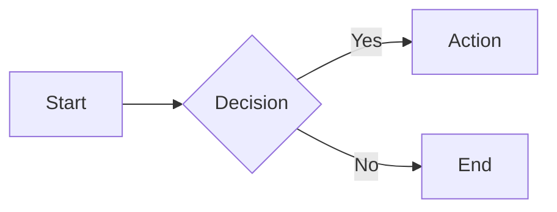

# Markdown Features

Complete reference for markdown features supported in this project.

## Standard Markdown (GFM)

GitHub Flavored Markdown is enabled by default.

### Text Formatting

```markdown
**bold** or **bold**
_italic_ or _italic_
~~strikethrough~~
`inline code`
```

### Links and Images

```markdown
[Link text](https://example.com)
[Link with title](https://example.com "Title")

```

### Lists

```markdown
- Unordered item
- Another item
  - Nested item

1. Ordered item
2. Another item
   1. Nested item
```

### Tables

```markdown
| Header 1 | Header 2 |
| -------- | -------- |
| Cell 1   | Cell 2   |
| Cell 3   | Cell 4   |
```

Tables are automatically wrapped for responsive horizontal scrolling.

### Blockquotes

```markdown
> Quote text
> Multiple lines
```

### Task Lists

```markdown
- [x] Completed task
- [ ] Incomplete task
```

### Horizontal Rules

```markdown
---
---

---
```

## Extended Features

### Math (KaTeX)

Inline math with single dollar signs:

```markdown
The formula $E = mc^2$ is famous.
```

Block math with double dollar signs:

```markdown
$$
\int_0^\infty e^{-x^2} dx = \frac{\sqrt{\pi}}{2}
$$
```

### Mermaid Diagrams

````markdown

````

Supported diagram types:

- `flowchart` / `graph`
- `sequenceDiagram`
- `classDiagram`
- `stateDiagram`
- `erDiagram`
- `gantt`
- `pie`

### Emoji Shortcodes

```markdown
:smile: :rocket: :warning:
```

Emojis automatically get ARIA labels for accessibility.

### Inline SVG

SVGs with `.inline.svg` suffix are inlined directly into HTML:

```markdown

```

The SVG content becomes part of the document, allowing CSS styling.

### Table of Contents

Add a "Table of Contents" heading to auto-generate navigation:

```markdown
## Table of Contents

## Section One

## Section Two
```

The TOC is generated from H2 and H3 headings (max depth: 3).

## Code Blocks (Expressive Code)

### Basic Syntax Highlighting

````markdown
```typescript
const greeting: string = "Hello, World!"
console.log(greeting)
```
````

Supported languages: All languages supported by Shiki, plus custom `m3u8`.

### File Title

Add context with a title:

````markdown
```typescript title="utils/helper.ts"
export function helper() {}
```
````

### Line Numbers

Line numbers shown by default. Disable for specific blocks:

````markdown
```bash
npm install
```
````

Bash and text blocks have line numbers disabled by default.

Start from a specific line:

````markdown
```typescript showLineNumbers startLineNumber=42
// This starts at line 42
```
````

### Line Highlighting

Highlight specific lines:

````markdown
```typescript {2-4}
const a = 1
const b = 2 // highlighted
const c = 3 // highlighted
const d = 4 // highlighted
const e = 5
```
````

### Diff Syntax

Show additions and deletions:

````markdown
```typescript
- const old = "removed"
+ const new = "added"
  const unchanged = "same"
```
````

### Collapsible Sections

Collapse boilerplate code:

````markdown
```typescript collapse={1-5}
import { a } from "a"
import { b } from "b"
import { c } from "c"
import { d } from "d"
import { e } from "e"

// Main code visible by default
function main() {
  return "hello"
}
```
````

### Terminal Frame

Bash blocks automatically get terminal frame styling:

````markdown
```bash
npm run build
```
````

### Code Import

Import code from external files:

````markdown
```typescript file=src/utils/helper.ts

```
````

With line range:

````markdown
```typescript file=src/utils/helper.ts#L10-L20

```
````

The `file=` syntax automatically:

- Sets the title from filename
- Detects language from extension
- Sets starting line number from range

## Custom Plugins

### Auto-Extracted Frontmatter

The `remarkFrontmatterPlugin` extracts metadata from content:

| Field         | Source                                  |
| ------------- | --------------------------------------- |
| `title`       | First H1 heading                        |
| `description` | Text between H1 and "Table of Contents" |
| `publishedOn` | Filename date (YYYY-MM-DD prefix)       |
| `minutesRead` | Calculated from word count              |
| `isDraft`     | Title starts with "Draft:"              |
| `pageSlug`    | Filename without date prefix            |

### Heading Links

All H2+ headings automatically get:

- Unique IDs for deep linking
- Anchor links for easy sharing

### Image Classes

Images get responsive styling automatically. Special suffixes:

| Suffix        | Effect                |
| ------------- | --------------------- |
| `.inline.svg` | SVG inlined into HTML |

### Responsive Tables

Tables are wrapped in a scrollable container for mobile.

## Document Structure

### Required Structure

```markdown
# Article Title

Description paragraph(s).
This becomes the meta description.

## Table of Contents

## First Section

Content...
```

### Optional Frontmatter

```yaml
---
lastReviewedOn: 2024-01-15
tags:
  - typescript
  - patterns
featuredRank: 1 # writing only
subcategory: dsa/arrays # deep-dives only
type: case-study # work only
---
```

### Draft Posts

Prefix the title with "Draft:" to mark as draft:

```markdown
# Draft: Work in Progress

This won't appear in production builds.
```

## Best Practices

1. **Code blocks**: Collapse imports with `collapse={1-N}`
2. **Titles**: Add `title="filename.ts"` for context
3. **Highlighting**: Use `{lines}` to draw attention
4. **Diagrams**: Prefer Mermaid for architectural diagrams
5. **Math**: Use KaTeX for formulas, not images
6. **TOC**: Always include for articles with 3+ sections
