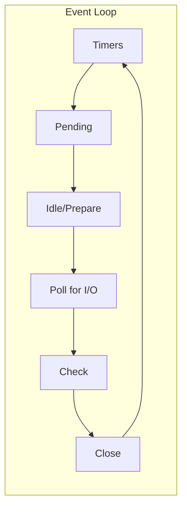

# Content Writing Guidelines

This document defines the standards for creating technical content for sujeet.pro. The target audience is experienced software professionals (senior/staff/principal engineers) who value deep technical analysis over introductory explanations.

## Content Philosophy

### Core Principles

1. **Depth Over Breadth**: Cover topics comprehensively rather than superficially. Each article should be the definitive resource on its subject.

2. **Why Before How**: Always explain the reasoning behind design decisions, architectural choices, and trade-offs before diving into implementation details.

3. **No Common Knowledge Padding**: Skip explanations of concepts your audience already knows. A senior engineer doesn't need "JavaScript is a programming language" level context.

4. **Evidence-Based Claims**: Back assertions with references, specifications, benchmarks, or source code. Avoid unsubstantiated opinions.

5. **Production Reality**: Include real-world considerations like cost, scale limits, operational complexity, and failure modes.

## Article Structure

### Required Sections

Every article must include these components:

```
# Title

[Abstract paragraph - 2-4 sentences setting context]

[Overview mermaid diagram - visual representation of the topic's architecture/flow]

## TLDR

[Structured summary with key points organized by theme]
[Use nested bullet points and subsections]

## Table of Contents

[Auto-generated or manual list with anchor links]

## Main Content Sections

[Detailed technical content organized hierarchically]

## Conclusion

[Key takeaways and synthesis]

## References

[All sources with proper attribution]
```

### Abstract (Before ToC)

The abstract appears before the table of contents and serves to:

- Set the context for why this topic matters
- Describe what the reader will learn
- Include an overview mermaid diagram showing the high-level architecture or concept flow

**Example Abstract:**

```markdown
# Libuv Internals

Explore libuv's event loop architecture, asynchronous I/O capabilities, thread pool management, and how it enables Node.js's non-blocking, event-driven programming model.

<figure>


<figcaption>Libuv architecture diagram showing the core components and their relationships</figcaption>

</figure>
```

### TLDR Section

The TLDR provides a comprehensive summary that stands alone. Structure it as:

- **Main concept definition** (1-2 sentences)
- **Subsections** organized by theme (3-6 subsections)
- Each subsection contains **3-6 bullet points** with key facts
- Use **bold** for important terms

**Example TLDR Structure:**

```markdown
## TLDR

**[Concept]** is [definition with key characteristics].

### Core Architecture Components

- **Component A**: Description of role and purpose
- **Component B**: Description of role and purpose
- **Component C**: Description of role and purpose

### Design Decisions

- **Decision 1**: Why it was made this way
- **Decision 2**: Trade-offs involved
- **Decision 3**: Alternatives considered

### Performance Characteristics

- **Metric 1**: Expected behavior and limits
- **Metric 2**: When to optimize
- **Metric 3**: Common bottlenecks
```

## Technical Writing Standards

### Focus on "Why"

Every technical decision should be explained with its rationale:

| Bad | Good |
|-----|------|
| "CSS is render-blocking" | "CSS is render-blocking because the browser needs complete style information before painting pixels. Without this, users would see FOUC (Flash of Unstyled Content)" |
| "Use a thread pool for file I/O" | "File I/O uses a thread pool because, unlike network I/O, operating systems lack consistent cross-platform async file APIs. This is a pragmatic solution to real-world OS limitations." |

### Focus on "How" (Edge Cases Included)

Technical explanations must cover:

1. **Normal operation** - The happy path
2. **Edge cases** - Boundary conditions and unusual inputs
3. **Failure modes** - What happens when things go wrong
4. **Performance implications** - Computational and memory costs

### Code Examples

Code should be:

1. **Minimal** - Show only what's necessary to make the point
2. **Annotated** - Include comments for non-obvious parts
3. **Realistic** - Use production-quality patterns
4. **Typed** - Prefer TypeScript over JavaScript when applicable

**Collapsing Irrelevant Lines:**

When showing partial code, use comments to indicate omitted sections:

```typescript title="pub-sub.ts"
export class PubSub<T> {
  private subscribers: Set<(data: T) => void> = new Set()

  subscribe(callback: (data: T) => void): () => void {
    this.subscribers.add(callback)
    return () => this.subscribers.delete(callback)
  }

  // ... publish, clear, and other methods
}
```

**Code with Explanatory Comments:**

```typescript
// The key insight: returning the unsubscribe function
// allows callers to manage their own cleanup
return () => this.subscribers.delete(callback)
```

### Mermaid Diagrams

Every article should include mermaid diagrams for:

1. **System architecture** - Components and their relationships
2. **Process flows** - Sequences of operations
3. **State machines** - State transitions
4. **Data flow** - How data moves through the system

**Diagram Guidelines:**

- Keep diagrams focused on one concept
- Use clear, descriptive labels
- Include a figcaption explaining what the diagram shows
- Prefer flowcharts for processes, sequence diagrams for interactions

**Example:**

```markdown
<figure>



<figcaption>The six phases of the libuv event loop executed in order each iteration</figcaption>

</figure>
```

### Tables for Comparisons

Use tables when comparing:

- Multiple approaches or technologies
- Feature sets across options
- Trade-offs between choices

**Example:**

```markdown
| Feature | epoll (Linux) | kqueue (BSD/macOS) | IOCP (Windows) |
|---------|---------------|--------------------| ---------------|
| Model | Readiness-based | Readiness-based | Completion-based |
| Multiplexing | Yes | Yes | Yes |
| File I/O | Not suitable | Limited | Native support |
```

## Research Requirements

### Before Writing

1. **Primary sources first**: Official documentation, specifications, source code
2. **Implementation details**: Read the actual code when explaining how something works
3. **Benchmarks**: Run or cite benchmarks for performance claims
4. **Cross-reference**: Verify claims across multiple sources

### Source Quality Hierarchy

1. **Official specifications** (RFC, W3C, ECMA)
2. **Official documentation** (MDN, vendor docs)
3. **Source code** (GitHub, GitLab)
4. **Peer-reviewed papers** (ACM, IEEE)
5. **Respected technical blogs** (from known experts)
6. **Stack Overflow** (only for specific implementation questions)

### Citation Format

Include a References section with:

```markdown
## References

- [Official Documentation Title](https://url) - Brief description
- [Specification Name](https://url) - Section reference
- [Video: Talk Title - Speaker, Conference](https://url)
```

## Non-Technical Considerations

When relevant, include sections on:

### Business Implications

- **Build vs Buy**: When to use existing solutions vs custom implementations
- **Total Cost of Ownership**: Infrastructure, maintenance, expertise
- **Time to Market**: Impact on delivery timelines

### Operational Considerations

- **Observability**: Logging, metrics, tracing requirements
- **Debugging**: How to troubleshoot issues
- **Scaling**: Horizontal and vertical scaling implications
- **Failure Recovery**: Backup, recovery, and disaster scenarios

### Team and Organization

- **Skill Requirements**: What expertise is needed
- **Learning Curve**: How steep is the adoption
- **Industry Adoption**: Maturity and ecosystem

### Trade-off Analysis

Present trade-offs explicitly:

```markdown
### Trade-off: Thread Pool Size

**Increasing pool size:**
- Pro: More concurrent blocking operations
- Con: Higher memory usage (8MB per thread stack)
- Con: More context switching overhead

**Optimal strategy:** Match thread count to CPU cores for CPU-bound work,
higher for I/O-bound work with high latency.
```

## Frontmatter Requirements

### Required Fields

```yaml
---
lastUpdatedOn: YYYY-MM-DD  # ISO date of last significant update
tags:                       # Relevant tags from tags.jsonc
  - tag-one
  - tag-two
---
```

### Optional Fields

```yaml
featuredRank: 10  # Lower number = more prominent (writing collection only)
type: design-doc  # For work collection: design-doc | architecture | case-study
```

## File Organization

### Naming Convention

```
YYYY-MM-DD-descriptive-slug/
├── index.md          # Main content
├── image-name.png    # Images with descriptive names
└── diagram.svg       # SVG diagrams
```

Or for simple articles:

```
YYYY-MM-DD-descriptive-slug.md
```

### Image Guidelines

- Use `.webp` for photographs
- Use `.svg` for diagrams (prefer inline via mermaid when possible)
- Use `.png` for screenshots
- Include `alt` text and `<figcaption>` for all images

```markdown
<figure>


<figcaption>Caption explaining what the image shows and why it's relevant</figcaption>

</figure>
```

## Quality Checklist

Before publishing, verify:

### Content Quality

- [ ] Abstract sets clear context
- [ ] Overview diagram visualizes the main concept
- [ ] TLDR provides comprehensive standalone summary
- [ ] All claims are backed by references
- [ ] Trade-offs are explicitly discussed
- [ ] Edge cases and failure modes are covered

### Technical Accuracy

- [ ] Code examples compile/run correctly
- [ ] Performance claims have benchmarks or citations
- [ ] Architecture diagrams match described behavior
- [ ] No outdated information (check lastUpdatedOn)

### Writing Quality

- [ ] No padding or unnecessary explanations
- [ ] Active voice preferred
- [ ] Technical terms used precisely
- [ ] Consistent terminology throughout

### Formatting

- [ ] Mermaid diagrams render correctly
- [ ] Code syntax highlighting works
- [ ] Tables are properly formatted
- [ ] All images have alt text and captions
- [ ] References section is complete

## Anti-Patterns to Avoid

### Content Anti-Patterns

- **Tutorial-style writing**: "First, let's understand what X is..." (audience already knows)
- **Obvious statements**: "Security is important" (provide specific security implications instead)
- **Unsubstantiated opinions**: "This is the best approach" (explain why with trade-offs)
- **Outdated references**: Citing deprecated features or old versions

### Structure Anti-Patterns

- **Missing overview diagram**: Always provide visual context
- **Walls of text**: Break up with diagrams, code, and tables
- **Shallow TLDR**: The TLDR should be genuinely useful, not just a teaser
- **Missing edge cases**: Real systems deal with edge cases

### Code Anti-Patterns

- **Toy examples**: Show production-quality patterns
- **Missing error handling**: Include realistic error handling
- **Unexplained magic numbers**: Comment or explain constants
- **Over-simplified**: Don't hide important complexity

## Drafts Workflow

### Draft Structure

```
content/drafts/your-slug/
├── _meta.yaml       # Target collection, tags, status
├── notes.md         # Research notes
├── outline.md       # Structure planning
├── references.md    # Sources gathered
└── code-examples.md # Code snippets being developed
```

### Draft Metadata

```yaml
# _meta.yaml
target: deep-dives        # Target collection
tags:
  - relevant-tag
workingTitle: Article Title
status: research          # research | outlining | drafting | review | ready
```

### Status Progression

1. **research**: Gathering sources and understanding the topic
2. **outlining**: Creating the article structure
3. **drafting**: Writing the content
4. **review**: Technical review and editing
5. **ready**: Ready to move to production
