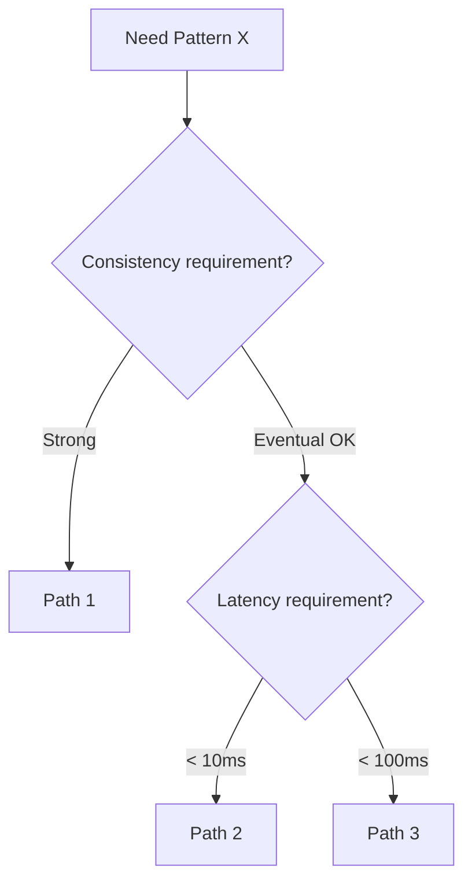
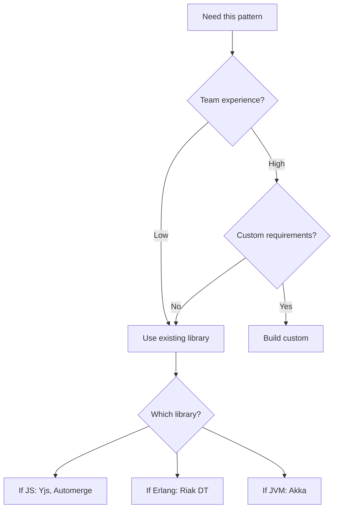

# Core Distributed Patterns Guidelines

This document provides guidance for writing articles in `content/articles/system-design/core-distributed-patterns/`.

These articles are deep-dives into specific patterns that solve distributed system challenges. They must cover multiple design paths, implementation variations, and real-world trade-offs.

## Core Philosophy

### Patterns Have Many Implementations

Each pattern has multiple valid implementations with different trade-offs. The article must:

1. **Cover all major variants** - Not just the textbook version
2. **Show the design decision tree** - When you reach this pattern, what choices remain?
3. **Real implementations differ from theory** - Show how production systems deviate from papers
4. **Implementation matters** - Two systems using "the same pattern" can have vastly different characteristics

### Design Path Structure

For each pattern, show the decision tree:

```markdown
## Design Paths

### Path 1: [Variant Name]

**When to choose this path:**
- [Specific condition]
- [Specific condition]

**Key characteristics:**
- [Property 1]
- [Property 2]

**Implementation approach:**
[Detailed explanation]

**Real-world example:**
[Company] uses this variant because [reason]. Their specific implementation:
- [Detail 1]
- [Detail 2]
Result: [Measurable outcome]

**Trade-offs vs other paths:**
| Aspect | This Path | Alternative Path |
|--------|-----------|------------------|
| Latency | Lower | Higher |
| Complexity | Higher | Lower |
| Failure modes | [Specific] | [Specific] |

### Path 2: [Variant Name]

[Same structure]

### Decision Framework


```

## Required Article Structure

### 1. Title and Description

```markdown
# [Pattern Name]

Deep-dive into [pattern]: understanding variants, implementation choices, and production trade-offs.
```

### 2. Problem Statement

Why does this pattern exist?

```markdown
## The Problem

### Why Naive Solutions Fail

**Approach 1: [Naive approach]**
- Fails because: [Specific failure mode]
- Example: [Concrete scenario]

**Approach 2: [Another naive approach]**
- Fails because: [Specific failure mode]

### The Core Challenge

The fundamental tension: [trade-off being navigated]

This pattern exists to: [specific problem it solves]
```

### 3. Pattern Overview

The canonical form of the pattern:

```markdown
## Pattern Overview

### Core Mechanism

[Explain how the pattern works at a conceptual level]

### Key Invariants

1. [Invariant 1]: [What must always be true]
2. [Invariant 2]: [What must always be true]

### Failure Modes

| Failure | Impact | Mitigation |
|---------|--------|------------|
| [Failure 1] | [What breaks] | [How to handle] |
| [Failure 2] | [What breaks] | [How to handle] |
```

### 4. Design Paths Section (Required - This is the Core)

This is the heart of the article. Cover ALL major implementation paths:

```markdown
## Design Paths

### State-Based vs Operation-Based [Example for CRDT]

#### State-Based (CvRDT)

**How it works:**
[Detailed mechanism]

**Data structure example:**
```typescript
// G-Counter state-based implementation
interface GCounter {
  counts: Map<NodeId, number>;  // Each node tracks its own counter
}

function increment(counter: GCounter, nodeId: NodeId): GCounter {
  return {
    counts: new Map(counter.counts).set(
      nodeId,
      (counter.counts.get(nodeId) ?? 0) + 1
    )
  };
}

function merge(a: GCounter, b: GCounter): GCounter {
  const merged = new Map<NodeId, number>();
  for (const [nodeId, count] of [...a.counts, ...b.counts]) {
    merged.set(nodeId, Math.max(merged.get(nodeId) ?? 0, count));
  }
  return { counts: merged };
}

function value(counter: GCounter): number {
  return [...counter.counts.values()].reduce((a, b) => a + b, 0);
}
```

**When to choose:**
- Network partitions are common
- Bandwidth is limited (send full state periodically)
- Merge function is cheap
- State size is bounded

**Trade-offs:**
- ✅ Simple delivery requirements (any order, duplicates OK)
- ✅ Easy to reason about (state is self-describing)
- ❌ State can grow unbounded (tombstones, actor IDs)
- ❌ Full state transfer can be expensive

**Real-world:** Riak uses state-based CRDTs. They added "delta state" optimization—only send the state diff since last sync.
[Link to Riak CRDT docs]

#### Operation-Based (CmRDT)

**How it works:**
[Detailed mechanism]

**Data structure example:**
```typescript
// G-Counter operation-based
type Operation = { type: 'increment'; nodeId: NodeId; };

function apply(counter: number, op: Operation): number {
  return counter + 1;
}

// Requires exactly-once, causal delivery
```

**When to choose:**
- Reliable message delivery available
- Operations are small
- Want immediate propagation
- Can guarantee causal ordering

**Trade-offs:**
- ✅ Small message size (just the operation)
- ✅ Immediate propagation possible
- ❌ Requires reliable, causal delivery layer
- ❌ History must be tracked for late-joining nodes

**Real-world:** Figma uses operation-based approach with their own delivery layer. They invested heavily in the transport to get low-latency sync.
[Link to Figma multiplayer blog post]

### Comparison Matrix

| Factor | State-Based | Operation-Based |
|--------|-------------|-----------------|
| Message size | Full state | Single operation |
| Delivery requirement | Any | Exactly-once, causal |
| Late joiner handling | Send current state | Replay history |
| Complexity | In merge function | In delivery layer |
| Latency | Higher (batched) | Lower (immediate) |

### Hybrid Approaches

**Delta-State CRDTs:**
Combine benefits: send only the "delta" (new operations merged into state form).
Used by: Riak 2.0+, Akka Distributed Data

**Operation-based with checkpoints:**
Periodically checkpoint state, new nodes get checkpoint + recent ops.
Used by: Many collaborative editors
```

### 5. Production Implementations Section (Required)

Show how real systems implement this pattern:

```markdown
## Production Implementations

### [System 1]: [Company/Product]

**Context:** [What they're building, scale]

**Implementation choices:**
- Pattern variant: [Which path]
- Key customization: [What they changed]
- Scale: [Numbers]

**Architecture:**
```mermaid
[Diagram of their implementation]
```

**Specific details:**
- [Technical detail 1]
- [Technical detail 2]

**What worked:**
- [Outcome 1]

**What was hard:**
- [Challenge 1] — solved by [solution]

**Source:** [Engineering blog/talk with link]

### [System 2]: Different Approach

[Same structure, contrasting implementation]

### Implementation Comparison

| Aspect | System 1 | System 2 | System 3 |
|--------|----------|----------|----------|
| Variant | State-based | Op-based | Hybrid |
| Scale | 10K ops/s | 100K ops/s | 1M ops/s |
| Latency | 100ms | 10ms | 50ms |
| Complexity | Low | High | Medium |
| Team size | 2 | 10 | 5 |
```

### 6. Implementation Guide

Practical guidance for implementing:

```markdown
## Implementation Guide

### Starting Point Decision



### Library Options

| Library | Language | Variant | Maturity | Notes |
|---------|----------|---------|----------|-------|
| Yjs | JS | Op-based | Production | Best for collaborative editing |
| Automerge | JS | State-based | Production | Best for offline-first |
| Riak DT | Erlang | State-based | Production | Battle-tested |

### Building Custom

**When to build custom:**
- Existing libraries don't fit data model
- Performance requirements exceed library capabilities
- Need specific guarantees libraries don't provide

**Implementation checklist:**
- [ ] Define merge semantics precisely
- [ ] Prove commutativity/associativity/idempotence
- [ ] Handle clock skew
- [ ] Plan garbage collection strategy
- [ ] Test with network partition simulation
```

### 7. Common Pitfalls

```markdown
## Common Pitfalls

### 1. Unbounded Growth

**The mistake:** Not planning for tombstone/history cleanup

**Example:** Notion-like app storing all operations. After 1 year, loading a page requires replaying 100K operations.

**Solutions:**
- Periodic state snapshots with operation truncation
- Tombstone garbage collection with grace period
- Compaction strategies

### 2. Assuming Strong Consistency

**The mistake:** Building features that assume immediate consistency

**Example:** "Undo" feature that assumes last operation is known—fails with concurrent edits.

**Solutions:**
- Design for concurrent operations from the start
- Use causal consistency, not wall-clock ordering
- Test with artificial latency injection
```

### 8. Appendix Requirements

#### Prerequisites
- Link to foundational articles (e.g., "consistency-and-cap-theorem")

#### Summary
- Pattern core insight
- Key decision factors
- Recommended starting point

#### References
Prioritized:
1. Original papers (with specific section references)
2. Production implementation blog posts
3. Library documentation
4. Conference talks (with timestamps)

## Quality Checklist

### Design Paths
- [ ] All major variants covered (not just textbook version)
- [ ] Clear decision criteria for each path
- [ ] Code examples for critical mechanisms
- [ ] Trade-off comparison matrix

### Production Examples
- [ ] At least 2 contrasting real-world implementations
- [ ] Specific numbers (scale, latency, team size)
- [ ] What worked AND what was hard
- [ ] Sources linked

### Implementation Guidance
- [ ] Decision tree for choosing approach
- [ ] Library recommendations with criteria
- [ ] When to build custom
- [ ] Checklist for implementation

### Depth
- [ ] Failure modes covered
- [ ] Common pitfalls with examples
- [ ] Edge cases addressed
- [ ] Garbage collection / operational concerns
