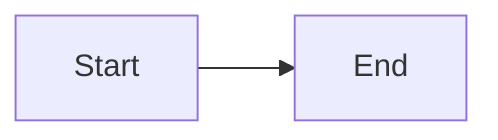

# Markdown Features and Usage

This project uses Expressive Code and additional remark plugins. Use these features consistently in articles and reviews.

## Code Blocks (Expressive Code)

### Basic Syntax

````markdown
```ts title="example.ts"
// code here
```
````

### Collapse (MANDATORY)

Only relevant lines should be visible. Collapse everything else using `collapse={...}`.

````markdown
```ts title="service.ts" collapse={1-6, 14-20}
// Collapsed: imports and setup
import { Client } from "./client"
import { logger } from "./logger"

const client = new Client()

// Visible: the key call pattern
export async function fetchUser(id: string) {
  const user = await client.get(`/users/${id}`)
  return user
}

// Collapsed: helpers
function normalizeUser() {}
```
````

### Line Highlighting

````markdown
```ts {2-3}
const a = 1
const b = 2
const c = 3
```
````

### Diff Highlighting

````markdown
```ts
const before = "old" - const old = "old" + const after = "new"
```
````

### Word Highlighting

````markdown
```ts "important" /regex/
const important = true
```
````

### Code Import

````markdown
```ts file=./src/example.ts#L10-L20

```
````

## Mermaid Diagrams

Wrap diagrams in a figure with a caption:

````markdown
<figure>



<figcaption>Short caption explaining the diagram.</figcaption>
</figure>
````

## Math (KaTeX)

Inline: `E = mc^2` as `$E = mc^2$`

Block:

```
$$
\int_0^1 x^2 dx
$$
```

## Tables

```
| Column | Description |
| ------ | ----------- |
| A      | Value       |
```

## Images

- Standard: ``
- Invert in dark mode: ``
- Inline SVG: ``

## Emoji

Emoji shortcodes are supported (use sparingly): `:warning:`

## Markdown Structure Rules

- Only one H1 per article.
- No manual Table of Contents.
- Keep headings hierarchical (H2 -> H3 -> H4).
