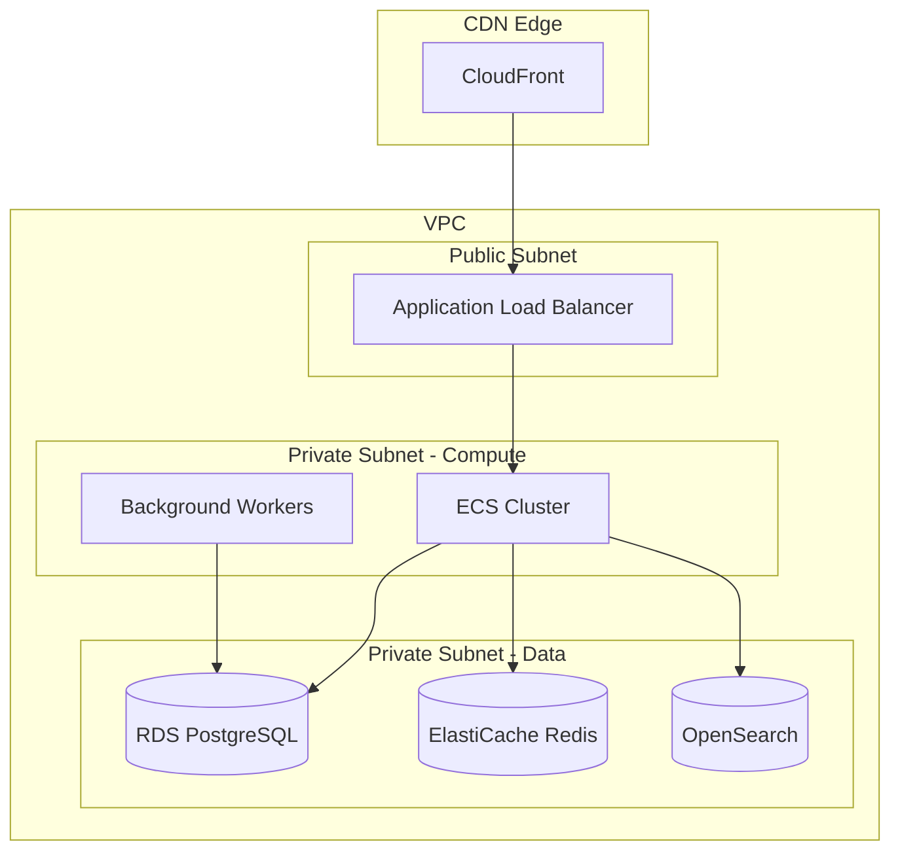

# System Design Architectural Problems Guidelines

This document provides exhaustive guidance for writing "System Design Architectural Problems" articles in `content/articles/system-design/system-design-problems/`. These articles focus on high-level design of real-world systems with low-level details for core features.

## Core Philosophy

### No Single Correct Answer

System design problems are inherently open-ended. The focus is:

1. **How to choose** the most optimal strategy
2. **Clearly state tradeoffs** being assumed
3. **Compare competing approaches** - explain all viable options and justify the chosen approach
4. **Acknowledge constraints** - different constraints lead to different optimal solutions

**Pattern for every major decision:**

```markdown
### [Decision Point]

**Options:**
1. **Option A**: [Description]
   - Pros: [List]
   - Cons: [List]
   - Best when: [Conditions]

2. **Option B**: [Description]
   - Pros: [List]
   - Cons: [List]
   - Best when: [Conditions]

**Chosen approach:** Option A

**Rationale:** [Why this tradeoff makes sense for this system's requirements]
```

### Scoping Vague Problem Statements

Problem statements like "Design X" or "Design a service like X" are intentionally vague. The approach:

1. **Identify the product's core value proposition** - What makes X successful?
2. **List all user-facing features** - Everything users interact with
3. **Prioritize by criticality** - Which features are essential vs. nice-to-have?
4. **Scope the discussion** - Focus on the 3-5 most critical services

**Example - "Design Twitter":**

| Feature | Criticality | In Scope |
|---------|-------------|----------|
| Tweet posting | Core | Yes |
| Timeline/Feed | Core | Yes |
| Follow system | Core | Yes |
| Notifications | Core | Yes |
| Search | High | Yes |
| Direct Messages | High | Maybe |
| Trends | Medium | Brief mention |
| Ads/Monetization | Medium | Out of scope |
| Analytics | Low | Out of scope |

State the scoping decision explicitly in the article.

## Required Article Structure

### 1. Title and Description

```markdown
# Design [System]: [Specific Focus]

A comprehensive system design for [system] covering [scope]. This design addresses [key challenges] with a focus on [primary optimization goals].
```

### 2. Overview Diagram

Include a high-level architecture diagram showing all major components and their interactions. Use Mermaid for maintainability.

### 3. Abstract (Mental Model)

Provide a mental model of the key design decisions:

- The 3-5 most critical architectural choices
- The primary tradeoffs accepted
- What this design optimizes for (and what it sacrifices)

### 4. Requirements Section (Required)

#### Functional Requirements

- List all features being designed (scoped)
- Mark which are core vs. extended
- Include user-facing AND internal requirements

#### Non-Functional Requirements

Be specific with numbers where possible:

| Requirement | Target | Rationale |
|-------------|--------|-----------|
| Availability | 99.99% (4 nines) | User-facing, revenue impact |
| Read latency | p99 < 100ms | User experience |
| Write latency | p99 < 500ms | Acceptable for async writes |
| Throughput | 100K RPS reads, 10K RPS writes | Based on [estimation] |
| Data retention | 7 years | Compliance requirement |
| Consistency | Eventual (< 5s) | Acceptable for social features |

#### Scale Estimation (Required)

Include back-of-envelope calculations:

```markdown
### Scale Estimation

**Users:**
- DAU: 100M
- Peak concurrent: 10M (10% of DAU)

**Traffic:**
- Reads: 100M DAU × 50 reads/day = 5B reads/day = ~58K RPS
- Writes: 100M DAU × 5 writes/day = 500M writes/day = ~5.8K RPS
- Peak multiplier: 3x → 174K RPS reads, 17K RPS writes

**Storage:**
- Per item: 1KB average
- Daily growth: 500M × 1KB = 500GB/day
- Yearly: ~180TB
- 5-year retention: ~1PB
```

### 5. High-Level Design (Exhaustive)

Cover ALL components the user interacts with:

- API Gateway / Load Balancers
- Application services (with service boundaries)
- Data stores (with clear rationale for each)
- Caching layers
- Message queues / Event streams
- CDN and static assets
- Real-time communication
- Background workers

Include an architecture diagram per major subsystem.

### 6. API Design (Required)

#### REST/GraphQL Endpoints

For each major operation, specify:

```markdown
### Create Tweet

**Endpoint:** `POST /api/v1/tweets`

**Request:**
```json
{
  "content": "string (max 280 chars)",
  "media_ids": ["uuid"],
  "reply_to": "uuid | null",
  "visibility": "public | followers | mentioned"
}
```

**Response (201 Created):**
```json
{
  "id": "uuid",
  "content": "string",
  "author": {
    "id": "uuid",
    "username": "string",
    "display_name": "string",
    "avatar_url": "string"
  },
  "created_at": "ISO8601",
  "media": [...],
  "metrics": {
    "likes": 0,
    "retweets": 0,
    "replies": 0
  }
}
```

**Error Responses:**
- `400 Bad Request`: Invalid content length, invalid media_ids
- `401 Unauthorized`: Missing or invalid auth token
- `429 Too Many Requests`: Rate limit exceeded

**Rate Limits:** 300 requests/15min per user
```

#### Response Structure Optimization

Address frontend consumption patterns:

- **Pagination strategy**: Cursor-based vs offset-based (with rationale)
- **Field inclusion**: Which fields to include by default vs. via `?expand=`
- **Denormalization**: When to include nested objects vs. IDs
- **Batch endpoints**: When to support multi-fetch

### 7. Data Modeling (Required)

#### Schema Design

For each major entity:

```markdown
### Tweet Schema

**Primary Store:** PostgreSQL (ACID for writes, complex queries)

```sql
CREATE TABLE tweets (
    id UUID PRIMARY KEY DEFAULT gen_random_uuid(),
    author_id UUID NOT NULL REFERENCES users(id),
    content TEXT NOT NULL CHECK (char_length(content) <= 280),
    reply_to_id UUID REFERENCES tweets(id),
    visibility VARCHAR(20) DEFAULT 'public',
    created_at TIMESTAMPTZ DEFAULT NOW(),
    deleted_at TIMESTAMPTZ,

    -- Denormalized for read performance
    like_count INT DEFAULT 0,
    retweet_count INT DEFAULT 0,
    reply_count INT DEFAULT 0
);

-- Indexes
CREATE INDEX idx_tweets_author ON tweets(author_id, created_at DESC);
CREATE INDEX idx_tweets_reply ON tweets(reply_to_id) WHERE reply_to_id IS NOT NULL;
```

**Sharding Strategy:** By author_id (co-locates user's tweets)

**Replication:** 3 replicas across AZs, async replication (eventual consistency acceptable)
```

#### Database Selection Matrix

| Data Type | Store | Rationale |
|-----------|-------|-----------|
| User profiles | PostgreSQL | ACID, complex queries, moderate scale |
| Tweets | PostgreSQL + Read replicas | Write consistency, read scaling |
| Timeline cache | Redis Cluster | Low latency reads, TTL support |
| Media metadata | DynamoDB/Cassandra | High write throughput, simple queries |
| Search index | Elasticsearch | Full-text search, aggregations |
| Analytics | ClickHouse/BigQuery | Columnar, analytical queries |

### 8. Low-Level Design (For Critical Components)

For the 2-3 most critical or complex components, provide detailed design:

#### Example: Timeline Generation

```markdown
### Timeline Service - Low-Level Design

#### Approach Comparison

**Fan-out on Write (Push model):**
- On tweet creation, push to all follower timelines
- Pros: Read latency O(1), simple read path
- Cons: High write amplification for celebrities (10M+ followers)
- Storage: N × followers timeline entries per tweet

**Fan-out on Read (Pull model):**
- On read, aggregate from followed users
- Pros: Simple write path, no storage amplification
- Cons: High read latency, expensive aggregation
- Storage: Only original tweets

**Hybrid Approach (Chosen):**
- Regular users (< 10K followers): Fan-out on write
- Celebrities (> 10K followers): Fan-out on read at query time
- Pros: Balanced write/read costs
- Cons: Complexity, two code paths

#### Data Flow

[Detailed sequence diagram]

#### Timeline Cache Structure

```redis
# User timeline (sorted set)
ZADD timeline:{user_id} {timestamp} {tweet_id}

# Keep last 800 tweets per user
ZREMRANGEBYRANK timeline:{user_id} 0 -801

# Timeline entry (hash for denormalized data)
HSET tweet:{tweet_id} content "..." author_id "..." ...
```

#### Consistency Handling

- Timeline writes are async (queue-based)
- Consistency window: < 5 seconds typical, < 30 seconds p99
- Self-tweets appear immediately (write-through for author's timeline)
```

## Frontend Considerations (Required Section)

This is from a **full-stack principal perspective**. Focus on architectural decisions that affect performance, NOT on visual design or aesthetics.

### Performance-Critical Decisions

Address these patterns where relevant:

#### DOM Performance

```markdown
### Board View (JIRA-like)

**Problem:** A board with 5 columns × 100 cards = 500 DOM nodes minimum. With card details expanded, could reach 2000+ nodes.

**Solution: Virtualization**

Only render cards visible in the viewport plus a buffer:

- Use `react-window` or `@tanstack/virtual` for list virtualization
- Each column is independently virtualized
- Render ~15 cards per column (viewport + buffer)
- Total DOM nodes: 5 columns × 15 cards = 75 nodes (vs 500)

**Implementation considerations:**
- Variable height cards require dynamic measurement
- Drag-and-drop across virtualized lists needs careful handling
- Scroll position restoration on navigation
```

#### Data Structure for UI

```markdown
### Column and Card Data Structure

**Naive approach (array-based):**
```typescript
interface Board {
  columns: {
    id: string;
    name: string;
    cards: Card[];  // ❌ Reordering = O(n) array operations
  }[];
}
```

**Optimized approach (normalized + order arrays):**
```typescript
interface BoardState {
  columns: Record<string, Column>;      // O(1) lookup
  cards: Record<string, Card>;          // O(1) lookup
  columnOrder: string[];                 // Column ordering
  cardOrder: Record<string, string[]>;  // Column ID → Card IDs
}
```

**Why normalized:**
- Moving a card = update 2 arrays (source column, dest column)
- Updating card content = update 1 object (no array scan)
- Reordering columns = update 1 array
- Enables efficient React renders (reference equality checks)
```

#### API Response Optimization for Frontend

```markdown
### Pagination Strategy

**Option 1: Board-level pagination**
```json
GET /api/boards/{id}/cards?cursor=xxx&limit=50

// Problem: Cards might all be from column 1
// Columns 2-5 appear empty until many pages loaded
```

**Option 2: Per-column pagination (Chosen)**
```json
GET /api/boards/{id}?cards_per_column=20

Response:
{
  "columns": [
    {
      "id": "col-1",
      "name": "To Do",
      "cards": [...20 cards...],
      "total_cards": 150,
      "next_cursor": "abc123"
    },
    ...
  ]
}
```

**Load more per column:**
```json
GET /api/columns/{id}/cards?cursor=abc123&limit=20
```

**Why this works:**
- Initial load shows cards in ALL columns (better UX)
- Each column loads more independently (better perceived performance)
- Virtualization + pagination = infinite scroll per column
```

#### Real-Time Updates

```markdown
### Real-Time Sync Strategy

**Options:**
1. **Polling:** Simple, works everywhere, high latency (5-30s)
2. **WebSocket:** Low latency, bidirectional, connection overhead
3. **SSE:** Low latency, unidirectional, simpler than WS
4. **WebSocket + Optimistic UI:** Best UX, most complex

**Chosen: WebSocket with optimistic updates**

**Flow:**
1. User moves card → optimistic UI update (instant feedback)
2. Send mutation via HTTP POST (not WebSocket)
3. Server broadcasts update via WebSocket to all board viewers
4. Client reconciles optimistic state with server state

**Conflict handling:**
- Server is source of truth
- If optimistic update conflicts, rollback + show toast
- Use vector clocks or timestamps for ordering
```

### State Management Patterns

Address state management architecture for complex UIs:

```markdown
### Client State Architecture

**State categories:**
1. **Server cache state:** React Query / SWR / Apollo (cards, columns)
2. **UI state:** Local React state (modals, dropdowns, drag state)
3. **Collaborative state:** Real-time sync layer (cursor positions, presence)

**Why separate:**
- Server cache has staleness, refetching, optimistic updates
- UI state is ephemeral, no persistence needed
- Collaborative state needs conflict resolution
```

## Infrastructure Design (Required)

### Cloud-Agnostic First

Present infrastructure concepts without vendor lock-in:

```markdown
### Message Queue

**Concept:** Async processing queue for decoupling services

**Requirements:**
- At-least-once delivery
- Message ordering per partition/key
- Horizontal scalability
- Message retention for replay

**Open-source options:**
- Apache Kafka (high throughput, complex ops)
- RabbitMQ (simpler, lower throughput)
- Redis Streams (simple, moderate scale)

**Managed service options (AWS):**
- Amazon MSK (Managed Kafka)
- Amazon SQS (simpler, no ordering guarantees across messages)
- Amazon Kinesis (AWS-native, similar to Kafka)
```

### AWS Implementation Examples

After presenting concepts, provide concrete AWS implementations:

```markdown
### AWS Reference Architecture

#### Compute
| Component | Service | Configuration |
|-----------|---------|---------------|
| API servers | ECS Fargate / EKS | Auto-scaling 2-100 tasks |
| Background workers | ECS Fargate | Spot instances for cost |
| Scheduled jobs | EventBridge + Lambda | Cron triggers |

#### Data Stores
| Data | Service | Rationale |
|------|---------|-----------|
| Primary DB | RDS PostgreSQL Multi-AZ | ACID, managed backups |
| Read replicas | RDS Read Replicas | Read scaling |
| Cache | ElastiCache Redis Cluster | Sub-ms latency |
| Object storage | S3 + CloudFront | Media files, CDN |
| Search | OpenSearch Service | Managed Elasticsearch |

#### Self-Hosted Alternatives
| Managed Service | Self-Hosted Option | When to self-host |
|-----------------|-------------------|-------------------|
| RDS PostgreSQL | PostgreSQL on EC2 | Cost at scale, specific extensions |
| ElastiCache | Redis on EC2 | Specific Redis modules |
| OpenSearch | Elasticsearch on EC2 | Cost, specific plugins |
| MSK | Kafka on EC2 | Cost at scale, specific configs |
```

### Infrastructure Diagrams

Include deployment architecture:

```markdown
### Production Deployment


```

## Conclusion Section

Summarize:

1. Key architectural decisions and their rationale
2. What this design optimizes for
3. Known limitations and future improvements
4. Alternative approaches considered but not chosen

## Appendix Requirements

### Prerequisites

List assumed knowledge:

- Basic distributed systems concepts
- Database fundamentals
- API design principles

### Summary

3-6 bullet points covering:

- The core architectural pattern
- Key tradeoffs accepted
- Most critical non-functional requirements met
- Primary technology choices

### References

Include:

- Industry case studies (how companies actually built similar systems)
- Relevant research papers
- Technology documentation for chosen tools

## Quality Checklist

### Problem Scoping
- [ ] Core services identified and prioritized
- [ ] Scope explicitly stated (what's in/out)
- [ ] Scale estimation with calculations

### Tradeoff Analysis
- [ ] Multiple options presented for major decisions
- [ ] Pros/cons clearly stated
- [ ] Chosen approach justified with rationale
- [ ] Tradeoffs explicitly acknowledged

### API Design
- [ ] All major endpoints documented
- [ ] Request/response schemas specified
- [ ] Error responses and rate limits included
- [ ] Pagination strategy explained

### Data Modeling
- [ ] Schema for all major entities
- [ ] Database selection justified
- [ ] Indexing strategy documented
- [ ] Sharding/replication strategy if needed

### Low-Level Design
- [ ] 2-3 critical components designed in detail
- [ ] Algorithms/data structures specified
- [ ] Consistency and failure handling addressed

### Frontend Considerations
- [ ] Performance-critical patterns identified
- [ ] Data structures optimized for UI operations
- [ ] API response optimized for frontend consumption
- [ ] Real-time update strategy if applicable

### Infrastructure
- [ ] Cloud-agnostic concepts first
- [ ] AWS implementation example
- [ ] Both managed and self-hosted options
- [ ] Deployment architecture diagram
