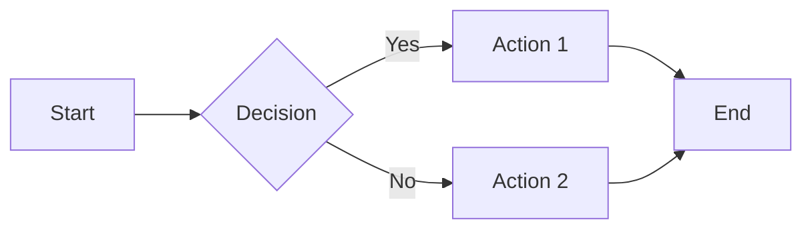
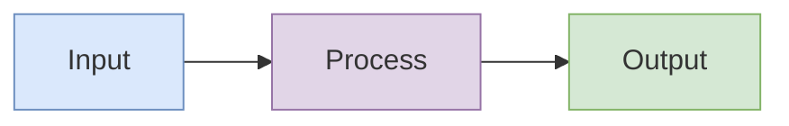
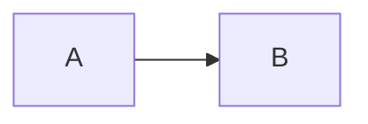

# Markdown Features & Tools

## Code Blocks (Expressive Code)

This project uses Expressive Code with extensive features for technical documentation.

### Basic Syntax

````markdown
```language title="filename.ts"
// code here
```
````

### Line Numbers

Line numbers are shown by default. Disable per-block:

````markdown
```ts showLineNumbers=false
const x = 1
```
````

Disabled by default for: `txt`, `bash`, `ascii`

### Terminal Frames

Bash blocks automatically use terminal frame:

````markdown
```bash
npm install package-name
```
````

### Line Highlighting

Highlight specific lines:

````markdown
```ts {2-4}
const a = 1
const b = 2 // highlighted
const c = 3 // highlighted
const d = 4 // highlighted
const e = 5
```
````

### Diff Highlighting

Show additions and removals:

````markdown
```ts
const greeting = "hello" - console.log("old way") + console.log("new way")
```
````

### Word/Text Highlighting

Highlight specific text:

````markdown
```ts "important" /regex/
const important = "highlighted text"
```
````

### Collapsible Sections

**IMPORTANT**: Use collapse to hide irrelevant code. Only the key concept lines should be visible by default. Collapse can target **any line ranges** - imports at the start, setup code, middle sections, helper functions, or any combination.

**Syntax**: `collapse={start-end}` or `collapse={1-5, 12-18, 25-30}` for multiple ranges.

#### Basic Example

````markdown
```ts collapse={1-5, 20-25}
// Lines 1-5 collapsed (imports)
import { something } from "somewhere"
import { another } from "elsewhere"
// ... more imports

// Lines 6-19 visible (main code)
function main() {
  // implementation
}

// Lines 20-25 collapsed (helpers)
function helper1() {}
```
````

#### Collapsing Middle Sections (Key Pattern)

Use collapse to show **only the key insight** while hiding surrounding implementation details:

````markdown
```typescript title="user-service.ts" collapse={1-8, 16-28, 35-42}
// Lines 1-8: Imports and type definitions (collapsed)
import { Database } from "./database"
import { Logger } from "./logger"
import { validateEmail, hashPassword } from "./utils"
import type { User, CreateUserInput, UserResult } from "./types"

const logger = new Logger("user-service")
const db = new Database()

// Lines 9-15: VISIBLE - The key authentication logic
export async function authenticateUser(email: string, password: string): Promise<UserResult> {
  const user = await db.users.findByEmail(email)
  if (!user) return { success: false, error: "User not found" }

  const isValid = await verifyPassword(password, user.passwordHash)
  return isValid ? { success: true, user } : { success: false, error: "Invalid password" }
}

// Lines 16-28: Password handling internals (collapsed)
async function verifyPassword(plain: string, hash: string): Promise<boolean> {
  // ... bcrypt comparison logic
  return true
}

async function createPasswordHash(password: string): Promise<string> {
  // ... bcrypt hashing logic
  return ""
}

function validatePasswordStrength(password: string): boolean {
  // ... validation rules
  return true
}

// Lines 29-34: VISIBLE - The key user creation logic
export async function createUser(input: CreateUserInput): Promise<UserResult> {
  if (!validateEmail(input.email)) return { success: false, error: "Invalid email" }
  const hash = await createPasswordHash(input.password)
  const user = await db.users.create({ ...input, passwordHash: hash })
  return { success: true, user }
}

// Lines 35-42: Cleanup and admin utilities (collapsed)
export async function deleteUser(id: string): Promise<void> {
  await db.users.delete(id)
  logger.info(`User ${id} deleted`)
}

export async function listUsers(): Promise<User[]> {
  return db.users.findAll()
}
```
````

**Result**: Reader sees only lines 9-15 and 29-34 (the two key functions), with collapsed sections for imports, helpers, and utilities.

### Marking Lines

Mark lines with labels:

````markdown
```ts ins={2} del={3}
const x = 1
const y = 2 // inserted
const z = 3 // deleted
```
````

### Code Titles

Add filename/title to code block:

````markdown
```ts title="src/utils/helper.ts"
export function helper() {}
```
````

### Frame Types

Control the frame appearance:

````markdown
```ts frame="code"
// Standard code frame (default)
```

```bash frame="terminal"
# Terminal frame (default for bash)
```

```ts frame="none"
// No frame
```
````

### Full Example

````markdown
```ts title="src/api/handler.ts" {5-7} collapse={1-3, 15-20} ins={10} del={11}
// Collapsed: imports
import { db } from "./db"
import { validate } from "./validate"

// Highlighted section
async function handler(req: Request) {
  const data = await req.json()

  // Changes
  const result = await db.insert(data) // added
  const result = db.insertSync(data) // removed

  return Response.json(result)
}

// Collapsed: helper functions
function helper1() {}
function helper2() {}
function helper3() {}
```
````

## Mermaid Diagrams

Create diagrams using fenced code blocks:

````markdown

````

### Diagram Types

- `flowchart` / `graph` - Flow diagrams
- `sequenceDiagram` - Sequence diagrams
- `classDiagram` - Class diagrams
- `stateDiagram-v2` - State diagrams
- `erDiagram` - Entity relationship
- `gantt` - Gantt charts
- `pie` - Pie charts
- `mindmap` - Mind maps

### Styling Mermaid

Use inline styles for colors:

````markdown

````

## Math (KaTeX)

### Inline Math

```markdown
The formula $E = mc^2$ shows energy-mass equivalence.
```

### Block Math

```markdown
$$
\int_{-\infty}^{\infty} e^{-x^2} dx = \sqrt{\pi}
$$
```

## Tables

Standard markdown tables with auto-wrapping:

```markdown
| Column 1 | Column 2 | Column 3 |
| -------- | -------- | -------- |
| Data 1   | Data 2   | Data 3   |
```

Tables are automatically wrapped in a scrollable container for horizontal overflow.

## Images

### Standard Images

```markdown

```

### Invertible Images (Dark Mode)

Add `.invert` suffix for images that should invert in dark mode:

```markdown

```

### Inline SVGs

Use `.inline.svg` suffix to inline SVG content:

```markdown

```

## Code Import

Import code from external files:

````markdown
```ts file=./src/example.ts

```
````

With line ranges:

````markdown
```ts file=./src/example.ts#L10-L20

```
````

## Emoji

Use emoji shortcodes:

```markdown
:rocket: :sparkles: :warning:
```

Emojis are made accessible automatically with ARIA labels.

## Figures with Captions

Wrap diagrams or images in figure elements:

````markdown
<figure>


````

<figcaption>Diagram caption here</figcaption>
</figure>
```

## Best Practices for Code Blocks

1. **Collapse aggressively**: Use `collapse` for any lines not essential to the key concept:
   - Imports and type definitions
   - Setup, configuration, and boilerplate
   - Helper functions and utilities
   - **Middle sections** that don't illustrate the main point
   - Error handling (unless that's the topic)
2. **Collapse multiple ranges**: Use `collapse={1-8, 15-20, 30-40}` to show only the essential parts
3. **Use titles for context**: Add `title="filename.ts"` for file-specific code
4. **Highlight key lines**: Use `{lineNumbers}` to draw attention to important code
5. **Use diff syntax for changes**: Show `+` and `-` for modifications
6. **Keep visible code focused**: Only show code directly relevant to the explanation
