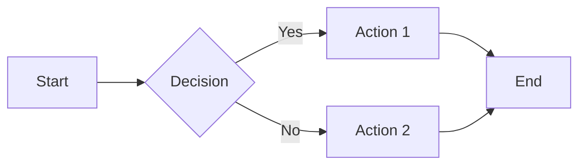
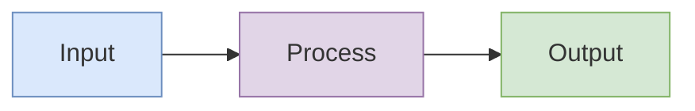
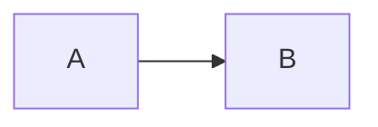

# Markdown Features & Tools

## Code Blocks (Expressive Code)

This project uses Expressive Code with extensive features for technical documentation.

### Basic Syntax

````markdown
```language title="filename.ts"
// code here
```
````

### Line Numbers

Line numbers are shown by default. Disable per-block:

````markdown
```ts showLineNumbers=false
const x = 1
```
````

Disabled by default for: `txt`, `bash`, `ascii`

### Terminal Frames

Bash blocks automatically use terminal frame:

````markdown
```bash
npm install package-name
```
````

### Line Highlighting

Highlight specific lines:

````markdown
```ts {2-4}
const a = 1
const b = 2 // highlighted
const c = 3 // highlighted
const d = 4 // highlighted
const e = 5
```
````

### Diff Highlighting

Show additions and removals:

````markdown
```ts
const greeting = "hello" - console.log("old way") + console.log("new way")
```
````

### Word/Text Highlighting

Highlight specific text:

````markdown
```ts "important" /regex/
const important = "highlighted text"
```
````

### Collapsible Sections

**IMPORTANT**: Use this to collapse irrelevant code lines. Non-essential boilerplate should be collapsed by default.

````markdown
```ts collapse={1-5, 20-25}
// These lines will be collapsed
import { something } from "somewhere"
import { another } from "elsewhere"
// ... more imports

// Main code visible by default
function main() {
  // implementation
}

// These lines will also be collapsed
// Additional utilities
```
````

### Marking Lines

Mark lines with labels:

````markdown
```ts ins={2} del={3}
const x = 1
const y = 2 // inserted
const z = 3 // deleted
```
````

### Code Titles

Add filename/title to code block:

````markdown
```ts title="src/utils/helper.ts"
export function helper() {}
```
````

### Frame Types

Control the frame appearance:

````markdown
```ts frame="code"
// Standard code frame (default)
```

```bash frame="terminal"
# Terminal frame (default for bash)
```

```ts frame="none"
// No frame
```
````

### Full Example

````markdown
```ts title="src/api/handler.ts" {5-7} collapse={1-3, 15-20} ins={10} del={11}
// Collapsed: imports
import { db } from "./db"
import { validate } from "./validate"

// Highlighted section
async function handler(req: Request) {
  const data = await req.json()

  // Changes
  const result = await db.insert(data) // added
  const result = db.insertSync(data) // removed

  return Response.json(result)
}

// Collapsed: helper functions
function helper1() {}
function helper2() {}
function helper3() {}
```
````

## Mermaid Diagrams

Create diagrams using fenced code blocks:

````markdown

````

### Diagram Types

- `flowchart` / `graph` - Flow diagrams
- `sequenceDiagram` - Sequence diagrams
- `classDiagram` - Class diagrams
- `stateDiagram-v2` - State diagrams
- `erDiagram` - Entity relationship
- `gantt` - Gantt charts
- `pie` - Pie charts
- `mindmap` - Mind maps

### Styling Mermaid

Use inline styles for colors:

````markdown

````

## Math (KaTeX)

### Inline Math

```markdown
The formula $E = mc^2$ shows energy-mass equivalence.
```

### Block Math

```markdown
$$
\int_{-\infty}^{\infty} e^{-x^2} dx = \sqrt{\pi}
$$
```

## Tables

Standard markdown tables with auto-wrapping:

```markdown
| Column 1 | Column 2 | Column 3 |
| -------- | -------- | -------- |
| Data 1   | Data 2   | Data 3   |
```

Tables are automatically wrapped in a scrollable container for horizontal overflow.

## Images

### Standard Images

```markdown

```

### Invertible Images (Dark Mode)

Add `.invert` suffix for images that should invert in dark mode:

```markdown

```

### Inline SVGs

Use `.inline.svg` suffix to inline SVG content:

```markdown

```

## Code Import

Import code from external files:

````markdown
```ts file=./src/example.ts

```
````

With line ranges:

````markdown
```ts file=./src/example.ts#L10-L20

```
````

## Emoji

Use emoji shortcodes:

```markdown
:rocket: :sparkles: :warning:
```

Emojis are made accessible automatically with ARIA labels.

## Auto-Generated Table of Contents

The `## Table of Contents` section is auto-populated by remark-toc. Just add the heading:

```markdown
## Table of Contents

<!-- Auto-generated -->
```

## Figures with Captions

Wrap diagrams or images in figure elements:

````markdown
<figure>


````

<figcaption>Diagram caption here</figcaption>
</figure>
```

## Best Practices for Code Blocks

1. **Always use `collapse` for boilerplate**: Imports, type definitions, and helper functions should be collapsed
2. **Use titles for context**: Add `title="filename.ts"` for file-specific code
3. **Highlight key lines**: Use `{lineNumbers}` to draw attention to important code
4. **Use diff syntax for changes**: Show `+` and `-` for modifications
5. **Keep visible code focused**: Only show code relevant to the explanation
